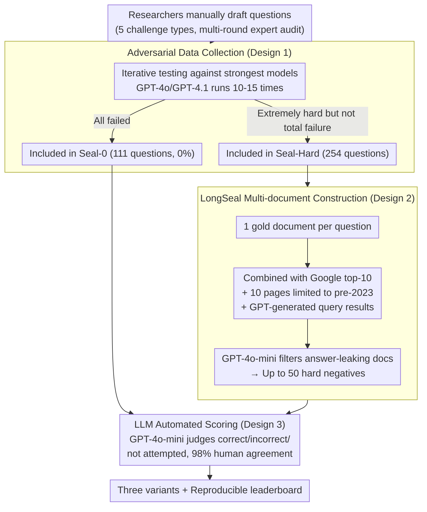

# SealQA: Raising the Bar for Reasoning in Search-Augmented Language Models

**Conference**: ICLR 2026  
**arXiv**: [2506.01062](https://arxiv.org/abs/2506.01062)  
**Code**: [HuggingFace](https://huggingface.co/datasets/vtllms/sealqa)  
**Area**: LLM Reasoning  
**Keywords**: benchmark, search-augmented LLM, RAG, noisy retrieval, test-time scaling, knowledge conflict

## TL;DR

Ours proposes the SealQA challenge benchmark (comprising Seal-0/Seal-Hard/LongSeal variants), where each question is carefully designed by NLP researchers to trigger ambiguity, conflict, or noisy search results. GPT-5 achieves a maximum accuracy of only 43.2%, revealing that test-time scaling fails to produce reliable gains under noisy retrieval.

## Background & Motivation

**Background**: LLMs have entered the new paradigm of test-time scaling, where reasoning models can decompose problems, decide when to search, and integrate retrieved content into reasoning paths. Frontier models have exceeded 90% accuracy on traditional benchmarks like MMLU, leading to saturation in existing evaluations.

**Limitations of Prior Work**: Most evaluations for search-augmented LLMs focus on short factual queries where top-ranked results directly provide the answer, requiring only shallow understanding. This fails to reflect the messy nature of real-world searches, where returned documents may be outdated, misleading, or superficially relevant but practically useless.

**Key Challenge**: Real-world information retrieval requires deep reasoning to filter inconsistent information, reconcile contradictions, and identify credible signals. However, existing benchmarks cannot simulate these challenges, partly because such datasets are difficult to curate and verify at scale.

**Goal**: Propose SealQA, a small but extremely challenging benchmark where each question is meticulously designed by NLP researchers and rigorously audited through multiple rounds to specifically trigger ambiguity, conflict, and noisy search results. It includes three variants covering different dimensions of search-augmented reasoning challenges.

## Method

### Overall Architecture

SealQA is not a new model but a set of **reverse-designed search-augmented reasoning benchmarks**. Its core idea is to make search itself a trap rather than an aid: each question is manually authored by NLP researchers and iteratively refined against the strongest models to elicit real-world scenarios of "ambiguous/conflicting/noisy retrieval results that cause more confusion as one searches." The pipeline starts with researchers drafting questions, followed by multiple rounds of human auditing and adversarial filtering, resulting in three variants: the core set Seal-0 (111 questions where frontier models like GPT-4o and GPT-4.1 achieved 0% accuracy across 10-15 attempts), the broader Seal-Hard (254 questions, including Seal-0 and others that are highly challenging but did not meet the zero-accuracy threshold), and the "needle-in-a-haystack" style LongSeal (254 questions, where each question is padded with up to 50 carefully constructed hard negatives alongside the gold document). Evaluation uses an LLM judge adapted from SimpleQA for automated scoring. Questions span 5 categories: Advanced Reasoning $\mathcal{Q}_1$ (72.4%), Entity/Event Disambiguation $\mathcal{Q}_2$ (58.3%), Temporal Tracking $\mathcal{Q}_3$ (13.7%), Cross-lingual Reasoning $\mathcal{Q}_4$ (5.5%), and False Premise Detection $\mathcal{Q}_5$ (4.3%), with most hitting more than two categories.

### Key Designs

**1. Adversarial Data Collection: Fully reversing the root cause of "shallow questions"**

Existing benchmarks are saturated because the questions themselves are shallow—top retrieval results directly provide the answer. SealQA does the opposite: each question is hand-written and iteratively refined by NLP researchers **until frontier models such as GPT-4o and GPT-4.1 fail completely across 10-15 attempts** before being included in Seal-0. This raises the "GPT-4 single failure" threshold of SimpleQA to "repeated failures across all strongest models." Each question is reviewed by at least two graduate-level auditors and approved by experts, taking over an hour on average (approx. 45 mins drafting plus extra auditing/revision), involving 6 researchers over 8 months. The trade-off is the small scale (Seal-0 has only 111 questions), but this small scale offers two benefits: significantly lower API evaluation costs allowing frequent answer updates to prevent data contamination, and manual adversarial filtering that prevents difficulty from eroding quickly as models improve—something automated benchmarks cannot achieve.

**2. LongSeal Multi-document Construction: Hiding a needle among 50 plausible distractions**

Tough questions alone are insufficient; the pain point of real-world retrieval is that models must pick the true evidence from a pile of "seemingly relevant but useless" documents. LongSeal provides a set of contexts for each Seal-Hard question: 1 gold document (from a webpage provided by the annotator) plus up to 50 hard negatives. These negatives are not random but explicitly constructed strong distractors—top-10 Google search results, 10 additional pages restricted to pre-2023 content, and results returned from three semantically related queries generated by GPT-4o-mini. Finally, GPT-4o-mini filters out documents that might allow the model to infer the correct answer to avoid "leaking." The resulting long context tests the model's noise resistance and exposes weaknesses in position bias and relevance modeling (experiments show accuracy drops as distractors increase from $k=12$ to $k=30$).

**3. LLM Automated Scoring: Reproducibility without sacrificing consistency**

The difficulty in evaluating open-ended Q&A lies in diverse answer expressions and the inaccuracy of string matching. SealQA uses a GPT-4o-mini scorer adapted from SimpleQA, taking the question, predicted answer, and reference answer as input to output a three-state judgment: "correct / incorrect / not attempted." Crucially, distinguishing "wrong" from "not attempted" prevents models from inflating their accuracy by refusing to answer. To verify reliability, the authors manually checked 100 answers, finding a 98% agreement rate with the automated scorer, sufficient for large-scale, reproducible evaluation of 20+ models.

## Key Experimental Results

### Main Results

| Model | Seal-0 (w/o search) | Seal-0 (w/ search) | Seal-Hard (w/o search) | Seal-Hard (w/ search) |
|------|---------------------|--------------------|-----------------------|----------------------|
| GPT-4o | 0.0% | 0.0%† | 11.8% | 15.0%† |
| GPT-4.1 | 0.0% | 0.0%† | 15.0% | 20.5%† |
| o3-mini-high | 3.6% | 1.8% | 12.6% | 14.2% |
| o3-high | - | 14.4%† | - | 32.7%† |
| GPT-5-high | 15.3% | **43.2%**† | 37.8% | **63.8%**† |
| DeepSeek-R1-671B | 5.4% | 1.8% | **22.4%** | 11.0% |
| Qwen3-235B | 0.0% | 5.4% | 4.3% | 11.4% |
| Llama-4-Scout | 0.0% | 0.0% | 5.9% | 5.9% |

† Uses ChatGPT built-in search; others use FreshPrompt.

### Ablation Study: Test-time Scaling Results

| Model | Low Effort | Medium Effort | High Effort |
|------|-----------|---------------|-------------|
| o3-mini (Seal-0) | 1.8% | 2.7% | 1.8% |
| o4-mini (Seal-0) | **6.3%** | 5.4% | 4.5% |
| o3 (Seal-0) | 11.7% | **17.1%** | 14.4% |

Increasing test-time computation does not produce reliable gains; performance often plateaus or even declines.

### Key Findings

- **Advanced reasoning models are extremely sensitive to noise**: DeepSeek-R1's Seal-Hard accuracy dropped from 22.4% to 11.0% after using FreshPrompt, with a 17.7% drop on "never-changing" questions.
- **Search can be harmful**: GPT-4.1-mini's accuracy dropped from 13.8% to 11.8% after using built-in search.
- **Humans significantly outperform models**: Humans achieved an average of 38.8% in open search and 50.4% in oracle mode on a 50-question Seal-Hard subset; the best human reached 64.0%/72.0%.
- **Performance degrades with more distractors in LongSeal**: GPT-4.1-mini dropped from 32.7% at $k=12$ to 29.5% at $k=30$; even with only the gold document (no noise), GPT-4.1 achieved only 48.0% accuracy.
- **Absence of classic position bias**: New models have mitigated the "lost-in-the-middle" effect, but identifying relevant documents remains a core difficulty.

## Highlights & Insights

- Highly innovative adversarial benchmark construction ensures each question poses a substantial challenge to even the strongest current models.
- Reveals the limitations of test-time scaling—more reasoning under noisy retrieval may amplify misinformation.
- Demonstrates that built-in search training (e.g., ChatGPT) is more effective than retrieval-style prompting methods (FreshPrompt).
- Dynamic versioned benchmark design with a commitment to regularly update answers to reflect current knowledge.

## Limitations & Future Work

- Small dataset size (Seal-0 has only 111 questions) may limit statistical significance.
- Answers change over time and require continuous maintenance, raising concerns about long-term sustainability.
- Evaluation covers only English questions, and the cross-lingual reasoning category is relatively small (5.5%).
- Focus is solely on factual Q&A, excluding more complex reasoning types like mathematical proofs or code generation.

## Related Work & Insights

- **SimpleQA** (Wei et al., 2024): SealQA builds on its adversarial collection philosophy, raising difficulty from "GPT-4 failure" to "repeated failure by all frontier models."
- **FreshLLMs** (Vu et al., 2024): SealQA's time-sensitivity classification and FreshPrompt methodology are directly derived from this work.
- **BrowseComp** (Wei et al., 2025): Complementary evaluation of browsing capabilities, whereas SealQA focuses more on reasoning than information acquisition.
- Insights for RAG system design: Naive retrieval integration may amplify noise, necessitating more robust evidence filtering and conflict resolution mechanisms.

## Rating

- Novelty: ⭐⭐⭐⭐⭐ The first adversarial search-augmented benchmark specifically designed for noisy/conflicting retrieval results, filling a critical gap.
- Experimental Thoroughness: ⭐⭐⭐⭐⭐ Covers 20+ models, including human evaluation and multi-dimensional ablations (question types, time, search methods, test-time scaling).
- Writing Quality: ⭐⭐⭐⭐ Clear structure and rich visualizations, though some tables have high information density.
- Value: ⭐⭐⭐⭐⭐ Reveals fundamental limitations of current state-of-the-art LLMs in real-world search scenarios, providing important guidance for RAG system design.

<!-- RELATED:START -->

## Related Papers

- [\[ICLR 2026\] AgentMath: Empowering Mathematical Reasoning for Large Language Models via Tool-Augmented Agent](agentmath_empowering_mathematical_reasoning_for_large_language_models_via_tool-a.md)
- [\[ICLR 2026\] SLM-MUX: Orchestrating Small Language Models for Reasoning](slm-mux_orchestrating_small_language_models_for_reasoning.md)
- [\[ICLR 2026\] Variational Reasoning for Language Models](variational_reasoning_for_language_models.md)
- [\[ICML 2026\] Prism: Efficient Test-Time Scaling via Hierarchical Search and Self-Verification for Discrete Diffusion Language Models](../../ICML2026/llm_reasoning/prism_efficient_test-time_scaling_via_hierarchical_search_and_self-verification_.md)
- [\[ICLR 2026\] Variation in Verification: Understanding Verification Dynamics in Large Language Models](variation_in_verification_understanding_verification_dynamics_in_large_language_.md)

<!-- RELATED:END -->
