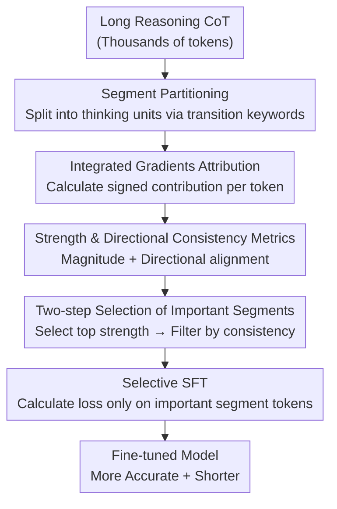

# Segment-Level Attribution for Selective Learning of Long Reasoning Traces

**Conference**: ICLR2026  
**arXiv**: [2602.00425](https://arxiv.org/abs/2602.00425)  
**Code**: [GitHub](https://github.com/SiyuanWangw/SegmentSelectiveSFT)  
**Area**: LLM Inference  
**Keywords**: reasoning trace, integrated gradients, selective SFT, segment attribution, CoT compression  

## TL;DR
Integrated Gradients are used to calculate the attribution strength and directional consistency of each segment within long reasoning chains to identify important segments for selective SFT. This approach improves accuracy by up to 4.7% while shortening output by 18% compared to full CoT training.

## Background & Motivation
1. Large Reasoning Models (LRMs) generate CoTs with thousands of tokens, but only a small portion truly contributes to answer prediction, while many are redundant, repetitive, or truncated.
2. Performing full SFT on redundant CoTs forces the model to learn lengthy, non-informative patterns, wasting learning capacity and potentially degrading performance.
3. Existing compression methods using token-level analysis overlook semantic integrity, and segment-level metrics like perplexity or entropy do not fully align with importance.
4. Perplexity-based methods suffer from false positives (overestimating transitional text) and false negatives (underestimating verification or intermediate conclusions).
5. There is a need for a direct measure of the causal contribution of segments toward correct answer prediction.

## Method

### Overall Architecture
In long reasoning chains, only a small part of the content actually drives the answer, while the rest consists of repetition, truncation, and filler. Directly using the entire CoT for SFT causes the model to learn these redundancies, making it more verbose and less accurate. The core idea is to first split a long CoT into several semantic segments based on transition keywords, then use Integrated Gradients (IG) to measure the causal contribution of each token to the final correct answer. These token-level attributions are aggregated into two metrics: "Attribution Strength" and "Directional Consistency." Based on these, important segments are filtered in two steps. Finally, selective SFT is performed by calculating the loss only on the tokens of these important segments. The entire pipeline does not change the training objective but modifies "which tokens to learn," making it plug-and-play like standard SFT.

### Key Designs

**1. Segment Partitioning: Splitting reasoning chains into attributable units**

Token-level importance analysis fragments semantics. A complete reasoning step (problem understanding, intermediate exploration, verification) often spans multiple tokens to be meaningful; token-by-token selection easily deletes partial sentences and destroys context coherence. Ours first uses a set of transition keywords (e.g., `\n\nWait`, `\n\nAlternatively`, `\n\nLet me`) to cut long CoTs into segments $T=\{S_1,\dots,S_n\}$, where each segment corresponds to an independent thinking action. All subsequent attribution and selection are performed at the segment granularity to maintain semantic integrity.

**2. Integrated Gradients Attribution: Directly measuring token causal contribution to the answer**

Indirect metrics like perplexity and entropy overestimate transitional scaffolding text (e.g., "Let's calculate step by step") and underestimate independent verification and intermediate conclusions, leading to false positives and negatives. Leave-one-out methods underestimate exploratory segments that "indirectly build foundations." Ours uses IG: using padding embeddings as the baseline $x'$, integrating the gradient along the straight path to the actual embedding $x$, approximated by $J$ interpolation steps:

$$\text{IG}_i(x) \approx (x_i - x_i') \times \frac{1}{J}\sum_{j=1}^{J}\frac{\partial F(x'+\frac{j}{J}(x-x'))}{\partial x_i}$$

Where $F$ is the model's predicted probability of the correct answer. Each token $o_n$ receives a signed attribution value $\text{IG}(o_n)$. A positive sign indicates it pushes the correct answer probability higher, while a negative sign lowers it. The magnitude represents the contribution. IG captures both direct and indirect influences, providing directional information that PPL/entropy cannot.

**3. Strength and Directional Consistency: Characterizing "How Much" and "How Pure"**

Token attribution values are aggregated into segments. Using only magnitude is biased by segment length, while using only sign fails to distinguish contribution scale. Thus, segment importance is split into two complementary metrics. Attribution Strength $\text{Strength}(S) = \sum_{o_n \in S}|\text{IG}(o_n)| / \sqrt{N}$ uses $\sqrt{N}$ normalization to offset length advantage (then globally normalized within one CoT for comparison). Directional Consistency $\text{Consistency}(S) = |\sum \text{IG}(o_n)| / \sum|\text{IG}(o_n)|$ measures if contributions within a segment are unidirectional. A value near 1 indicates the tokens are almost all positive or negative, corresponding to shallow confirmation or completely erroneous paths. Moderate values suggest a segment contains both support and self-correction—the fingerprint of reflective reasoning. Using absolute values for strength ensures exploratory segments that self-correct are not discarded as unimportant despite a low net attribution.

**4. Two-step Selection: Rank by magnitude, filter by direction**

Given the metrics, the important segment set $\mathcal{S}_{\text{important}}$ is determined. First, segments are ranked by attribution strength in descending order, selecting the top-$k^*$ segments until their cumulative strength reaches a threshold $\tau=70\%$ (data shows ~30–40% of segments carry 80%+ total attribution). Second, within these top segments, those with directional consistency $>\beta=0.8$ are filtered out, keeping only those with consistency $\le 0.8$ as important. This order ensures high-contribution segments are retained while removing "fluffy" segments that only provide surface-level confirmation. This threshold ($\tau=0.7, \beta=0.8$, found via greedy search) labels ~33% of segments as important, covering ~45% of tokens since important segments are generally longer.

### Loss & Training
During training, the full CoT is still fed into the model to maintain autoregressive context coherence, but only tokens within important segments contribute to the cross-entropy loss. The loss for other tokens is masked to 0 using the indicator function $I(o_t)$:

$$L_{\text{Selective-SFT}}(\theta) = -\frac{1}{\sum_t I(o_t)}\sum_{t=1}^{T}I(o_t)\log P(o_t \mid o_{<t}, q; \theta)$$

This acts as an implicit regularization: the model can still read the entire context but will not fit redundant, repetitive, or truncated filler. Parameter updates are guided toward key reasoning patterns, improving both accuracy and output length. This is more stable than pruning redundant tokens before SFT, which destroys trajectory coherence and degrades performance.

## Key Experimental Results

| Model | Method | Overall Acc | Output Length |
|------|------|:-----------:|:--------:|
| R1-Distill-Qwen-1.5B | Full SFT | 44.8 | 16520 |
| R1-Distill-Qwen-1.5B | **Segment Selective** | **46.9**(+4.7%) | 13506(-18%) |
| R1-Distill-Qwen-7B | Full SFT | 62.1 | 9693 |
| R1-Distill-Qwen-7B | **Segment Selective** | **64.5**(+3.9%) | 8499(-12%) |
| Qwen2.5-7B-Instruct | Full SFT | 44.2 | 10317 |
| Qwen2.5-7B-Instruct | **Segment Selective** | **45.6**(+3.2%) | 9852(-5%) |

### Ablation Study

| Setting | Overall Acc | Overall Length |
|------|:-----------:|:--------------:|
| R1-Distill-Qwen-7B (base) | 57.7 | 12518 |
| + Full CoT SFT | 62.1 | 9693 |
| + Token-level pruning SFT | 60.5 | 8112 |
| + **Segment Selective SFT** | **64.5** | **8499** |
| Only Strength (No Consistency filter) | 63.2 | 8856 |
| Only Consistency (No Strength ranking) | 61.8 | 9234 |

**Key Findings**:
1. 30-40% of segments contribute 80%+ of total attribution (verified by CDF curves), indicating high redundancy.
2. Important segments show lower perplexity/entropy; unimportant segments have more repetition (high BLEU > 0.8) and truncation (49% vs 26%).
3. Selective SFT consistently outperforms full SFT and token-level pruning—pruning destroys context integrity.
4. Significant improvements (+13.3 pp) on OOD challenges (AIME24) show selective learning helps generalization.
5. Directional consistency filtering ($\beta=0.8$) contributes an additional ~1.3% accuracy gain, validating the value of mixed positive/negative reasoning within segments.
6. The methodology is generalizable to RL—increasing policy gradient weights on important segments.
7. Selective SFT shows higher gains under temperature sampling (pass@6), indicating it learns better reasoning patterns rather than just fitting specific outputs.

## Highlights & Insights
- Using IG attribution directly measures the causal contribution of segments to the answer, making it more reliable than indirect metrics like PPL/entropy.
- The Directional Consistency metric is cleverly designed to distinguish surface-level confirmation from reflective reasoning.
- Selective SFT provides a win-win by simultaneously improving accuracy and efficiency (reducing output length).
- Thorough analysis verifies that unimportant segments indeed correspond to repetition, truncation, and filler.

## Limitations & Future Work
- IG calculation requires multiple forward passes for interpolation, leading to high computational overhead (though it is a one-time cost).
- The keyword-based split is simple and might not adapt to all reasoning styles.
- Validation was limited to mathematical reasoning datasets; effects on code generation or natural language reasoning are unknown.
- $\tau$ and $\beta$ thresholds require grid search on a validation set, increasing tuning costs.

## Related Work & Insights
- CoT Compression: Xia et al. 2025b (token-level); Cui et al. 2025b (segment-level PPL); Li et al. 2025b (entropy-based).
- Selective SFT: Lin et al. 2024 (selective learning framework).
- Attribution Methods: Sundararajan et al. 2017 (Integrated Gradients); first application to reasoning chain segments.
- Long Reasoning Redundancy: Wang et al. 2025d (truncated thoughts); Wu et al. 2025 (verbosity degrades reasoning).

## Rating
- Novelty: ⭐⭐⭐⭐ (Combination of IG, segment attribution, and selective SFT is novel)
- Experimental Thoroughness: ⭐⭐⭐⭐ (Multiple models, ID/OOD datasets, and thorough ablations)
- Writing Quality: ⭐⭐⭐⭐ (Detailed analysis and good visualization)
- Value: ⭐⭐⭐⭐ (Direct engineering value for long reasoning chain training)

<!-- RELATED:START -->

## Related Papers

- [\[NeurIPS 2025\] Segment Policy Optimization: Effective Segment-Level Credit Assignment in RL for Large Language Models](../../NeurIPS2025/llm_reasoning/segment_policy_optimization_effective_segment-level_credit_assignment_in_rl_for_.md)
- [\[ACL 2026\] SPPO: Sequence-Level PPO for Long-Horizon Reasoning Tasks](../../ACL2026/llm_reasoning/sppo_sequence-level_ppo_for_long-horizon_reasoning_tasks.md)
- [\[ICLR 2026\] Tracing the Traces: Latent Temporal Signals for Efficient and Accurate Reasoning](tracing_the_traces_latent_temporal_signals_for_efficient_and_accurate_reasoning.md)
- [\[ICLR 2026\] PERK: Long-Context Reasoning as Parameter-Efficient Test-Time Learning](perk_long-context_reasoning_as_parameter-efficient_test-time_learning.md)
- [\[ICLR 2026\] Is In-Context Learning Learning?](is_in-context_learning_learning.md)

<!-- RELATED:END -->
