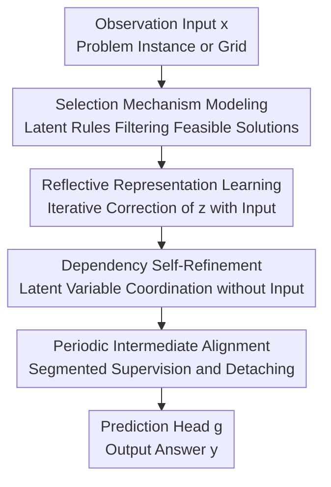

# Selection, Reflection and Self-Refinement: Revisit Reasoning Tasks via a Causal Lens

**Conference**: ICLR 2026  
**OpenReview**: [https://openreview.net/forum?id=0X5moS8KSm](https://openreview.net/forum?id=0X5moS8KSm)  
**Code**: https://github.com/dengyl20/SR2  
**Area**: LLM Reasoning / Causal Analysis  
**Keywords**: Causal Selection Mechanism, Latent Variable Reasoning, Recurrent Transformer, Self-Refinement, Constraint Satisfaction  

## TL;DR
This paper interprets reasoning tasks such as Sudoku, Maze, and ARC as latent variable constraint satisfaction problems under a causal selection mechanism. It proposes SR2, which iteratively corrects latent representations via reflective representation learning, dependency self-refinement, and periodic intermediate alignment, significantly improving structured reasoning accuracy with fewer parameters.

## Background & Motivation
**Background**: Reasoning tasks have long been essential benchmarks for testing the abstraction capabilities of machine learning models, especially Large Language Models (LLMs). Recent approaches roughly follow two paths: scaling up pre-training, post-training, and inference-time computation; or incorporating chain-of-thought, reward models, or self-feedback to generate intermediate trajectories resembling human problem-solving steps.

**Limitations of Prior Work**: While these approaches improve scores, they fail to explain why reasoning is difficult. Scaled models might only learn correlations between inputs and answers, and CoT supervision may merely mimic the surface form of natural language explanations. When a task requires global consistency across implicit rules, models remain prone to results that are locally correct but globally contradictory. In Sudoku, filling a cell requires satisfying constraints of rows, columns, and blocks simultaneously; in a Maze, the next path step must align with the reachability of the entire shortest path.

**Key Challenge**: The authors argue that the difficulty lies not in the size of the observation space itself, but in the complexity and high degree of coupling within the underlying latent variable space. While an input $x$ and answer $y$ might be uniquely determined, the combinations of rules, candidate intermediate states, and feasible reasoning trajectories leading to that answer are vast. Furthermore, a local modification in the latent variables affects many others. Learning a direct mapping $x \rightarrow y$ easily bypasses this structure.

**Goal**: The paper aims to achieve two things. First, to provide a unified interpretation of reasoning tasks using the selection mechanism in causality: high-level logical concepts act like selection operators that filter out observation-answer combinations that do not satisfy rules. Second, to translate this interpretation into model design, where the model iteratively reflects and cleans dependencies within the latent space—rather than spitting out an answer in one go—while maintaining optimizability during long recursive training.

**Key Insight**: Starting from the constraint satisfaction example of Sudoku, the authors formulate reasoning as a process where latent rules $z$ select observation pairs $(x,y)$. The merit of this perspective is that it transforms "being able to reason" from "outputting the correct answer" into "finding a latent state that satisfies selection constraints." Consequently, the model design naturally shifts towards fixed-point / recurrent refinement rather than simply stacking deeper Transformers.

**Core Idea**: Utilizing a shared recurrent Transformer block to first perform reflective initialization with the input in the latent space, followed by dependency self-refinement relying solely on the latent state, and finally stabilizing long recursive training with periodic intermediate alignment to explicitly learn dense latent variable dependencies in reasoning tasks.

## Method

### Overall Architecture
The overall logic of SR2 is divided into two layers: "causal modeling" and "neural implementation." The causal layer formulates reasoning as a selection mechanism: latent rules $z$ determine which $(x,y)$ pairs satisfy constraints. The neural layer uses a weight-shared Transformer block to repeatedly update the latent state $z$, first extracting available information from the input, then allowing the latent state to self-coordinate without further input injection, and finally outputting the answer via a prediction head $g$.

During training, SR2 sets two iteration scales: $M$ updates run within each alignment block, across $N$ total alignment blocks. The first block performs reflective representation learning, injecting the observation $x$ at each step to update $z^{(t+1)}=f(z^{(t)},x)$. Subsequent blocks perform dependency self-refinement, where $x$ is no longer injected, and the update becomes $z^{(t+1)}=f(z^{(t)},0)$. Every other block uses $g(z)$ to generate an intermediate prediction and calculate loss, followed by detaching the state to prevent long-distance gradients from destabilizing training.

In this process, the selection mechanism serves primarily as a theoretical explanation and design motivation. The three subsequent stages are the actual trainable modules. Reflective representation learning compresses problem instance information into the latent state; dependency self-refinement resolves global consistency among latent variables; and periodic intermediate alignment ensures stable training for the long recurrent model. Together, they form the "Selection, Reflection and Self-Refinement" of SR2.

### Key Designs
**1. Selection Mechanism Modeling: Shifting the Reasoning Difficulty from Answer Space to Latent Rule Space**

The paper first formulates reasoning tasks as a causal selection process. Let $x$ denote the observation input, $y$ the answer, and $z$ the latent rules or logical concepts. An $(x,y)$ pair is a valid sample only when the selection condition $S(z)=1$ is met. Formally, the authors define the joint distribution as $p(x,y)=\int p(z)p_g(x,y|z)I(S(z)=1)dz$. This formula is not for direct joint distribution estimation but to emphasize that answers appearing in training data are filtered by hidden rules.

This perspective explains why directly fitting $p(y|x)$ is insufficient. In Sudoku, the numbers provided are the observation space and the answer is deterministic, but the latent rules involve vast feasible trajectories such as row/column/block constraints, candidate elimination, and filling order. Even if a unique solution exists, the set of latent variables may be much larger than the observation itself. The authors use the filling order as an example in the appendix: if there are $n$ empty cells, a single complete solution still has $n!$ valid filling trajectories, leaving a massive latent space behind the "unique answer."

**2. Reflective Representation Learning: Compressing the Overly Large Latent Space with Input Feedback**

The first stage of SR2 addresses the transition from the problem instance into the latent space. The model initializes the latent state $z^{(0)}$ from zero and repeatedly applies a shared update function $z^{(n+1)}=f(z^{(n)},x)$. The key here is not deepening the Transformer but treating the same atomic block as a fixed-point operator: each update sees both the previous latent state and the observation input, allowing the representation to gradually approach a latent state that both interprets the input and moves closer to constraint satisfaction.

The difference from a standard multi-layer Transformer lies in parameter sharing and state feedback. While a standard Transformer can be written as different layers $h^{(l+1)}=T_l(h^{(l)},x)$, SR2 flattens it into recursive calls of the same block $h^{(m+1)}=T(h^{(m)},x)$. This reduces parameters while achieving effective depth through iterations. The authors draw intuition from deep equilibrium models but use explicit unrolling for a fixed number of steps instead of implicit function theorem solvers, allowing training targets to act directly on intermediate trajectories.

**3. Dependency Self-Refinement: Forcing Latent Variables to Reach Consensus without Input**

If $x$ were injected into every recursive step, the model might continue to rely on shallow patterns in the observation rather than learning constraint propagation among latent rules. Therefore, SR2 enters a second stage after obtaining the initial latent state: the input is set to zero, and updates continue via $z^{(t+1)}=f_s(z^{(t)},0)$. Since subsequent updates can no longer draw information from the problem instance, the model must resolve conflicts internally within the latent state, coordinating implicit variables like rows, columns, paths, and abstract transformations.

This design aligns with the authors' second hypothesis: feasible latent variables are densely dependent. In Sudoku, a change in one cell affects the corresponding row, column, and block; in a Maze, a path choice affects subsequent reachability; in ARC, local pattern transformations alter global consistency. Self-refinement allows these dependencies to propagate repeatedly through the same shared block. Removing this step caused Sudoku-Extreme performance to drop from $66.63\%$ to $53.11\%$, proving that "input feedback" alone is insufficient and that long-range latent variable coordination is a core contribution.

**4. Periodic Intermediate Alignment: Breaking Long Recurrent Training into Optimizable Segments**

The total number of update steps in SR2 is $T=M\times N$. If supervision were only applied at the final step, gradients would need to traverse a very long recursive chain, likely leading to vanishing or unstable gradients. The authors therefore introduce intermediate supervision at alignment points $A$, with the objective $L=\sum_{t\in A}\ell(g(z^{(t)}),y)$. After each alignment block, the model predicts the answer from the current $z$, calculates the loss, and then detaches the state so that the subsequent block cannot backpropagate gradients deep into the past.

This is not merely deep supervision. Combined with the first two stages, it forms a "piecewise approximation of the fixed point": each block pushes the latent state closer to a readable answer, yet state transmission is preserved between blocks. Ablations show that frequently re-injecting the input actually degrades performance: Mixture 2 Reflections achieved $63.32\%$, while Mixture 4 Reflections dropped to $55.25\%$. This indicates that SR2 succeeds not by looking at the input multiple times, but through prolonged latent space coordination following an initial input modeling phase.

### A Complete Example
Consider a cell $Y_{ij}$ to be filled in Sudoku. The observation $x$ is a partially filled $9\times9$ grid, and the target $y$ is the completion of all empty cells. Traditional direct prediction treats each empty cell as a classification problem, at most observing row, column, or block information via attention, but does not necessarily guarantee global consistency.

In SR2, the first $M$ steps repeatedly inject the grid numbers into the latent state. The model gradually forms internal encodings for candidate numbers and row/column/block constraints—for instance, one cell might temporarily favor candidates $\{2,5,8\}$, while adjacent cells have their own sets. Upon entering self-refinement, the model stops reading the grid and instead propagates constraints between these candidate states: if another cell in the same block is updated to $5$, this cell's candidates should simultaneously exclude $5$; if only one position in a row can hold an $8$, other related latent states must shrink accordingly.

After each alignment block, the prediction head decodes the current latent state into a full grid for supervision. Early outputs might only be locally valid, while later outputs gradually satisfy the joint constraints of rows, columns, and blocks. This example illustrates the difference between SR2 and verbal self-refinement: SR2 does not ask the model to write "let me check again," but continuously updates candidate structures within the hidden states.

### Loss & Training
The training objective of SR2 is the periodic summation of task-specific losses, formally $L=\sum_{t\in A}\ell(g(z^{(t)}),y)$, where $g$ maps the latent state to the answer space. For discrete output tasks like Sudoku or Maze, $\ell$ is the classification loss aligned with the target answer. In the implementation, all baselines use the same backbone, optimizer, learning rate, batch size, and loss function to ensure fair comparison.

Default hyperparameters are $M=N=16$. Under a fixed budget of $M\times N=256$, the authors found optimal performance when $M\approx N$; if unbalanced, the degradation is less severe for $M>N$ than for $N>M$. Training uses AdamAtan2 with a learning rate of $1\times10^{-4}$ and a batch size of 768. Sudoku-Extreme and Maze-Hard are trained for 60,000 epochs. Hardware includes 8 AMD MI210 64GB GPUs; Sudoku training takes approximately 1 hour, and Maze takes about 15 hours.

## Key Experimental Results

### Main Results
SR2 was evaluated on Sudoku-Extreme, Maze-Hard, and ARC-AGI. Sudoku-Extreme has 1,000 training problems and 422,786 test problems, requiring an average of 22 backtracking steps. Maze-Hard consists of $30\times30$ mazes with 1,000 instances each for training and testing. ARC-1 / ARC-2 follow official splits and report pass@2.

| Method | Params | Sudoku-Extreme | Maze-Hard | ARC-1 | ARC-2 |
| :--- | :--- | :--- | :--- | :--- | :--- |
| Transformer | 27.3M | 1.17 | 0 | 21.0 | 0 |
| Block Universal Transformer | 3.4M | 0 | 30.4 | - | - |
| Recurrent Depth | 3.4M | 42.52 | 48.4 | - | - |
| HRM | 27.3M | 55.0 | 74.5 | 40.3 | 5.0 |
| Reflective Model | 27.3M | 53.12 | 70.8 | - | - |
| **SR2** | **3.4M** | **66.63** | **93.7** | **44.3** | **6.7** |

The most significant takeaway is SR2's parameter efficiency. With only 3.4M parameters, SR2 outperforms the 27.3M parameter HRM by $11.63$ points on Sudoku-Extreme and $19.2$ points on Maze-Hard. Compared to Recurrent Depth, it shows an improvement of approximately $24.11$ points on Sudoku and nearly double the performance on Maze.

| Method | Training Speed (Batch/s) | Training VRAM (GB) | Inference Speed (Sample/s) |
| :--- | :--- | :--- | :--- |
| Direct Pred | 21.39 | 3.024 | 7489.6 |
| HRM | 10.57 | 3.231 | 1487.7 |
| **SR2** | **14.73** | **3.950** | **2073.6** |

In terms of efficiency, SR2 is slower than direct prediction due to periodic alignment and more iterations, but it remains faster than HRM. Inference speed is approximately 2073.6 samples/s, higher than HRM's 1487.7 samples/s. The trade-off is slightly higher training memory usage, reaching 3.950GB.

### Ablation Study
| Configuration | Sudoku-Extreme Accuracy | Description |
| :--- | :--- | :--- |
| No Self-Refinement | 53.11 | No subsequent latent self-refinement; primarily input feedback |
| No Reflection | 0 | No repeated input injection; model fails to retain problem features |
| Mixture (2 Reflections) | 63.32 | Re-injecting input across multiple blocks; slightly lower than default |
| Mixture (4 Reflections) | 55.25 | Excessive input injection significantly interferes with latent dependency learning |
| Separate Function | 59.76 | Using two different functions for reflection and refinement; performs worse |
| Reflective Model | 53.12 | 8-layer non-shared reflective model |
| Flattened Reflective Model | 53.75 | Single-layer shared recursion can substitute deep stacking |
| **SR2** | **66.63** | **Default full model** |

### Key Findings
- **Both reflection and self-refinement are necessary.** Accuracy drops to zero without Reflection, meaning the model must first repeatedly absorb the observation input. Removing Self-Refinement leaves $53.11\%$, which is significantly lower than the full model, indicating the major contribution of long-range latent variable coordination.
- **More input feedback is not necessarily better.** Two reflections were already worse than the default, and four reflections showed a clearer degradation. The authors suggest that frequent $x$ injection induces the model to fit shallow input patterns rather than learning latent space dependencies.
- **A single shared function suffices.** The Separate Function configuration using two Transformer layers for reflection and refinement respectively performed worse than the shared version, suggesting both stages do not necessarily require entirely different dynamical systems.
- **SR2 has task boundaries.** Appendix tests on CUB-200-2011 fine-grained classification showed roughly $75\%$ top-1 for ViT, whereas SR2 was below $45\%$. This supports the judgment that iterative latent refinement is suited for constraint satisfaction and complex reasoning, rather than classification tasks with direct input-to-label relationships.

## Highlights & Insights
- The causal selection mechanism provides a clearer language for "why reasoning is hard" than empirical narratives. it reframes the problem from "the model cannot output the answer" to "the model has not learned the constraint structure that filters valid latent states," which is natural for tasks like Sudoku, Maze, and ARC.
- The elegance of SR2 lies in translating theoretical assumptions into architectural divisions of labor. Given the large latent space, reflection is used to narrow the search; given strong latent variable coupling, self-refinement is used for coordination without input; given long recursive chains, periodic alignment is used for segmented training.
- The paper integrates recurrent Transformers, DEQ, latent reasoning, and self-refinement into a single framework. It does not pursue verbal "self-reflection" but implements it as fixed-point iterations of hidden states, which is highly insightful for LLM reasoning architectures.
- Parameter efficiency is a valuable signal. SR2's success with a single-layer shared Transformer over the larger HRM suggests that in structural reasoning, the "correct computational process" is more critical than "more independent layer parameters."
- The analysis of test-time compute is practical. The authors note that reducing test alignment steps creates an accuracy-throughput Pareto frontier, and pushing test steps beyond the training horizon yields limited returns, reminding future methods not to rely solely on infinite reasoning steps.

## Limitations & Future Work
- The selection mechanism perspective might be overly idealized. Sudoku and Maze have clear, closed, and verifiable constraints, but rules in natural language reasoning, open-domain mathematical proofs, or multi-hop knowledge reasoning are often fuzzy and debatable, potentially difficult to define as $S(z)=1$.
- Experiments are focused on small-scale structured benchmarks. While ARC-1 / ARC-2 provide some evidence for abstract reasoning, SR2's scalability to real LLMs, long-context reasoning, or tool-use tasks remains unverified.
- The method currently relies on numerous recursive steps, meaning inference is still slower than direct prediction. Future research into dynamic stopping, difficulty-adaptive step counts, or refining only specific tokens/states is needed for low-latency deployment.
- The periodic alignment target still relies on standard supervised labels. Designing reliable self-supervision or consistency signals for tasks with no intermediate labels, sparse answers, or non-differentiable goals is a key next step.
- The model performs poorly on simple classification tasks, indicating it is not a universal replacement for Transformer architectures. A more reasonable future direction might be task-adaptive logic to decide whether to enable latent refinement rather than applying it universally.

## Related Work & Insights
- **vs Chain-of-Thought / Verbal Self-Refinement**: CoT, Reflexion, and Self-Refine guide models through natural language intermediate steps or feedback, whereas SR2 performs self-correction entirely in the latent space. The former is more interpretable and suitable for LLM interfaces; the latter lacks linguistic redundancy and functions more as a neural computational mechanism.
- **vs Recurrent Depth**: Recurrent Depth also applies the same layer repeatedly and maps intermediate representations back to the input space. SR2 differs by explicitly separating "initial input injection" from "final no-input refinement," using the latter specifically to learn latent variable dependencies, resulting in significant gains in Sudoku and Maze.
- **vs HRM**: HRM uses high-level/low-level modules to simulate slow planning and fast computation, with a more complex structure and more parameters. SR2's results suggest that for these constraint satisfaction tasks, hierarchical modules are not the only path; a shared recurrent function with correct training sequences can achieve similar or even superior reasoning.
- **vs DEQ / Implicit Deep Learning**: DEQs define representations as implicit equilibrium points and train using implicit differentiation; SR2 is more like an explicitly unrolled truncated fixed-point model. It sacrifices the theoretical compactness of DEQ for observable and supervisable intermediate states.
- **Inspiration for Future Work**: Integrating SR2's latent space refinement into LLM hidden layers or verifiers could create a reasoning module that "generates candidates first and then performs constraint consistency repair in hidden states." Another direction is to make $S(z)$ in the selection mechanism explicit, using verifiable rules, program executors, or neural constraint checkers to provide stronger signals for periodic alignment.

## Rating
- Novelty: ⭐⭐⭐⭐ The causal selection mechanism interpretation of reasoning is distinct, and the three-stage design of SR2 deviates significantly from existing recurrent reasoning methods.
- Experimental Thoroughness: ⭐⭐⭐⭐ Strong results on Sudoku and Maze with solid ablations, though verification on open-domain LLM reasoning and larger-scale tasks is still lacking.
- Writing Quality: ⭐⭐⭐⭐ The main narrative is clear, aligning theoretical assumptions, architecture, and ablations; some formulas are more for explanatory modeling than direct estimation, requiring distinctions between the theoretical and implementation layers.
- Value: ⭐⭐⭐⭐⭐ Clearly articulates that "reasoning is not answer fitting, but latent constraint coordination," providing significant reference value for future latent reasoning, test-time compute, and small-parameter reasoning models.

<!-- RELATED:START -->

## Related Papers

- [\[ICLR 2026\] Plan-Answer-Refine-on-Graph: Structured Planning and Self-Refinement for Large Language Model Reasoning on Knowledge Graphs](plan-answer-refine-on-graph_structured_planning_and_self-refinement_for_large_la.md)
- [\[ICLR 2026\] A Stitch in Time Saves Nine: Proactive Self-Refinement for Language Models](a_stitch_in_time_saves_nine_proactive_self-refinement_for_language_models.md)
- [\[ICLR 2026\] Semantic Voting: A Self-Evaluation-Free Approach for Efficient LLM Self-Improvement on Unverifiable Open-ended Tasks](semantic_voting_a_self-evaluation-free_approach_for_efficient_llm_self-improveme.md)
- [\[ACL 2025\] Self-Correction is More than Refinement: A Learning Framework for Visual and Language Reasoning Tasks](../../ACL2025/llm_reasoning/self-correction_is_more_than_refinement_a_learning_framework_for_visual_and_lang.md)
- [\[ICLR 2026\] Rectifying LLM Thought from Lens of Optimization](rectifying_llm_thought_from_lens_of_optimization.md)

<!-- RELATED:END -->

## Related Papers

- [\[ICLR 2026\] Semantic Voting: A Self-Evaluation-Free Approach for Efficient LLM Self-Improvement on Unverifiable Open-ended Tasks](semantic_voting_a_self-evaluation-free_approach_for_efficient_llm_self-improveme.md)
- [\[ICLR 2026\] Plan-Answer-Refine-on-Graph: Structured Planning and Self-Refinement for Large Language Model Reasoning on Knowledge Graphs](plan-answer-refine-on-graph_structured_planning_and_self-refinement_for_large_la.md)
- [\[ICLR 2026\] Premise Selection for a Lean Hammer](premise_selection_for_a_lean_hammer.md)
- [\[ICLR 2026\] Rectifying LLM Thought from Lens of Optimization](rectifying_llm_thought_from_lens_of_optimization.md)
- [\[ICLR 2026\] A Stitch in Time Saves Nine: Proactive Self-Refinement for Language Models](a_stitch_in_time_saves_nine_proactive_self-refinement_for_language_models.md)

<!-- RELATED:END -->
