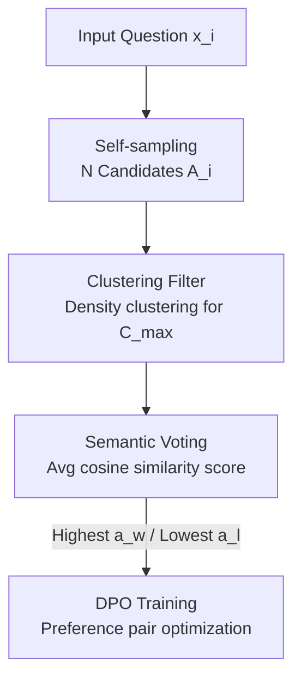

# Semantic Voting: A Self-Evaluation-Free Approach for Efficient LLM Self-Improvement on Unverifiable Open-ended Tasks

**Conference**: ICLR 2026  
**OpenReview**: [https://openreview.net/forum?id=7AlPbFkcs3](https://openreview.net/forum?id=7AlPbFkcs3)  
**Code**: https://github.com/rubickkcibur/Semantic-Voting  
**Area**: LLM Reasoning / Self-Improvement / Preference Learning  
**Keywords**: Self-Improvement, Semantic Voting, Unsupervised Pseudo-labeling, DPO, Open-ended Tasks

## TL;DR
For open-ended tasks like translation and summarization, where "answers do not match literally and lack verifiable rewards," this paper proposes **Semantic Voting**: using a lightweight sentence vector model to calculate pairwise semantic similarity among several self-sampled candidates. Each candidate is assigned an "alignment score with consensus," and the highest/lowest scoring pairs are selected for DPO training. This process bypasses LLM self-evaluation entirely, achieving stable self-improvement with a computational cost that is two to three orders of magnitude lower than self-evaluation methods.

## Background & Motivation

**Background**: The core of LLM self-improvement is "creating pseudo-labels without external annotation to train itself." In **verifiable tasks** (e.g., mathematics, multiple-choice), the most straightforward and effective pseudo-labeling method is **majority voting**—sampling multiple answers for the same problem and selecting the most frequent one (following the line of LMSI, ScPO, and TTRL).

**Limitations of Prior Work**: Majority voting relies on **hard matching (exact matching)**—only answers that match word-for-word can be counted. However, in **unverifiable open-ended tasks** (e.g., translation, summarization), a single meaning can have infinite legitimate expressions, rendering hard matching ineffective. Consequently, researchers have turned to **self-evaluation** mechanisms for pseudo-labeling, primarily through two paths: ① **Self-judging**, or "LLM-as-a-Judge," where the model scores/ranks its own outputs; ② **Entropy minimization**, using metrics like Shannon entropy to measure output confidence and reinforce low-entropy (high-confidence) answers.

**Key Challenge**: Self-evaluation suffers from two major drawbacks. First, it is **expensive**—both self-judging and entropy estimation require additional model inference passes, with costs escalating alongside model size. Second, it is **biased**—models exhibit self-preference bias when scoring themselves, and entropy minimization can be skewed by pre-training priors, amplifying **overconfidence** or even causing small models to collapse. Conversely, research (Chowdhury et al., 2024) indicates that preference learning is quite robust to noisy labels, questioning **the necessity of expensive self-evaluation** for pseudo-feedback.

**Goal**: To perform self-improvement on open-ended unverifiable tasks while **bypassing self-evaluation mechanisms**, ensuring the process is both lightweight and stable.

**Core Idea**: Relax "hard matching" of majority voting into **"soft matching"**—instead of counting occurrences, use sentence vectors to calculate **semantic similarity**. The candidate most consistent with others is deemed the "most voted." A lightweight sentence vector model eliminates both the computational overhead and intrinsic biases of self-evaluation.

## Method

### Overall Architecture

The method, named **SVSI (Semantic Voting-based Self-Improvement)**, is essentially a pseudo-label pipeline of "Self-sampling → Filtering → Semantic Voting → DPO." For each input $x_i$ in the dataset: first, the base LLM samples $N$ candidate answers to form set $\mathcal{A}_i$. Since random sampling can introduce deviant outliers, density clustering is used to group candidates, and **only the largest cluster** $\mathcal{C}_i^{max}$ is retained as a clean candidate pool. Within this cluster, **semantic voting** is performed by assigning each candidate a score based on its average semantic similarity to others in the cluster. Finally, the candidate with the highest score $a_i^w$ is selected as preferred, and the one with the lowest score $a_i^l$ as dispreferred, forming the preference pair $(x_i, a_i^w, a_i^l)$ for DPO training. No part of this pipeline requires the LLM to judge itself; the sole "judge" is a lightweight sentence vector model.

### Key Designs

**1. Semantic Voting: Relaxing Hard Matching to Sentence Vector Soft Matching**

This is the core engine, directly addressing the pain point that open-ended tasks cannot be counted verbatim. While majority voting counts occurrences (requiring hard matching), semantic voting uses a soft metric—for candidate $a_i^j$, its voting score is defined as the **average similarity** to other candidates in the set:

$$S_{sv}(a_i^j \mid \mathcal{A}_i) = \frac{1}{|\mathcal{A}_i|} \sum_{a_i^k \in \mathcal{A}_i,\, k \neq j} f_{sim}(a_i^j, a_i^k)$$

The similarity function $f_{sim}$ is implemented using **cosine similarity** of sentence vectors: $f_{sim}(a_i^j, a_i^k) = \frac{M_{emb}(a_i^j) \cdot M_{emb}(a_i^k)}{\|M_{emb}(a_i^j)\| \times \|M_{emb}(a_i^k)\|}$, where $M_{emb}$ is a lightweight sentence vector model (SimCSE is used). Intuitively, the highest-scoring answer is the one "most semantically consistent with the group," representing the "most voted" candidate under semantic consensus. This cleverly reduces a "task requiring LLM intelligence" to a cheap "encode once + calculate cosine" operation, avoiding both self-preference bias and overconfidence.

**2. Self-sampling Filtering: Clustering the Largest Cluster to Remove Outliers Before Voting**

Semantic voting assumes that the candidate pool can form a "meaningful consensus," meaning candidates should not diverge too drastically. However, random sampling (temperature 0.7, top-p 0.9, $N=64$) inevitably generates deviant outliers. Empirical results show these anomalies can **distort voting results**, which is particularly critical for weaker, small models.

The solution is a **clustering filter** before voting: using sentence vectors as features and cosine similarity as distance, the HDBSCAN density clustering algorithm groups $\mathcal{A}_i$ into clusters $\{\mathcal{C}_i^k\}$. Only the **largest cluster** $\mathcal{C}_i^{max} = \arg\max_k |\mathcal{C}_i^k|$ is retained, and semantic voting is performed only on this clean, consistent subset. By removing answers that are clearly outside the range of consensus before voting, the results become significantly more reliable. Ablation studies show this is essential for noisy weak models (e.g., Llama-1B) but optional for high-quality models (e.g., Qwen-1.5B).

**3. DPO Training: Constructing Preference Pairs with Extreme Scores**

Semantic voting provides a continuous score, which could theoretically be used for Online RL rewards or preference pairs. Given that unsupervised signals are inherently noisy, a robust training framework is required. The authors choose **DPO**, as prior work demonstrates its provable robustness to mislabeled or imperfect data. To maximize the preference margin, the **highest-scoring candidate is taken as preferred** $a_i^w$ and the **lowest as dispreferred** $a_i^l$, forming $(x_i, a_i^w, a_i^l)$ for standard DPO loss optimization:

$$\mathcal{L}_{DPO} = -\mathbb{E}_{(x, a^w, a^l) \sim \mathcal{D}_{dpo}} \left[ \log \sigma \left( \beta \log \frac{\pi_\theta(a^w \mid x)}{\pi_{ref}(a^w \mid x)} - \beta \log \frac{\pi_\theta(a^l \mid x)}{\pi_{ref}(a^l \mid x)} \right) \right]$$

The authors also tested using semantic voting scores directly as continuous rewards for GRPO (SVSI-G), but found that many preference pairs derived from continuous rankings were incorrect due to noise, leading to unstable convergence. The DPO approach of "taking the extremes and discarding the ambiguous middle" proved more stable.

## Key Experimental Results

### Main Results

Experiments were conducted on **Translation** (WMT24++ for de/fr/ru/es→en, metrics BLEU + n-MQM) and **Summarization** (CNN/DailyMail, PubMed, metrics ROUGE-L + BLEURT) across 6 base models (Llama 1B/3B/8B, Qwen 1.5B/3B/7B). Comparison was made between SVSI and two self-evaluation baselines: SJ (self-judging) and EM (entropy minimization). Note that n-MQM $= \frac{1}{1+\text{MQM}}$ normalizes MQM to a "higher is better" metric.

| Setting | Metric | Base | SJ | EM | SVSI |
|------|------|------|------|------|------|
| Qwen-1.5B / wmt24pp de | BLEU | 16.12 | 3.45 | 18.21 | **18.04** |
| Qwen-1.5B / cnn dailymail | RougeL | 13.50 | 13.54 | 1.63 | **13.72** |
| Qwen-7B / cnn dailymail | BLEURT | 33.9 | 16.33 | 33.75 | **42.61** |
| Llama-8B / wmt24pp es | BLEU | 28.92 | 26.08 | 12.4 | **29.33** |
| Llama-1B / pubmed | BLEURT | 50.23 | 50.54 | 45.69 | **50.92** |

The key finding is **stability**: SJ and EM frequently **cause the base model to collapse** in various settings (e.g., SJ dropping Qwen-1.5B BLEU from 16.12 to 3.45), whereas SVSI **consistently maintains or improves performance without severe degradation**. Plotting the relative gains (Figure 2), SVSI points are concentrated in the "positive gain for both metrics" region.

**Computational Overhead**: The time required for SVSI to construct preference pairs is **orders of magnitude lower** than the self-evaluation baselines. Furthermore, this cost **does not scale with the base model size**, as the sentence vector model remains fixed, making the advantage more pronounced for larger models.

### Ablation Study

| Configuration | Effect | Description |
|------|------|------|
| Full (Clustering + SV) | Optimal | Complete SVSI |
| w/o. SV (Clustering only) | Significant Drop | Large cluster as preferred, small as dispreferred; proves clustering alone is insufficient |
| w/o. Clustering (Direct Voting) | Model-dependent | Llama-1B degrades; Qwen-1.5B remains stable or improves slightly |

### Key Findings
- **Semantic Voting as the Engine, Clustering as the Stabilizer**: Removing SV leads to a sharp performance drop, indicating clustering signals are not sufficiently reliable. The impact of removing clustering depends on the model—weak models (Llama-1B) require it due to higher noise, while strong models (Qwen-1.5B) generate cleaner candidates.
- **Genuine Reward Signal**: Training with flipped preference pairs (flipped-SV) consistently yields performance lower than normal SV and almost always lower than the base. The degree of degradation corresponds proportionally to the gain of normal SV, proving the method captures **valid preference signals** rather than the "random reward gain" phenomenon described by Shao et al. (2025).
- **Hyperparameter Suggestions**: Temperature 0.7–1.0 and sample size $N \geq 32$ are stable. For HDBSCAN, larger minimum cluster size $m$ is better ($m>5$ is insensitive to neighborhood parameter $k$). Excessively high temperatures disrupt coherence and clustering.
- **Encoder Agnosticism**: Replacing SimCSE with DeBERTa-v3, BGE-en, or BGE-m3 yields stable downstream performance, indicating the method is not tied to a specific encoder.

## Highlights & Insights
- **The Concept of "Evaluation Dimensionality Reduction"**: Reducing open-ended scoring—which normally requires LLM "intelligence"—to cheap geometric operations is a brilliant paradigm shift that avoids biases and overhead.
- **Elegant Generalization of Majority Voting**: Majority voting is a special case where similarity is binary (0/1). Semantic voting continuousizes it, extending a mature paradigm to unverifiable tasks.
- **Rigorous Verification via flipped-SV**: In an era of skepticism regarding "meaningless rewards," using flipped preference pairs to disprove the "false reward" hypothesis is a simple yet persuasive experimental design.
- **Insights on DPO vs GRPO**: Continuous reward rankings provide more information but are noisy and hard to converge; DPO’s focus on extremes provides better stability for noisy pseudo-labels.

## Limitations & Future Work
- **Reliance on the "Consensus is Correct" Assumption**: Semantic voting assumes the direction of consensus among majority candidates is the correct one. If the base model is systematically biased in one direction, SVSI might reinforce that error—a risk similar to entropy minimization's "prior bias."
- **GRPO Variant Instability**: The authors acknowledge that SVSI-G (using SV scores as continuous rewards) is volatile compared to discrete reward methods like EMPO. Improving stability for continuous rewards remains future work.
- **Limited Task Scope**: Experiments cover translation and summarization. Whether meaningful consensus can form in more open scenarios (e.g., creative writing or long-form generation) where semantic variance is higher is unverified.
- **Dependency on Sentence Vectors**: The "evaluation ability" is outsourced to the sentence vector model. Distortions in similarity estimation in specialized domains (e.g., medical) could bottleneck the voting quality.

## Related Work & Insights
- **vs. Majority Voting (TTRL / ScPO)**: These rely on hard matching and are limited to verifiable closed tasks; SVSI extends this to open-ended tasks via soft matching.
- **vs. Self-Judging (SRLM)**: Self-judging uses LLMs as referees, which is expensive and biased; SVSI removes the LLM from the judging loop entirely.
- **vs. Entropy Minimization (RENT / EMPO)**: EM reinforces high-confidence outputs but risks overconfidence and model collapse; SVSI replaces "self-confidence" with "semantic consensus," providing better stability.

## Rating
- Novelty: ⭐⭐⭐⭐ Relaxing hard matching to semantic soft matching while removing self-evaluation is an elegant solution to a clear pain point.
- Experimental Thoroughness: ⭐⭐⭐⭐ 6 bases × 6 datasets + flipped control + 4 ablation/analysis groups; however, task diversity is limited to translation and summarization.
- Writing Quality: ⭐⭐⭐⭐ Logical motivation, complete formulas, and self-consistent visualization.
- Value: ⭐⭐⭐⭐ Provides a plug-and-play, computationally efficient solution for cheap self-improvement on unverifiable tasks.

<!-- RELATED:START -->

## Related Papers

- [\[ICLR 2026\] ShinkaEvolve: Towards Open-Ended and Sample-Efficient Program Evolution](shinkaevolve_towards_open-ended_and_sample-efficient_program_evolution.md)
- [\[ICLR 2026\] Reverse-Engineered Reasoning for Open-Ended Generation](reverse-engineered_reasoning_for_open-ended_generation.md)
- [\[ICLR 2026\] Selection, Reflection and Self-Refinement: Revisit Reasoning Tasks via a Causal Lens](selection_reflection_and_self-refinement_revisit_reasoning_tasks_via_a_causal_le.md)
- [\[ICLR 2026\] Think in Parallel, Answer as One: Logit Averaging for Open-Ended Reasoning](think_in_parallel_answer_as_one_logit_averaging_for_open-ended_reasoning.md)
- [\[ICLR 2026\] Toward Effective Tool-Integrated Reasoning via Self-Evolved Preference Learning](toward_effective_tool-integrated_reasoning_via_self-evolved_preference_learning.md)

<!-- RELATED:END -->
