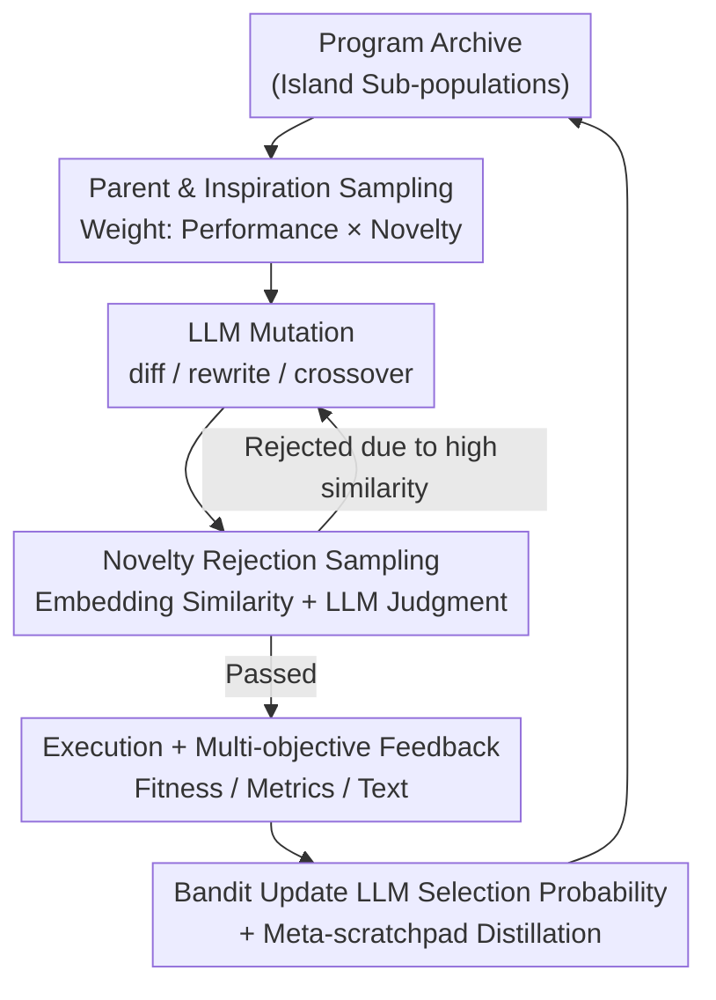

# ShinkaEvolve: Towards Open-Ended and Sample-Efficient Program Evolution

**Conference**: ICLR 2026  
**OpenReview**: [https://openreview.net/forum?id=lKEdGCoDNC](https://openreview.net/forum?id=lKEdGCoDNC)  
**Code**: https://github.com/SakanaAI/ShinkaEvolve  
**Area**: LLM Reasoning / Program Evolution / Automated Scientific Discovery  
**Keywords**: LLM Program Evolution, Sample Efficiency, Rejection Sampling, Bandit Model Selection, Open-Ended Discovery

## TL;DR
ShinkaEvolve utilizes a "Parent Weighted Sampling + Code Novelty Rejection Sampling + Bandit-style LLM Ensemble Selection" triad to compress LLM-driven program evolution from thousands of evaluations to just 150. It achieves state-of-the-art results across four domains: circle packing, AIME agent scaffolding, ALE-Bench competitive programming, and MoE load-balancing loss.

## Background & Motivation
**Background**: Using LLMs as "mutation operators" for the automated discovery of scientific/engineering code is a mature pipeline—frameworks like AlphaEvolve, OpenEvolve, and LLM4AD maintain an archive of evaluated programs, repeatedly sampling parent programs, having an LLM rewrite them into new variants, evaluating fitness, and retaining high-quality solutions for further reproduction to iteratively approach optimal solutions.

**Limitations of Prior Work**: This approach faces a fatal practical bottleneck—**extremely low sample efficiency**. Existing methods typically require **thousands of evaluations** to find an effective solution. Each evaluation represents an expensive LLM call plus program execution, making the search both costly and time-consuming. For the classic circle packing task, AlphaEvolve requires over a thousand iterations.

**Key Challenge**: The root cause of inefficiency lies in **naive exploration strategies** that fail to effectively utilize knowledge accumulated in previous generations. This manifests as three types of waste: parent selection is either purely random (ignoring fitness) or purely greedy (converging too early to local optima); LLM-generated variants are often "new wine in old bottles" (near-duplicate programs) wasting evaluation budget; and using a fixed single LLM or uniform ensemble fails to allocate compute to the models most likely to produce breakthroughs given the current archive state.

**Goal**: To reduce the required number of evaluations by one to two orders of magnitude without sacrificing solution quality, making LLM-driven discovery both cost-effective and capable of continuous open-ended innovation.

**Key Insight**: The authors address the three sources of waste respectively: performance and novelty are considered simultaneously for parent selection; embedding similarity is used for novelty filtering of mutation products; and model scheduling is handled by an adaptive Multi-Armed Bandit. These three components synergistically improve sampling efficiency.

**Core Idea**: Transform every sampling decision in the evolutionary search (selecting parents, retaining variants, choosing LLMs) into an **adaptive, knowledge-driven** process rather than naive randomness, thereby extracting SOTA solutions with minimal evaluations.

## Method

### Overall Architecture
ShinkaEvolve maintains a **fixed-capacity program archive** divided into several parallel evolving "islands" (island model). The control flow for each generation follows three stages: ① Sample a **primary parent** and several **inspiration programs** from an island (balancing exploration and exploitation); ② Let the LLM rewrite candidate programs via three mutation methods (diff editing / full rewrite / crossover), and use **novelty rejection sampling** to block near-duplicate candidates; ③ Execute the surviving programs to obtain scalar fitness, public metrics, and textual feedback. This feedback is written back to the archive as context for the next generation and used to update the **Bandit-style LLM selection probabilities**, while a meta-scratchpad distills common strategies every few generations to append to prompts. These three stages form a closed loop that iteratively combines "stepping stones" (sub-optimal intermediate solutions) into breakthrough solutions.

### Key Designs

**1. Parent and Inspiration Sampling: Breaking the Exploration-Exploitation Dilemma with "Performance × Novelty" Weighting**

Naive methods struggle with parent selection: uniform random sampling ignores historical fitness, while pure hill-climbing (choosing only the best) quickly plateaus or gets stuck in local optima. ShinkaEvolve uses an **island model** to preserve diversity—the archive is split into multiple independently evolving sub-populations, with occasional migrations to diffuse knowledge, though **egress of the best program from each island is prohibited** to protect unique traits. During sampling, an island ID is drawn uniformly, followed by parent and inspiration sampling within that island. Intra-island parent selection defaults to **weighted sampling**: for each program $P_i$, the median population fitness $\alpha_0 = \mathrm{median}(\{F(P_1),\dots,F(P_n)\})$ is calculated. The performance component is scaled via a sigmoid $s_i = \sigma(\lambda \cdot (F(P_i) - \alpha_0))$ (where $\lambda$ controls selection pressure), and the novelty component $h_i = \frac{1}{1+N(P_i)}$ favors programs with fewer descendants $N(P_i)$. The final probability is $p_i = \frac{w_i}{\sum_j w_j}$, where $w_i = s_i \cdot h_i$. The authors also provide power-law sampling as a baseline: based on fitness rank $r_i$ ($r_i=1$ is best), $p_i = \frac{r_i^{-\alpha}}{\sum_j r_j^{-\alpha}}$. The multiplicative $s_i \cdot h_i$ scheme gives high-fitness programs higher selection probabilities (exploitation) while actively giving opportunities to programs that "have not yet been fully reproduced" (exploration).

**2. Code Novelty Rejection Sampling: Blocking Near-Duplicate Variants Before Evaluation**

LLMs often produce "re-skinned" near-duplicate programs during mutation; evaluating each costs an expensive execution, leading to significant sample waste. ShinkaEvolve introduces a novelty filter **before** the program is executed: an embedding model encodes the **mutable portions** of the program (regions marked by `EVOLVE-BLOCK-START/END`) into vectors, and the maximum cosine similarity to existing programs in the island is calculated. If the maximum similarity exceeds a threshold (e.g., $\eta = 0.95$), an additional LLM is queried as a "novelty judge" to determine if the candidate has substantial semantic differences—if judged redundant, it is rejected and re-sampled. This design places "filtering" before "evaluation," saving the most expensive step. Ablations show significant gains from the embedding threshold alone, with the LLM judge providing marginal improvements.

**3. Bandit-style LLM Ensemble Selection: Dynamically Tilting Compute to Currently Effective Models**

Different LLMs vary in mutation capability across domains and archive states, and the "stronger" model changes **non-stationarily** as the search progresses. ShinkaEvolve uses a variant of **UCB1** to evolve the sampling probabilities of each LLM at the end of each generation. The key modification is the reward signal—instead of absolute fitness $F(P_i)$, it uses relative improvement $F(P_i)_u = \exp(\max(F(P_i) - F(P_i)_b,\ 0)) - 1$, where the baseline $F(P_i)_b$ is the maximum of the "program's parent" and the "initial program in the database." The $\max(\cdot,0)$ ensures that mutations yielding no improvement are not rewarded, while $\exp(\cdot)$ amplifies the weight of major improvements. This system **precisely favors models capable of high-risk, high-reward mutations** rather than those performing only safe minor edits.

**4. Meta-Scratchpad Online Refinement: Back-filling Accumulated Evolution Experience into Prompts**

Evolutionary processes accumulate latent experience regarding "what changes are effective," but LLMs "rediscover" this every generation if not explicitly summarized. ShinkaEvolve sets up a meta-scratchpad: every $T$ generations, a meta-agent aggregates recent program evaluations, identifies common optimization strategies and design principles, and distills insights into actionable suggestions appended to mutation prompts. Simultaneously, each program undergoes **multi-objective evaluation**—exposing public metrics and textual feedback alongside scalar fitness, which are stored in the archive as informational context for future LLM mutations.

## Key Experimental Results

### Main Results
Comprehensive verification across four domains focuses on the core selling point: **achieving SOTA with minimal evaluations**.

| Task | Eval/Iteration Budget | Key Results | Comparison |
|------|-----------------------|-------------|------------|
| Circle Packing (26 circles in square) | Only **150** gens | New SOTA solution found | AlphaEvolve requires 1000+ iterations |
| AIME 2024 agent scaffolding | 75 gens, gpt-4.1-nano | 7-call scaffold found, 34.4% accuracy | Base 18.4% / Majority@5 24.4% |
| ALE-Bench LITE (10 contests) | 50 gens | Avg score vs ALE-Agent up **~2.3%** (1879.3→1932.1) | ahc039 moved from 5th to 2nd place |
| MoE Load Balancing Loss | Only **30** gens | New LBL regularization found, better than global-batch LBL | 556M Tuning / 2.7B Validation |

AIME results highlight strong transferability: gains were even larger on the 2025 set (suggesting no data contamination), and transfer across models (gpt-4.1-mini/gpt-4.1/o4-mini) significantly raised accuracy (e.g., o4-mini from 65.6% to 94.4%).

### Ablation Study
Removing the three main components one by one in the circle packing task:

| Configuration | Trend | Description |
|---------------|-------|-------------|
| Parent Selection | Weighted ＞ Hill Climbing ＞ Best-of-N | Hill climbing is strong early but plateaus; Weighted sampling climbs steadily. |
| LLM Ensemble | + Bandit Priority ＞ Fixed Uniform ＞ Single Model | Bandit adaptive prioritization yields the largest gain. |
| Novelty Sampling | + LLM Judge ≳ Threshold Rejection ≫ No Rejection | Embedding threshold provides major gain; LLM judge provides marginal utility. |

### Key Findings
- **Synergy of the three components**: Parent weighted sampling handles "correct direction," rejection sampling ensures "no wasted evaluation," and Bandit ensures "correct model usage." The combination minimizes the evaluation budget.
- **Embedding similarity is a sufficient novelty proxy**: Adding an LLM judge only offers marginal returns, suggesting practical deployments can save on this overhead.
- **Evolutionary solutions tend to "stick to the initial solution"**: On ALE-Bench, ShinkaEvolve tends to perform fine-grained refinement near the ALE-Agent solution, implying a risk of overfitting to initial solutions.

## Highlights & Insights
- **Decomposing "Evaluation Efficiency" into three orthogonal decision points**: Parent selection, variant retention, and model selection. Each point is upgraded from naive randomness to knowledge-driven adaptation.
- **Clever Bandit reward design**: Using $\exp(\max(\cdot,0))-1$ with relative improvement addresses non-stationarity and rewards "successful risk-taking," which is exactly what open-ended discovery requires.
- **The MoE Load Balancing Loss is a genuinely useful byproduct**: The discovered regularization term $\frac{0.1}{L}\sum_\ell s(P_\ell)\sum_i \max(0,\tau - f_{\ell,i})$ covers blind spots in global-batch LBL (where dot products look balanced but specific experts are untouched), acting as an "adaptive safety net for dead experts."

## Limitations & Future Work
- **Requirement for manual task specifications**: The framework relies on human-provided objective functions and domain expertise, limited to problems with well-defined numerical goals.
- **Overfitting to initial solutions**: Evolution tends to stay near the starting point in ALE-Bench, meaning poor starting points can anchor the search, distancing it from "true open-endedness."
- **Dependency on closed-source models + API costs**: High costs of large-scale LLM calls may counteract "democratization" goals.
- **Future Directions**: Automating task specification generation using LLMs to move toward true open-ended discovery where the system defines its own goals.

## Related Work & Insights
- **vs AlphaEvolve**: Both are LLM-driven archive-based frameworks. ShinkaEvolve adopts diff editing and EVOLVE-BLOCK markers but pushes sample efficiency to new heights (150 vs 1000+ evals).
- **vs OpenEvolve / LLM4AD**: ShinkaEvolve differentiates itself through the "triad" of adaptive sampling decisions and the commitment to open-source the full code.
- **vs Traditional Novelty Search**: Traditional methods rely on explicit diversity metrics. ShinkaEvolve uses code embedding similarity + LLM semantic judgment, ensuring semantic coherence while filtering duplicates.

## Rating
- Novelty: ⭐⭐⭐⭐ The triad consists of adaptations of existing ideas (Weighted Sampling/Rejection Sampling/UCB1), but the combination and reward design are robust and effective.
- Experimental Thoroughness: ⭐⭐⭐⭐⭐ Four heterogeneous domains + full ablation of three components + cross-year/cross-model transfer provide a strong chain of evidence.
- Writing Quality: ⭐⭐⭐⭐ Clear structure, sufficient diagrams, and well-explained motivation and formulas.
- Value: ⭐⭐⭐⭐⭐ Reduces evaluation costs for LLM-driven discovery by orders of magnitude and is open-sourced, offering high practical value.

<!-- RELATED:START -->

## Related Papers

- [\[ICLR 2026\] Reverse-Engineered Reasoning for Open-Ended Generation](reverse-engineered_reasoning_for_open-ended_generation.md)
- [\[ICML 2026\] Deliberate Evolution: Agentic Reasoning for Sample-Efficient Symbolic Regression with LLMs](../../ICML2026/llm_reasoning/deliberate_evolution_agentic_reasoning_for_sample-efficient_symbolic_regression_.md)
- [\[ICLR 2026\] Semantic Voting: A Self-Evaluation-Free Approach for Efficient LLM Self-Improvement on Unverifiable Open-ended Tasks](semantic_voting_a_self-evaluation-free_approach_for_efficient_llm_self-improveme.md)
- [\[ICLR 2026\] Think in Parallel, Answer as One: Logit Averaging for Open-Ended Reasoning](think_in_parallel_answer_as_one_logit_averaging_for_open-ended_reasoning.md)
- [\[ICLR 2026\] Stabilizing Policy Gradients for Sample-Efficient Reinforcement Learning in LLM Reasoning](stabilizing_policy_gradients_for_sample-efficient_reinforcement_learning_in_llm_.md)

<!-- RELATED:END -->
