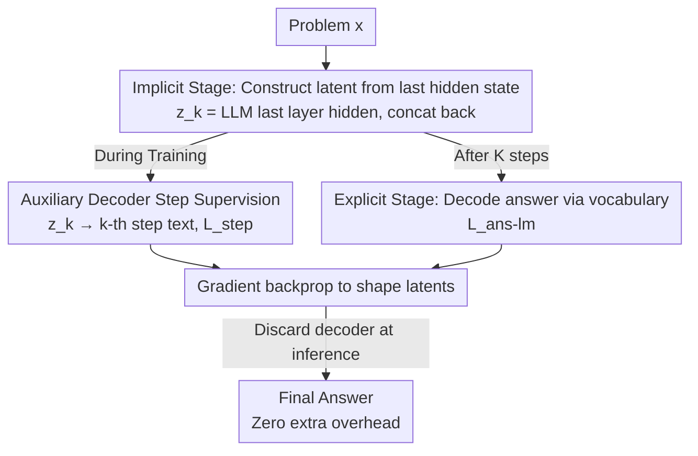

# SIM-CoT: Supervised Implicit Chain-of-Thought

**Conference**: ICLR 2026  
**OpenReview**: [https://openreview.net/forum?id=6YRJ4jmVQl](https://openreview.net/forum?id=6YRJ4jmVQl)  
**Code**: https://github.com/InternLM/SIM-CoT  
**Area**: LLM Reasoning  
**Keywords**: Implicit Chain-of-Thought, Step-level Supervision, Latent Representation Collapse, Token Efficiency, Auxiliary Decoder

## TL;DR
SIM-CoT identifies that implicit Chain-of-Thought (CoT) suffers from latent representation collapse when increasing reasoning tokens due to a lack of fine-grained supervision. It introduces a "disposable" auxiliary decoder during training to align each implicit latent with its corresponding explicit reasoning step. This stabilizes training and enriches semantics, improving Coconut by +8.2% on GPT-2 and allowing implicit CoT to outperform explicit CoT for the first time, all while adding zero overhead during inference.

## Background & Motivation
**Background**: Large Language Models (LLMs) rely on explicit Chain-of-Thought (CoT) to decompose complex problems into step-by-step natural language reasoning, showing excellent results in math and programming. However, explicit CoT must "speak out" every step, is constrained by a fixed vocabulary, and cannot explore multiple reasoning paths. Furthermore, generating a large number of intermediate tokens significantly increases inference costs and produces redundant "overthinking." To address this, implicit CoT has emerged, using continuous latent vectors (latents) instead of discrete text tokens to represent reasoning. Each latent can encode richer information than a single token, replacing a long explicit reasoning chain with just a few latents. Representative works like Coconut supervise only on the final answer, while CODI performs trajectory-level distillation.

**Limitations of Prior Work**: Although implicit CoT is fast and token-efficient, its accuracy consistently lags behind explicit CoT, leaving a persistent performance gap. A natural idea is to "increase compute for better performance" by increasing the number of implicit tokens. However, the authors discovered an counter-intuitive phenomenon—**latent instability**: when implicit tokens are increased from the default 3 to 5, accuracy rises initially but then becomes unstable or collapses entirely, dropping as low as 12.5%.

**Key Challenge**: The authors analyzed the collapsed models (by projecting latents back to the vocabulary via the LM head to inspect top-8 decoded tokens) and identified the root cause as the **trade-off between diversity and stability**. During collapse, two simultaneous changes occur: (1) Information loss—latents encode almost only digits while losing operators (e.g., +, −) essential for calculation; (2) Semantic homogenization—the distance between latents shrinks sharply (becoming nearly identical) while drifting away from the vocabluary embedding center, losing semantic anchoring with tokens. The fundamental cause is that existing implicit methods supervise only at the answer or trajectory level, failing to tell the model "which latent should encode which step," thus lacking step-level supervision.

**Goal / Key Insight / Core Idea**: Since collapse stems from coarse supervision, each implicit latent should be assigned a clear "answer." The authors propose SIM-CoT: attaching an auxiliary decoder during training to decode the $k$-th latent into the $k$-th explicit reasoning step. This step-level supervision anchors latents to specific reasoning content. The decoder is discarded during inference to maintain the original efficiency of implicit CoT. In short: **using a "training-time detachable step-level decoder" to provide fine-grained supervision for implicit latents and cure latent collapse**.

## Method

### Overall Architecture
SIM-CoT does not change the inference paradigm of implicit CoT; it only adds a supervision branch during training. The process consists of two stages: In the **implicit stage**, the LLM runs for $K$ fixed reasoning steps, where the last-layer hidden state of each step is treated as an implicit latent $z_k$ and concatenated back into the sequence as the next "token vector." After $K$ steps, it switches to the **explicit stage**, decoding the final answer normally over the vocabulary. The key innovation is an **auxiliary decoder** $p_\phi$ used only during training, which takes a single latent $z_k$ as a condition to autoregressively generate the $k$-th step's text, providing step-level supervision. During inference, this decoder is removed completely.

### Key Designs

**1. Implicit Stage: Autoregressive Latent Chain Construction**

This step defines how implicit reasoning occurs. The authors fix the number of reasoning steps $K$. For each step $k=1,\dots,K$, the last-layer hidden state at the current prefix end is taken as the implicit latent, which is then appended to the sequence as the next input vector:

$$z_k = H_\theta\!\left(U^{(k-1)}\right) \in \mathbb{R}^d, \qquad U^{(k)} = U^{(k-1)} \oplus z_k$$

where $\oplus$ represents concatenation along the time axis. The entire implicit CoT is a sequence of continuous hidden states $z_{1:K}$, generated and appended autoregressively before switching to explicit decoding. This construction follows Coconut—latents do not correspond to specific words but "think" in continuous space, allowing for more compact representation than text tokens.

**2. Training-time Auxiliary Decoder: Anchoring Latents to Reasoning Steps**

This is the core of the paper, addressing the issue that "latents do not know which step to encode." An auxiliary decoder $p_\phi$, structurally identical to the LLM, is introduced. It is conditioned **only** on the $k$-th latent $z_k$ to autoregressively generate the $k$-th text step $s_k=(y_{k,1},\dots,y_{k,L_k})$:

$$p_\phi(s_{1:K} \mid z_{1:K}) = \prod_{k=1}^{K}\prod_{t=1}^{L_k} p_\phi\!\left(y_{k,t} \mid z_k, y_{k,<t}\right)$$

A key detail: since $z_k$ does not correspond to a vocabulary token, it is injected as an **additional prefix vector** to initialize the decoder's hidden states. The decoder input sequence is $U_k^{\text{dec}}=\big[z_k;\, e(y_{k,1}),\dots,e(y_{k,L_k})\big]$, where the embedding function $e(\cdot)$ is shared. This strong "one latent ↔ one text step" mapping provides the fine-grained supervision that Coconut and CODI miss, forcing each $z_k$ to encode distinct and meaningful reasoning content.

**3. Dual Objectives: Shaping Latents while Ensuring Independent Reasoning**

To ensure latents learn fine-grained semantics without compromising the ability to "discard the decoder and still answer" during inference, two complementary cross-entropy losses are used. The step loss is calculated only on text step tokens (excluding $z_k$):

$$\mathcal{L}_{\text{step}} = -\sum_{k=1}^{K}\sum_{t=1}^{L_k}\log p_\phi\!\left(y_{k,t}\mid z_k, y_{k,<t}\right)$$

The answer loss follows the standard language modeling objective, allowing the base LLM to decode the answer directly after $K$ implicit steps:

$$\mathcal{L}_{\text{ans-lm}} = -\sum_{t=1}^{L_a}\log p_\theta\!\left(a_t\mid x, z_{1:K}, a_{<t}\right)$$

The total objective is a weighted sum $\mathcal{L}=\lambda_{\text{step}}\mathcal{L}_{\text{step}}+\lambda_{\text{lm}}\mathcal{L}_{\text{ans-lm}}$. The gradient path for $\mathcal{L}_{\text{step}}$ flows through the decoder into the latent representations, shaping them for step-level reasoning, while $\mathcal{L}_{\text{ans-lm}}$ trains the base model to produce answers independently.

### Loss & Training
Training data uses GSM8k-Aug (385k samples). Following the Coconut convention, each latent corresponds to two tokens, with a maximum latent count of 8. SIM-CoT is a plug-and-play module that can be added to Coconut or CODI; for larger models, the authors use CODI as the backbone due to its KL regularization which prevents catastrophic forgetting.

## Key Experimental Results

### Main Results
On GPT-2 and LLaMA 3 (1B/3B/8B), in-domain (GSM8k-Aug) and out-of-domain (GSM-Hard / MultiArith / SVAMP) accuracies were reported.

| Model / Backbone | Config | GSM8k-Aug (ID) | OOD Average | Notes |
|------|------|------|------|------|
| GPT-2 SFT-CoT (Baseline) | — | 42.7 | 45.2 | Explicit CoT, 24.7 tokens |
| GPT-2 Coconut | Original | 36.6 | 42.6 | Answer-level supervision |
| GPT-2 Coconut | +SIM-CoT | **44.8 (+8.2)** | 46.9 (+4.3) | Surpasses SFT-CoT, 2.3× speedup |
| GPT-2 CODI | +SIM-CoT | 42.6 (+0.6) | 48.3 (+0.3) | Gains on SOTA |
| LLaMA-3.2 1B Coconut | +SIM-CoT | 42.2 (+9.0) | 47.0 (+9.0) | — |
| LLaMA-3.2 1B CODI | +SIM-CoT | 56.1 (+3.4) | 56.8 (+1.0) | 96% of SFT-CoT accuracy |
| LLaMA-3.1 8B CODI | +SIM-CoT | 64.1 (+3.0) | 65.2 (+0.8) | Surpasses SFT-CoT on MultiArith/SVAMP |

### Ablation Study

| Config | Key Metric (GSM8k-Aug) | Description |
|------|---------|------|
| Coconut, scale to 5 latents | Collapse to 12.5% | Lack of step supervision → Instability |
| SIM-CoT, scale to 8–16 latents | Stable Improvement | Supervision remains effective as capacity grows |
| LLaMA-1B + 1B Decoder | 56.1 | Same-size decoder is best |
| LLaMA-1B + 3B Decoder | 50.4 | Oversized decoder hurts performance |
| LLaMA-1B + 8B Decoder | 50.0 | Representation mismatch |
| Latent Dist: Fail 5 latents | Dist 4.21 / to Vocab 39.39 | Collapse: Latents clumped, drifted from vocab |
| Latent Dist: After SIM-CoT | Dist 32.81 / to Vocab 29.80 | Latents separated, returned to vocab space |

### Key Findings
- **Step supervision directly cures geometric collapse**: Inter-latent distance recovered from 4.21 to 32.81, and distance to the vocabulary center moved from 39.39 to 29.80.
- **Decoder size matters**: A 1B backbone paired with a 1B decoder is optimal. Larger decoders (3B/8B) cause performance drops due to representation mismatch.
- **Scalability**: While Coconut collapses at 8/16 latents, SIM-CoT remains stable and continues to improve.
- **Zero Efficiency Loss**: The decoder is discarded post-training. SIM-CoT achieves 2.3× speedup relative to explicit CoT on GPT-2.

## Highlights & Insights
- **"Detachable Training-time Supervision Heads" as a paradigm**: Placing expensive supervision signals in training-only modules allows for high-quality latents without inference overhead.
- **Quantifying representation collapse**: By using geometric metrics (inter-latent distance and distance to vocabulary center), the authors made the abstract phenomenon of "latent instability" diagnosable and verifiable.
- **Interpretability**: The auxiliary decoder allows for visualizing "what the latent is thinking" by projecting it back to the vocabulary, providing a per-step window into the black-box implicit reasoning process.

## Limitations & Future Work
- **Decoder Scalability**: The decoder must be from the same family and size as the backbone for optimal results.
- **Dependency on Step-level Annotation**: Requires data that can be segmented into explicit reasoning steps, which may be challenging for tasks without structured step-by-step labels.
- **Narrow Evaluation Domain**: Primarily focused on elementary math reasoning; effectiveness on code or common-sense reasoning is yet to be verified.

## Related Work & Insights
- **vs Coconut**: Coconut supervises at the answer level and collapses when scaled; SIM-CoT adds step-level supervision, significantly improving performance and stability.
- **vs CODI**: CODI uses trajectory-level distillation; SIM-CoT refines this to the step level, yielding better OOD generalization.
- **vs SFT-CoT (Explicit)**: Explicit CoT is slow and path-constrained; SIM-CoT outperforms it on some tasks for the first time while being ~2× faster.

## Rating
- Novelty: ⭐⭐⭐⭐⭐ Diagnosing collapse as a lack of step supervision and solving it with detachable decoders is highly novel.
- Experimental Thoroughness: ⭐⭐⭐⭐⭐ Covers multiple models (1B to 8B) and benchmarks with deep geometric analysis.
- Writing Quality: ⭐⭐⭐⭐⭐ Clear logical chain from phenomenon to diagnosis to solution.
- Value: ⭐⭐⭐⭐⭐ Plug-and-play, zero inference cost, and the first to make implicit CoT outperform explicit CoT.

<!-- RELATED:START -->

## Related Papers

- [\[ICLR 2026\] CoT-RVS: Zero-Shot Chain-of-Thought Reasoning Segmentation for Videos](cot-rvs_zero-shot_chain-of-thought_reasoning_segmentation_for_videos.md)
- [\[ICLR 2026\] CoT-Evo: Evolutionary Distillation of Chain-of-Thought for Scientific Reasoning](cot-evo_evolutionary_distillation_of_chain-of-thought_for_scientific_reasoning.md)
- [\[ICLR 2026\] Uni-CoT: Towards Unified Chain-of-Thought Reasoning Across Text and Vision](uni-cot_towards_unified_chain-of-thought_reasoning_across_text_and_vision.md)
- [\[ICLR 2026\] Why is Your Language Model a Poor Implicit Reward Model?](why_is_your_language_model_a_poor_implicit_reward_model.md)
- [\[ICLR 2026\] Agentic Reinforcement Learning with Implicit Step Rewards](agentic_reinforcement_learning_with_implicit_step_rewards.md)

<!-- RELATED:END -->
