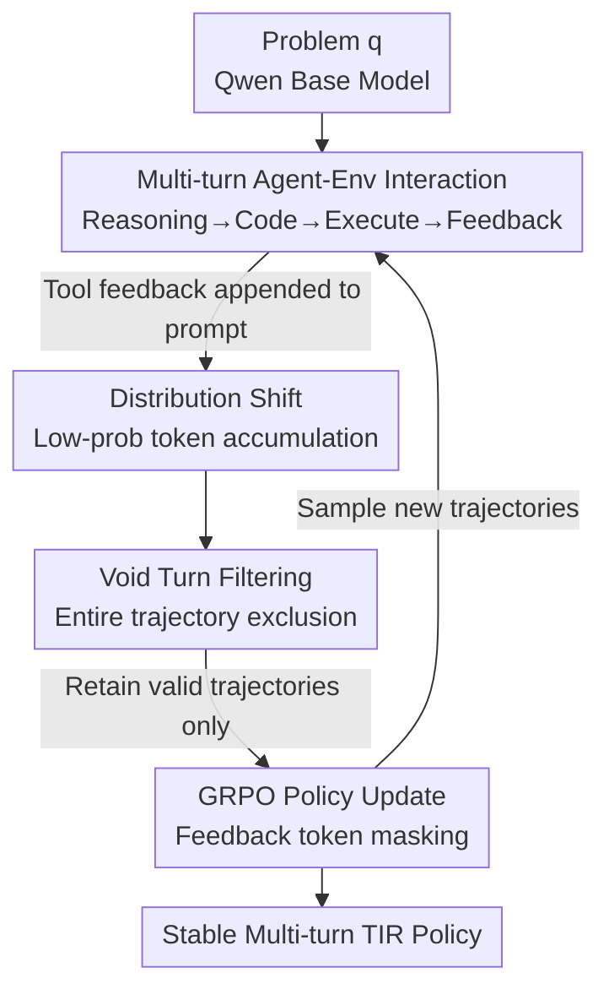

# SimpleTIR: End-to-End Reinforcement Learning for Multi-Turn Tool-Integrated Reasoning

**Conference**: ICLR 2026  
**OpenReview**: [https://openreview.net/forum?id=EplNy91Xqh](https://openreview.net/forum?id=EplNy91Xqh)  
**Code**: TBD  
**Area**: LLM Reasoning / Tool-Integrated Reasoning / Reinforcement Learning  
**Keywords**: Tool-Integrated Reasoning, Multi-turn RL, Zero RL, Gradient Explosion, Trajectory Filtering

## TL;DR
SimpleTIR discovers that the root cause of RL training collapse in multi-turn Tool-Integrated Reasoning (TIR) is the accumulation of low-probability tokens introduced by tool feedback. It proposes a plug-and-play trajectory filtering strategy—discarding entire trajectories containing a "void turn"—to stabilize gradients, raising the AIME24 score of the Qwen2.5-7B base model from a text-only baseline of 22.1 to 50.5.

## Background & Motivation
**Background**: Zero RL (the DeepSeek-R1 paradigm), which trains LLMs starting from pre-trained models using only outcome-based rewards, is believed to unlock more general problem-solving capabilities. Tool-Integrated Reasoning (TIR) allows models to iteratively "Reason → Write Code → Execute → Continue with Output," addressing LLM weaknesses in arithmetic and outdated knowledge. Combining the two—training multi-turn TIR with Zero RL—is a promising frontier.

**Limitations of Prior Work**: RL training for multi-turn TIR is highly unstable, frequently suffering from performance collapse and gradient norm explosion. A common remedy is using distilled TIR trajectories for "cold-start" SFT to stabilize training, but this fundamentally contradicts the goal of Zero RL by constraining the model to human-annotated fixed patterns and stifling the emergence of novel reasoning strategies.

**Key Challenge**: The true source of instability has remained unexplained. The authors point out that when external tool feedback is appended to the prompt for the next turn, this feedback deviates from the model's pre-training distribution (OOD). Even if feedback tokens are masked when calculating the policy loss, the tokens subsequently generated by the model inherit this distribution drift, becoming highly stochastic and resulting in the sampling of abnormally low-probability tokens. This drift accumulates across turns and eventually triggers response collapse and gradient explosion.

**Goal**: To find a simple, plug-and-play, algorithm-agnostic mechanism to identify and mask these pathological trajectories to stabilize Zero RL training for multi-turn TIR without introducing SFT cold-starts.

**Key Insight**: Through controlled experiments of single-turn vs. multi-turn TIR, the authors precisely locate the source of instability in the "tool feedback loop." Furthermore, through theoretical analysis of the gradient norm of softmax logits, they identify two dominant terms negatively correlated with token probability and amplified by low-probability tokens, explaining the gradient explosion.

**Core Idea**: Low-probability tokens often manifest through an observable symptom: the "void turn," where a response turn yields neither a complete code block nor a final answer. By filtering out the entire trajectory containing a void turn during policy updates, pathological gradients can be blocked and credit assignment errors corrected simultaneously.

## Method

### Overall Architecture
SimpleTIR addresses the problem of training multi-turn TIR under Zero RL without collapse. It models multi-turn TIR as a **hierarchical MDP**: the high-level MDP makes decisions at the "turn" granularity (selecting a high-level sub-policy per turn), while the low-level MDP executes at the token granularity. A unified policy $\pi_\theta(a_t|s_t)$ is learned to solve both levels implicitly. Optimization is performed using GRPO with tool feedback token masking, accumulating losses only on model-generated response tokens.

On top of this standard pipeline, SimpleTIR introduces one core modification: before each GRPO update, it scans every sampled trajectory in the batch. If any turn within a trajectory is a "void turn" (containing neither a complete code block nor a final answer), the **entire trajectory** is excluded from the policy loss calculation. This step prevents the high-magnitude gradients from low-probability sequences while avoiding credit assignment errors where correct early turns are penalized by a final collapse.

### Key Designs

**1. Attributing the root cause of instability to "tool-feedback-induced low-probability token accumulation"**

The authors first perform a clean comparison: single-turn TIR (where the model generates one response with optional code but ignores feedback) trains smoothly and performs well, whereas multi-turn TIR collapse under the same settings. The only difference is the "tool feedback loop," identifying it as the source. Case studies visualize token log-probabilities: the 1st and 2nd turn feedback contain extremely low-probability tokens, confirming their OOD nature. Although masked during loss calculation, this drift "infects" the model's own subsequent generations—low-probability segments appear in the model's text in turns 2 and 3, and by turn 4, the response collapses into low-probability gibberish. The key conclusion is that **masking feedback tokens is insufficient**, as the drift spreads to unmasked tokens.

**2. Explaining gradient explosion via logit gradient norms**

The authors provide a quantitative explanation. For the logits $z_t$ of a token $c$ at time $t$, the L2 norm of the policy gradient is:

$$\|\nabla_{z_t} J_{\text{TIR}}\|_2 = \frac{m_{i,t}}{\sum_j m_{i,j}} \cdot \rho_{i,t}(\theta) \cdot g_{i,t} \cdot |\hat{A}_i| \cdot \sqrt{1 - 2P(c) + \sum_{j\in A} P(j)^2}$$

This formula reveals two terms amplified by low-probability tokens: first, the **untruncated importance ratio** $\rho_{i,t} = \pi_\theta / \pi_{\theta_{\text{old}}}$, which is unbounded from above for negative advantage trajectories ($\hat{A}_i < 0$). If a token was generated with extremely low probability by the old policy, the denominator $\pi_{\theta_{\text{old}}}$ is tiny, making $\rho$ explode even with minor policy updates. Second, the **probability-dependent term** $\sqrt{1-2P(c)+\sum_j P(j)^2}$: when the sampled token $c$ has low probability, $1-2P(c)$ approaches 1. If the distribution is sharp, the collision probability $\sum_j P(j)^2$ remains high, preventing the gradient norm from decaying. Additionally, low-probability tokens cause **credit assignment misalignment**: they usually appear in late turns, and sparse rewards cannot distinguish between correct early reasoning and late-stage low-probability failures, causing the RL to unfairly punish valid multi-turn behavior.

**3. Void turn filtering: Using an observable symptom to fix gradients and credit assignment**

Instead of setting heuristic thresholds for token probabilities (which are hard to tune), the authors use a binary criterion: the **void turn**, a turn that yields neither a tool call nor a final answer. Such turns indicate zero reasoning progress. Void turns are rare in successful trajectories but frequent in pathological ones. The algorithm scans every turn of a trajectory; if a void turn is found, the entire trajectory's policy loss is masked. This **simultaneously** blocks high-amplitude gradient backpropagation from low-probability sequences and corrects credit assignment by not letting late-stage collapses penalize early successes. This is plug-and-play and orthogonal to other RL improvements.

**4. Implementation details for base models: Enabling Zero RL from scratch**

To stabilize base models without SFT, several engineering practices are added. First, **no chat templates** are used to avoid introducing OOD special tokens; instead, a simple prefix `Code Execution Result:` is used. Second, a **pre-set `final_answer` function** is included in every code block to allow early termination for simple tasks. Third, **generation is strictly stopped** after a complete code block is produced, and only real external feedback is appended, preventing the model from hallucinating tool outputs.

### Loss & Training
The objective is GRPO with feedback masking: the advantage $\hat{A}_i = r_i - \text{mean}(\{r_j\}_{j=1}^G)$ is based on the relative performance of $G$ trajectories. Loss is accumulated only on tokens where the mask $m_{i,t}=1$ (belonging to response $l_k$). SimpleTIR adds trajectory-level filtering. Training uses the VeRL + Search-R1 framework with Sandbox Fusion for asynchronous code execution. Data includes Math3-5 from SimpleRL and Deepscaler. Base models include Qwen2.5-7B/32B and Qwen3-4B-Base. Rollout batch size is 512, with a mini-batch of 128. Maximum response length starts at 16K with 5 turns, expanding to 24K and 10 turns as average response length plateaus.

## Key Experimental Results

### Main Results
On mathematical reasoning benchmarks (average@32), SimpleTIR outperforms all Zero RL baselines and even surpasses methods initialized from math-instruct models:

| Model | From | AIME24 | AIME25 | MATH500 | AMC23 | Hmmt25 |
|------|----|--------|--------|---------|-------|--------|
| Qwen2.5-7B (base) | Base | 3.2 | 1.1 | 51.9 | 21.7 | 0.0 |
| ToRL-7B (TIR) | Math-Inst | 40.2 | 27.9 | 82.2 | 75.0 | - |
| Effective TIR-7B | Math | 42.3 | 29.2 | 86.4 | 74.2 | - |
| ZeroTIR-7B (Zero+TIR) | Base | 39.6 | 25.0 | 80.2 | - | 22.5 |
| **SimpleTIR-7B** | Base | **50.5** | **30.9** | **88.4** | **79.1** | **29.7** |
| ZeroTIR-32B | Base | 48 | 27 | 87.8 | - | 20.0 |
| **SimpleTIR-32B** | Base | **59.9** | **49.2** | **92.9** | **91.6** | **34.6** |
| **SimpleTIR-4B** (Qwen3) | Base | 48.1 | 40.2 | 90.0 | 83.1 | 28.2 |

Notably, applying native TIR directly to base models (Qwen2.5-7B-TIR) performs worse than the pure-text base (AIME24 1.7 vs 3.2), confirming the collapse issue. SimpleTIR consistently improves across all sizes, demonstrating generality.

### Ablation Study
Best scores within 1000 gradient steps:

| Configuration | AIME24 | MATH500 | Description |
|------|--------|---------|------|
| **SimpleTIR-7B** | **50.5** | **88.4** | Full method (Void turn filtering) |
| Naive Multi-Turn | 20.8 | 73.1 | Direct RLVR on multi-turn TIR |
| Low Prob Filtering | 23.3 | 72.8 | Masking tokens with lowest probability |
| High Ratio Filtering | 26.3 | 75.0 | Masking tokens with highest importance ratio |
| Stop Gen w/o Filtering | 26.1 | 77.3 | Stopping generation at void turn but not filtering trajectory |

### Key Findings
- **Void turn filtering is the critical stabilization component**: Threshold-based heuristics (low prob/high ratio) fail to contain gradient explosion. Only SimpleTIR maintains a smooth gradient norm, with AIME24 scores doubling compared to the next best ablation.
- **Stopping generation without trajectory filtering is insufficient**: Merely truncating at a void turn while keeping the trajectory in the loss still suffers from credit assignment errors, leading to performance drops.
- **The benefit of multi-turn is task-dependent**: MATH500 scores improve with more turns (1→5→10), but AIME24 gains are less pronounced, suggesting different reasoning requirements for different task difficulties.
- **Zero RL preserves reasoning diversity**: Without SFT constraints, the model spontaneously evolves patterns like cross-validation, incremental reasoning, and error correction.

## Highlights & Insights
- **Turning "mysterious collapse" into observable diagnostics**: Moving from "single-turn stable/multi-turn collapse" to the feedback loop and then to the gradient norm formula (Prop. 1) provides a clean logical chain.
- **Clever proxy signal**: Instead of quantifying "low probability" with difficult thresholds, it identifies a binary, easily detected symptom (void turn) that captures pathological behavior.
- **Plug-and-play and orthogonal**: Logic is not tied to GRPO and can be added to any multi-turn agent RL training encountering instability.
- **Reward for sticking to Zero RL**: Avoiding SFT cold-starts allowed for richer emergent reasoning patterns, providing empirical evidence for reward-driven capability emergence.

## Limitations & Future Work
- **Heuristic nature of void turns**: It is a strong correlate but not an equivalent signal for low-probability accumulation; it might miss some pathological trajectories or "falsely accuse" others.
- **Sample loss**: Discarding entire trajectories may lose significant data in early training; the impact on sample efficiency in harder tasks needs more study.
- **Narrow task domain**: Experiments focused on math reasoning with code interpreters; effectiveness for other tools (e.g., search engines) or longer-horizon agent tasks remains to be verified.

## Related Work & Insights
- **vs. Cold-start SFT (e.g., ReTool)**: ReTool uses SFT to stabilize; SimpleTIR uses filtering to preserve diversity while achieving stability. SimpleTIR avoids "imitation of fixed patterns."
- **vs. Feedback token masking**: While others mask feedback loss, SimpleTIR argues this is enough because drift "infects" subsequent generated tokens, necessitating trajectory-level filtering.
- **vs. ZeroTIR**: SimpleTIR significantly outperforms ZeroTIR on 7B/32B models (AIME24 50.5 vs 39.6), with the primary difference being the stability provided by void turn filtering.

## Rating
- Novelty: ⭐⭐⭐⭐ Diagnostics chain is insightful.
- Experimental Thoroughness: ⭐⭐⭐⭐ Solid evidence across multiple models and benchmarks.
- Writing Quality: ⭐⭐⭐⭐ Clear progression from phenomenon to theory to solution.
- Value: ⭐⭐⭐⭐⭐ Provides a low-cost, universal solution for multi-turn agent RL instability.

<!-- RELATED:START -->

## Related Papers

- [\[ICLR 2026\] Generalizable End-to-End Tool-Use RL with Synthetic CodeGym](generalizable_end-to-end_tool-use_rl_with_synthetic_codegym.md)
- [\[ICLR 2026\] Toward Effective Tool-Integrated Reasoning via Self-Evolved Preference Learning](toward_effective_tool-integrated_reasoning_via_self-evolved_preference_learning.md)
- [\[ICLR 2026\] THOR: Tool-Integrated Hierarchical Optimization via RL for Mathematical Reasoning](thor_tool-integrated_hierarchical_optimization_via_rl_for_mathematical_reasoning.md)
- [\[CVPR 2026\] Scaling Agentic Reinforcement Learning for Tool-Integrated Reasoning in VLMs](../../CVPR2026/llm_reasoning/scaling_agentic_reinforcement_learning_for_tool-integrated_reasoning_in_vlms.md)
- [\[CVPR 2026\] Latent Chain-of-Thought World Modeling for End-to-End Autonomous Driving](../../CVPR2026/llm_reasoning/latent_chain-of-thought_world_modeling_for_end-to-end_autonomous_driving.md)

<!-- RELATED:END -->
## Related Papers

- [\[ICLR 2026\] Generalizable End-to-End Tool-Use RL with Synthetic CodeGym](generalizable_end-to-end_tool-use_rl_with_synthetic_codegym.md)
- [\[ICLR 2026\] Toward Effective Tool-Integrated Reasoning via Self-Evolved Preference Learning](toward_effective_tool-integrated_reasoning_via_self-evolved_preference_learning.md)
- [\[CVPR 2026\] Scaling Agentic Reinforcement Learning for Tool-Integrated Reasoning in VLMs](../../CVPR2026/llm_reasoning/scaling_agentic_reinforcement_learning_for_tool-integrated_reasoning_in_vlms.md)
- [\[CVPR 2026\] Latent Chain-of-Thought World Modeling for End-to-End Autonomous Driving](../../CVPR2026/llm_reasoning/latent_chain-of-thought_world_modeling_for_end-to-end_autonomous_driving.md)
- [\[ICLR 2026\] THOR: Tool-Integrated Hierarchical Optimization via RL for Mathematical Reasoning](thor_tool-integrated_hierarchical_optimization_via_rl_for_mathematical_reasoning.md)

<!-- RELATED:END -->
