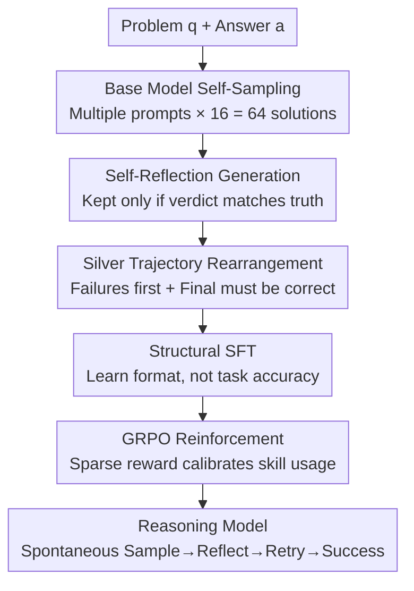

# SkillFactory: Self-Distillation for Learning Cognitive Behaviors

**Conference**: ICLR 2026  
**OpenReview**: [https://openreview.net/forum?id=ttMLNXBWKY](https://openreview.net/forum?id=ttMLNXBWKY)  
**Code**: https://github.com/Zayne-sprague/SkillFactory (Available)  
**Area**: LLM Reasoning  
**Keywords**: Cognitive Skills, Self-Distillation, Cold-start SFT, GRPO, Reasoning Generalization

## TL;DR
SkillFactory utilizes correct and incorrect solutions sampled from the base model itself, combined with self-reflection, to rearrange them into "silver" trajectories with labels such as `<sample>`, `<reflect>`, and `<verdict>` for SFT. This pre-installs cognitive skills like "verification-retry" into the model before applying GRPO reinforcement. Without relying on a stronger teacher model, the post-RL model demonstrates enhanced performance on difficult task variants and cross-domain tasks, while exhibiting greater resistance to catastrophic forgetting.

## Background & Motivation

**Background**: The strength of modern large reasoning models (e.g., o1, DeepSeek-R1) stems largely from their use of a set of "cognitive skills"—systematically searching the solution space, verifying their own outputs, and switching methods to retry after a failure. Prior work (Gandhi et al. 2025) has found that if a base model already "implicitly" possesses these skills, RL (such as GRPO) can amplify them.

**Limitations of Prior Work**: The issue is that if the base model does not exhibit a certain skill at all, RL has nothing to reinforce. To bridge this gap, existing approaches have significant drawbacks: (1) Pure RL with sparse rewards only activates potential skills already in the base, leading to instability in cross-task generalization; (2) Distillation from stronger models (e.g., using R1 trajectories for SFT) requires a stronger teacher and is often only effective within the domain of the distillation data; (3) Targeted data construction (continual pre-training, ICL, MCTS rollouts) requires either external strong models or large amounts of customized data.

**Key Challenge**: There is a default assumption that "better task solving in the SFT stage leads to stronger performance after RL," prompting efforts to maximize the accuracy of SFT models. However, the authors find this assumption to be incorrect—**high accuracy before RL does not imply high accuracy after RL**. What truly matters is whether the SFT stage pre-installs the structural framework of "which skill to use and where to use it," rather than mastering the task itself.

**Goal**: To instill cognitive skills like "verify + retry" into the model before RL as a "warm start" without the aid of a stronger teacher model, making the post-RL model more stable on harder variants and cross-domain tasks.

**Key Insight**: Since the base model occasionally produces implicit verification and retries during its own sampling, these **self-generated correct solutions, incorrect solutions, and reflections** can be collected and reassembled into trajectories following a specific "skill format." Even if these "silver" trajectories are imperfect at solving the task, the structure is sufficient to provide a foundation for RL.

**Core Idea**: Use self-distillation from the model's own sampling to create trajectories with explicit labels for "Trial-Error-Reflection-Retry-Success" for cold-start SFT. The focus is on **learning the structure rather than solving the task correctly**, followed by using GRPO to calibrate the timing of skill utilization.

## Method

### Overall Architecture
SkillFactory is a three-stage pipeline: **Data Construction → SFT → RL**. The input is a task dataset $D_T=\{(q_i,a_i)\}$ with ground truth and a base model $M$; the output is a reasoning model that has undergone RL and can explicitly use verification/retry skills.

The key lies in the first stage, "Data Construction": For each problem, the base model samples multiple **solution attempts** $y$ (both correct and incorrect). Then, the same base model writes a **reflection** $r$ for each $y$ and provides a "Correct/Incorrect" **verdict**. These (solution, reflection) pairs are rearranged into a sequence of "several failures + a final success," wrapped with tags like `<sample>`, `<reflect>`, `<verdict>`, and `<answer>`, and joined by transitional phrases like "Let me think again." In the SFT stage, the model only learns **this structure** (without expecting accuracy to increase), and finally, GRPO uses sparse "correct/incorrect" rewards to calibrate when and where to use these skills.

### Key Designs

**1. Self-Sampled Silver Data: Replacing Strong Teachers with the Model's Own Solutions**

This step addresses the pain point of distillation requiring a stronger teacher. For each problem $q_i$, the authors use 4 different Chain-of-Thought prompts $P_{solve}$, each sampling 16 times, to obtain $N_{sample}=64$ solutions $Y$. Each solution's content is extracted from the `<answer>` tag, and $\text{correct}(y,a_i)=\mathbb{1}[\text{extract}(y)=a_i]$ is used to assign labels. Note that **both correct and incorrect solutions are retained**—incorrect solutions are essential materials for teaching "self-correction." These trajectories are termed "silver" (rather than gold) because they are imperfect at solving the problem, but they provide the **structural template** for the skills. The fundamental difference from distillation is that distillation learns new knowledge/strategies from a stronger model, whereas this approach "rearranges" the same model's output. Thus, the ceiling is not limited by external models, and the model is not prone to over-fitting the teacher's domain.

**2. Self-Reflection + Verdict Filtering: Ensuring Reliable Validation Signals**

Simply having correct/incorrect solutions is insufficient; the model must learn to "judge whether a solution is correct by looking at it." The authors use the reflection prompt $P_{reflect}$ to have the base model write a critical reflection $r$ for each solution $y$, requiring a "Correct/Incorrect" verdict within `<verdict>...</verdict>` tags. Four reflections are sampled for each solution, but **only those where the verdict matches the actual correctness are kept**, i.e., reflections satisfying $\text{verdict}(r)=\text{correct}(y,a_i)$. This step acts as a quality gate: if the model learns reflections that call an incorrect solution "correct," the verification skill becomes noise. The filtered reflection set $R$ ensures that every "verification" seen during SFT is correctly judged, thereby imprinting reliable verification behavior—reflected in the analysis where verification F1 scores generally exceed 0.8.

**3. Trajectory Rearrangement Algorithm: Storytelling via "Trial-Error-Success"**

Finally, scattered (solution, reflection) pairs are assembled into a coherent reasoning trajectory (Algorithm 1). The authors divide correct/incorrect pairs into $Y^+$ and $Y^-$. For each trajectory, they sample $n^+\le L_{max}$ correct pairs and $n^-\in[0,n^+-1]$ incorrect pairs. They shuffle all pairs except for the last correct one ($\text{shuffle}(T^-\cup T^+[1{:}n^+{-}1])$) and then **append** the retained correct pair to the end, ensuring the $\text{trace}=\dots\cup\{T^+[n^+]\}$ **always terminates with a correct solution**. This ensures the trajectory follows a "Trial → Reflection → (if wrong) Retry → Final Success" pattern. The rearrangement order is critical: ablations show that without this ordered structure (No Sample Order), the verifier's accuracy on cross-domain tasks drops significantly—the structure itself, not just the content, determines skill generalization.

### Loss & Training
The SFT stage performs standard supervised fine-tuning on silver trajectories. The authors explicitly **do not expect accuracy to increase** during this stage; the goal is simply to provide a better starting point for RL. The RL stage uses standard GRPO, with rewards based on binary sparse rewards for answer correctness, sharing the same GRPO configuration as the baselines. Countdown experiments use a training context length of 4,096 and evaluation of 16,384; OpenThoughts experiments fine-tune Qwen2.5-7B-Instruct on 1k/10k lines of SFT data.

## Key Experimental Results

Two main setups: (1) SFT+RL solely on **Countdown-3arg**, evaluating on harder 4–6 arg variants and a series of cross-domain tasks (easy to hard + OOD generalization); (2) Training on **OpenThoughts** subsets, evaluating on GPQA/AIME25/AMC/Math500 (complex math reasoning). Base models include Qwen2.5-1.5B/7B-Instruct and Olmo-3-7B.

### Main Results

Countdown-3arg training, cross-difficulty/cross-domain evaluation (Qwen2.5-1.5B-Instruct, Overall is the average):

| Method | Countdown | Mult | CSQA | GSM8k | Overall |
|------|-----------|------|------|-------|---------|
| Base Qwen2.5-1.5B | 1.9 | 29.8 | 55.7 | 59.2 | 27.3 |
| RL-Only | 15.8 | 24.4 | 62.6 | 67.7 | 31.9 |
| R1 Distill → GRPO | 21.2 | 37.1 | 63.8 | 72.9 | **35.9** |
| **SkillFactory → GRPO** | **25.1** | 35.0 | 60.8 | 68.2 | 35.7 |

Key comparison: On the most difficult Countdown variant, SkillFactory→GRPO achieved 25.1%, which is +3.9 higher than the next best, R1 Distill→GRPO (21.2%), and 9.3 points higher than RL-Only. The overall score of 35.7 is nearly tied with teacher-dependent R1 distillation (35.9)—despite SkillFactory requiring no stronger model.

OpenThoughts training, complex math evaluation (Qwen2.5-7B, Overall average):

| Method | AMC | Math500 | Overall |
|------|-----|---------|---------|
| RL Only | 33.5 | 59.1 | 38.0 |
| QwQ distill 10k | 36.5 | 58.6 | **42.5** |
| SkillFactory 1k | **37.5** | **64.6** | 42.1 |
| SkillFactory 10k | 35.2 | 61.9 | 40.6 |

With only 1k SFT data, SkillFactory approaches QwQ distillation with 10k data (42.1 vs 42.5) and outperforms distillation on AMC and Math500, benchmarks not explicitly targeted by OpenThoughts.

### Ablation Study

| Configuration | Phenomenon | Explanation |
|------|------|------|
| SkillFactory (Full) | CD-3arg Verdict F1 0.96/0.92 | Accurate judgments for both correct and incorrect classes |
| w/o Sample Order | OOD Verdict F1 drop (e.g., Letter CD 0.34→0.22) | Rearranged structure is necessary for cross-domain generalization |
| Budget Forcing (triggering `<sample>` at inference) | Countdown +5.3 (17.5→22.8) | Built-in skills allow the model to utilize longer contexts |

### Key Findings
- **"SFT Performance $\neq$ RL Strength" is confirmed**: R1 Distill's SFT accuracy (11.7%) is much higher than SkillFactory's (2.8%), but after RL, the relationship reverses, with SkillFactory→GRPO taking the lead. This indicates that providing the "correct skill structure" for RL is more important than mastering the task during SFT.
- **More data leads to slight degradation**: Increasing SkillFactory from 1k to 10k OpenThoughts data saw the overall score drop from 42.1 to 40.6. Core skills are learned early; redundant SFT data does not bring new strategies or knowledge like distillation does.
- **Resistance to Forgetting**: Post-RL SkillFactory is less prone to catastrophic forgetting on OOD tasks (CSQA, GSM8k) compared to pure RL; pure RL often degrades into short or degenerate outputs on OOD.
- **Verification is Active and Reliable**: Analysis shows that the F1 for incorrect cases is generally >0.8 (incorrect solutions are correctly rejected), and the frequency of reflection increases with task difficulty (CD-4arg > CD-3arg), proving the skills are genuinely utilized rather than decorative.

## Highlights & Insights
- **"Learning structure, not solving correctly" is a counter-intuitive but effective training philosophy**: Redefining the SFT goal from "improving accuracy" to "installing a skill scaffold" decouples the cold-start problem into "installing structure first, then calibrating timing with RL," bypassing the need for a strong teacher.
- **Self-distillation loop naturally resists over-fitting the teacher's domain**: Since the data comes entirely from the base model itself, the skills aren't tied to a domain where an external model excels, which is the root cause of its superior OOD stability compared to distillation.
- **Verdict filtering + final success termination** are simple but critical constraints: the former ensures reliable verification learning, while the latter ensure every trajectory represents a "successful trial" rather than a "failure," making it transferable to any search-like task (NP-style tasks) that is easy to verify but hard to solve.
- **Budget Forcing reuse**: The built-in `<sample>` tag allows for "one more round of thinking" at inference by simply appending the trigger word, and it can also break degenerate output loops, serving as a zero-cost inference scaling interface.

## Limitations & Future Work
- The authors acknowledge that poor performance on some tasks (e.g., Letter Countdown) is primarily limited by **model scale**—small models cannot distinguish if a string is a valid English word, not because the method failed.
- The experiments scale up to 7B; whether the advantage of "low-data SFT" holds for larger models and more complex multi-step reasoning remains unverified.
- The quality of silver trajectories is capped by the base model's sampling ability: if the base model never exhibits even implicit skills, self-sampling might fail to yield enough correct solutions or valid reflections.
- Currently focused on "verification" and "retry" skills; extending this paradigm to more complex cognitive behaviors (e.g., decomposition, backtracking to specific steps) is a natural next step.

## Related Work & Insights
- **vs. Distillation (R1 Distill / QwQ)**: They learn trajectories from stronger teachers for SFT, resulting in high SFT accuracy but binding to the teacher's domain and requiring strong models. Ours uses the base's own output; SFT accuracy is low, but post-RL performance meets or exceeds distillation while being more robust to forgetting and teacher-free.
- **vs. STaR**: STaR is also self-distillation but only collects **correct** outputs. Ours deliberately retains incorrect solutions + reflections to teach self-correction. On harder Countdown variants, STaR provides almost no gain, while SkillFactory achieves the highest score.
- **vs. Pure RL (RL-Only)**: Pure RL can only amplify latent skills, showing instability in cross-task generalization and common degradation on OOD. Ours pre-installs the structure via SFT before RL, ensuring stability.
- **vs. BOLT / ASTRO**: Similar ideas (installing skills before RL), but this work emphasizes that data **comes entirely from the base model** and reveals that "structure" rather than "content" is the key to consistent skill generalization.

## Rating
- Novelty: ⭐⭐⭐⭐ Cold-start paradigm of "self-sampled silver trajectories + structural learning" clarifies the relationship between SFT and RL.
- Experimental Thoroughness: ⭐⭐⭐⭐ Two main setups, three base models, covering easy-to-hard/OOD/complex math, including detailed analysis of verification F1 and length distribution.
- Writing Quality: ⭐⭐⭐⭐ Motivation is clearly derived, and Algorithm 1 makes data construction reproducible.
- Value: ⭐⭐⭐⭐ Provides a simple, deployable recipe for installing cognitive skills without a strong teacher, particularly useful for small and medium-sized reasoning models.

<!-- RELATED:START -->

## Related Papers

- [\[ICML 2026\] The Role of Feedback Alignment in Self-Distillation](../../ICML2026/llm_reasoning/the_role_of_feedback_alignment_in_self-distillation.md)
- [\[ICLR 2026\] KaVa: Latent Reasoning via Compressed KV-Cache Distillation](kava_latent_reasoning_via_compressed_kv-cache_distillation.md)
- [\[ICLR 2026\] Probing to Refine: Reinforcement Distillation of LLMs via Explanatory Inversion](probing_to_refine_reinforcement_distillation_of_llm_reasoners_via_explanatory_in.md)
- [\[ICLR 2026\] RESTRAIN: From Spurious Votes to Signals — Self-Training RL with Self-Penalization](restrain_from_spurious_votes_to_signals_self-training_rl_with_self-penalization.md)
- [\[ICLR 2026\] Toward Effective Tool-Integrated Reasoning via Self-Evolved Preference Learning](toward_effective_tool-integrated_reasoning_via_self-evolved_preference_learning.md)

<!-- RELATED:END -->
