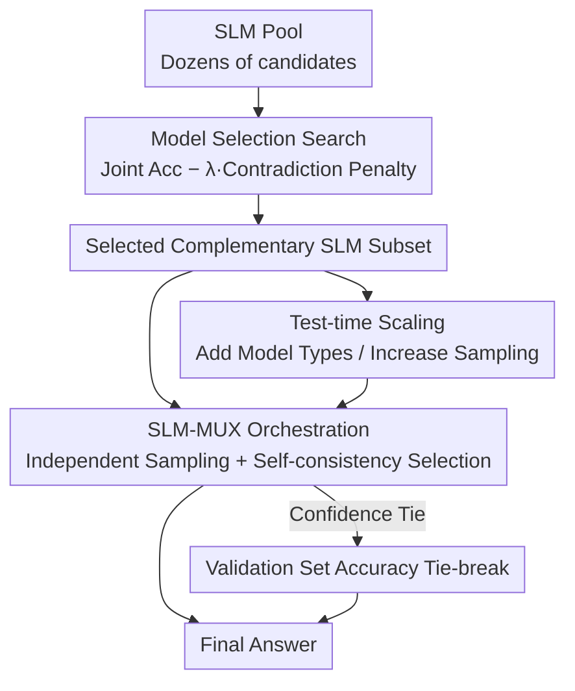

# SLM-MUX: Orchestrating Small Language Models for Reasoning

**Conference**: ICLR 2026  
**OpenReview**: [https://openreview.net/forum?id=317bcKF4zv](https://openreview.net/forum?id=317bcKF4zv)  
**Code**: None  
**Area**: LLM Reasoning  
**Keywords**: Small Language Models, Multi-model Orchestration, Confidence Selection, Model Selection Search, Test-time Scaling

## TL;DR
This paper finds that "discussion-based" orchestration methods are ineffective and even detrimental for Small Language Models (SLMs). Instead, it proposes SLM-MUX, a training-free orchestration framework without text interaction. Each SLM samples independently, and final answers are selected based on self-consistency confidence. Combined with model selection search and test-time scaling strategies, SLM-MUX outperforms Qwen2.5-72B on GPQA/GSM8K using only two SLMs.

## Background & Motivation
**Background**: Recent years have seen a surge in Small Language Models (SLMs, ranging from several to dozens of billions of parameters). While their individual accuracy lags behind frontier large models, they offer lower inference costs and edge-deployment potential. A natural idea is to orchestrate multiple SLMs into a system to exceed the accuracy of any single model, similar to how CPUs transitioned from single-core to multi-core. Existing methods like Mixture-of-Agents, LLM-Debate, and Multi-Agent Verification follow this path.

**Limitations of Prior Work**: These methods are categorized by the authors as "discussion-based orchestration," where multiple model instances propose, criticize, debate, and verify via natural language. They share the implicit assumption that the models possess sufficient reasoning and reflection capabilities to self-correct during interaction. This assumption holds for frontier LLMs (where MoA/Debate can improve results by ~2%), but systematic experiments in this paper reveal that **once applied to SLMs, these mechanisms not only fail to improve but can drop performance by up to 5.5%**.

**Key Challenge**: SLMs lack reliable self-correction capabilities. In discussions, rather than correcting errors, they aggregate into "groupthink"—reinforcing incorrect reasoning and amplifying rather than mitigating errors. Appendix analysis shows that 59.5% of failures are attributed to groupthink, and the performance gap persists even with extensive prompt optimization. In other words, the premise that "language models can correct each other's answers" does not hold for SLMs.

**Goal**: Given a pool of available SLMs, the paper aims to answer: (i) how to orchestrate their outputs for optimal overall performance; (ii) how to select a complementary subset of effective SLMs from dozens of candidates.

**Key Insight**: Since SLMs cannot discuss to self-correct, **do not let them discuss**. The authors observe that "self-consistency" is highly correlated with "correctness"—a model that places high probability mass on the correct answer will repeatedly provide equivalent answers across multiple samples, whereas an uncertain model will produce diverse outputs. Thus, a training-free rule can estimate model confidence to select the answer from the model with the highest confidence.

**Core Idea**: Replace "textual discussion for correction" with "independent sampling + self-consistency confidence selection." Use model selection search to identify complementary SLM subsets, extracting complementary capabilities without training any models.

## Method

### Overall Architecture
The SLM-MUX pipeline consists of three layers. The bottom layer is the **SLM-MUX Orchestration Architecture**: for a given problem, each selected SLM in the pool independently samples multiple candidate answers (temperature > 0). The frequency of the most frequent answer for each model is treated as its "confidence." The answer from the model with the highest confidence is exported; ties are broken using validation set accuracy. The middle layer is **Model Selection Search**: before deployment, a search is conducted on a validation set using the objective "Joint Accuracy − λ · Contradiction Penalty" to pick a complementary subset. The top layer is **Test-time Scaling**: after fixing a model group, inference compute is increased by adding more model types and increasing samples per model to find the optimal accuracy-compute trade-off.

### Key Designs

**1. SLM-MUX: Selecting Answers via Self-consistency Confidence, Bypassing Text Discussion**

This design directly addresses the "groupthink" issue. Since interaction is harmful, the models have **zero textual interaction**. In the independent generation phase, each model $M_i$ samples $k$ candidates $Y_i=\{y_i^{(1)},\dots,y_i^{(k)}\}$ for the same question at temperature > 0. In the confidence estimation phase, the frequency of each candidate is calculated as $f_i(y)=\frac{1}{k}\sum_{j=1}^{k}\mathbb{1}[y_i^{(j)}=y]$. The most frequent answer $y_i^*=\arg\max_y f_i(y)$ is identified, and its frequency $s_i=f_i(y_i^*)$ serves as the confidence. The system selects the answer with $S_{\max}=\max_i s_i$. If multiple models tie at $S_{\max}$, the model with the highest validation accuracy $a_i$ in subset $I^*$ is chosen: $i^*=\arg\max_{i\in I^*} a_i$.

Its effectiveness stems from the empirical pattern "self-consistency ⟺ correctness." SLM-MUX uses this single-model phenomenon as a **cross-model arbitration signal**. This preserves complementary strengths in specialized domains (e.g., on MATH, the final answers comprise 38.8% from Gemma-2 27B, 38.0% from Mixtral-8×7B, and 21.2% from Llama 3.1 8B) while avoiding error contagion.

**2. Model Selection Search: Picking Complementary Rather Than Strongest Models**

Selecting which SLMs to include is crucial. Picking the strongest based on individual accuracy ignores interactions: a model weaker in all dimensions than another (e.g., Llama 3.2-3B vs Qwen2.5-7B) adds nothing. Instead, models with diverse strengths (e.g., Mistral Small 24B and Qwen2.5-7B excelling in different sub-disciplines) should be combined.

Model selection is modeled as a search problem on the validation set. The objective function balances two terms. The first is **Joint Accuracy**, representing an optimistic upper bound—the system is correct if at least one model in subset $S$ is correct: $\text{UnionAcc}(S)=\frac{1}{|D|}\sum_{x\in D}\mathbb{1}\{\exists m\in S: m(x)\text{ is correct}\}$. The second is **Contradiction Penalty**, capturing cases where one model confidently provides a wrong answer and suppresses another model's correct answer: $\text{Contradiction}(S)=\frac{1}{|D|}\sum_{x\in D}\mathbb{1}\{\exists m_1\in S: m_1(x)\text{ is consistently wrong},\ \exists m_2\in S: m_2(x)\text{ is correct}\}$. The final objective is $O(S)=\text{UnionAcc}(S)-\lambda\cdot\text{Contradiction}(S)$.

This objective defines the bounds of SLM-MUX's accuracy: Joint Accuracy is the optimistic ceiling, while $\lambda=1$ represents the pessimistic floor. Figure 7 shows that as the number of models $K$ increases from 2 to 5, both Joint Accuracy and Contradiction Penalty rise, indicating a trade-off where more models are not always better.

**3. Test-time Scaling: Scaling Compute via Model Types and Sample Counts**

After fixing a subset, the paper explores two orthogonal scaling dimensions. **Adding Model Types**: for each budget $K$ (2 to 5), the optimal combination is selected via search—this increases complementary capability but introduces more contradictions. **Increasing Sample Counts**: fixing the models and increasing $k$ from 2 to 9. Since confidence is estimated via frequency, more samples lead to more stable confidence estimation and reliable tie-breaking.

These dimensions function differently: the former expands "capability coverage," while the latter improves "statistical stability of confidence." Experiments reveal sweet spots rather than monotonic improvement; for example, GPQA peaks at two models and then declines, suggesting task-specific scaling.

## Key Experimental Results

### Main Results
Base models: Mistral 8×7B, LLaMA 3.1 8B, Gemma 2 27B. Temperature 0.3 with 3 samples per model. Comparison with discussion-based methods (MATH / GPQA / GSM8K, Accuracy %):

| Method | MATH | GPQA | GSM8K |
|------|------|------|-------|
| Mixture-of-Agents | 51.4 | 33.3 | 81.6 |
| LLM-Debate | 51.6 | 36.8 | 80.8 |
| Multi-Agent Verification | 48.4 | 35.3 | 86.4 |
| Single-Best | 56.8 | 38.9 | 84.2 |
| Single-Best-SC | 58.0 | 42.4 | 86.8 |
| **SLM-MUX (Ours)** | **61.8** | **42.1** | **87.8** |

Compared to discussion methods, SLM-MUX improves MATH by up to 13.4%, GPQA by 8.8%, and GSM8K by 7.0%. With just two SLMs, it surpasses Qwen2.5-72B on GPQA/GSM8K.

### Ablation Study

**Comparison of discussion methods on SLM vs frontier LLM (Single-Model Max vs orchestration)**:

| Setting | Dataset | Single-Model Max | MoA | Debate | Verification |
|------|--------|------------------|-----|--------|--------------|
| SLM Orchestration | MATH | 56.8 | 51.6 | 48.4 | — |
| SLM Orchestration | GPQA | 46.2 | 38.8 | 33.3 | 35.4 |
| LLM Combination | MATH | 90.4 | 88.8 | 90.8 | 91.6 |
| LLM Combination | GPQA | 63.6 | 58.6 | 65.6 | 64.2 |

The same discussion methods that improve frontier LLMs by ~2% cause SLMs to drop below single-model baselines (by up to 5.5%), validating that these methods do not scale down.

**Gains from Model Selection Search (Two-model combination, best-single vs orchestrated)**: MATH (Mistral Small 24B + Qwen2.5-7B) 75.5→80.0 (+4.5 Gain); GPQA (Gemma 2 27B + Mistral Small 24B) 45.1→49.5 (+4.4 Gain); GSM8K (Mistral Small 24B + Qwen2.5-7B) 88.5→92.8 (+4.3 Gain).

**Test-time Scaling vs Agent Forest (2 samples per model / Best samples)**:

| Dataset | Setting | SLM-MUX | Agent Forest | Gain |
|--------|------|---------|--------------|------|
| MATH | 2 samples | 76.8 | 72.3 | +4.5 |
| GPQA | 2 samples | 46.3 | 40.4 | +5.9 |
| GSM8K | 2 samples | 82.1 | 77.7 | +4.4 |

### Key Findings
- **Groupthink is the root cause of discussion failure**: 59.5% of orchestration failures arise from mutual reinforcement of errors, and prompt optimization cannot bridge this gap.
- **Select for complementarity, not just strength**: Search provides a stable +4% Gain. The simultaneous rise in joint accuracy and contradiction penalty indicates an inflection point where extra models introduce more harm than good (peaking at 2 models for GPQA).
- **Scaling dimensions have different sweet spots**: SLM-MUX shows the largest advantage over Agent Forest at low sample counts (k=2), providing high efficiency for low-compute budgets.

## Highlights & Insights
- **"Not letting models discuss" is the key insight**: Contrary to the intuition that interaction makes agents smarter, this paper proves interaction is a burden for models with limited capability. Elevating self-consistency from a single-model trick to a cross-model arbitration signal is simple yet effective.
- **The Contradiction Penalty explicitly models "confident wrongness"** in the selection objective. Using $\lambda$ to interpolate between the optimistic Joint Accuracy and pessimistic floor provides a formal framework for deciding the optimal system size.
- **Zero training, zero textual interaction, and highly transferable**: The principle can extend to open-ended generation (HumanEval) and specialized SLMs with minimal cost. Any scenario with multiple candidates and estimable confidence can reuse this selection rule.

## Limitations & Future Work
- Confidence relies entirely on the "self-consistency ⟺ correctness" correlation. Problems that trigger systematic confident errors (which the contradiction penalty targets) remain difficult to solve, relying solely on tie-breaking and complementarity.
- Evaluation focuses on reasoning benchmarks with deterministic/verifiable answers (MATH/GPQA/GSM8K). For open-ended generation, determining answer equivalence is harder, making confidence signals noisier.
- Model selection currently uses exhaustive search, which assumes a small candidate pool. As the pool grows, search costs and validation set requirements may become bottlenecks, requiring more efficient approximate search algorithms.

## Related Work & Insights
- **vs Mixture-of-Agents / LLM-Debate / Multi-Agent Verification**: These rely on textual discussion and self-correction, assuming strong reasoning. This paper proves this fails for SLMs and replaces it with confidence selection to avoid groupthink.
- **vs Self-Consistency**: While Self-Consistency (SC) is a single-model majority vote, SLM-MUX extends this to a cross-model selector, using internal consistency as a cross-model arbitration signal.
- **vs Agent Forest**: Agent Forest uses a simple majority vote across all models combined. SLM-MUX estimates confidence *within* models first, significantly outperforming it under low-compute budgets (+5.9 on GPQA with 2 samples).
- **vs Accuracy-based Model Selection**: Unlike picking based on standalone accuracy, this paper uses "Joint Accuracy - Contradiction Penalty" to focus on system performance, highlighting that the strongest individuals don't always form the strongest system.

## Rating
- Novelty: ⭐⭐⭐⭐ The finding that "discussion is harmful to SLMs" is counter-intuitive and valuable. The method is simple but addresses the core issue.
- Experimental Thoroughness: ⭐⭐⭐⭐ Covers three benchmarks, LLM vs SLM comparisons, and provides scaling/search ablations with theoretical bounds.
- Writing Quality: ⭐⭐⭐⭐ The three-layer method is presented clearly with formal objectives.
- Value: ⭐⭐⭐⭐ Training-free and efficient; highly practical for multi-SLM deployment on edge or low-compute environments.

<!-- RELATED:START -->

## Related Papers

- [\[ICLR 2026\] Following the Navigation: Enhancing Small Language Models Contextual Reasoning with LLM Guidance](following_the_navigation_enhancing_small_language_models_contextual_reasoning_wi.md)
- [\[ICLR 2026\] T1: Tool-Integrated Verification for Test-Time Compute Scaling in Small Language Models](t1_tool-integrated_verification_for_test-time_compute_scaling_in_small_language_.md)
- [\[ICLR 2026\] Efficient Test-Time Scaling for Small Vision-Language Models](efficient_test-time_scaling_for_small_vision-language_models.md)
- [\[ICML 2026\] DenseSteer: Steering Small Language Models towards Dense Math Reasoning](../../ICML2026/llm_reasoning/densesteer_steering_small_language_models_towards_dense_math_reasoning.md)
- [\[ICLR 2026\] Variational Reasoning for Language Models](variational_reasoning_for_language_models.md)

<!-- RELATED:END -->
