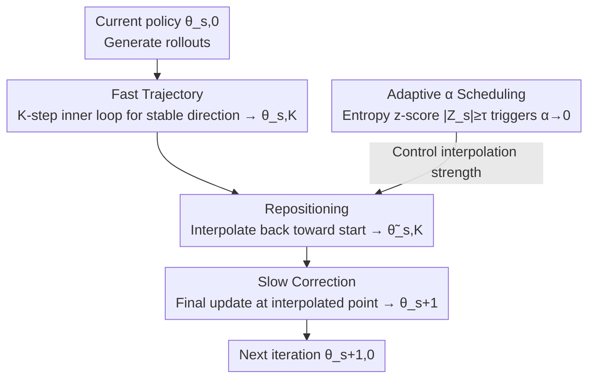

# Slow-Fast Policy Optimization: Reposition-Before-Update for LLM Reasoning

**Conference**: ICLR 2026  
**arXiv**: [2510.04072](https://arxiv.org/abs/2510.04072)  
**Code**: [slow-fast-po.github.io](https://slow-fast-po.github.io/)  
**Area**: LLM Alignment  
**Keywords**: Reinforcement Learning, GRPO, Policy Optimization, Mathematical Reasoning, Sample Efficiency

## TL;DR

Ours proposes SFPO (Slow-Fast Policy Optimization), which decomposes each training step into a three-phase structure: "Fast Trajectory—Reposition—Slow Correction." Without modifying the objective function or rollout process, it enhances the stability and sample efficiency of GRPO in a plug-and-play manner, achieving an average improvement of up to 2.80 points on mathematical reasoning benchmarks and reducing rollouts by up to 4.93×.

## Background & Motivation

- Reinforcement learning (RL) has become a core method for enhancing LLM reasoning capabilities, with GRPO being a widely used critic-free policy gradient method.
- **Limitations of Prior Work** (GRPO):
    - Poor rollout quality in early training leads to **high-variance gradients** from random rewards, causing unstable updates.
    - Each batch of rollouts undergoes only a **one-shot update**, wasting gradient information that could be further utilized.
    - Simple reuse of rollout data introduces off-policy bias, which can degrade performance in later stages.
- **Goal**: A mechanism that stabilizes gradient direction, improves sample utilization, and controls distribution shift.

## Method

### Overall Architecture

SFPO maintains the GRPO objective function and rollout process, replacing the "one step per rollout batch" update with a three-phase "move fast—pull back—step slow" structure. For the same batch of data, it first performs $K$ inner-loop fast updates to accumulate a stable direction (Fast Trajectory), then interpolates the endpoint back toward the starting point to control drift (Repositioning), and finally performs a single correction update at the interpolated point (Slow Correction). An adaptive $\alpha$ scheduling mechanism monitors policy entropy to disable interpolation and revert to standard GRPO when training approaches convergence.

### Key Designs

**1. Fast Trajectory: Filtering high-variance gradients into stable directions via inner loops**

In GRPO, high-variance gradients from random rewards in early training directly pollute the update. SFPO performs $K$ inner-loop updates $\theta^{s,k+1} = \theta^{s,k} - \eta \nabla_\theta \mathcal{L}(\theta^{s,k})$ starting from $\theta^{s,0}$. The total displacement $\theta^{s,K} - \theta^{s,0} = -\eta \sum_{k=0}^{K-1} \nabla_\theta \mathcal{L}(\theta^{s,k})$ accumulates $K$ gradients. Under second-order approximation, this acts as a curvature-aware low-pass filter: along an eigen-direction with curvature $\lambda$, the gain is $(1-(1-\eta\lambda)^K)/\lambda$. Flat directions (small $\lambda$) accumulate steadily, while high-curvature directions (large $\lambda$) saturate and suppress oscillation.

**2. Repositioning: Implicit trust region via interpolation to control off-policy drift**

The $K$ steps reuse rollouts generated by $\theta^{s,0}$. As parameters move further from the sampling policy, the update shifts from on-policy to off-policy. Inspired by the Lookahead Optimizer, SFPO interpolates the endpoint back to $\widetilde{\theta}^{s,K} = \theta^{s,0} + \alpha(\theta^{s,K} - \theta^{s,0})$, where $\alpha \in [0,1]$. This step is equivalent to solving a linearized proximal subproblem centered at $\theta^{s,0}$, where $\alpha$ acts as an implicit trust region radius.

**3. Slow Correction: Local curvature alignment at the repositioned point**

The point $\widetilde{\theta}^{s,K}$ is a scaled version of the fast trajectory and is not guaranteed to be optimal under current curvature. SFPO performs a final gradient update $\theta^{s+1} = \widetilde{\theta}^{s,K} - \eta \nabla_\theta \mathcal{L}(\widetilde{\theta}^{s,K})$, forming a predictor-corrector structure. The combined update is:

$$\theta^{s+1} = \theta^{s,0} - \eta \left[\alpha \sum_{k=0}^{K-1} \nabla_\theta \mathcal{L}(\theta^{s,k}) + \nabla_\theta \mathcal{L}(\widetilde{\theta}^{s,K})\right]$$

**4. Adaptive $\alpha$ Scheduling: Reverting to GRPO via entropy anomaly signals**

The three-phase structure accelerates early training but may amplify drift when signals weaken near convergence. SFPO monitors policy entropy $H_s$, maintaining a rolling buffer of length $\omega$ to calculate the z-score $Z_s = (H_s - \mu_s) / \sigma_s$. If $|Z_s| \geq \tau$ (indicating significant entropy fluctuation near a local optimum), $\alpha$ is set to 0 for all subsequent steps, reverting the algorithm to standard on-policy GRPO.

### Loss & Training

Ours follows the standard GRPO clipped objective with KL regularization:

$$\mathcal{J}_{GRPO}(\theta) = \frac{1}{G}\sum_{i=1}^G \frac{1}{|o_i|}\sum_{t=1}^{|o_i|} \min(r_{i,t}(\theta)\hat{A}_{i,t}, \text{clip}(r_{i,t}(\theta), 1-\epsilon, 1+\epsilon)\hat{A}_{i,t}) - \beta D_{KL}[\pi_\theta \| \pi_{ref}]$$

All modifications occur at the parameter update level, making it a plug-and-play replacement for GRPO updates without increasing VRAM, as no additional optimizer states are required.

## Key Experimental Results

### Main Results: Mathematical Reasoning (DAPO+Math Training Set)

| Model | Method | Math-500 | AIME24 | AIME25 | AMC | Minerva | Olympiad | Avg |
|------|------|----------|--------|--------|-----|---------|----------|-----|
| Qwen2.5-Math-1.5B | GRPO | 77.15 | 16.67 | 11.67 | 53.31 | 31.89 | 39.42 | 38.35 |
| | **SFPO** | **78.35** | **20.00** | **15.00** | **56.02** | **32.07** | **39.72** | **40.19** |
| DS-Qwen-1.5B | GRPO | 84.65 | 30.00 | 23.33 | 66.86 | 31.71 | 49.85 | 47.73 |
| | **SFPO** | **86.10** | **32.50** | **30.83** | **70.28** | **32.81** | **50.67** | **50.53** |
| DS-Qwen-7B | GRPO | 91.70 | 50.00 | 35.83 | 80.42 | 43.65 | 61.24 | 60.47 |
| | **SFPO** | **92.60** | **54.17** | **37.50** | **83.75** | **44.49** | **65.73** | **63.04** |

### Efficiency Analysis

| Model | Rollout Reduction | Training Time Reduction |
|------|-----------------|-----------------|
| DS-Qwen-1.5B | 3.21× | 2.62× |
| Qwen3-4B-Base | 3.50× | 2.65× |
| DS-Qwen-7B | **4.93×** | **4.19×** |

### Key Findings

1. SFPO consistently outperforms GRPO across 5 models and 6 benchmarks, with the largest gains on small models.
2. SFPO effectively prevents the response length collapse often observed in GRPO.
3. No additional GPU memory overhead is introduced as optimizer states are not increased.
4. Consistent gains are maintained on the larger Skywork-OR1 (105K) dataset.

## Highlights & Insights

- **Plug-and-play Design**: Replaces the GRPO update step without changing the loss function, rollout generation, or regularization.
- **Clear Theoretical Intuition**: Fast trajectory acts as curvature-aware low-pass filtering; repositioning serves as an implicit trust region.
- **Adaptive Exit Mechanism**: Entropy-based scheduling ensures stability near convergence by reverting to standard GRPO.
- **Significant Sample Efficiency**: Achieves identical accuracy with up to 4.93× fewer rollouts.

## Limitations & Future Work

- Introduces additional hyperparameters ($K$, $\alpha_0$, $\omega$, $\tau$), though experiments show low sensitivity.
- Theoretical analysis relies on approximations under the L-smooth assumption.
- Validation is currently limited to mathematical reasoning tasks; code generation and multimodal reasoning remain for future work.

## Related Work & Insights

- Policy Gradient Enhancement: DAPO and Dr.GRPO improve GRPO from different perspectives.
- Lookahead Optimizer: Inspired the repositioning mechanism in SFPO.
- Sample Efficiency: ReMax and RLOO focus on improving rollout utilization.

## Rating

- **Novelty**: ⭐⭐⭐⭐ — The three-phase fast-reposition-slow structure is a novel optimization paradigm.
- **Writing Quality**: ⭐⭐⭐⭐ — Complete theoretical derivation from curvature analysis to proximal optimization.
- **Experimental Thoroughness**: ⭐⭐⭐⭐⭐ — Comprehensive evaluation across various models, benchmarks, and datasets.
- **Value**: ⭐⭐⭐⭐⭐ — High practical value due to plug-and-play nature and lack of VRAM overhead.

<!-- RELATED:START -->

## Related Papers

- [\[ICLR 2026\] Reference-guided Policy Optimization for Molecular Optimization via LLM Reasoning](reference-guided_policy_optimization_for_molecular_optimization_via_llm_reasonin.md)
- [\[ICLR 2026\] Scaf-GRPO: Scaffolded Group Relative Policy Optimization for Enhancing LLM Reasoning](scaf-grpo_scaffolded_group_relative_policy_optimization_for_enhancing_llm_reason.md)
- [\[ACL 2026\] Think Outside the Policy: In-Context Steered Policy Optimization](../../ACL2026/llm_reasoning/think_outside_the_policy_in-context_steered_policy_optimization.md)
- [\[ICLR 2026\] Stabilizing Policy Gradients for Sample-Efficient Reinforcement Learning in LLM Reasoning](stabilizing_policy_gradients_for_sample-efficient_reinforcement_learning_in_llm_.md)
- [\[ICLR 2026\] Temperature as a Meta-Policy: Adaptive Temperature in LLM Reinforcement Learning](temperature_as_a_meta-policy_adaptive_temperature_in_llm_reinforcement_learning.md)

<!-- RELATED:END -->
