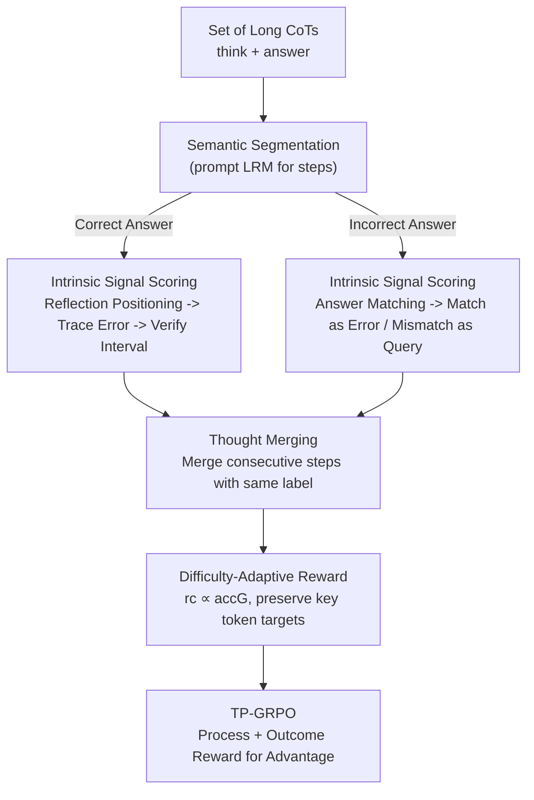

# Smarter Not Harder: Generative Process Evaluation with Intrinsic-Signal Driving and Ability-Adaptive Reward Shaping

**Conference**: ICLR 2026  
**OpenReview**: [https://openreview.net/forum?id=LZZENDlZt9](https://openreview.net/forum?id=LZZENDlZt9)  
**Code**: None  
**Area**: LLM Reasoning  
**Keywords**: Process Reward, GenPRM, Reinforcement Learning, Mathematical Reasoning, Training Efficiency

## TL;DR
To address three major pitfalls of Generative Process Reward Models (GenPRM) in Reinforcement Learning (RL)—scoring dependence on reasoning ability, dense step rewards triggering reward hacking, and static rewards suppressing exploration—this paper proposes "using intrinsic semantic signals (reflection/matching) in reasoning trajectories to determine correctness" + "merging consecutive steps with the same correctness into 'thoughts' before awarding" + "adaptively scaling rewards based on current difficulty." Integrated into process-supervised GRPO as TP-GRPO, it outperforms outcome-only GRPO on 1.5B/7B models using 5× fewer samples.

## Background & Motivation

**Background**: RLVR (Reinforcement Learning from Verifiable Rewards) relies on rule-based outcome rewards (Correct +1 / Incorrect -1) to train Large Reasoning Models (LRM), showing significant effectiveness in mathematical reasoning (e.g., DeepSeek-R1, Kimi k1.5). However, outcome rewards only evaluate the final answer, providing no feedback on reasoning trajectories that may span thousands of tokens. This results in extremely sparse feedback and low sample efficiency.

**Limitations of Prior Work**: To leverage intermediate processes, researchers have turned to Process Reward Models (PRM). Discriminative PRMs suffer from unstable step segmentation, poor generalization, and expensive annotation. While Generative PRMs (GenPRM) allow strong models to "judge while thinking" more flexibly, the authors find that naively integrating GenPRM into reward shaping introduces three fatal risks: ① **Scoring Phase**: GenPRM relies on "re-solving/simulated reasoning" to judge each step, implying an assumption that PRM reasoning ability $\ge$ actor LRM. As tasks get harder and actors stronger, evaluation reliability collapses (with bias in self-evaluation scenarios). ② **Rewarding Phase (Dense)**: Assigning static $\pm 1$ to every step causes process rewards to dominate advantage estimation as step counts increase, leading the model to maximize "process gains" instead of final correctness (reward hacking). ③ **Rewarding Phase (Static)**: Uniformly punishing all incorrect attempts suppresses the trial-and-error exploration that should be encouraged, trapping the model in local optima.

**Key Challenge**: Process rewards aim to "utilize trajectories at a finer granularity," but finer granularity requires stronger PRM reasoning for scoring, and higher density risks distorting the optimization objective. Scoring dependence, dense bias, and exploration suppression are deeply entangled.

**Goal**: Design a GenPRM mechanism that: ① Does not depend on strong reasoning for scoring; ② Employs appropriate reward granularity to avoid optimization distortion; ③ Balances exploration and exploitation. These correspond to three principles: P1 Decoupling evaluation from reasoning, P2 Rewarding at appropriate granularity, and P3 Balancing exploration/exploitation.

**Key Insight**: The authors observe that Long CoTs contain intrinsic signals—if a correct solution contains an incorrect step, it must be accompanied by a "reflection/correction" (otherwise the error would propagate to the final answer). In incorrect solutions, "steps adopted into the final answer" naturally serve as targets for punishment. These semantic/matching cues are fundamental abilities where LLMs are more stable than when "re-solving" the problem.

**Core Idea**: Decompose the difficult task of "judging reasoning correctness" into "semantic understanding + matching" sub-tasks (intrinsic-signal-driven) which LLMs excel at. Rewards are elevated to the thought level and adaptively scaled by difficulty, then integrated into GRPO as TP-GRPO.

## Method

### Overall Architecture

TP-GRPO integrates GenPRM into the GRPO training loop via two stages: the input is a set of Long CoTs (think + answer) sampled by the LRM for a math problem, and the output is the advantage for each token, optimized using the standard GRPO objective. **Stage I (Evaluation)** first segments the "think" block into semantic steps, then uses "intrinsic signals" to judge correctness—not by re-reasoning, but through a "reflection positioning $\to$ error source tracing $\to$ interval verification" protocol for correct solutions and an "answer matching" protocol for incorrect solutions. **Stage II (Rewarding)** merges consecutive steps with the same label into "thoughts," issues $\pm r_c$ adaptively based on the group-wise accuracy $acc_G$ of the current problem, and deliberately maintains the optimization targets of key tokens to suppress reward hacking. Both stages are incorporated into the process-supervised GRPO advantage calculation to obtain TP-GRPO.

### Key Designs

**1. Intrinsic-Signal-Driven Evaluation: Decoupling "Correctness Judgment" from "Reasoning Ability"**

This addresses the first pitfall—existing GenPRMs require "re-solving" to judge each step, meaning PRM reasoning must surpass the actor, which is unreliable for hard tasks. The authors replace scoring with more stable semantic understanding/matching abilities and design two protocols. For **correct solutions** (identifying invalid steps), they use a self-consistency hypothesis: if the answer is correct, any incorrect step must be followed by a valid reflection to correct it; otherwise, the error would persist. Thus, errors and reflections appear in pairs. This involves: 1) **Reflection positioning**, using semantic understanding to find self-reflections (e.g., "wait, I made a mistake"); 2) **Error source tracing**, backtracking from the reflection's analysis to circle a candidate error interval; 3) **Interval verification**, using heuristic rules (e.g., "steps depending on prior errors are also wrong") for step-by-step judgment. For **incorrect solutions** (avoiding over-punishment), they make a conservative assumption that "all steps in the answer are wrong," then label steps in the "think" block that **semantically match the incorrect answer** as wrong, while labeling **mismatched** steps as "uncertain." This avoids killing valid exploration within the "think" block like pure outcome rewards do, without requiring superior reasoning from the PRM. Essentially, it uses the foundational "semantic understanding + matching" abilities of LLMs to replace the unstable "re-reasoning" ability.

**2. Thought-level Reward Unit: Elevating Dense Step Rewards to Paragraph Granularity**

This addresses the second pitfall—"think" blocks are often cut into many steps, and static step rewards can dominate advantages and distort optimization. The paper provides an intuitive counter-example: a correct step 4 might be penalized by the accumulated negative rewards of five subsequent incorrect steps because the advantage $\hat{A}_{i,t}=\sum_{index(j)\ge t}\hat{r}_i^{index(j)}$ aggregates all standardized process rewards after token $t$. The solution is merging **consecutive steps with the same correctness label** into a single logical unit—a thought. Rewards are issued at the thought level rather than the step level. This is not blind filtering but retaining the "minimal reward set required to guide optimization" while maximizing redundancy reduction. Experiments show this simple strategy is crucial (AIME 25 dropped from 25.63 to 22.29 without it), as it significantly reduces token advantage variance and increases mutual information between advantage and token correctness.

**3. Adaptive Reward: Scaling by Problem Difficulty to Balance Exploration and Hacking**

This addresses the third pitfall (static rewards suppressing exploration) and caps reward hacking. The core is dynamically adjusting reward intensity based on current ability. For **correct solutions**, each correct thought receives $+r_c$ and each incorrect thought receives $-r_c$, where:

$$r_c = \alpha \cdot acc_G,\quad \alpha>0$$

$acc_G$ is the accuracy of $G$ sampled solutions for the same problem. When $acc_G=0$ (hard problem), $r_c\to 0$, degrading to pure outcome rewards to prioritize exploration. When $acc_G=1$ (easy problem), $r_c=\alpha$, the process reward is strongest to reinforce correct patterns and suppress errors. For **incorrect solutions**, only matching thoughts "adopted into the incorrect answer" are punished: given a standardized outcome reward $\hat{r}_i^o\le 0$, matching thoughts get $\hat{r}_i^o$ and mismatched thoughts get $-\hat{r}_i^o$ (non-negative), ensuring exploratory attempts that did not lead to the final answer are not penalized.

**4. TP-GRPO: Advantage Construction Preserving Key Token Objectives**

Integrating the two stages into process-supervised GRPO yields TP-GRPO. Process rewards are **not** standardized (unlike Eq.2), while outcome rewards are standardized within the group as usual. Its most critical property is "introducing process rewards without changing the original training target," characterized by two propositions: in correct solutions, the advantage of a **token in a correct thought** still equals the outcome reward $\hat{r}_i^o$ (Prop. 1); in incorrect solutions, the advantage of a **token in a matching thought** still equals $\hat{r}_i^o$, while mismatched thoughts get 0 (Prop. 2). This means the targets for key tokens determining "which direction to optimize" are preserved, and process rewards only de-weight incorrect/invalid steps (e.g., incorrect thoughts in correct solutions get $\hat{r}_i^o-r_c$), fundamentally preventing reward hacking since the model cannot shift the primary objective by farming process rewards.

### Loss & Training
The model uses the clipped surrogate + KL regularization objective from GRPO (Eq.1). Advantages are constructed by accumulating process and outcome rewards after tokens. Due to high GenPRM overhead, training is off-policy: each round samples enough rollouts for 50 training steps, then multiple GenPRMs are deployed in parallel for evaluation, followed by multi-step training. The framework is based on TRL + vLLM, with batch=5, lr=1e-6, and 8 rollouts per prompt.

## Key Experimental Results

The backbone models are DeepSeek-R1-Distill-Qwen 1.5B/7B, trained on DeepScaler-40K. Evaluation is conducted on five math benchmarks: AIME24/25, AMC23, MATH-500, and Olympiad. A custom efficiency metric is used: $\text{Effic.}=\frac{\text{Improvement}}{\#\text{training solutions}}\times 10^5$.

### Main Results

| Model (1.5B) | AIME24 | AIME25 | Avg. | #Solution | Effic. |
| :--- | :--- | :--- | :--- | :--- | :--- |
| Base Model | 28.80 | 22.50 | 48.06 | - | - |
| GRPO Replication (850 steps) | 32.71 | 24.58 | 49.64 | 34K | 4.65 |
| GRPO + LLM-as-judge (118 steps) | 30.41 | 24.58 | 48.85 | 4.7K | 16.8 |
| GRPO + GenPRM-32B (262 steps) | 31.45 | 23.12 | 48.86 | 10.4K | 7.63 |
| **TP-GRPO (140 steps)** | **33.12** | **25.63** | **50.10** | **5.6K** | **36.43** |

On the 7B model, TP-GRPO (214 steps, 8.56K solutions) averaged 67.23, surpassing on-policy GRPO (65.34) which used 16K solutions (400 steps), with AIME24/25 increasing by +6.67/+6.66 respectively. The efficiency index of 40.07 is much higher than the 9.6 of the GRPO Replication. Key conclusion: TP-GRPO surpasses outcome-only GRPO using ~5× fewer samples. Two GenPRM baselines (LLM-as-judge, GenPRM-32B) only slightly outperformed the base model, suggesting process rewards are ineffective if not designed properly.

### Ablation Study

| Config (1.5B) | AIME24 | AIME25 | AMC23 | Description |
| :--- | :--- | :--- | :--- | :--- |
| TP-GRPO | 33.12 | 25.63 | 64.01 | Full Model |
| - w/o Stage I | 31.04 | 23.54 | 63.93 | Replace with direct LLM-as-judge |
| - w/o S1 (Thought Merging) | 31.66 | 22.29 | 62.19 | Step-level rewards, largest drop |
| - w/o S2 (Difficulty Adaptive) | 32.71 | 22.92 | 63.47 | Fixed ±1 static reward |

Reward component ablation (Table 4): Using only correct solution rewards performed better on AIME24 (30.00), while using only incorrect solution rewards performed better on AIME25. This confirms the different roles of the two reward sets (incorrect rewards mitigate over-punishment for exploration in hard problems, while correct rewards reinforce effective patterns).

### Key Findings
- **Thought Merging (S1) is the core contributor**: Removing it dropped AIME25 from 25.63 to 22.29. Analysis shows step-level rewards cause token advantage variance to spike to ~77.97 with mutual information to correctness of only 0.22; merging into thoughts raises mutual information to 0.69 because consecutive error steps no longer distort the advantage sign of preceding steps.
- **Low dependence on evaluator reasoning ability**: Using Qwen3-32B/4B or Gemma3-12B-it (decreasing reasoning power) as the PRM, TP-GRPO performance remained stable (51.64 $\to$ 51.13), whereas LLM-as-judge declined significantly (51.33 $\to$ 48.75, with Gemma failing to outperform the base). This verifies the effectiveness of "decoupling evaluation from reasoning."
- **Stable and efficient gains**: The authors admit absolute gains are modest (avg. +2.04 for 1.5B) but achieved in significantly fewer steps, supporting the core hypothesis that reasonable GenPRM can improve training efficiency over pure outcome rewards.

## Highlights & Insights
- **"Using reflection to find errors" is a clever free signal**: The self-consistency hypothesis that "error implies reflection" in correct solutions converts the hard "correctness judgment" into "reflection positioning + checking," bypassing the requirement for the PRM to out-reason the actor. This is transferable to any Long CoT evaluation with self-reflection.
- **Structural prevention of reward hacking**: Propositions 1/2 show process rewards only de-weight errors without moving the primary objective of correct steps, which is more fundamental than post-hoc hacking detection.
- **Adaptive difficulty $r_c\propto acc_G$ handles trade-offs**: A simple formula manages the exploration/exploitation trade-off by degrading to pure outcome rewards for hard problems and strengthening process guidance for easy ones.

## Limitations & Future Work
- **Modest absolute gains**: The 1.5B average gain is only +2.04; the main selling point is efficiency rather than the performance ceiling.
- **Limited scale/domain**: Validated only on 1.5B/7B small models and the mathematics domain; generalization to larger scales or non-math tasks is unproven.
- **Engineering complexity**: The off-policy pipeline requires deploying multiple GenPRMs in parallel, and since TP-GRPO only keeps solutions with non-zero process rewards, training steps per round are less than 50, making curve comparison not perfectly aligned.
- **Correct solution assumption**: If a correct answer is "guessed correctly" or contains "canceled errors" without explicit reflection, the "error implies reflection" premise fails, leading to potential omissions in step evaluation.

## Related Work & Insights
- **vs. Discriminative PRM (Lightman 2023, etc.)**: Discriminative PRMs rely on human/Monte Carlo step-level labels and suffer from subjectivity and high costs; this paper uses GenPRM + intrinsic signals to avoid re-labeling and improve stability.
- **vs. Reasoning GenPRM (Feng 2025, etc.)**: These rely on "re-solving" for scoring, implying PRM $\ge$ Actor. This paper decouples scoring into semantic matching, demonstrated by stable performance even with weaker evaluators.
- **vs. LLM-as-a-judge**: Direct scoring is sensitive to evaluator reasoning power; TP-GRPO uses structured intrinsic signals for scoring, making it more robust.
- **vs. Standard Process-Supervised GRPO (DeepSeekMath)**: Inherits the advantage accumulation framework but modifies it with thought-level granularity + adaptive difficulty + non-standardized process rewards to fix the issue where dense rewards dominate advantages.

## Rating
- Novelty: ⭐⭐⭐⭐ The "intrinsic signal decoupling" and "thought-level adaptive rewards" are targeted new solutions for GenPRM pitfalls.
- Experimental Thoroughness: ⭐⭐⭐⭐ Five benchmarks, two scales, three types of ablation, and evaluator dependency analysis, though limited to small models and math.
- Writing Quality: ⭐⭐⭐⭐ Clear progression from three pitfalls to three principles to three innovations; well-characterized propositions.
- Value: ⭐⭐⭐⭐ Clarifies why process rewards often fail and provides actionable fixes, with significant efficiency gains.

<!-- RELATED:START -->

## Related Papers

- [\[ICLR 2026\] Generative Adversarial Reasoner: Enhancing LLM Reasoning with Adversarial Reinforcement Learning](generative_adversarial_reasoner_enhancing_llm_reasoning_with_adversarial_reinfor.md)
- [\[ICLR 2026\] Linking Process to Outcome: Conditional Reward Modeling for LLM Reasoning](linking_process_to_outcome_conditional_reward_modeling_for_llm_reasoning.md)
- [\[ICLR 2026\] StepORLM: A Self-Evolving Framework with Generative Process Supervision for Operations Research Language Models](steporlm_a_self-evolving_framework_with_generative_process_supervision_for_opera.md)
- [\[ICML 2026\] GRPO is Secretly a Process Reward Model](../../ICML2026/llm_reasoning/grpo_is_secretly_a_process_reward_model.md)
- [\[ICLR 2026\] OR-PRM: A Process Reward Model for Algorithmic Problem in Operations Research](or-prm_a_process_reward_model_for_algorithmic_problem_in_operations_research.md)

<!-- RELATED:END -->
