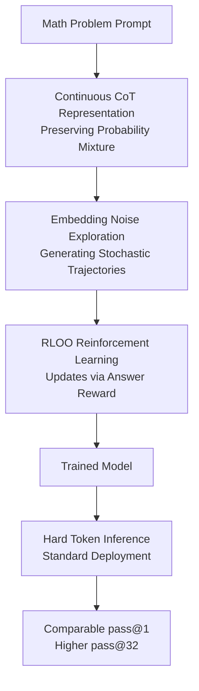

# Soft Tokens, Hard Truths

**Conference**: ICLR2026  
**OpenReview**: [https://openreview.net/forum?id=9JjKTp8Jmy](https://openreview.net/forum?id=9JjKTp8Jmy)  
**Code**: TBD  
**Area**: LLM Reasoning  
**Keywords**: Continuous Chain-of-Thought, soft tokens, fuzzy tokens, RL fine-tuning, reasoning diversity

## TL;DR
This paper proposes a soft/fuzzy token method that uses Reinforcement Learning (RL) training on continuous CoT embeddings with added noise, without requiring discrete CoT annotations. It maintains nearly identical pass@1 performance to discrete CoT in mathematical reasoning while significantly improving pass@32 diversity and out-of-distribution (OOD) capability preservation.

## Background & Motivation
**Background**: Reasoning enhancement in LLMs typically relies on Chain-of-Thought (CoT), where the model generates intermediate reasoning tokens before providing a final answer. Traditional CoT intermediate steps consist of discrete tokens: a token is sampled from the vocabulary at each step, and its embedding is fed back into the transformer. This approach is naturally compatible with existing language model training paradigms and facilitates optimization of final answer accuracy using RL-based post-training methods such as RLHF, RLOO, or GRPO.

**Limitations of Prior Work**: The issue with discrete CoT is that each step must collapse into a single token, forcing the reasoning trajectory to unfold along a unique path. The intuition behind continuous CoT or "soft thinking" is that if intermediate states maintain full probability distributions or continuous vectors, they could potentially carry multiple candidate reasoning directions simultaneously, exploring in parallel like a "reasoning superposition state." However, practical training for continuous CoT has been difficult: some methods only switch a pre-trained discrete model to soft inputs during inference without training the model to adapt; others require distillation from human or model-generated discrete CoTs; and methods like Coconut require backpropagation through the entire continuous CoT, limiting length due to memory and compute constraints.

**Key Challenge**: While continuous tokens have high theoretical expressivity, without stochasticity, a continuous CoT trajectory is almost deterministic for a given prompt, making it difficult to apply REINFORCE/RLOO which rely on sampled trajectories. Conversely, discrete tokens possess natural sampling noise, making them trainable and explorable, yet they may become overconfident during fine-tuning, sacrificing reasoning diversity and OOD behavior.

**Goal**: The authors aim to address three specific questions: first, how to make continuous CoT trainable via RL like discrete CoT; second, whether this method can scale to hundreds of CoT tokens rather than just 4 to 6 toy steps; and third, what the optimal training and inference configuration for continuous CoT should be, and whether it truly offers substantial gains over discrete CoT.

**Key Insight**: The paper observes that RL training does not strictly require discrete tokens; it requires computable trajectory probabilities and sufficient exploration noise. Thus, the authors stop attempting BPTT through the entire continuous CoT and do not require reference CoTs. Instead, they add Gaussian noise to the input embeddings of soft tokens, transforming the continuous CoT into a stochastic trajectory. This preserves the expressive space of continuous mixed embeddings while allowing the log probability of each step's noise to be formulated for optimizing final answer rewards via REINFORCE-style methods.

**Core Idea**: Replace discrete CoT sampling with "probability-weighted continuous token embeddings + embedding noise," allowing the continuous reasoning trajectory to obtain the explorability required for RL, while still permitting standard discrete token inference deployment after training.

## Method

### Overall Architecture
The method can be viewed as a local replacement of the token generation process during the CoT phase: standard prompts and final answers are handled normally, but intermediate reasoning tokens are no longer forced to be sampled as one-hot discrete tokens. During training, the model converts the next-token distribution into an embedding mixture and adds Gaussian noise to form a continuous CoT state. The final answer is decoded normally and scored by a mathematical verifier. RLOO updates the model based on the reward, teaching it to utilize noisy continuous trajectories for richer reasoning exploration. During inference, the authors systematically compare six settings across hard, soft, and fuzzy, finding that the most practical combination is "soft/fuzzy training + hard token inference."

Two easily confused concepts are used. "Soft tokens" refer to using the full next-token probability distribution with temperature $\tau=0.5$ for weighted average embeddings plus noise. "Fuzzy tokens" refer to setting the CoT phase temperature very low (e.g., $\tau=0.0001$), which almost collapses into discrete token embeddings before adding Gaussian perturbations. Both are continuous CoT training methods but differ in their degree of continuity: soft is more like a true distribution mixture, while fuzzy is more like local continuous perturbations around discrete tokens.

### Key Designs
**1. Probability Mixed CoT: Transforming Discrete Choices into Continuous Embedding States**

Standard hard token generation samples a one-hot token $x_t$ from $p_{t-1}$ at step $t$, then obtains the input embedding via the embedding matrix $E$. This paper follows the soft thinking approach: instead of one-hot sampling during the CoT phase, it preserves the entire distribution, writing the next input as $h_t^0=p_{t-1}E$. This allows the model to avoid premature commitment to a specific token, integrating the semantic directions of multiple tokens into a single continuous vector.

**2. Embedding Noise Exploration: Turning Continuous CoT into RL-Optimizable Stochastic Trajectories**

$h_t^0=p_{t-1}E$ alone is insufficient because this continuous CoT is deterministic given a prompt and parameters, lacking the sampled trajectories needed for REINFORCE. The authors add Gaussian noise to the input embedding: $\tilde{h}_t^0=p_{t-1}E+\sigma N(0,I_d)$. This modification makes each step of the continuous CoT a random variable, shifting exploration from discrete token sampling to perturbations in the continuous embedding space.

Crucially, the log probability of this noise is easily computable. Given previous noisy soft tokens, the model calculates the un-noised $h_t^0$. Since the actual input is $\tilde{h}_t^0$, the trajectory log probability for each step is the Gaussian density: $\log \pi(\tilde{h}_t^0|\tilde{h}_{<t}^0)=-\frac{1}{2\sigma^2}\|\tilde{h}_t^0-h_t^0\|^2+\text{cst}$. This makes the continuous CoT trajectory probability differentiable and cumulative, enabling integration with RLOO, GRPO, or PPO.

**3. Decoupling Soft/Fuzzy Training from Hard Inference**

The paper does not merely propose a new inference mode but cross-evaluates training and inference methods. Training includes hard, soft, and fuzzy modes; testing includes six combinations: hard greedy, hard sample, soft greedy, soft sample, fuzzy greedy, and fuzzy sample. This addresses a practical question: if soft token training only works with soft inference, deployment costs increase. The results show that the strongest combination is often "soft/fuzzy training + hard token inference," suggesting continuous CoT acts as a "gentle exploration mechanism" during training that helps the model retain more reasoning paths and distributional entropy.

**4. Outcome-Only Rewards: Avoiding Dependence on Reference CoT**

The training does not require ground-truth CoTs; it uses the correctness of the final answer. Each mini-batch contains $B=2$ prompts, with $G=32$ trajectories sampled per prompt. Rewards are determined by a Math Verifier: 100 for a correct answer, 10 for a boxed but incorrect answer, and 0 otherwise. RLOO uses a leave-one-out baseline among the 32 samples to calculate the advantage for model updates.

### Loss & Training
The objective is to maximize the expected reward $E_{(\tilde{h},a)\sim\pi}[R(a)]$. In REINFORCE terms, this minimizes the reward-weighted negative log probability:

$$
E_{(\tilde{h},a)\sim\pi_{sg}}\left[-R(a)(\log \pi(\tilde{h}^0)+\log \pi(a|\tilde{h}^0))\right].
$$

Where $\log \pi(a|\tilde{h}^0)$ is the standard log probability of the final answer tokens, and $\log \pi(\tilde{h}^0)$ is the sum of step-wise Gaussian noise densities. The experiments use Llama 3.2 3B, Llama 3.1 8B, and Qwen 2.5 3B. Training sampled up to 128 CoT tokens for GSM8K and 512 for MATH/DeepScaleR. Soft training uses $\tau=0.5$, fuzzy uses $\tau=0.0001$, and noise scale is $0.33 \times$ the token embedding's RMS norm.

## Key Experimental Results

### Main Results
The primary conclusion is that soft/fuzzy training performs comparably to hard training in pass@1 but frequently wins in pass@32.

| Model / Training Set | Test Set | Training Mode | Greedy pass@1 | Sample pass@32 | Observations |
| :--- | :--- | :--- | :--- | :--- | :--- |
| Llama 3B / GSM8K | GSM8K | hard | 75.9±1.3 | 94.1±0.3 | Pass@1 is usable, but sampling ceiling is lower |
| Llama 3B / GSM8K | GSM8K | fuzzy | 76.7±1.8 | 97.4±0.3 | Pass@1 similar, pass@32 higher |
| Llama 3B / GSM8K | GSM8K | soft | 77.2±0.9 | 97.9±0.3 | Best pass@32 in the group |
| Llama 8B / GSM8K | MATH-500 | hard | 20.2±0.8 | 45.4±3.2 | Severe OOD performance collapse |
| Llama 8B / GSM8K | MATH-500 | fuzzy | 44.6±2.1 | 83.1±0.9 | Maintains base level and diversity |
| Qwen 3B / MATH | MATH-500 | hard | 59.0±1.7 | 83.6±1.0 | Strongest pass@1 |
| Qwen 3B / MATH | MATH-500 | soft | 54.7±0.3 | 84.4±0.7 | Slight pass@1 drop, maintains pass@32 advantage |

### Ablation Study
| Configuration | Key Metrics | Insights |
| :--- | :--- | :--- |
| Fuzzy embedding noise, $\gamma=0.33$ | GSM8K hard greedy 76.7±1.8 | Default setting, stable learning |
| Fuzzy embedding noise, $\gamma=3.0$ | GSM8K hard greedy 65.4±1.9 | Excessive noise collapses learning |
| Soft/fuzzy final hidden noise | hard greedy ~66-68 | Noise at embedding layer is superior to final hidden |
| Soft/fuzzy logits noise | hard greedy ~60-67 | S/N ratio is poor on full logits, leads to instability |

### Key Findings
- **pass@k vs pass@1**: Soft/fuzzy training's primary benefit is in pass@k. It preserves more successful reasoning paths rather than strictly maximizing single-pass accuracy.
- **Hard Inference Preference**: The paper finds that training with continuous CoT but testing with standard hard tokens is the most effective approach.
- **OOD Robustness**: Hard training often increases the NLL of correct answers on OOD tasks, whereas soft/fuzzy training remains closer to the base model, suggesting a gentler influence on the model's original capabilities.
- **Entropy Analysis**: Hard training leads to lower entropy (overconfidence), while soft/fuzzy training maintains an entropy profile closer to the base model, explaining the higher pass@32.

## Highlights & Insights
- The method ingeniously transforms the continuous CoT training bottleneck into a noise modeling problem, making RL exploration possible without discrete tokens.
- It clarifies that soft tokens are most valuable as a "gentle exploration" training mechanism rather than an inference-time panacea.
- Decoupling "soft training" from "hard inference" provides a practical way to integrate these gains into existing production inference stacks.

## Limitations & Future Work
- The experiments are focused on mathematical reasoning; it remains to be seen if this scales to tasks with noisier rewards like coding or open-ended dialogue.
- Computational costs remain high, requiring significant GPU hours for replication.
- While it scales to 512 tokens, the stability of noise scales and temperatures in even longer-context or much more difficult tasks requires further validation.

## Related Work & Insights
- Compared to **Soft Thinking**, this work focuses on RL post-training rather than just inference-time distribution usage.
- Compared to **Coconut**, it avoids BPTT through continuous steps by using noisy embedding trajectory probabilities, allowing for much longer CoT sequences.
- Compared to **standard hard-token RL**, it prevents the model from collapsing into single overconfident paths, preserving distributional entropy and OOD performance.

## Rating
- **Novelty**: ⭐⭐⭐⭐⭐ Solves a key bottleneck in continuous RL without needing reference trajectories.
- **Experimental Thoroughness**: ⭐⭐⭐⭐ Covers multiple models and metrics, though task variety is primarily limited to math.
- **Writing Quality**: ⭐⭐⭐⭐ Clear structure and well-aligned theoretical/experimental links.
- **Value**: ⭐⭐⭐⭐⭐ Offers both theoretical insights and a practical path for LLM reasoning post-training.

<!-- RELATED:START -->

## Related Papers

- [\[ICLR 2026\] Learning to Reason over Continuous Tokens with Reinforcement Learning (HyRea)](learning_to_reason_over_continuous_tokens_with_reinforcement_learning.md)
- [\[ICLR 2026\] Analytica: Soft Propositional Reasoning for Robust and Scalable LLM-Driven Analysis](analytica_soft_propositional_reasoning_for_robust_and_scalable_llm-driven_analys.md)
- [\[ICLR 2026\] Curriculum Reinforcement Learning from Easy to Hard Tasks Improves LLM Reasoning](curriculum_reinforcement_learning_from_easy_to_hard_tasks_improves_llm_reasoning.md)
- [\[ICML 2026\] Reasoning Can Be Restored by Correcting a Few Decision Tokens](../../ICML2026/llm_reasoning/reasoning_can_be_restored_by_correcting_a_few_decision_tokens.md)
- [\[ICLR 2026\] Sample Smart, Not Hard: Correctness-First Decoding for Better Reasoning in LLMs](sample_smart_not_hard_correctness-first_decoding_for_better_reasoning_in_llms.md)

<!-- RELATED:END -->
