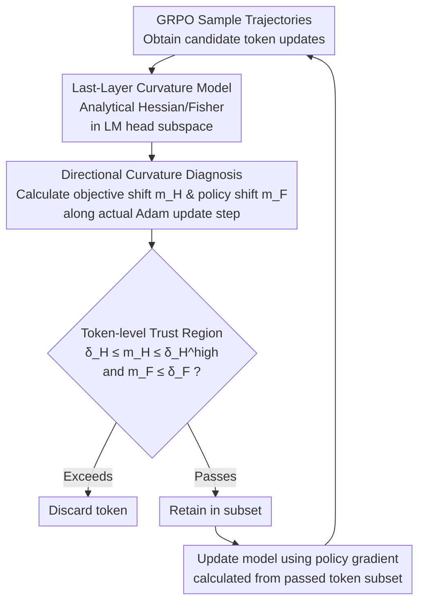

# Stabilizing Policy Gradients for Sample-Efficient Reinforcement Learning in LLM Reasoning

**Conference**: ICLR 2026  
**arXiv**: [2510.00819](https://arxiv.org/abs/2510.00819)  
**Code**: [https://github.com/luckeciano/stable-pg-llm](https://github.com/luckeciano/stable-pg-llm)  
**Area**: LLM Reasoning  
**Keywords**: Policy Gradient, Curvature-Aware, Sample Efficiency, GRPO, Second-order Optimization  

## TL;DR
This paper proposes CAPO (Curvature-Aware Policy Optimization), which stabilizes training under aggressive hyperparameters (5× learning rate, 1/12 batch size) by modeling second-order geometry in the final LM head layer to predict and filter token updates that lead to policy collapse. It achieves a 30× improvement in sample efficiency on MATH compared to standard GRPO.

## Background & Motivation

**Background**: Policy gradient methods such as GRPO and PPO are core technologies for LLM reasoning post-training (e.g., DeepSeek-R1). Current practices require extremely conservative hyperparameters—learning rates as low as $3 \times 10^{-6}$ and batch sizes in the thousands—to ensure training stability.

**Limitations of Prior Work**: Conservative settings imply massive sample requirements and computational overhead. However, increasing the learning rate or reducing the batch size leads to a sharp increase in policy gradient estimation variance, causing catastrophic parameter updates and policy collapse—where model performance drops below the baseline and fails to recover.

**Key Challenge**: Policy gradients utilize only first-order information and cannot perceive curvature in non-convex RL objectives. This may lead to large steps in directions that seemingly improve the objective but fall off a performance cliff. Furthermore, the Hessian matrix cannot be directly computed or approximated at the LLM scale (billions of parameters).

**Key Insight**: The authors observe that LLM logit outputs are generated solely by the final linear transformation layer $W \in \mathbb{R}^{K \times d_i}$, and top-k sampling makes the gradients naturally sparse (only $k < 100$ tokens have non-zero probabilities). Consequently, the Hessian and Fisher Information matrices can be efficiently approximated in this final layer.

**Core Idea**: Construct a last-layer curvature calculation model to track the impact of each token update on the objective function and policy distribution, filtering out samples that do not satisfy trust region constraints.

## Method

### Overall Architecture
The goal of CAPO (Curvature-Aware Policy Optimization) is to prevent GRPO from collapsing under aggressive hyperparameters (high learning rate, small batch size). It inserts a lightweight gate between sampling and parameter updates: before each update, a curvature model computed only at the final layer (LM head) predicts whether a candidate token update will push the policy off a performance cliff or progress safely. Only safe tokens are allowed into the actual policy gradient. The pipeline is as follows: after obtaining GRPO trajectories, gradients and curvature are estimated in the last-layer subspace; two scalars, "objective shift" $m_H$ and "policy shift" $m_F$, are calculated for each token; tokens exceeding trust region thresholds are discarded; and the remaining subset is used for standard policy gradient updates. The objective function itself (clipped surrogate + KL) remains unchanged; the innovation lies entirely in the data filtering during the gradient estimation phase.

### Key Designs

**1. Last-Layer Curvature Model: Making Second-Order Information Tractable at Billion-Parameter Scale**

Policy gradients use only first-order information and cannot perceive curvature in non-convex RL objectives, potentially taking large steps toward performance cliffs. While the Hessian is uncomputable for billions of parameters, CAPO partitions parameters into $\bm{\theta} = (\bar{\bm{\theta}}, \bm{\psi})$, where $\bar{\bm{\theta}}$ is the backbone and $\bm{\psi} = \text{vec}(W)$ is the final LM head layer. Since logits are produced entirely by this layer, the authors derive analytical forms for the objective Hessian $\tilde{H}(\bm{\psi})$ and Fisher information matrix $\tilde{F}(\bm{\psi})$ in this subspace. Crucially, top-k sampling ensures gradient sparsity (typically $k < 100$), reducing memory complexity from $\mathcal{O}((Kd_i)^2)$ to $\mathcal{O}(\tilde{k} \cdot d_i)$, making curvature calculations feasible for every step.

**2. Directional Curvature Diagnosis: Compressing Update Impacts into Interpretable Scalars**

With $\tilde{H}$ and $\tilde{F}$, CAPO performs two second-order expansions along the actual update direction $\Delta\bm{\psi}$ to obtain two diagnostic quantities. The objective shift predicts whether the update will increase or decrease the objective:

$$m_H(\Delta\bm{\psi}) = \tilde{g}(\bm{\psi})^\top \Delta\bm{\psi} + \frac{1}{2} \Delta\bm{\psi}^\top \tilde{H}(\bm{\psi}) \Delta\bm{\psi}$$

The policy shift measures how far the policy distribution will be moved:

$$m_F(\Delta\bm{\psi}) = \frac{1}{2} \Delta\bm{\psi}^\top \tilde{F}(\bm{\psi}) \Delta\bm{\psi}$$

Both require only sparse vector dot products, resulting in minimal overhead. Critically, $\Delta\bm{\psi}$ is modeled using Adam’s first and second moment estimates to match the actual optimizer step, ensuring the curvature prediction remains accurate for the landed update.

**3. Token-Level Trust Region Filtering: Removing "Toxic" Tokens Without Modifying the Objective**

CAPO decomposes a batch into token-level subsets, calculates $m_H$ and $m_F$ for each, and applies three thresholds: tokens are accepted only if $\delta_H \leq m_H(\Delta\psi_i) \leq \delta_H^{high}$ and $m_F(\Delta\psi_i) \leq \delta_F$. Out-of-bounds tokens are excluded from the current policy gradient. This step performs fine-grained cleaning at the sample level without modifying the surrogate objective, allowing it to be integrated with any policy gradient method (e.g., Dr.GRPO→Dr.CAPO, REINFORCE→ReinCAPO). Theoretically, the authors provide a monotonic improvement guarantee: by setting the trust region radius $\omega \geq C\sqrt{\delta_F}$, one can ensure $J(\pi_{\theta+\Delta\theta}) \geq J(\pi_\theta)$, aligning empirical "toxic token" filtering with the "no policy degradation" conclusion.

### Loss & Training
The objective function is identical to GRPO—using a clipped surrogate with KL regularization. CAPO introduces no new loss terms; its effect is limited to the selection of tokens during gradient calculation. In practice, the rejection rate is approximately 8% initially, dropping below 2% later, with an additional computational overhead of <5%.

## Key Experimental Results

### Main Results (Qwen2.5-Math-7B, Trained on MATH Dataset)

| Method | Settings | MATH Accuracy | TEST 8 Baseline Mean | Completions to reach 70% |
|------|------|------------|----------------|-------------------------|
| GRPO (Conservative) | lr=3e-6, batch=Large | ~72% | ~65% | ~150K |
| GRPO (Aggressive) | lr=1.5e-5, batch=Small | Collapse ❌ | Collapse ❌ | N/A |
| Dr.GRPO (Aggressive) | Same as above | Collapse ❌ | Collapse ❌ | N/A |
| REINFORCE (Aggressive) | Same as above | Collapse ❌ | Collapse ❌ | N/A |
| **CAPO (Aggressive)** | **lr=1.5e-5, batch=Small** | **~72%** | **~66%** | **~5K (30×)** |

### Ablation Study

| Analysis Dimension | Result | Description |
|---------|------|------|
| Token Rejection Rate | ~8% initially, <2% later | Minimal intervention suffices for stability |
| Scalability | Dr.CAPO, ReinCAPO effective | Applicable to any PG method |
| Computational Overhead | <5% extra time | Last-layer computation is lightweight |
| $m_F$ Tracking | Global $m_F$ spikes for failed methods | Curvature model effectively warns of instability |
| $m_H$ Tracking | CAPO $m_H$ curve is smooth | Local constraints ensure global stability |

### Key Findings
- All baseline methods (GRPO, Dr.GRPO, REINFORCE) collapse under aggressive settings, while only CAPO remains stable.
- CAPO achieves a 30× sample efficiency gain on MATH and a 9× gain across 8 evaluation baselines (TEST).
- Policy shift $m_F$ is highly correlated with training instability—spikes in $m_F$ precede collapse.
- Curvature-aware filtering generalizes to different policy gradient objectives, consistently preventing collapse.

## Highlights & Insights
- **Minimal Intervention for Maximum Gain**: Calculating curvature only at the last layer and rejecting <8% of tokens leads to a 30× efficiency gain. This suggests that instability is concentrated in a few "toxic" samples.
- **Diagnostic Value of Curvature**: Tracking $m_F$ and $m_H$ provides a window into RL-LLM optimization dynamics, making the previously black-box "collapse" predictable via $m_F$ spikes.
- **High Generality**: The token-filtering mechanism is modular, serving as a drop-in enhancement for any policy gradient method.
- **Alignment of Theory and Practice**: The monotonic improvement guarantee in Theorem 5.1 is empirically validated, as CAPO maintains $m_F$ within safe thresholds.

## Limitations & Future Work
- Validated only on Qwen2.5-Math-7B; performance on larger models and longer training schedules requires testing.
- Thresholds $\delta_H, \delta_F, \delta_H^{high}$ require tuning for specific MDPs and base policies.
- Last-layer approximation might lack information from deeper layers; extension to multi-layer curvature estimation is a natural progression.
- Validated primarily on mathematical reasoning; effectiveness on code generation or Agent tasks remains unknown.

## Related Work & Insights
- **vs. GRPO/PPO**: Clipping mechanisms in standard methods provide coarse-grained constraints in parameter space, while CAPO offers fine-grained filtering in sample space. Both can be used together.
- **vs. K-FAC**: K-FAC uses Kronecker approximations for Fisher matrices in general deep RL, but entails high memory overhead. CAPO leverages LLM top-k sparsity and last-layer approximations to scale.
- **vs. Dr.GRPO**: Dr.GRPO reduces variance via objective modification but does not address curvature; it still collapses under aggressive settings, whereas Dr.CAPO remains stable.
- **Insight**: Instability in RL-LLM training may not require changing the objective, but rather identifying and filtering "toxic samples"—analogous to data cleaning in supervised learning.

## Rating
- Novelty: ⭐⭐⭐⭐ Practical application of second-order methods in LLM RL via last-layer sparsity.
- Experimental Thoroughness: ⭐⭐⭐⭐ Significant 30× gain across 8 benchmarks, though limited in model scale.
- Writing Quality: ⭐⭐⭐⭐ Rigorous theoretical derivation and clear logical flow from motivation to method.
- Value: ⭐⭐⭐⭐⭐ Direct practical implications for LLM RL efficiency, significantly reducing compute costs.

<!-- RELATED:START -->

## Related Papers

- [\[ICLR 2026\] Temperature as a Meta-Policy: Adaptive Temperature in LLM Reinforcement Learning](temperature_as_a_meta-policy_adaptive_temperature_in_llm_reinforcement_learning.md)
- [\[ICLR 2026\] On the Design of KL-Regularized Policy Gradient Algorithms for LLM Reasoning](on_the_design_of_kl-regularized_policy_gradient_algorithms_for_llm_reasoning.md)
- [\[ICLR 2026\] ShinkaEvolve: Towards Open-Ended and Sample-Efficient Program Evolution](shinkaevolve_towards_open-ended_and_sample-efficient_program_evolution.md)
- [\[ICLR 2026\] Slow-Fast Policy Optimization: Reposition-Before-Update for LLM Reasoning](slow-fast_policy_optimization_reposition-before-update_for_llm_reasoning.md)
- [\[ICLR 2026\] Generative Adversarial Reasoner: Enhancing LLM Reasoning with Adversarial Reinforcement Learning](generative_adversarial_reasoner_enhancing_llm_reasoning_with_adversarial_reinfor.md)

<!-- RELATED:END -->
