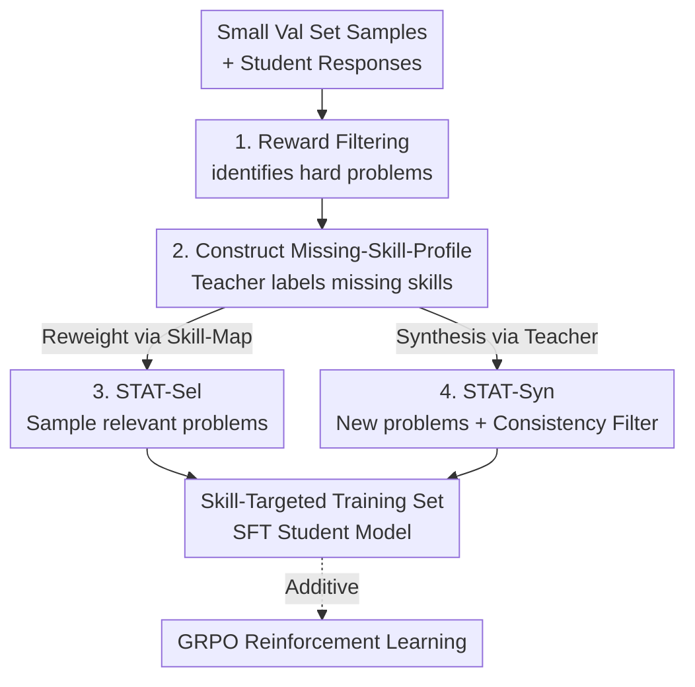

# STAT: Skill-Targeted Adaptive Training

**Conference**: ICLR 2026  
**OpenReview**: [https://openreview.net/forum?id=m3jG3GaNIj](https://openreview.net/forum?id=m3jG3GaNIj)  
**Code**: https://github.com/princeton-pli/STAT  
**Area**: LLM Reasoning / Data Selection / SFT  
**Keywords**: Skill-targeted training, Missing skill profile, SFT saturation, Meta-cognitive teacher, Mathematical reasoning  

## TL;DR
Utilizing a stronger LLM as a "teacher" to diagnose **exactly which skills** a student model lacks in mathematics, followed by reweighting or synthesizing training data for SFT. This allows small models already "saturated" on MATH to continue improving (+7.5% max on MATH, +4.6% avg OOD) and shows additive benefits when combined with subsequent GRPO reinforcement learning.

## Background & Motivation
**Background**: Supervised Fine-Tuning (SFT) on domain-specific datasets (e.g., MATH) is a standard approach to boost specialized capabilities. Common practices involve training for multiple epochs on a fixed dataset or using embedding/gradient similarity to select subsets "most similar to failed validation examples."

**Limitations of Prior Work**: For instruction-following models already heavily post-trained (e.g., Llama-instruct), continuing SFT on data they have already seen (like MATH) yields almost no gains—a phenomenon known as **saturation**. In the paper's experiments, naive SFT like MATH-Augment improves the base model by only 1–2% at most, while Qwen2.5-3B even shows performance degradation. Even worse, embedding-based data selection (Embed-Sel/Syn) remains largely ineffective on these saturated models.

**Key Challenge**: The root of saturation lies in SFT using **average next-token loss across all samples**. When a model can already solve the majority of problems, the training signal from the average loss is heavily diluted. Furthermore, there is a mismatch between "average loss" and actual errors during auto-regressive generation; validation loss is merely a coarse proxy for real generation errors. Embedding similarity only measures "problem prompt similarity" without addressing the specific **step in reasoning capability** that the model lacks.

**Goal**: Instead of broadly reducing average loss, the goal is to precisely locate the **underlying skills** missing in the student model and concentrate the training signal on problems corresponding to those skills.

**Key Insight**: Leveraging the **meta-cognitive** capability of frontier LLMs—strong models can not only solve problems but also analyze the skills required for a problem and identify missing skills in a student's response. Thus, a strong model can act as a "teacher," monitoring student mastery of individual skills to allocate training samples adaptively.

**Core Idea**: The teacher builds a **Missing-Skill-Profile** for the student, which is then used to either "select data" (STAT-Sel reweighting existing tasks) or "generate data" (STAT-Syn synthesizing new tasks), achieving skill-targeted adaptive training.

## Method

### Overall Architecture
STAT defines a three-stage pipeline of "Diagnosis—Prescription—Execution," driven by a frontier teacher LLMs (defaulting to GPT-4o-mini). Given a set of test problems $Q$ (split into $Q_{val}$ and $Q_{test}$) and a training library $P$ previously seen by the model (e.g., MATH train set), the objective is to construct a targeted training set $P_{targeted}$ for further SFT.

The pipeline utilizes an existing skill taxonomy: following Didolkar et al. (2024), it enumerates a skill set $S$ and establishes a **Skill-Map** $S \to P$ (mapping each skill to problems requiring it). Then, three stages are executed: ① Use a Reward Model (RM) to filter out **difficult problems** where the student failed or performed poorly; ② The teacher analyzes student errors step-by-step to label missing skills, aggregating them into a **Missing-Skill-Profile**; ③ Based on this profile, the pipeline either performs **reweighted sampling** from $P$ (STAT-Sel) or **synthesizes** new problems targeting missing skills (STAT-Syn) to form $P_{targeted}$.

### Key Designs

**1. Reward Filtering to Identify Hard Problems: Isolating weaknesses without ground truth**

To "treat the symptoms," one must first know where the student struggles. While checking correctness is direct, it requires ground-truth answers, limiting generalizability. STAT uses a **Reward Model** to score step-by-step reasoning. If a response for problem $q$ consists of $t$ steps, the RM provides scores $\{r_{q,1}, \dots, r_{q,t}\}$, filtered by two thresholds $\tau_1, \tau_2$:

$$R(q)=0 \iff r_{q,t}\le\tau_1 \;\text{or}\; \tfrac{1}{t}\sum_{i=1}^{t} r_{q,i}\le\tau_1 \;\text{or}\; \exists\, i<t,\; r_{q,i}\le\tau_2$$

If the **final step score is low, the average score is low, or any intermediate step score is too low**, the problem is classified as difficult ($R(q)=0$). This approach avoids dependence on ground-truth while pinpointing "where the reasoning collapsed."

**2. Missing-Skill-Profile: Translating "Failure" into "Actionable Skill Gaps"**

STAT analyzes each difficult problem $q \in Q^{val}_{difficult}$ by having the teacher LLM check which skills from $S$ were omitted in the student's response, resulting in a $\text{Missing-Skill-Profile}: Q^{val}_{difficult} \to S$. This is the diagnostic core: it transforms vague failures into an actionable frequency table of missing skills. Analysis revealed a counter-intuitive finding—even models trained repeatedly on MATH often lack **foundational algebra and basic arithmetic** skills.

**3. STAT-Sel: Reweighted Sampling from Existing Library**

Using the Missing-Skill-Profile, STAT-Sel adjusts the weights of old problems. For each missing skill, multiple problems requiring that skill are sampled from the library $P$ via the Skill-Map. The sampling frequency of a skill is proportional to its occurrence in the Missing-Skill-Profile, shifting the training distribution toward the student's weaknesses.

**4. STAT-Syn: Synthesizing New Targeted Problems**

When the existing library lacks coverage, STAT-Syn has the teacher generate new problems. For each missing skill, the teacher uses three relevant problems as in-context examples to generate a new problem and solution. To ensure quality, a **consistency filter** is applied: a QA pair is kept only if the teacher generates the same answer at least twice across multiple attempts. STAT-Syn is more costly but yields higher gains on difficult benchmarks like MATHD and AIME.

### Loss & Training
The student is fine-tuned on $P_{targeted}$ using standard SFT objectives (3 epochs). To ensure fair comparison, all methods (including baselines) use a consistent scale of approximately 4k unique problems / 9.5k QA pairs. STAT is complementary to GRPO: performing STAT-SFT to bridge skill gaps before applying GRPO on the same dataset provides additive gains.

## Key Experimental Results

### Main Results
On Llama-3.2-3B-Instruct, STAT significantly outperforms naive SFT and embedding-based data selection:

| Method | MATH | MATHD | AMC23 | AIME24 | Average |
|------|------|-------|-------|--------|------|
| Base | 44.0 | 18.2 | 33.7 | 33.3 | 30.5 |
| MATH-Augment (Naive SFT) | 45.2 | 23.9 | 35.1 | 30.0 | 31.7 |
| Embed-Sel | 46.0 | 26.5 | 36.2 | 36.7 | 32.8 |
| Embed-Syn | 48.8 | 27.3 | 36.9 | 26.7 | 33.0 |
| **STAT-Sel** | **51.5** | 26.6 | **39.8** | **43.3** | 36.5 |
| **STAT-Syn** | 50.2 | **31.7** | 39.1 | 40.0 | **37.2** |

STAT improves MATH by up to +7.5% (51.5 vs 44.0) and shows consistent gains across 7 OOD benchmarks (avg OOD gain of 5.3%/5.8% for STAT-Sel/Syn).

### Complementarity with GRPO
STAT-SFT followed by GRPO yields stacked benefits:

| Method (+GRPO) | Average |
|------|------|
| Base + GRPO | 31.8 |
| MATH-Augment + GRPO | 37.9 |
| **STAT-Sel + GRPO** | 48.0 |
| **STAT-Syn + GRPO** | **48.4** |

Notably, while GRPO alone was nearly ineffective on Llama series models (≤2.4%), STAT exceeded pure GRPO results through SFT alone and gained another 4% when combined with GRPO.

### Key Findings
- **Mismatch in Skill Selection**: Baselines like Embed-Sel fail because the top-10 skills they emphasize do not match the top-10 skills the student actually lacks. STAT succeeds by precisely hitting foundational gaps.
- **STAT-Syn for Harder Problems**: On more difficult sets like MATHD and AIME, synthesized data (STAT-Syn) generally outperforms reweighting (STAT-Sel).
- **Continuous Adaptation**: By updating the Missing-Skill-Profile for harder benchmarks (STAT-ConSel/ConSyn), models can gain an additional 3–4% on difficult tasks, demonstrating the effectiveness of continuous skill calibration.

## Highlights & Insights
- **Shifting the data selection anchor from loss/embedding to "skill gaps"**: STAT diagnoses actionable missing skills through teacher meta-cognition, hitting generation errors invisible to average loss—the fundamental reason it breaks through SFT saturation.
- **Decoupled Diagnosis and Execution**: Once built, the Missing-Skill-Profile can drive either cheap reweighting or strong synthesis, and can be rebuilt for different difficulty levels, showing high modularity.
- **Orthogonality to RL**: STAT addresses skill deficits in SFT, while GRPO optimizes the policy. Their complementarity is highly valuable for the standard "SFT -> RL" training pipeline.

## Limitations & Future Work
- **Dependency on Skill Taxonomy and Teacher Quality**: The method relies on predefined skill sets and the accuracy of the teacher LLM's diagnosis; vague skill definitions remain a challenge.
- **Domain and Scale Constraints**: Validation is primary focused on mathematics and small models (1B–3B). While skills are naturally enumerable in math, generalizability to open domains requires further study.
- **Synthesis Costs**: STAT-Syn is significantly more expensive than STAT-Sel due to multiple LLM calls and consistency filtering.
- **Reward Model Sensitivity**: Identification of hard problems depends on RM quality and the choice of $\tau_1, \tau_2$ hyper-parameters.

## Related Work & Insights
- **vs. Embedding/Gradient Selection (Embed-Sel, LESS)**: These methods anchor on surface similarity or loss proxies. STAT anchors on actionable skill missingness, which is far more effective for saturated instruction models.
- **vs. Naive SFT / Hard Example Mining**: Selecting only Level 4-5 problems doesn't solve the alignment of training signals to specific student weaknesses.
- **vs. Pure RL (GRPO)**: RL optimizes policies but may fail on weak base models. STAT provides the necessary skill foundation for RL to build upon.

## Rating
- Novelty: ⭐⭐⭐⭐⭐ Anchoring data selection/synthesis on meta-cognomitive "skill gaps" is a significant departure from loss-based proxies.
- Experimental Thoroughness: ⭐⭐⭐⭐ Extensive benchmarks and RL stacking, though limited to smaller models and math.
- Writing Quality: ⭐⭐⭐⭐ Clear presentation of the three-stage pipeline and convincing skill analysis.
- Value: ⭐⭐⭐⭐⭐ Plug-and-play potential for mitigating SFT saturation and complementing RL in modern training pipelines.

<!-- RELATED:START -->

## Related Papers

- [\[ICLR 2026\] TRIM: Hybrid Inference via Targeted Stepwise Routing in Multi-Step Reasoning Tasks](trim_hybrid_inference_via_targeted_stepwise_routing_in_multi-step_reasoning_task.md)
- [\[ICLR 2026\] RLAD: Training LLMs to Discover Abstractions for Solving Reasoning Problems](rlad_training_llms_to_discover_abstractions_for_solving_reasoning_problems.md)
- [\[ICLR 2026\] Temperature as a Meta-Policy: Adaptive Temperature in LLM Reinforcement Learning](temperature_as_a_meta-policy_adaptive_temperature_in_llm_reinforcement_learning.md)
- [\[ICLR 2026\] Zero-Overhead Introspection for Adaptive Test-Time Compute](zero-overhead_introspection_for_adaptive_test-time_compute.md)
- [\[ICLR 2026\] Training Large Reasoning Models Efficiently via Progressive Thought Encoding](training_large_reasoning_models_efficiently_via_progressive_thought_encoding.md)

<!-- RELATED:END -->
