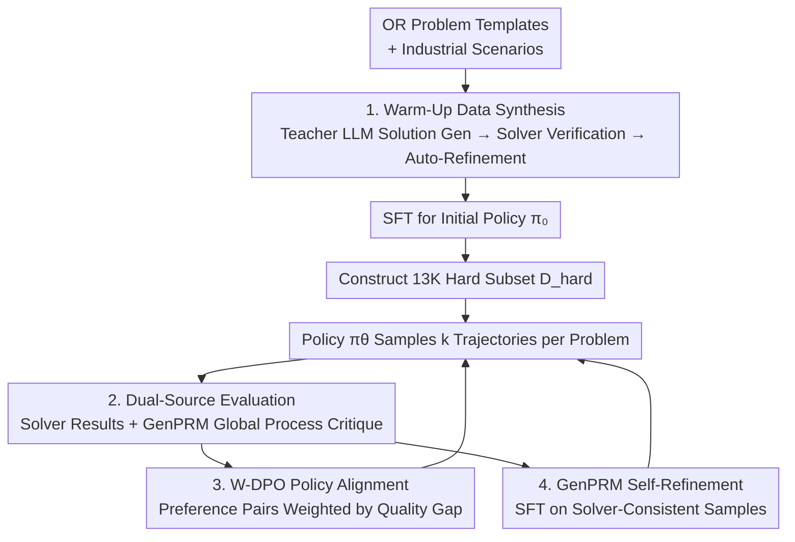

# StepORLM: A Self-Evolving Framework with Generative Process Supervision for Operations Research Language Models

**Conference**: ICLR 2026  
**OpenReview**: [https://openreview.net/forum?id=ZrgxU8WMmG](https://openreview.net/forum?id=ZrgxU8WMmG)  
**Code**: https://github.com/0xzhouchenyu/StepORLM (Available)  
**Area**: LLM Reasoning  
**Keywords**: Operations Research, Generative Process Reward, Self-Evolution, W-DPO, Solver Verification

## TL;DR
StepORLM enables an 8B policy model and a Generative Process Reward Model (GenPRM) to refine each other in a self-evolving loop: each modeling trajectory sampled by the policy receives dual feedback from "solver result verification" and "GenPRM global process critique." The policy is aligned via weighted DPO (W-DPO) and the GenPRM is refined via SFT, achieving SOTA results across six OR benchmarks using a small model. The co-evolved GenPRM also serves as a general-purpose inference-time verifier.

## Background & Motivation
**Background**: Applying LLMs to Operations Research (OR)—translating natural language problems into mathematical programming and executable solver code—primarily follows two paths: building multi-agent agentic pipelines or dedicated reinforcement learning (RL) training. RL approaches are further divided into outcome-based rewards (outcome reward) and step-wise scoring (process supervision).

**Limitations of Prior Work**: Both approaches falter on OR tasks characterized by "long-range, strongly coupled steps." Outcome rewards suffer from a typical **credit assignment problem**: an optimal final answer might be derived from an erroneous reasoning path, leading to the unintended reinforcement of incorrect intermediate steps. Conversely, traditional **discriminative step-wise PRMs are too myopic**: they score each step in isolation. In OR, the validity of a constraint often depends on variable definitions established many steps prior. Consequently, step-wise scoring can produce inconsistent and unreliable rewards.

**Key Challenge**: Steps in OR modeling are context-dependent and interdependent. The "step-wise scoring" paradigm is inherently local and myopic, failing to account for the global consistency of the trajectory. Pure outcome rewards lack intermediate supervision entirely. Neither aligns well with the structure of OR problems.

**Goal**: Design a training paradigm that incorporates both result-level "hard verification" and process-level "global critique," enabling the policy model to acquire dual capabilities: **process rationality + result correctness**.

**Key Insight**: The authors advocate for a shift from "myopic step-wise evaluation" to "holistic trajectory-level process supervision." A critic should review the complete reasoning path and understand inter-step dependencies before distributing credit. This naturally points toward **Generative PRM**: the reward model should first perform chain-of-thought reasoning on the entire trajectory and then generate a holistic critique, rather than outputting isolated local scores.

**Core Idea**: A synergetic self-evolution loop of "Policy Model $\leftrightarrow$ Generative Process Reward Model (GenPRM)," utilizing dual feedback from "solver results + GenPRM process" and W-DPO to ground process supervision in solver feasibility and numerical optimality.

## Method

### Overall Architecture
StepORLM is a two-stage self-evolving training framework. **Phase 1 (Warm-Up)** first synthesizes high-quality OR solutions strictly verified by solvers to train an initial policy $\pi_0$ via SFT. **Phase 2 (Co-Evolution)** initiates a self-evolution loop: the current policy $\pi_\theta$ samples $k$ candidate trajectories for each difficult problem. Each trajectory receives dual feedback: "result verification" from an external solver and "process evaluation" from the GenPRM. This dual feedback is distilled into preference pairs for policy alignment via Weighted DPO (W-DPO) and "solver-consistent" samples for refining the GenPRM via SFT. As the policy improves, it produces better trajectories, which in turn provide higher-quality training data for the GenPRM, making it a sharper critic.

### Key Designs

**1. Warm-Up Data Synthesis & Initial Policy: Cleaning Training Corpora with Solvers**

Self-evolution requires a reasonable starting policy to avoid sampling only low-quality trajectories. The authors built a scalable data synthesis pipeline: using OR templates and industrial scenarios, a teacher model (GPT-4o) pairs compatible templates with scenarios to draft problems $Q$. Data augmentation (rewriting, unit conversion, parameter scaling) is applied. The teacher model then generates multi-step reasoning trajectories $R$, from analysis to solver code. Crucially, **each solution undergoes deterministic verification**: executing code, checking solver status, and verifying objective values. Errors trigger an automated self-refinement loop for correction until verification passes. This ensures the evolution starts from "solver-certified" data.

**2. Dual-Source Evaluation: Integrating "Hard Result Verification" and "Global Process Critique"**

In Phase 2, the policy dynamically samples $k$ trajectories for a hard subset $D_{hard}$ (13K problems where the warm-up policy failed to reach consensus). Evaluation follows two paths: **Result Verification**, where an external solver provides ground-truth "success/failure" labels, and **Process Evaluation**, where GenPRM evaluates the trajectory. Instead of discriminative step-wise scoring, GenPRM **performs chain-of-thought reasoning on the OR solution before generating a retrospective global critique**. This allows it to capture long-range dependencies missed by step-wise verifiers, preventing reward hacking.

**3. W-DPO Policy Alignment: Distilling Dual Feedback into Weighted Preference Signals**

Evaluation results are distilled into preference pairs $(\tau_w, \tau_l, w)$. The selection logic (Algorithm 1) **prioritizes the solver**: if one trajectory is correct and the other is not, the correct one wins ($w=1.0$). If both have the same result outcome, the one with a higher "correct step ratio" as determined by GenPRM wins, with $w=|r(\tau_{pos})-r(\tau_{neg})|$. Training follows the weighted DPO objective:

$$\mathcal{L}_{\text{W-DPO}}(\theta) = -\mathbb{E}_{(x,\tau_w,\tau_l)}\Big[\, w(\tau_w,\tau_l)\cdot \log\sigma\big(\beta(\log\pi_\theta(\tau_w\mid x) - \log\pi_\theta(\tau_l\mid x))\big)\Big]$$

This scalar weighting aggregates fine-grained process feedback into robust trajectory-level signals.

**4. GenPRM Self-Refinement & Co-Evolution: Improving the Critic Parallelly**

To prevent GenPRM from becoming stagnant as the policy improves, it is refined using the same trajectory data. Only **"solver-consistent" trajectories**—samples where GenPRM's judgment aligns with the external solver—are used for SFT of $\rho_\theta$. This creates a positive feedback loop where both the policy and the critic improve iteratively.

## Key Experimental Results

### Main Results
StepORLM (8B) achieved SOTA with an average Pass@1 of **81.4%** across six OR benchmarks (NL4Opt, MAMO-EasyLP/ComplexLP, NLP4LP, ComplexOR, IndustryOR, ReSocratic). Combined with GenPRM as an inference-time verifier (StepORLM+GenPRM), the average reached **85.6%**, with significant gains on complex datasets.

| Model | Parameters | Avg. Pass@1 |
|------|-----------|------------|
| OpenAI o3 | Closed | 80.3 |
| Gemini-2.5-Pro | Closed | 78.9 |
| DeepSeek-V3 | 671B | 75.4 |
| Qwen2.5-72B-Instruct | 72B | 70.7 |
| ORLM (Specialized SFT) | 8B | 65.0 |
| LLMOPT (Specialized SFT) | 14B | 65.7 |
| OptiMUS-v0.3 (Agentic) | Closed | 67.1 |
| **StepORLM** | 8B | **81.4** |
| **StepORLM + GenPRM** | 8B+8B | **85.6** |

### Ablation Study

| Configuration | Avg. Pass@1 | Note |
|------|------------|------|
| StepORLM (Full) | 81.4 | Full framework |
| w/o SFT | 64.6 | Skipping warm-up; most significant drop (-16.8) |
| w/o Self-evolution | 76.4 | Only one DPO round; drop (-5.0) |
| w/o GenPRM Evolution | 77.7 | Frozen initial GenPRM; drop (-3.7) |
| w/o W-DPO | 78.0 | Regular DPO; drop (-3.4) |

### Key Findings
- **Warm-up SFT is the foundation**: Skipping it leads to the largest performance drop, proving a strong initial policy is essential for effective self-evolution.
- **Co-evolution of both components is vital**: Freezing GenPRM or omitting iterations significantly degrades performance.
- **Data Quality > Data Scale**: Training on 3K high-quality warm-up samples outperformed larger sets of lower-quality data.
- **Transferability across backbones**: The pipeline successfully improved a LLaMA-3-8B base model from 16.1% to 82.2%.

## Highlights & Insights
- **Grounded Generative Process Supervision**: Process supervision is successfully grounded in "solver feasibility + numerical optimality," providing a hard bedrock for process rewards.
- **Clever W-DPO Scalar Weighting**: The weighting strategy elegantly folds dual feedback into a trajectory-level scalar, focusing training on high-information preference pairs.
- **GenPRM as a "Free" General Verifier**: The training byproduct (GenPRM) can boost other OR models (e.g., ORLM +10 points), indicating it learns model-agnostic OR reasoning principles.

## Limitations & Future Work
- Dependency on a strong teacher model (GPT-4o) for initial bootstrapping may propagate teacher biases.
- High reliance on external solvers for deterministic results; the framework may not easily transfer to domains without reliable automatic verifiers.
- Non-monotonic performance curves on IndustryOR suggest that self-evolution on small, difficult distributions requires further stabilization.

## Related Work & Insights
- **vs. SIRL (Outcome-driven RL)**: While SIRL relies on sharp solver outcome signals, StepORLM mitigates credit assignment issues by adding global process feedback.
- **vs. Discriminative Step-wise PRM**: StepORLM's generative approach avoids myopic scoring and captures long-range dependencies by reviewing the entire trajectory.
- **vs. rStar-Math / GenPRM**: Unlike frameworks relying on answer-string supervision in math, StepORLM adapts these ideas to the solver-verified OR domain with dual feedback.

## Rating
- Novelty: ⭐⭐⭐⭐⭐ 
- Experimental Thoroughness: ⭐⭐⭐⭐⭐ 
- Writing Quality: ⭐⭐⭐⭐ 
- Value: ⭐⭐⭐⭐⭐ 

<!-- RELATED:START -->

## Related Papers

- [\[ICLR 2026\] OR-PRM: A Process Reward Model for Algorithmic Problem in Operations Research](or-prm_a_process_reward_model_for_algorithmic_problem_in_operations_research.md)
- [\[ICLR 2026\] Smarter Not Harder: Generative Process Evaluation with Intrinsic-Signal Driving and Ability-Adaptive Reward Shaping](smarter_not_harder_generative_process_evaluation_with_intrinsic-signal_driving_a.md)
- [\[ICLR 2026\] Co-rewarding: Stable Self-supervised RL for Eliciting Reasoning in Large Language Models](co-rewarding_stable_self-supervised_rl_for_eliciting_reasoning_in_large_language.md)
- [\[ICLR 2026\] Once-More: Continuous Self-Correction for Large Language Models via Perplexity-Guided Intervention](once-more_continuous_self-correction_for_large_language_models_via_perplexity-gu.md)
- [\[ICLR 2026\] Generative Adversarial Reasoner: Enhancing LLM Reasoning with Adversarial Reinforcement Learning](generative_adversarial_reasoner_enhancing_llm_reasoning_with_adversarial_reinfor.md)

<!-- RELATED:END -->
