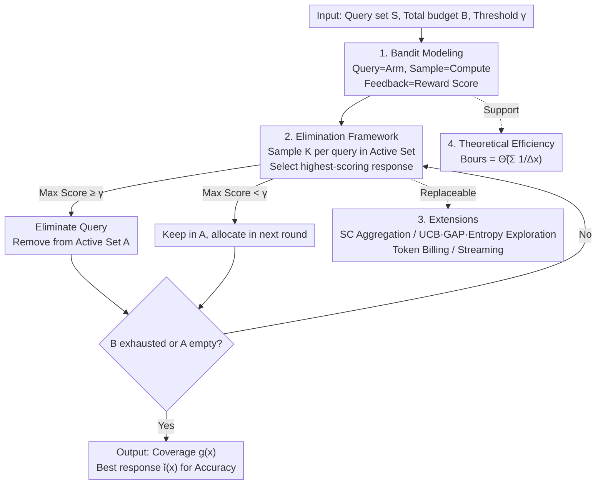

# Strategic Scaling of Test-Time Compute: A Bandit Learning Approach

**Conference**: ICLR 2026  
**OpenReview**: [https://openreview.net/forum?id=0mNnINd2z5](https://openreview.net/forum?id=0mNnINd2z5)  
**Code**: None  
**Area**: LLM Inference  
**Keywords**: Test-time compute, Adaptive allocation, Bandit learning, Pure exploration, Best-of-N

## TL;DR
The authors model "allocating test-time compute budget across a batch of queries" as a fully adaptive pure exploration bandit problem. They propose an elimination algorithm that "estimates difficulty while sampling and eliminates once correct," prioritizing compute for hard problems under a fixed budget. They theoretically prove this is more efficient than uniform allocation, with empirical accuracy gains up to 11% on MATH-500, AIME25, and LiveCodeBench.

## Background & Motivation

**Background**: Test-time compute has emerged as an effective means to improve LLM performance without retraining. Typical approaches include Best-of-N sampling and Self-Consistency—generating multiple responses for the same query and selecting the best using a reward oracle (PRM / ORM / ground-truth verifier). OpenAI o1 reports that repeated sampling on AIME problems 64 times increases accuracy from 74.4% to 83.3% without any parameter updates.

**Limitations of Prior Work**: The vast majority of test-time scaling methods employ **uniform allocation**, assigning the same compute budget $\bar{B}$ to every query. This is wasteful: simple arithmetic and complex multi-step reasoning receive the same number of samples, resulting in compute overflow on easy tasks and insufficient budget for hard ones. Ideally, one should "spend just enough to solve easy tasks confidently and reallocate the saved budget to difficult ones."

**Key Challenge**: To achieve adaptive allocation, one must estimate difficulty and decide where to double down **without prior knowledge of each query's difficulty**—a classic "exploration vs. exploitation" dilemma. Existing adaptive works either schedule compute only **within a single query** or rely on **two-stage** pipelines (training an auxiliary model or performing a pre-run to estimate difficulty), the latter of which still involves uniform allocation in the first stage, leading to high overhead.

**Goal**: To adaptively allocate compute across a batch of queries under a fixed total budget $B$ to maximize the "proportion of correctly answered queries."

**Key Insight**: The authors observe that this problem is naturally isomorphic to **pure exploration** in bandits—treating each query as an "arm" where sampling once consumes one unit of compute for a scored response. However, the objective differs **fundamentally** from classical pure exploration: while the latter aims to identify arms with high expected rewards (corresponding to "finding easy tasks"), the goal here is to **generate at least one correct response per query**, regardless of its expected score.

**Core Idea**: Reformulate test-time compute allocation as a fully adaptive pure exploration bandit problem, using an elimination-based algorithm to flow compute toward queries as needed.

## Method

### Overall Architecture

The method revolves around a simple loop: maintaining an "Active Set" $A$ (queries not yet solved with confidence). In each round, $K$ new responses are generated for every query in $A$ and scored by a reward oracle. Once a query yields a response with a score $\geq \gamma$, it is **eliminated** from $A$ (meaning it is solved and no more compute is wasted), continuing until the total budget $B$ is exhausted or $A$ is empty. Compute naturally flows from "solved easy tasks" to "remaining hard tasks."

The approach comprises four parts: **Bandit modeling** (query=arm, sampling=compute cost, feedback=reward score); the **Elimination framework** (exploration rule + elimination rule); a set of **Extensions** (supporting different aggregation, exploration strategies, token-based billing, and streaming); and **Theoretical efficiency analysis** using a probabilistic model.

### Key Designs

**1. Modeling Test-Time Allocation as Pure Exploration Bandit: Defining "Difficulty-Based Allocation" via Decision Theory**

To address the challenge of "online difficulty estimation," the authors treat each query $x \in S$ as an arm. "Sampling $x$ once" is equivalent to spending one unit of compute to obtain a random response $y$, with the learner receiving a reward score $r(x, y)$. Correctness is defined by a threshold $\gamma \in [0, 1]$: $r(x, y) \geq \gamma$ is considered correct. The objective is to maximize the success ratio under budget $B$:

$$\max_{\{c(x_i)\}} \frac{1}{n} \sum_{i=1}^{n} \mathbb{I}\!\left[\max_{y \in g(x_i; c(x_i))} r(x_i, y) \geq \gamma\right] \quad \text{s.t.} \sum_{i=1}^{n} c(x_i) \leq B$$

A subtle point is that this **departs from classical pure exploration**: standard versions (e.g., thresholding bandits) aim to identify arms with high expected scores ("finding easy tasks"); this work requires **at least one correct response per query**, even if the expected score is low—a query that is generally hard but occasionally solvable is still worth tackling.

**2. Elimination Framework: Using Rules to Transfer Compute from Easy to Hard Tasks**

The framework (Algorithm 1) maintains an active set $A=S$, recording the response set $g(x)$, the historical best response $\check{y}(x)$, and its score $\check{r}(x)$. It proceeds in rounds:

- **Exploration Rule**: Generate $K$ new responses for **every** query $x \in A$, update $g(x)$, and deduct $K$ from the budget.
- **Elimination Rule**: Let $i^\star = \arg\max_{i \in [K]} r(x, y_i)$ be the highest-scoring response of the round. If $r(x, y_{i^\star}) > \check{r}(x)$, update the historical best; if $r(x, y_{i^\star}) \geq \gamma$, remove $x$ from $A$—signaling that the task is solved.

Crucially, this framework uses **exactly the same number of reward oracle calls** as uniform Best-of-N—it achieves gains not through extra verification, but by reallocating compute saved from "early stops."

**3. Modular Extensions: Aggregation, Exploration, Token Billing, and Streaming**

The framework is plug-and-play, offering four extensions:

- **Aggregation**: Replaces the best-of-N rule with **Self-Consistency (SC)**—eliminating a query when a certain percentage of responses converge. This is effective for reasoning models (e.g., Qwen3-4B) and removes PRM dependency.
- **Exploration Rules**: Beyond uniform sampling of $A$, it supports **UCB** (prioritizing high reward + high uncertainty), **GAP** (focusing on queries near threshold $\gamma$), and **Entropy** (selecting queries with diverse response patterns). Entropy is particularly effective on extremely hard sets.
- **Token Billing**: Tracks token usage instead of sample counts, stopping when the token budget is reached.
- **Streaming Queries**: For queries arriving sequentially, the rule focuses on the current $x_t$, using a `max_sample` limit to manage the local exploration-exploitation trade-off.

**4. Theoretical Budget Complexity: Superiority over Uniform and Two-Stage Methods**

The authors model the probability of a correct response as $X \sim \text{Bernoulli}(\Delta_x)$, where smaller $\Delta_x$ denotes higher difficulty. Assuming the reward oracle is aligned with correctness (Assumption 1), they derive the core conclusion (Theorem 1): To solve all queries in $S$ with probability $1-\delta$, this algorithm requires:

$$B_{\text{ours}} = \tilde{\Theta}\!\Big(\sum_{x \in S} \frac{1}{\Delta_x}\Big)$$

Uniform allocation requires $B_{\text{unif}} = \tilde{\Omega}\big(\max_{x \in S} \frac{|S|}{\Delta_x}\big)$. For example, if $|S|=n$ and $\Delta_{x_i}=i/n$, then $B_{\text{ours}}=\tilde{O}(n)$ while $B_{\text{unif}}=\tilde{\Omega}(n^2)$—a factor of $n$ difference. Furthermore, even two-stage Explore-Then-Commit (ETC) methods are limited by their initial uniform stage: $B_{\text{ETC}} = \tilde{\Omega}\big(\sum_{x \in S} \max(m, \frac{1}{\Delta_x})\big)$, incurring a $\Theta(m)$ cost on easy tasks that **Ours** avoids.

## Key Experimental Results

### Main Results

Evaluations were conducted on MATH-500, AIME25, and LiveCodeBench using Llama-3.2-1B/8B, DeepSeek-R1-Distill-Llama-8B, Qwen3-4B, and Gemini-2.5-Flash-Lite. Reward oracles included PRMs, LLM-as-judge, and Ground Truth (GT).

| Dataset / Model | Metric | Budget | Absolute Gain | Relative Gain | Efficiency Gain |
|--------------|------|------|---------|---------|---------|
| MATH-500 / Llama-3.1-8B | Coverage | 8 | +11.10% | 15.04% | 3.93× |
| MATH-500 / Llama-3.2-1B | Coverage | 16 | +10.70% | 17.95% | 2.00× |
| MATH-500 / Llama-3.2-1B | Accuracy | 16 | +2.50% | 7.37% | 1.82× |
| AIME25 / Qwen3-4B | Coverage | 16 | +10.82% | 14.44% | 4.00× |
| LiveCodeBench / DeepSeek-R1-8B | Coverage | 8 | +9.97% | 12.30% | 4.00× |
| LiveCodeBench / Llama-3.1-8B | Coverage | 8 | +7.41% | 14.40% | 3.11× |

Efficiency Gain $k\times$ indicates that uniform allocation requires $k$ times the compute to match the algorithm's performance.

### Ablation Study

| Configuration | Conclusion |
|------|------|
| Variable $K \in \{1,2,4,8\}$ | All outperform Uniform; smaller $K$ allows finer allocation, while larger $K$ approaches uniform under tight budgets. |
| Token Billing | Outperforms Uniform when matching average token budgets on LiveCodeBench. |
| Streaming Version | Similar performance to the full-pool version, outperforming Uniform with full access. |
| MATH-500-Hard-16 | Standard Elimination struggles on unsolvable tasks, but the Entropy rule significantly improves performance. |

### Key Findings
- **"Save on Easy, Spend on Hard"**: On MATH-500, the algorithm significantly reduces compute for easy groups and increases it for hard groups compared to uniform allocation.
- **"Target Solvable, Avoid Unsolvable"**: On extremely hard sets, the Entropy extension prioritizes solvable tasks over those that remain unsolved even after 500 samples.
- **Why Entropy Works**: Unsolvable tasks often produce low-entropy, repetitive, or poorly formatted outputs. Solvable tasks show higher diversity/entropy during sampling, making entropy a viable signal for continued investment.

## Highlights & Insights
- **A Clean Isomorphism**: Mapping test-time compute allocation to pure exploration bandits provides both theoretical tools and a new problem formulation (focusing on "at least one correct" rather than "highest expected reward").
- **Zero Extra Overhead**: The elimination algorithm uses the **exact same** number of reward oracle calls as uniform Best-of-N; gains come solely from redistribution.
- **Theory-Phenomenon Alignment**: The $\tilde{\Theta}(\sum 1/\Delta_x)$ complexity explains why uniform and two-stage methods lag, specifically validating the $\Theta(m)$ overhead analysis for ETC.
- **Transferable Framework**: This "Active Set + Eliminate if Successful" logic is transferable to any "batch task, fixed budget, stop on success" scenario, such as multi-task agent scheduling.

## Limitations & Future Work
- **Dependency on Reward Oracle Accuracy**: Theorem 1 assumes perfect alignment between reward and correctness. While true for GT-verifiable tasks (math/code), PRMs only approximate this.
- **Idealized Difficulty Model**: Modeling success as independent $\text{Bernoulli}(\Delta_x)$ ignores correlations between generated samples and differences in reasoning chain lengths.
- **Threshold $\gamma$ Sensitivity**: The elimination threshold $\gamma$ is critical. Its transferability across datasets and the cost of misconfiguration require more systematic analysis.
- **Base Version Failure on Extreme Tasks**: Elimination fails on tasks where the base model lacks any capability; more sophisticated signals like Entropy are needed.

## Related Work & Insights
- **vs. Uniform Best-of-N / Self-Consistency**: These assign compute blindly; **Ours** adaptively schedules based on difficulty.
- **vs. Two-Stage / ETC (Damani et al., Wang et al.)**: Two-stage methods suffer from uniform exploration in the first stage; **Ours** is fully adaptive and strictly more efficient.
- **vs. Per-Query Scheduling (Sun et al., Manvi et al.)**: Prior works decide how many samples to take for a single query; **Ours** manages budget globally across a batch.
- **vs. Classical Pure Exploration (Bubeck, Jamieson)**: This work adapts bandit tools but modifies the objective to "at least one correct answer per query," creating a new bandit variant.

## Rating
- Novelty: ⭐⭐⭐⭐⭐ Formulates test-time allocation as pure exploration bandit for the first time.
- Experimental Thoroughness: ⭐⭐⭐⭐ Covers various domains, models, and oracles, though more noise-robustness analysis for oracles would be beneficial.
- Writing Quality: ⭐⭐⭐⭐⭐ Logical progression from problem to theory to experiment with strong alignment.
- Value: ⭐⭐⭐⭐⭐ Zero overhead, plug-and-play, with guaranteed theoretical gains for engineering applications.

<!-- RELATED:START -->

## Related Papers

- [\[ICLR 2026\] T1: Tool-Integrated Verification for Test-Time Compute Scaling in Small Language Models](t1_tool-integrated_verification_for_test-time_compute_scaling_in_small_language_.md)
- [\[ICLR 2026\] Zero-Overhead Introspection for Adaptive Test-Time Compute](zero-overhead_introspection_for_adaptive_test-time_compute.md)
- [\[ICLR 2026\] Mode-conditioning unlocks superior test-time compute scaling](mode-conditioning_unlocks_superior_test-time_compute_scaling.md)
- [\[ICLR 2026\] e3: Learning to Explore Enables Extrapolation of Test-Time Compute for LLMs](e3_learning_to_explore_enables_extrapolation_of_test-time_compute_for_llms.md)
- [\[ICLR 2026\] ROC-n-Reroll: How Verifier Imperfection Affects Test-Time Scaling](roc-n-reroll_how_verifier_imperfection_affects_test-time_scaling.md)

<!-- RELATED:END -->
