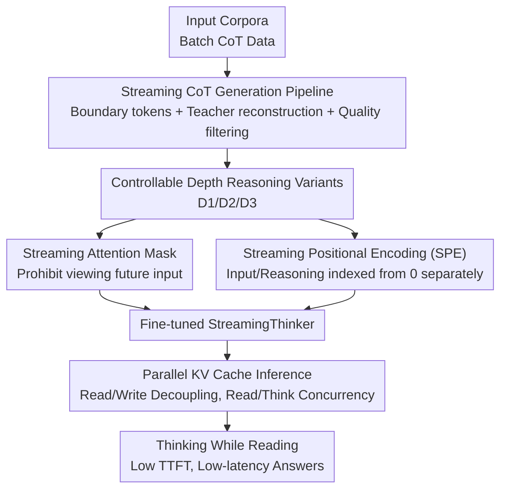

# StreamingThinker: Large Language Models Can Think While Reading

**Conference**: ICLR2026  
**OpenReview**: [https://openreview.net/forum?id=10Iiew095e](https://openreview.net/forum?id=10Iiew095e)  
**Code**: Available (The paper claims open source; see footnote in the original text)  
**Area**: LLM Reasoning  
**Keywords**: Streaming Reasoning, Chain-of-Thought, Attention Mask, Parallel KV cache, Low-latency Inference

## TL;DR
StreamingThinker enables LLMs to "think while reading" similarly to humans—synchronously generating sequentially aligned reasoning segments as input arrives sentence-by-sentence, followed by deepening thoughts after reading as needed. Through a combination of a streaming CoT data construction pipeline, streaming attention mask/positional encoding training, and parallel KV cache inference, it maintains accuracy comparable to traditional "think-after-reading" on mathematics, logic, and context QA, while reducing the waiting tokens before reasoning by approximately 80% and lowering first-answer latency by over 60%.

## Background & Motivation

**Background**: Strong reasoning LLMs, exemplified by OpenAI-o1 and DeepSeek-R1, generally follow a "batch thinking" paradigm—the model must wait until the entire input is received before starting reasoning within `<think>` to provide an answer.

**Limitations of Prior Work**: This "think-after-reading" approach has two major flaws in scenarios requiring real-time response or dynamic information flows. First is **latency**: the longer the input, the longer the pure waiting time before reasoning begins, forcing users to wait. Second is **attention dilution**: as input length increases, the distance between reasoning steps and the truly relevant early context grows, diluting the model's focus on earlier information, which leads to decreased coherence and increased hallucination risk. To compensate, models are often forced to extend CoT or repeatedly self-correct to "re-focus," which in turn drives up token consumption and computational costs.

**Key Challenge**: The batch paradigm forcibly serializes "reading" and "thinking"—reasoning can only start after all input is in place. Consequently, both "low latency" and "strong alignment with early information" are bottlenecked by this serial structure.

**Goal**: To allow LLMs to reason while input is still arriving (reducing waiting latency) and ensure each reasoning step depends only on the currently read content and is tightly aligned with the corresponding input (mitigating attention dilution), while allowing the model to deepen its thinking freely based on question difficulty after reading.

**Key Insight**: The authors draw inspiration from the human cognitive mechanism of "thinking while reading"—humans immediately decode, construct semantics, activate background knowledge, perform integrated reasoning, and actively generate inferences while reading; a global integration is performed after reading to sublimate local shallow understanding into holistic deep understanding. This duality of "local immediate reasoning + global post-processing deepening" corresponds exactly to the balance between latency and quality.

**Core Idea**: Transform "batch thinking" into "streaming thinking"—reasoning unfolds sentence-by-sentence along the input stream, sequentially aligned with the current context. After reading, instruction signals control whether to perform global integration and reflection, truly achieving concurrency between "reading" and "thinking" in both training and inference mechanisms.

## Method

### Overall Architecture

StreamingThinker is a Supervised Fine-Tuning (SFT) framework that transforms originally "batch" LLMs into "streaming thinkers." It addresses three progressive questions: **what data to use to teach the model to think while reading**, **how to train it to force reasoning to only look at read content**, and **how to realize true parallelism between reading and thinking during inference**. These correspond to three modules connected in a pipeline.

The overall workflow is: first, a **streaming CoT generation pipeline** transforms standard batch reasoning data into streaming reasoning trajectories that are "sentence-by-sentence, sequentially aligned, and depth-controllable"; then, a **streaming training framework** (streaming attention mask + streaming positional encoding) is used to fine-tune on this data, forcing each reasoning step to only attend to past and current input and align with corresponding positions; finally, in the **streaming inference** phase, parallel KV caches decouple input encoding and reasoning generation, allowing the model to reason about read content while receiving new sentences. Reasoning depth is categorized into three levels (D1: Direct Answer / D2: Global Integration / D3: Self-Reflection), explicitly controlled by instructions to adjust the latency-quality trade-off based on problem difficulty.

### Key Designs

**1. Streaming CoT Generation Pipeline: Transforming batch reasoning trajectories into sentence-aligned, controllable-depth training data**

Existing strong reasoning datasets consist of batch CoT (reasoning all at once after reading), which lacks the "think-while-reading" form. To teach the model streaming thinking, the authors first construct the data. The pipeline inserts sentence-level **boundary tokens** (sentence-end `<EOS>`, question-end `<EOQ>`) into the input to define "minimum reasoning units." A generation model (Qwen3-32B) is prompted such that upon encountering each `<EOS>`, it generates a sequentially maintained reasoning segment for the preceding sentence only, ending with `<EOT>`. To further strengthen sequential alignment, a larger **teacher model** (Qwen3-235B-A22B-Instruct) reconstructs the generated reasoning.

The resulting trajectories are filtered for quality using two metrics. **Granularity score** measures the sentence-by-sentence alignment, defined as the ratio of input to output boundary tokens: $\text{granularity} = \frac{N_{\text{EOS}}}{N_{\text{EOT}}}$. A value of 1 indicates ideal alignment. **Sequential consistency score** measures whether each reasoning segment truly discusses the corresponding input sentence, using cosine similarity of sentence embeddings: $\text{consistency} = \text{sim}(R_t, C_t) = \frac{v_R \cdot v_C}{\lVert v_R\rVert \lVert v_C\rVert}$, where $v_R, v_C$ are SentenceBERT embeddings of reasoning segment $R_t$ and input sentence $C_t$. Validated samples generate three depth variants using **token-level intervention**; failed samples are re-generated or discarded if Pass@2 fails. This teaches the training set both "sequential alignment" and "controllable depth."

**2. Streaming Attention Mask: Enforcing reasoning constraints at the training level**

A naive approach would be interleaved input and reasoning sentences, but this deviates from LLM pre-training formats and remains serial. The core constraint (from Eq. 1) is that reasoning at step $t$ must not access input arriving after step $t$. Standard masks expose all input to every reasoning step, violating this. The authors inject a causal constraint into the reasoning-to-input attention to block attention from step $t$ to input at positions $>t$, denoted as the streaming mask region:

$$M_{\text{streaming}}(i,j) = M(i,j) + \big(-\infty - M(i,j)\big)\cdot \mathbb{I}\{\,i>T,\ j<T,\ j>i-T+1\,\}$$

where $M$ is the original causal mask, $T$ is the input length, $L$ is the reasoning segment length, and $\mathbb{I}$ is the indicator function. This ensures the model is structurally constrained to reason based only on read content.

**3. Streaming Positional Encoding (SPE): Eliminating positional contention during concurrency**

LLMs use RoPE to rotate queries/keys based on relative positions. In streaming scenarios, output generation and input reception are concurrent; if they share the same position ID space, **positional contention** occurs, disrupting alignment. The authors resolve this by assigning independent position IDs starting from 0 to input and reasoning tokens: setting the position ID of both $R_t$ and $S_t$ to $t$, thus $\text{Attn}(R_t, S_t) = q_R^{\top} R(t-t)\,k_S = q_R^{\top}R(0)k_S$. This eliminates conflicts and naturally keeps each reasoning segment closest to its corresponding input sentence in position.

**4. Parallel KV Cache Inference: Decoupling input encoding and reasoning generation**

To achieve true concurrency, the authors design two parallel caches: a **source cache** for input tokens and a **target cache** for reasoning tokens. Input is written to the source cache sentence-by-sentence as it arrives; before decoding, the two caches are **merged**, allowing reasoning to attend to read input, with new reasoning tokens written to the merged cache. After a segment is processed, they are **split**. This allows source-side prefilling and target-side decoding to occur concurrently—reading a new sentence while reasoning about previously read content.

### Main Results

Latency comparison (Qwen3-4B, where TTFT = input tokens observed before reasoning starts, Delay = time latency for the first answer token, input rate set to human speech of 150 words/min):

| Task/Method | Acc↑ | TTFT↓ | Delay↓(s) |
|--------|------|------|----------|
| GSM-Symbolic / Batch Original | 0.855 | 94.74 | 47.70 |
| GSM-Symbolic / Interleaved D3 | 0.843 | 20.77 | 15.46 |
| GSM-Symbolic / **Streaming D3** | **0.856** | **20.77** | **9.77** |
| ProofWriter / Batch Original | 0.620 | 232.11 | 61.99 |
| ProofWriter / **Streaming D3** | **0.813** | **20.51** | **11.05** |
| HotPotQA / Batch Original | 0.575 | 1485.5 | 20.37 |
| HotPotQA / **Streaming D3** | **0.603** | **24.32** | **6.50** |

Streaming thinking maintains or exceeds batch accuracy while reducing TTFT from hundreds/thousands of tokens to approximately twenty, and lowering first-answer latency to 1/3 ~ 1/6 of the batch baseline.

### Ablation Study

Effect of reasoning depth levels (Qwen3-4B, Acc in batch setting):

| Configuration | GSM-Symbolic | ProofWriter | Description |
|------|---------|---------|------|
| Batch Original | 0.855 | 0.620 | Think-after-reading baseline |
| Batch-S, D1 (SPE) | 0.437 | 0.596 | Local streaming only, fast but coarse |
| Batch-S, D2 (SPE) | 0.871 | 0.795 | Adds global integration, largest gain |
| Batch-S, D3 (SPE) | 0.874 | 0.861 | Adds self-reflection, exceeds batch |

### Key Findings
- **Global integration (D1→D2) provides the highest marginal utility**: The streaming phase performs lightweight incremental reasoning; global integration is necessary to synthesize dispersed information for complex reasoning.
- **Value of SPE is alignment rather than accuracy gain**: While accuracy is similar to RoPE, SPE concentrates attention along the diagonal, proving it "anchors" reasoning to the corresponding context.
- **Input sequence robustness**: Both context-first and question-first orders show consistent trends; question-first is more token-efficient in context QA by skipping irrelevant reasoning.

## Highlights & Insights
- **Translates human "thinking while reading" into an engineering trio**: Quality is managed by granularity/consistency metrics, training uses masks and SPE to prevent "peeking," and parallel KV caches enable true concurrency.
- **Dual-dimension latency measurement**: Evaluating TTFT (token level) and delay (time level) under a 150 words/min human speech rate provides a more realistic perspective for interactive streaming applications than simple throughput.
- **Controllable depth is a clean latency-quality knob**: This paradigm—quickly outputting local results and deepening as needed—is portable to streaming voice QA, real-time translation, and long-document interaction.

## Limitations & Future Work
- **Dependency on strong teacher models**: The pipeline utilizes Qwen3-32B and a 235B teacher for data construction, which might be costly or difficult to replicate in domains without equivalent teacher models.
- **Relies on "input slower than decoding"**: The latency advantage is most pronounced when the bottleneck is input arrival (e.g., streaming voice). For static long documents provided instantly, the advantage diminishes.
- **Local streaming reasoning is shallow**: D1 accuracy is significantly lower than batch accuracy, meaning the quality relies heavily on D2/D3 global post-processing. Improving local reasoning strength is a future direction.

## Related Work & Insights
- **vs. Batch Thinking (o1 / R1 style)**: Those models wait for the entire input, causing high latency and attention dilution; Ours unfolds reasoning along the stream, reducing wait tokens by 80% and latency by 60%+.
- **vs. Naive Interleaved Streaming**: Interleaved approaches often deviate from pre-training distributions and force serial execution; StreamingThinker uses parallel KV caches and SPE for higher accuracy and lower latency.
- **vs. Long CoT / Self-correction**: Those methods combat dilution by increasing token count; Ours mitigates dilution through structural sequential alignment, proving more token-efficient.

## Rating
- Novelty: ⭐⭐⭐⭐⭐ 
- Experimental Thoroughness: ⭐⭐⭐⭐ 
- Writing Quality: ⭐⭐⭐⭐⭐ 
- Value: ⭐⭐⭐⭐

<!-- RELATED:START -->

## Related Papers

- [\[ICLR 2026\] Adaptive Thinking: Large Language Models Know When to Think in Latent Space](adaptive_thinking_large_language_models_know_when_to_think_in_latent_space.md)
- [\[CVPR 2026\] Think-as-You-See: Streaming Chain-of-Thought Reasoning for Large Vision-Language Models](../../CVPR2026/llm_reasoning/think-as-you-see_streaming_chain-of-thought_reasoning_for_large_vision-language_.md)
- [\[ICLR 2026\] Characterizing and Mitigating Reasoning Drift in Large Language Models](characterizing_and_mitigating_reasoning_drift_in_large_language_models.md)
- [\[NeurIPS 2025\] Adaptive Dual Reasoner: Large Reasoning Models Can Think Efficiently by Hybrid Reasoning](../../NeurIPS2025/llm_reasoning/adaptive_dual_reasoner_large_reasoning_models_can_think_efficiently_by_hybrid_re.md)
- [\[ICLR 2026\] A Simple "Motivation" Can Enhance Reinforcement Finetuning of Large Reasoning Models](a_simple_motivation_can_enhance_reinforcement_finetuning_of_large_reasoning_mode.md)

<!-- RELATED:END -->
