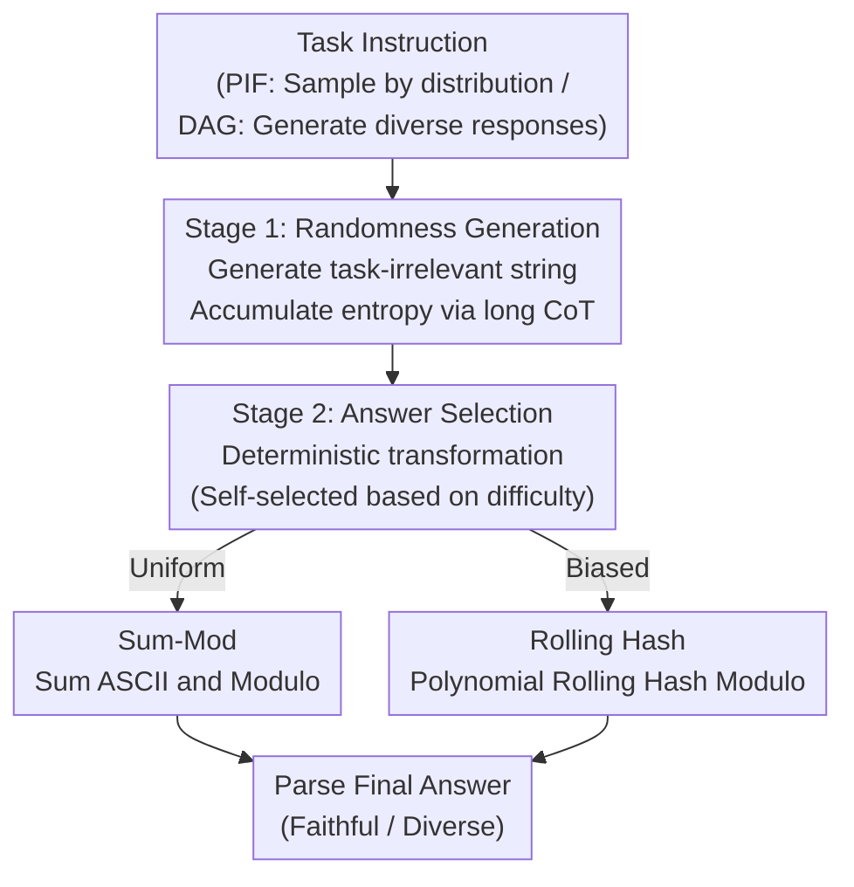

# String Seed of Thought: Prompting LLMs for Distribution-Faithful and Diverse Generation

**Conference**: ICLR 2026  
**arXiv**: [2510.21150](https://arxiv.org/abs/2510.21150)  
**Code**: None  
**Area**: LLM Reasoning  
**Keywords**: prompting, probabilistic instruction following, diversity, LLM reasoning, randomness

## TL;DR

This paper proposes String Seed of Thought (SSoT), a concise prompting method where LLMs first generate a random string and then extract randomness to select an answer. It significantly improves distribution faithfulness in Probabilistic Instruction Following (PIF) and response diversity in Diverse Answer Generation (DAG). Theoretically, the TV distance decays exponentially with string length, and experiments show that reasoning-heavy LLMs perform close to pseudo-random number generators.

## Background & Motivation

1.  **Systematic bias in LLM probabilistic choices**: While LLMs excel at deterministic single-answer tasks, they perform poorly when required to select answers according to a specific distribution. For instance, simulating a fair coin toss often results in a skewed distribution rather than a 50-50 split.
2.  **Diverse applications require probabilistic behavior**: Scenarios such as human behavior simulation, content diversification, and mixed strategies in game theory (e.g., Nash equilibrium in Rock-Paper-Scissors) require the empirical distribution of LLM outputs to align with a target distribution.
3.  **Response diversity is critical for test-time scaling**: Generating numerous candidates to select an optimal solution is a core strategy for test-time scaling, but LLM outputs often collapse into a limited set of answers, restricting candidate diversity.
4.  **Limited efficacy of existing debiasing methods**: Increasing temperature, few-shot examples, or prompt ensemble techniques can alleviate bias but remain unstable for skewed distributions and often require task-specific tuning.
5.  **Gap between describing and sampling**: Research shows LLMs can accurately describe a probability distribution but fail to sample from it accurately, representing a "know but cannot do" gap.
6.  **Opportunities in reasoning LLMs**: Reasoning models like DeepSeek-R1 and QwQ-32B possess long chains-of-thought (CoT), providing the possibility of generating sufficient entropy sources during reasoning.

## Method

### Overall Architecture

SSoT requires no training or external tools, adding a two-stage instruction to the prompt: first, the LLM generates a task-irrelevant random string as an entropy source (Stage 1), and then it performs a deterministic operation (Sum-Mod, Hashing) to "translate" entropy into a final answer (Stage 2). The task type only changes the goal of the second stage—PIF instructions focus on "sampling from a target distribution," while DAG focuses on "generating a diverse response." Specific transformations and string lengths are decided by the model within its CoT, with the result extracted from the `<answer>` tag.

### Key Designs

**1. Two-Stage Prompting: Decoupling Randomness and Selection**

Directly asking an LLM to "flip a coin" triggers priors related to option position or training frequency, leading to bias. SSoT forces the model to write a random string first—an action unrelated to the specific choice that avoids selection bias while accumulating entropy through long CoT. Stage 2 extracts the answer via a fixed arithmetic transformation. Since the source (string) and destination (transformation result) are decoupled, the model cannot easily manipulate the choice toward training preferences. 

This enables parallel sampling as each response depends only on its own generated string, unlike sequential sampling which requires historical choice logs and increases prompt length.

**2. Theoretical Convergence: Exponential Decay of TV Distance**

Theorem 4.1 utilizes 2-universal hashing: assuming the conditional probability of each character in the generated string is bounded ($\delta \leq P(x_i|\{x_j\}_{j<i}) \leq 1-(A-1)\delta$), the Total Variation (TV) distance between the sampled and target distributions satisfies:

$$d_{TV} \leq \frac{\sqrt{M}}{2\delta''} 2^{-\frac{n}{2}\log_2 \frac{1}{(1-(A-1)\delta)^2+(A-1)\delta^2}} + \sqrt{\frac{\ln((2^M-2)/\delta')}{K\phi(\pi_{P_X})}}$$

The first term decays exponentially with string length $n$, and the second term represents finite-sample error for $K$ samples. Theorem 4.2 shows that even for simple Sum-Mod operations ($\sum_j \text{ord}(x_j)\bmod M$), TV distance converges exponentially if marginal distributions are not extremely biased.

**3. Autonomous Strategy Selection**

Analysis of CoT (using Gemini-2.5-flash to classify 600 responses) reveals that models adaptively choose transformations: Sum-Mod for uniform tasks, polynomial rolling hashes ($\sum_i B^i\,\text{ord}(c_i)$) for biased tasks to cancel marginal character bias, and "template + bitwise sampling" for creative DAG categories. This adaptability allows a unified instruction to work across diverse tasks without task-specific tuning.

## Main Results

### PIF Performance: Evaluation of 5 SOTA LLMs

| Model | Method | 2-choice | Biased 2-choice | 3-choice | Biased 3-choice | Biased 9-choice |
|------|------|:-:|:-:|:-:|:-:|:-:|
| deepseek-v3 | Baseline | 5.97 | 111.45 | 136.03 | 117.28 | 297.33 |
| deepseek-v3 | **SSoT** | **2.91** (↓51%) | **3.54** (↓97%) | **15.33** (↓89%) | **15.65** (↓87%) | **44.90** (↓85%) |
| deepseek-r1 | Baseline | 36.09 | 69.58 | 106.30 | 49.53 | 138.21 |
| deepseek-r1 | **SSoT** | **3.03** (↓92%) | **1.51** (↓98%) | **4.98** (↓95%) | **4.30** (↓91%) | **18.06** (↓87%) |
| QwQ-32B | **SSoT** | 3.39 | **2.47** (↓98%) | **1.82** (↓98%) | **1.30** (↓99%) | **11.48** (↓96%) |
| PRNG (Ideal) | — | 1.85 | 1.93 | 3.36 | 2.85 | 13.72 |

(JS Divergence ×10³, lower is better)

**Key Finding**: JS divergence for DeepSeek-R1 and QwQ-32B using SSoT approaches that of a Pseudo-Random Number Generator (PRNG). QwQ-32B even outperformed the PRNG baseline in the Biased 3-choice setting (1.30 vs 2.85).

### DAG Performance & Competitive Games

| Method | NoveltyBench Overall (Distinct / Utility) |
|------|:-:|
| Baseline | 4.70 / 5.17 |
| Paraphrase | 5.63 / 5.57 |
| T=1.0 | 5.57 / 6.03 |
| **SSoT** | **6.19** / 5.92 |

SSoT achieved the highest Distinct score (6.19). In Rock-Paper-Scissors experiments against 10 "Black-belt" bots, SSoT allowed LLMs to approach an average score of zero (indicating a Nash equilibrium mixed strategy), whereas Baseline prompts were systematically defeated.

### CoT Scaling Analysis

Budget forcing experiments show:
- As the number of thinking tokens increases, integer generation uniformity significantly improves (JS divergence decreases).
- Even at $T=0$ (greedy decoding), longer reasoning chains generate strings with higher Lempel-Ziv complexity and zlib compression ratios.

## Highlights & Insights

-   **Extreme Simplicity**: Dramatically improves probabilistic behavior with a single prompt instruction without training or external tools.
-   **Theoretical-Practical Unity**: Rigorous proof of TV distance convergence aligns closely with experimental results.
-   **Autonomous Strategy**: LLMs can autonomously "invent" appropriate randomness extraction strategies based on task complexity.
-   **Reasoning Scaling Law**: Demonstrates that PIF performance scales with CoT length, providing a new dimension for understanding reasoning models.

## Limitations & Future Work

-   **Dependency on Reasoning**: Smaller models (e.g., <8B) may fail to execute modulo or hashing operations correctly.
-   **Bias Propagation**: If a "lazy" model only uses the first character of a string with positional bias, the output distribution remains skewed.
-   **Single-Answer Tasks**: SSoT is not intended for deterministic tasks like math or fact retrieval, where it might distract the model.
-   **Inference Overhead**: Generating strings and performing arithmetic increases CoT length and cost.

## Related Work & Insights

### vs. Prompt Ensemble
Prompt Ensemble uses 50 paraphrased prompts and randomized option orders to reduce position bias. While effective for uniform PIF, it degrades on biased distributions. SSoT maintains near-PRNG performance in both uniform and biased settings.

### vs. Few-shot Examples
Few-shot methods provide $k$ samples from the target distribution. Performance drops rapidly as the number of actions increases, whereas SSoT maintains a low JS divergence across a range of 2 to 64 options.

### vs. Sequential Sampling
Sequential sampling appends history to the prompt, which breaks independence and prevents parallelization. SSoT allows for independent, parallel generation with high faithfulness.

## Rating

-   ⭐⭐⭐⭐⭐ Novelty: The concept of generating random strings to extract randomness via CoT is highly creative.
-   ⭐⭐⭐⭐ Technical Quality: Rigorous theoretical analysis supported by extensive experiments across 5 models.
-   ⭐⭐⭐⭐ Utility: Zero-cost deployment suitable for gaming, simulation, and diversification.
-   ⭐⭐⭐⭐ Writing Quality: Clear structure with a logical flow from theory to CoT strategy analysis.

<!-- RELATED:START -->

## Related Papers

- [\[AAAI 2026\] Intention Chain-of-Thought Prompting with Dynamic Routing for Code Generation](../../AAAI2026/llm_reasoning/intention_chain-of-thought_prompting_with_dynamic_routing_for_code_generation.md)
- [\[ICLR 2026\] Expanding Reasoning Potential in Foundation Model by Learning Diverse Chains of Thought Patterns](expanding_reasoning_potential_in_foundation_model_by_learning_diverse_chains_of_.md)
- [\[ICLR 2026\] ProofFlow: A Dependency Graph Approach to Faithful Proof Autoformalization](proofflow_a_dependency_graph_approach_to_faithful_proof_autoformalization.md)
- [\[ECCV 2024\] Controllable Navigation Instruction Generation with Chain of Thought Prompting](../../ECCV2024/llm_reasoning/controllable_navigation_instruction_generation_with_chain_of_thought_prompting.md)
- [\[ICLR 2026\] Reasoning Scaffolding: Distilling the Flow of Thought from LLMs](reasoning_scaffolding_distilling_the_flow_of_thought_from_llms.md)

<!-- RELATED:END -->
