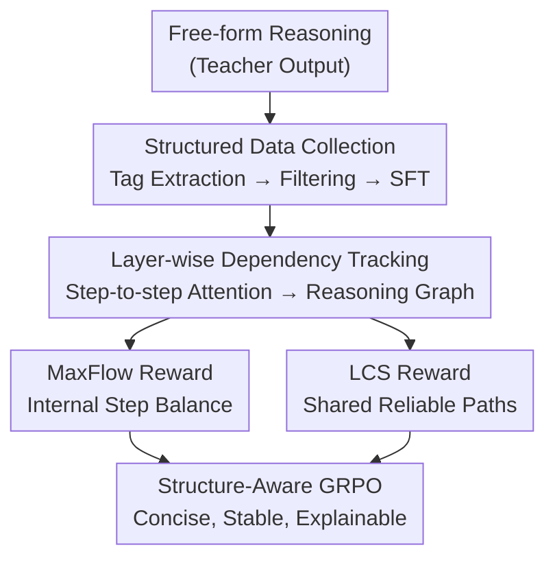

# Structured Reasoning for LLMs: A Unified Framework for Efficiency and Explainability

**Conference**: ICLR 2026  
**OpenReview**: [https://openreview.net/forum?id=TIu1RM84P0](https://openreview.net/forum?id=TIu1RM84P0)  
**Code**: Project page Structured-Reasoning (GitHub link not provided in the paper)  
**Area**: LLM Reasoning  
**Keywords**: Structured Reasoning, Reasoning Graph, MaxFlow Reward, LCS Reward, GRPO

## TL;DR
This paper explicitly decomposes the LLM reasoning process into labeled "steps" and models them as a directed graph. By extending GRPO with two structure-aware algorithms—"MaxFlow Reward" and "Longest Common Subsequence (LCS) Reward"—it enables DeepSeek-R1-Distill-Qwen-1.5B/7B to achieve more concise, stable, and explainable reasoning within shorter contexts, surpassing tuned baselines such as GRPO.

## Background & Motivation

**Background**: The current mainstream approach to enhancing LLM reasoning capabilities is Reinforcement Learning (GRPO and its variants), which relies on token-level probabilistic relationships to perform long CoT. Most "efficient reasoning" works follow strategies such as length penalties, token budgets, or pruning steps based on perplexity.

**Limitations of Prior Work**: The authors identify three specific flaws in existing reasoning paradigms: (i) redundant and verbose content, (ii) unstable performance (results fluctuate with sampling temperature), and (iii) unexplainable and un-auditable internal reasoning logic. These issues directly impact the safety, controllability, and trustworthiness of LLMs in practical applications.

**Key Challenge**: The root cause is that existing methods optimize at the token probability level, lacking an explicit characterization of the "dependency structure between reasoning steps." Consequently, the optimization target is misplaced—length penalties reduce word count regardless of logic, and perplexity cannot accurately reflect the importance of a step to the final answer.

**Goal**: Elevate optimization from the "token sequence" level to the "reasoning step graph structure" level, simultaneously achieving three objectives: more efficient reasoning (better scores with fewer steps), higher stability (lower variance across temperatures), and better explainability (visible step dependencies).

**Key Insight**: Inspired by Dual-Process Theory in cognitive science and neuro-symbolic AI, the authors view reasoning as a single-source single-sink flow diffusion process from the "question step" to the "answer step." High-quality reasoning corresponds to a sparse graph with balanced contributions from each step; redundant, repetitive, or meaningless steps are ignored by the answer step, manifesting as weak connections to the sink. Thus, "optimizing redundant reasoning" is transformed into the mathematically tractable problem of "optimizing reasoning graph structure."

**Core Idea**: First, use tags to segment free-form reasoning into discrete steps and construct structured data for fine-tuning. Then, treat inter-step attention as graph edges and employ two structure-aware rewards—MaxFlow (internal balance within a single graph) and LCS (consensus across multiple graphs)—to perform reinforcement learning.

## Method

### Overall Architecture

The system is a three-stage pipeline operating on "labeled reasoning steps" rather than raw tokens. The first stage, **Structured Data Collection**, uses a teacher model (DeepSeek-R1) to segment free-form reasoning into high-frequency, cross-domain step labels (e.g., `rephrase`, `inference`, `verify`), filters them into a refined structured dataset, and fine-tunes a model $\theta_{struct}$ that generates structured reasoning. The second stage, **Layer-wise Inter-step Dependency Tracking**, aggregates the attention tensors of a model layer based on the token indices of each step to calculate an $n \times n$ step-to-step attention matrix $\mathcal{A}$, serving as the edge weights for the directed reasoning graph—this step also reveals that intermediate layers play a critical role in integrating global reasoning context. The third stage, **Structure-Aware Reinforcement Learning**, adds two complementary rewards on top of GRPO: MaxFlow evaluates whether step contributions within a single graph are balanced, while LCS identifies reliable reasoning paths shared across multiple sampled responses.

### Key Designs

**1. Structured Reasoning Data Collection: Segmenting Free Text into Parsable Labeled Steps**

Small models struggle to reliably segment free-form reasoning into discrete steps, hindering any "step-based optimization." The authors first use a teacher model $T$ (DeepSeek-R1) to generate raw reasoning $r_{raw}$ and answers $a$ for a question set $Q_0$. A self-summarization prompt then compresses this reasoning into a linear chain of labels $l = (l_1 \to \cdots \to l_m)$. High-frequency labels are retained, synonyms merged, and domain-specific tags removed to derive a cross-domain core label set $P$. Subsequently, a set of labels $\pi \in P$ is sampled for each question, and $T$ generates the corresponding labeled reasoning. A filtering function $F(q,\pi,r,a)$ verifies answer correctness and reasoning difficulty, keeping only samples with $F=0$ to form $D_{struct}$. The final fine-tuning objective is to enable the model to generate structured reasoning and answers under the guidance of a structured prompt $I$: $\theta_{struct} = \prod_{(q,r,a) \in D_{struct}} P(r,a \mid q, I)$. The dataset is intentionally "tiny but high-quality," driven by quality rather than scale to cold-start the structured capability.

**2. Layer-wise Inter-step Dependency Tracking: Representing Reasoning as a Graph via Attention**

To optimize reasoning as a graph, edges must be defined. Given an attention tensor $\mathcal{A} \in \mathbb{R}^{H \times L_{seq} \times L_{seq}}$ from a specific layer, the authors aggregate values based on the token interval $T_k = [s_k^{start}, s_k^{end}]$ of each step to obtain a normalized step-to-step attention matrix:

$$\mathcal{A}_{ij} = \frac{1}{H T_i} \sum_{h=1}^{H} \sum_{a \in T_i} \max_{b \in T_j} A_{h,a,b}.$$

This captures how much step $i$ depends on step $j$. This matrix provides the edge weights for the directed reasoning graph. The computational complexity is $O(B \times H \times n^2 \times T_{avg})$, managed by vectorized reduction and timely buffer release. The paper validates that this matrix captures true reasoning dependencies using the Entailment Trees dataset, proving it is not a spurious correlation.

**3. MaxFlow Reward: Measuring Step Contribution Balance via Maximum Flow**

A scalar reward is needed to distinguish "good graphs" from "redundant graphs." The insight is that in an ideal reasoning chain, removing any step should break the flow, meaning each step's contribution is roughly equal. Redundant steps contribute minimally to the sink. The graph is set as single-source (Step 1 = Question) and single-sink (Step $n$ = Answer), with a sparse skeleton formed by edges where $\mathcal{A}_{ij} > \tau$ ($\tau=0.05$). The total maximum flow $F$ is calculated, followed by recalculating $F_{-k}$ after removing each intermediate node $k$. The importance is quantified as $\Delta F_k = F - F_{-k}$. Taking the top 25% most important steps $K_{top}$, reasoning quality is defined as:

$$Q = 1 - \frac{\sum_{k \in K_{top}} \Delta F_k}{\sum_{j=0}^{n-1} \Delta F_j} \in [0,1].$$

A higher $Q$ indicates dispersed importance without any single dominant step, representing balanced, non-redundant reasoning. The final reward is $r_{maxflow} = Q$ (if the answer is correct), otherwise $-1$. This addresses the failure of perplexity in evaluating step importance by directly reading causal contributions from the graph structure. Practically, an optimized Dinic algorithm with residual network reuse is used to reduce complexity from $O(n^4)$ to an empirical $O(n^{2.5})$, achieving a 7.41× speedup.

**4. LCS Reward: Identifying Reliable Paths via Longest Common Subsequence**

While MaxFlow looks at individual graphs, the LCS reward leverages consensus across multiple samplings. Given a set of sampled responses $R=\{r_1,\dots,r_n\}$, the longest common subsequence $LCS(r_i, r_j)$ of reasoning labels is calculated for each pair. Continuous steps shared across multiple answers are treated as reliable paths. To prevent "length cheating" (intentionally lengthening steps to inflate scores), a length suppression factor $ratio_k$ is introduced for each matching step (if $\ell_{i,k} > \ell_{j,k}$, it is $\frac{\ell_{j,k}}{2\ell_{i,k}}$, otherwise $1 - \frac{\ell_{i,k}}{2\ell_{j,k}}$). The weighted length is $L_{lcs} = \sum_k ratio_k \cdot \ell_{i,k}$. Pairwise scores are assigned based on correctness: both correct $\frac{L_{lcs}}{L_i}$, both incorrect $-\frac{L_{lcs}}{L_i}$, $r_i$ correct while $r_j$ incorrect $1-\frac{L_{lcs}}{L_i}$, and vice versa $-1+\frac{L_{lcs}}{L_i}$. This encourages the model to align with correct answers and deviate from incorrect ones. The final reward is $r_{lcs}(c_i) = \frac{1}{n-1}\sum_{j \neq i} Score_{lcs}(c_i, c_j)$.

## Key Experimental Results

The base models are DeepSeek-R1-Distill-Qwen-1.5B and 7B. Structured fine-tuning uses 500 high-quality samples from the S1 dataset, and the RL stage uses DeepScaleR (40K math problems). Evaluation covers 9 benchmarks (AIME24/25, AMC, MATH500, Minerva, Olympiad, DROP, LSAT-AR, MMLU-ALL), reporting Pass@1 across various maximum response lengths (0.5k–8k).

### Main Results (1.5B, Average Score)

| Max Length | GRPO | Ours (LCS) | Ours (MaxFlow) |
|----------|------|-----------|---------------|
| 1K | 21.58 | **24.28** | 22.19 |
| 2K | 32.33 | **33.79** | 32.78 |
| 4K | 39.28 | 40.50 | **41.68** |
| 8K | 43.28 | 44.19 | **48.89** |

At 8K length, the MaxFlow version achieves an average score of 48.89, significantly outperforming GRPO (43.28) and matching or exceeding the specialized baseline DeepScaleR (48.14). At shorter lengths (1K), the LCS version is superior (24.28 vs. GRPO 21.58), indicating that structured optimization is particularly effective at producing concise reasoning under tight budgets.

### 7B Results and Attention-Dependency Alignment

| Configuration | 1K Avg. | 2K Avg. |
|------|---------|---------|
| GRPO (7B) | 29.19 | 43.36 |
| Ours (LCS, 7B) | **35.06** | **47.34** |
| Ours (MaxFlow, 7B) | 32.32 | 43.36+ |

| Attention-Dependency Alignment (Entailment Trees) | Avg. Alignment | Win Rate |
|----------------------|-----------|------|
| Shuffled Task 1 | 28.48% | 5.50% |
| Structured Task 1 | **71.27%** | **97.15%** |
| Shuffled Task 2 (with distractors) | 24.87% | 4.71% |
| Structured Task 2 | **72.27%** | **95.29%** |

Shuffling the step order causes the alignment to plummet from ~71% to ~28%, with the structured version winning nearly every case (>95%). This provides strong evidence that the step-to-step attention matrix captures real reasoning dependencies rather than coincidental correlations.

### Key Findings
- **MaxFlow excels in long-context efficiency**: At 8K length, it shows the largest Gains (1.5B: 43.28→48.89), as longer reasoning contains more redundant steps where the MaxFlow balance signal is most effective.
- **LCS excels in short budgets and smaller models**: LCS is stronger at 1K/2K lengths and for the 7B model at 1K, as consensus helps lock in reliable skeletons when step counts are limited.
- **Stability**: Within the temperature range 0.1–1.0 at a fixed 8K length, the proposed method shows lower variance in accuracy, meaning it is more stable across different temperatures.
- **Explainability (IISR Experiment)**: By injecting clearly irrelevant steps and comparing the efficiency of error filtering, MaxFlow outperforms top-p/top-k backtracking, average step perplexity, and random selection when removing 1–11 irrelevant steps.

## Highlights & Insights
- **Redefining "Efficient Reasoning" as "Optimizing Sparse Reasoning Graphs"**: This is the most elegant contribution—moving away from proxy metrics like length penalties or perplexity to a graph-theoretic characterization of "good reasoning" (balanced flow contributions).
- **MaxFlow Sensitivity as Causal Importance**: Using $\Delta F_k = F - F_{-k}$ to measure flow loss after removing a step is equivalent to a causal ablation, providing a measure closer to actual step necessity than statistical metrics like perplexity.
- **Clever LCS Sign Design**: The use of correctness combinations to determine reward signs encourages convergence toward correct consensus while penalizing deviations, and the length suppression factor effectively prevents gaming the reward by writing longer steps.
- **The "Attention as Dependency" Hypothesis is Hard-Validated**: The shuffle experiment (71% to 28% drop) provides empirical grounding for using attention as a proxy for reasoning dependencies, a technique applicable to other explainability research.

## Limitations & Future Work
- **Strong Dependency on Teacher Models and Attention Availability**: Data collection requires DeepSeek-R1 as a teacher, and dependency tracking requires access to internal model attention tensors, making it inapplicable to black-box API models.
- **Sensitivity to Step Granularity**: The method relies on reliably segmenting reasoning into discrete labeled steps; high segmentation noise would distort the graph and rewards.
- **Dominance of Math/STEM Domains**: RL uses DeepScaleR math data, and benchmarks are biased toward math and logic; performance in open-ended generation or long-term planning is unknown.
- **MaxFlow Computational Cost**: Despite optimization to $O(n^{2.5})$, it remains an additional overhead during training for exceptionally long reasoning chains ($n$ large).

## Related Work & Insights
- **vs. GRPO**: GRPO performs RL at the token/sequence level using group relative advantage; this work overlays structure-aware rewards, shifting optimization from token probability to the reasoning graph.
- **vs. Length Penalty / Token Budget (L1, O1-Pruner, DAST, THINKPRUNE)**: While those methods directly penalize length to control cost, this work rewards "graph balance + consensus." Conciseness is a byproduct of structural optimization rather than a hard constraint, avoiding the sacrifice of logic for brevity.
- **vs. Perplexity-based Efficient CoT**: The authors demonstrate that perplexity fails to accurately assess step importance and show via IISR experiments that MaxFlow is a superior measure for filtering erroneous steps.

## Rating
- Novelty: ⭐⭐⭐⭐⭐ Modeling reasoning as a flow graph with MaxFlow+LCS rewards for GRPO is a fresh and self-consistent perspective.
- Experimental Thoroughness: ⭐⭐⭐⭐ Extensive testing across 9 benchmarks, 5 lengths, and 2 model sizes, plus alignment and IISR validation; however, it is biased toward the math domain.
- Writing Quality: ⭐⭐⭐⭐ The three-stage pipeline is clearly explained, with motivations well-aligned with the formulas.
- Value: ⭐⭐⭐⭐⭐ Simultaneously improves efficiency, stability, and explainability with hard evidence for the latter; high practical utility.

<!-- RELATED:START -->

## Related Papers

- [\[ICLR 2026\] Unleashing Scientific Reasoning for Bio-Experimental Protocol Generation via Structured Component-based Reward Mechanism](unleashing_scientific_reasoning_for_bio-experimental_protocol_generation_via_str.md)
- [\[ICLR 2026\] A State-Transition Framework for Efficient LLM Reasoning](a_state-transition_framework_for_efficient_llm_reasoning.md)
- [\[ICLR 2026\] Enhancing Language Model Reasoning with Structured Multi-Level Modeling](enhancing_language_model_reasoning_with_structured_multi-level_modeling.md)
- [\[ICML 2026\] FloorplanQA: A Benchmark for Spatial Reasoning in LLMs Using Structured Representations](../../ICML2026/llm_reasoning/floorplanqa_a_benchmark_for_spatial_reasoning_in_llms_using_structured_represent.md)
- [\[ICLR 2026\] Emergent Hierarchical Reasoning in LLMs through Reinforcement Learning](emergent_hierarchical_reasoning_in_llms_through_reinforcement_learning.md)

<!-- RELATED:END -->
