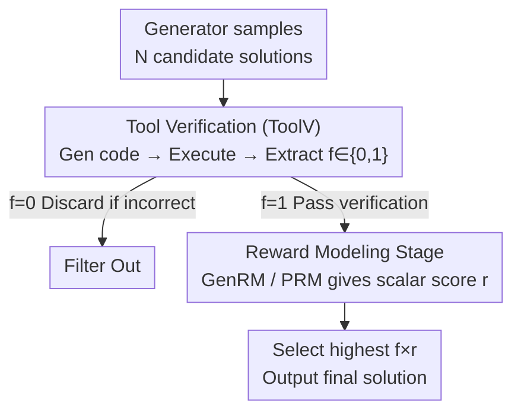

# T1: Tool-Integrated Verification for Test-Time Compute Scaling in Small Language Models

**Conference**: ICLR 2026  
**OpenReview**: [https://openreview.net/forum?id=tBkLWfmugI](https://openreview.net/forum?id=tBkLWfmugI)  
**Area**: LLM Inference  
**Keywords**: Test-time compute scaling, Small Language Models, Verifier, Tool use, Best-of-N

## TL;DR
When small models serve as verifiers in test-time scaling, they often misjudge due to an inability to memorize arithmetic or facts. T1 introduces a two-stage verification process: first, an external tool like a code interpreter filters out candidates with calculation errors; then, a reward model scores the remaining ones. By outsourcing memory-intensive tasks to tools, Llama-3.2-1B outperforms Llama-3.1-8B on the MATH dataset.

## Background & Motivation
**Background**: Test-time compute scaling is a popular strategy to enhance Small Language Models (sLMs). A typical approach is best-of-N: a generator samples $N$ candidate solutions, and a verifier scores each solution to select the one with the highest score. Existing work shows that with a large verifier, 3B small models can approach or even exceed 405B models on benchmarks like MATH/AIME.

**Limitations of Prior Work**: However, this scheme usually requires verifiers to be large models (e.g., PRM, critic models, or GenRM). If verification still relies on large models, the advantages of sLMs—low memory footprint and reduced cost—are negated. Can sLMs perform verification themselves? The authors conducted a proof-of-concept experiment: letting Llama-1B/3B verify whether the sum of $N$ three-digit numbers is correct. They found the 1B model's accuracy plummeted as $N$ increased, while the 3B model remained stable—even knowledge distillation from larger verifiers could not fix this.

**Key Challenge**: The root cause of sLM verification failure is not a lack of "reasoning" but rather **limited parameter capacity to memorize all facts required for verification** (e.g., arithmetic tables, factual knowledge). Verifying whether "$237+321=556$" is correct requires the model to correctly compute that step internally, and small models fail exactly at these memorization-heavy steps.

**Goal**: To enable sLMs to achieve verification reliability close to that of large verifiers without increasing parameters or relying on larger models, thereby supporting test-time scaling.

**Key Insight**: The proof-of-concept experiment had a second half—once the 1B model was allowed to generate and execute code, its verification accuracy at large $N$ almost equalled that of large models. This suggests that **outsourcing memory-intensive steps** like arithmetic or fact-checking to external tools can bypass the capacity bottleneck of sLMs. Tools are not just "helpful"; they are "necessary" for sLM verification.

**Core Idea**: Decompose verification into two stages: first, use external tools (code interpreters, retrievers) to hard-filter candidates with calculation or factual errors; then, let the sLM provide a semantic score for the remaining candidates. Memory-intensive tasks are handled by tools, while logical judgments remain with the small model.

## Method

### Overall Architecture
T1 (Tool-integrated Verification) is a two-stage verification workflow built on best-of-N test-time scaling. The input consists of $N$ candidate solutions sampled by a generator for the same problem, and the output is the selected final solution. The core mechanism replaces the "single verifier scoring" step with a multiplicative gating of "tool hard-filtering + reward model soft-scoring":

$$y^* = \arg\max_{y \in \{y_1,\dots,y_N\}} f(x, y; \mathcal{T}, \theta) \times r(x, y; \theta)$$

Where $f(x,y;\mathcal{T},\theta) \in \{0,1\}$ is the tool verification function (0 indicates the candidate is filtered out), $\mathcal{T}$ represents the tools used (e.g., code interpreter, retriever), and $r(x,y;\theta)$ is the scalar score from the reward model. This multiplication is crucial: as long as the tool judges a solution as incorrect ($f=0$), the score becomes zero regardless of how high the reward model ranks it; only solutions passing tool verification are ranked. Both stages can be further enhanced using distillation from large verifiers.

### Key Designs

**1. Two-stage Multiplicative Gating: Hard-filtering followed by Soft-scoring**

This addresses the pain point where a single sLM verifier conflates "correct calculation" with "coherent reasoning," often assigning high scores to solutions with incorrect final answers due to failures in memory-intensive arithmetic checks. T1 decouples these by assigning the tool verifier (ToolV) to check factual/numerical correctness, outputting a binary $f \in \{0,1\}$. The reward model (GenRM or PRM) then evaluates overall logical consistency and coherence only within the filtered candidates, outputting a continuous score $r$. Ranking by $f \times r$ is equivalent to "veto first, then select the best." This design is **universal for both generative verifiers and process reward models**—ToolV can be wrapped around either GenRM or PRM. The multiplicative gate ensures that solutions rejected by the tool are never selected.

**2. ToolV Verification Stage: Query Generation → Execution → Extraction**

This is where T1 outsources the memory burden. Instead of asking the sLM to directly answer "True/False," ToolV follows an executable process. The tool verification function is split into three parts: the sLM generates a tool-call query $c_1$ based on the problem and candidate (e.g., translating a calculation into Python code); $c_1$ is fed into the tool to get $\mathcal{T}(c_1)$ (the actual result from the code interpreter); finally, the sLM extracts the decision $c_2$ by comparing the candidate with the execution result:

$$f(x, y; \mathcal{T}, \theta) = c_2 \sim \pi\big(c \mid \mathcal{T}(c_1), x, y, I_f; \theta\big), \quad c_1 \sim \pi(c \mid x, y, I_c; \theta)$$

Where $I_c$ and $I_f$ are task-specific instructions. Crucially, determining the result of "$237+321$" no longer depends on the sLM's internal arithmetic table but on the code interpreter. The sLM only needs to "write the calculation as code" and "interpret the execution result," neither of which is memory-intensive. This mechanism can extend to factual verification using a retriever.

**3. Multi-LoRA Verifier Distillation: Specialized Adapters for Both Stages**

With zero-shot prompting, sLMs struggle to write reliable verification code or provide accurate scores. T1 uses distillation from large teacher models to enhance both stages. Since writing tool queries and scoring involve different tasks, a multi-LoRA approach is adopted: separate adapters $\Delta\theta_{\text{tool}}$ and $\Delta\theta_{\text{reward}}$ are used for ToolV and RM, respectively. The ToolV distillation objective encourages the student to mirror the teacher's tool-checking trajectories:

$$\mathcal{L}_{\text{tool}}(\Delta\theta_{\text{tool}}) = -\mathbb{E}\,\log \pi(c \mid t, x, y, I; \theta + \Delta\theta_{\text{tool}})$$

Where $c \in \{c_{1}, c_{2}\}$ and $t$ is the tool execution result. For the reward side, $\mathcal{L}_{\text{reward}}$ involves sampling responses from the student's distribution, obtaining verification labels from the teacher, and fine-tuning the student. GPT-4o-mini is used for GenRM trajectories, while Qwen2.5-Math-PRM-7B is used for the PRM stage. This allows a single sLM backbone to switch between "coding for verification" and "scoring" roles by swapping LoRAs.

**4. Theoretical Guarantee: Outsourcing Memory and Monotonicity of Filtering**

This section justifies why outsourcing to tools is effective. In a toy task of verifying "$a+b=c$", the authors prove that without tools, any near-optimal algorithm requires the amount of information stored in parameters $\theta$ to be $I(X;\theta\mid P) = \Omega(M^3)$ (where $M$ is the magnitude of numbers), indicating a cubic explosion in required memory (Lemma 5.1). With tool access $\mathcal{T}$, since the answer is provided independently, $I(X;\theta\mid P) = 0$ (Theorem 5.2)—the memory requirement is eliminated. Another theorem proves that treating ToolV as a filter increases the verifier's hit probability $p$ on correct solutions, and the probability of selecting a correct answer in best-of-N, $\pi_N(1\mid x)$, is monotonically increasing with $p$ (Theorem 5.3). Thus, filtering wrong solutions is guaranteed to improve test-time scaling.

## Key Experimental Results

### Main Results
Evaluation Setup: Weighted best-of-N on MATH500 and GSM8K, with $N=64$ candidates. Both PRM and GenRM-CoT verifiers were tested. sLMs included the smallest instruct versions from various families: Qwen2.5-0.5B, Llama-3.2-1B, and the tiny SmolLM2-360M.

| Configuration | Dataset | Key Finding |
| :--- | :--- | :--- |
| Distilled PRM + ToolV | MATH500 | Llama-3.2-1B outperforms Llama-3.1-8B; Qwen2.5-0.5B with N=16 matches 1.5B |
| Distilled GenRM + ToolV | MATH500 | Universal improvement for all sLMs; tools filter arithmetic errors that GenRM misses |
| Distilled GenRM + ToolV | GSM8K | Effective across the board; the weakest SmolLM2-360M shows largest gain; gains smaller on easy tasks |
| vs. Themis | MATH (Llama-1B) | Both ToolV+GenRM and ToolV+PRM outperform the existing Themis tool-augmentation approach |

### Ablation Study

| Configuration / Analysis | Key Metrics | Observation |
| :--- | :--- | :--- |
| Zero-shot GenRM | Lowest | Small models barely verify without distillation |
| Distilled GenRM/PRM | Medium | Still hampered by numerical errors after distillation |
| + ToolV (Full T1) | Highest | Tool filtering catches arithmetic errors that reward models cannot |
| ToolV Scope (Difficulty) | Level 2–4 stable gains, Level 5 drop | Tools are less helpful for the hardest reasoning problems |
| ToolV Scope (Category) | Algebra/Number Theory/Counting surge, Geometry drop | Calculation-intensive domains benefit most |
| Scaling GenRM (1B to 8B) | ToolV always adds gain | "1B GenRM + ToolV" outperforms "8B GenRM" on MATH |

### Key Findings
- **Tool filtering is the primary source of gain**: By removing incorrect solutions from $N=64$ candidates, ToolV shifts the distribution of correct solutions to the right, significantly improving best-of-N accuracy—validating the "monotonicity of filtering" theory.
- **Small Verifier + Tools > Large Verifier**: Even when GenRM is scaled, ToolV consistently adds value. Specifically, 1B+ToolV exceeds 8B GenRM, suggesting that for tasks like MATH, adding tool support is more cost-effective than simply increasing verifier parameters (especially for VRAM savings).
- **Controllable Computing Overhead**: Average tokens per problem: Generator 574.39, GenRM 4431.11, ToolV code 610.84. ToolV's overhead is only roughly equivalent to using a 1.14x larger verifier ($k = (5616.34-574.39)/4431.11 = 1.14$). Even when normalized by computational budget (Figure 10), ToolV remains superior, particularly for SmolLM2-360M and large $N$ scenarios.

## Highlights & Insights
- **Rediagnosing "Verification" as a "Memory Problem" rather than a "Reasoning Problem"**: The authors' proof-of-concept (1B model fails at multi-digit addition as $N$ grows while 3B is stable) precisely identifies that sLM verification is bottlenecked by memory capacity. This framing is much deeper than simply saying "small models are weak."
- **Elegant Multiplicative Gating (Binary Filtering × Continuous Scoring)**: Using $f \times r$ cleanly combines "hard constraints" (factual correctness) with "soft preferences" (logical quality). This interface is naturally compatible with both PRM and GenRM, providing a reusable design for any "prune then select" scenario.
- **Theory-Experiment Alignment**: The memory bound $\Omega(M^3)\to 0$ and the filtering monotonicity theorem explain "why tools are necessary" and "why filtering is a win," providing more than just empirical results.
- **Transferability**: The strategy of outsourcing memory-intensive steps to verifiable tools can be generalized beyond math—such as using retrieval for fact-checking or calling calculators/unit converters/calendars for any sub-task where tools are deterministic and sLMs are fallible.

## Limitations & Future Work
- **Limited help for the hardest and non-computational problems**: ToolV performance drops on Level 5 problems and Geometry. Tools verify numbers but cannot assist with complex spatial reasoning that lacks arithmetic steps.
- **Assumption of "Known and Available Tools"**: The method assumes the required tool $\mathcal{T}$ is explicitly known (e.g., using a code interpreter). It does not address tool selection or robustness when tools are unavailable.
- **Token Overhead**: While only 1.14x the verifier cost, ToolV adds a round of code generation and execution, which may be a factor in extreme low-latency scenarios. The GenRM overhead of 4431 tokens is also non-negligible.
- **Primary Validation on Math**: Knowledge-intensive tasks (MMLU-Pro subset) were only briefly explored in the appendix. The reliability of retrieval-based tool verification in more open domains requires further study.

## Related Work & Insights
- **vs. Large Verifier Approach (PRM / GenRM / critic, 7B+)**: While others scale parameters for reliability, this work shows that a 1B verifier + tool filtering can surpass 8B models on hard tasks, establishing "tools" as a new dimension for test-time scaling.
- **vs. Themis (Tool-augmented Reward Modeling)**: Themis uses a unified tool-augmented reward framework for 7B models. T1 focuses on smaller models and math reasoning using a decoupled "filter + score" two-stage approach, outperforming Themis empirically.
- **vs. Program-Aided Language Models (PAL / Toolformer, etc.)**: Previous works used tools during the **generation/reasoning** phase (calling code to find the answer). T1 uses tools in the **verification** phase to check the correctness of candidate solutions and formalizes tool use as a dimension of test-time compute.

## Rating
- Novelty: ⭐⭐⭐⭐ Moving tools from "assistant generation" to "verification filtering" and providing a clean theoretical motivation via memory bounds is a fresh perspective.
- Experimental Thoroughness: ⭐⭐⭐⭐ Extensive multi-model/multi-dataset testing, breakdown by difficulty/category, and cost normalization, though tasks are math-heavy.
- Writing Quality: ⭐⭐⭐⭐ Clear logic, using the proof-of-concept to identify the problem and aligning theory with experiments.
- Value: ⭐⭐⭐⭐ Provides a practical, VRAM-efficient solution for "sLM self-verification" in resource-constrained environments.

<!-- RELATED:START -->

## Related Papers

- [\[ICLR 2026\] Efficient Test-Time Scaling for Small Vision-Language Models](efficient_test-time_scaling_for_small_vision-language_models.md)
- [\[ICLR 2026\] Strategic Scaling of Test-Time Compute: A Bandit Learning Approach](strategic_scaling_of_test-time_compute_a_bandit_learning_approach.md)
- [\[ICLR 2026\] ROC-n-Reroll: How Verifier Imperfection Affects Test-Time Scaling](roc-n-reroll_how_verifier_imperfection_affects_test-time_scaling.md)
- [\[ICLR 2026\] Zero-Overhead Introspection for Adaptive Test-Time Compute](zero-overhead_introspection_for_adaptive_test-time_compute.md)
- [\[ICLR 2026\] Mode-conditioning unlocks superior test-time compute scaling](mode-conditioning_unlocks_superior_test-time_compute_scaling.md)

<!-- RELATED:END -->
