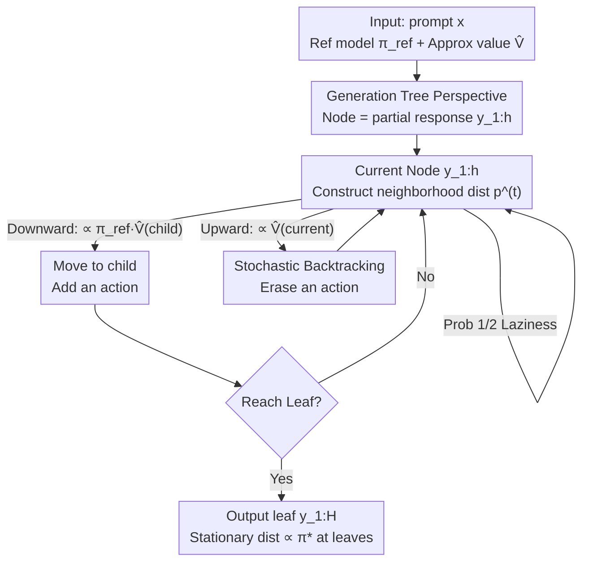

# Taming Imperfect Process Verifiers: A Sampling Perspective on Backtracking

**Conference**: ICLR 2026  
**OpenReview**: [https://openreview.net/forum?id=MFDkLbcydi](https://openreview.net/forum?id=MFDkLbcydi)  
**Code**: Available (included in paper supplementary material)  
**Area**: LLM Inference  
**Keywords**: Process Verifiers, Test-time Alignment, Stochastic Backtracking, Markov Chain Sampling, Error Amplification

## TL;DR
This work reinterprets "guiding language models with process verifiers" as a "random walk on a generation tree" and introduces probabilistic **backtracking** (occasionally erasing generated tokens). This approach provably avoids the amplification of estimation errors over the generation length, even when the verifier (value function) is imperfect, consistently outperforming action-level sampling without backtracking across various distributional fidelity metrics.

## Background & Motivation

**Background**: Combining the generative capabilities of language models with "verifiers" via test-time algorithms has become a mainstream approach for enhancing reasoning. The simplest method is best-of-N (selecting the highest-scoring complete response), while more powerful methods utilize **process verifiers**—which evaluate **partial generations** (prefixes $y_{1:h}$) to provide step-by-step guidance. A principled class of process verifiers is the **value function** $V^\star_{\text{tilt}}(x, y_{1:h}) := \mathbb{E}_{\pi_{\text{ref}}}[\tau(x, y_{1:H}) \mid y_{1:h}]$, representing the conditional expectation of the final reward under the reference model $\pi_{\text{ref}}$ given a prefix. With the true $V^\star_{\text{tilt}}$, test-time alignment (sampling from the tilted distribution $\pi^\star(y\mid x) \propto \pi_{\text{ref}}(y\mid x)\cdot \tau(x,y)$) can be solved accurately and efficiently through action-level rejection sampling (ActionLevelRS).

**Limitations of Prior Work**: There is no free lunch—the true value function is computationally intractable. In practice, researchers use a **learned value function** $\widehat V$ regressed from Monte Carlo rollouts, which inevitably contains errors (inductive bias, optimization bottlenecks, finite samples). The issue is that even seemingly "harmless" errors are **gradually amplified** by ActionLevelRS during long-sequence generation, leading to catastrophic failure. The paper provides two counterexamples: ① A small perturbation $(1+\varepsilon_V)$ on a single action can result in a Total Variation distance of $\Omega(\min(\varepsilon_V\sqrt H, 1))$ from the target; ② Even without "perturbations," simply delaying the true value by one step ($\widehat V(y_{1:h}) := V^\star_{\text{tilt}}(y_{1:h-1})$) causes ActionLevelRS to degrade into uniform sampling from $\pi_{\text{ref}}$ because $\widehat V$ does not depend on the current action $y_h$, incurring $\Omega(1)$ KL-regularized regret.

**Key Challenge**: The random walk in action-level sampling **only moves down the tree**. Once a systematic bias is introduced at any step due to noisy values, there is no mechanism to correct it—this is a concrete manifestation of the well-known "horizon curse" (amplification of learning errors over time) in generative contexts. However, the "delay counterexample" reveals a glimmer of hope: while $\widehat V(x, y_{1:h})$ cannot guide the **choice** of $y_h$, it can judge whether the **previous step** $y_{h-1}$ was good—information can, in fact, flow backward.

**Goal**: Establish a concrete error model for "imperfect process verifiers" and design a test-time sampling algorithm that **provably mitigates error amplification**, ensuring that errors do not degrade with the generation length $H$.

**Key Insight**: The authors connect this problem to the classic toolbox of approximate sampling in theoretical computer science—specifically the Sinclair-Jerrum random walk (1989), originally used to prove that "approximate counting can be reduced to approximate sampling" without amplifying errors. Since the value function is a generalization of the "counting oracle" in this context, this machinery allows the implementation of heuristic "backtracking" (erasing tokens) as a **mathematically rigorous** step.

**Core Idea**: Add an edge to the action-level random walk that "backtracks to the parent node with a certain probability." This ensures the stationary distribution of the walk on the leaves is exactly proportional to $\pi^\star$, even if the internal node value estimates are erroneous.

## Method

### Overall Architecture

All possible responses to a prompt $x$ are organized into an exponentially large tree $\mathcal{T}$: nodes are partial responses $y_{1:h}$, $y_{1:h-1}$ is the parent of $y_{1:h}$, and leaves are complete responses $y_{1:H}$. All guided generation algorithms can be viewed as random walks from the root $\varnothing$ to a leaf. ActionLevelRS only moves **downward**: at $y_{1:h}$, the probability of selecting child $(y_{1:h}, y_{h+1})$ is proportional to $\pi_{\text{ref}}(y_{h+1}\mid x, y_{1:h})\,\widehat V(x, y_{1:h}, y_{h+1})$.

VGB (Value-Guided sampling with stochastic Backtracking) introduces a "one-line change": in the neighborhood $N(y_{1:h})$ of every node, it includes the **parent node** $y_{1:h-1}$ as a candidate alongside all children. The probability of backtracking to the parent is proportional to $\widehat V(x, y_{1:h})$. At each step, it stays in place with probability $1/2$ (laziness, ensuring the existence of a stationary distribution); otherwise, it samples the next node from this neighborhood distribution $p^{(t)}$. The entire walk is a lazy, reversible Markov chain whose stationary distribution $\widetilde\pi$ is proportional to $\pi^\star$ on the leaves. By allowing the chain to mix and then reading the leaf, one obtains an approximate target sample. This generalizes the Sinclair-Jerrum walk from "uniform $\pi_{\text{ref}}$ + binary $\tau$" to "general reference model + general value function."

### Key Designs

**1. Tree Random Walk + Probabilistic Backtracking: Adding a return edge to "downward-only" sampling**

The root cause of error amplification in ActionLevelRS is the unidirectional nature of its random walk. Once biased by noisy values, there is no way back. The core operation of VGB is to include the **parent node** in the transition neighborhood of each internal node $y_{1:h}$, defining the distribution:

$$p^{(t)}(y_{1:h-1}) \propto \widehat V(x, y_{1:h}), \qquad p^{(t)}(y_{1:h}, y_{h+1}) \propto \pi_{\text{ref}}(y_{h+1}\mid x, y_{1:h})\,\widehat V(x, y_{1:h}, y_{h+1}),$$

Then, with $1/2$ probability, it remains stationary (laziness); otherwise, it samples the next node from $p^{(t)}$. Moving to the parent node semantically means **erasing the action just generated**, formalizing various heuristic backtracking methods into a mathematically grounded framework. The backtracking weight is exactly the current node's value $\widehat V(x, y_{1:h})$, making the chain reversible. As hinted by the delay counterexample, when the value of a prefix is low, the walk tends to backtrack and re-select, automatically correcting errors rather than crystallizing them.

**2. Generalization of Sinclair-Jerrum Walk: Using the approximate counting toolbox to guarantee distribution correctness**

This backtracking chain is a generalization of the Sinclair-Jerrum random walk (1989), which was designed to reduce approximate sampling to approximate counting for self-reducible problems like SAT without repeating earlier reduction errors. The authors' conceptual insight is that **the value function is the counterpart to the counting oracle in test-time alignment**—$V^\star_{\text{tilt}}$ measures the (weighted) mass of valid complete responses reachable from a prefix, corresponding to the number of satisfying solutions in a sub-problem. Under Assumption 4.1 (multiplicative error of $\widehat V$ relative to truth is consistently bounded by $1+\varepsilon_V$ at each internal node, and $\widehat V(x,y_{1:H})=\tau(x,y_{1:H})$ at leaves), VGB inherits three properties: ① Fast mixing to $\widetilde\pi$; ② $\widetilde\pi$ places $\Omega(1/H)$ mass on leaves; ③ As long as exact rewards are used at the ends, $\widetilde\pi$ is proportional to $\pi^\star$ on the leaves. This means **even if internal node values are erroneous, the target distribution on leaves remains accurate**—errors are absorbed by the backtracking mechanism instead of accumulating along $H$.

**3. Two-layer Theoretical Guarantees: Relaxing from worst-case consistent error to average-case error**

The paper provides two levels of guarantees. **Strong Tier (Theorem 4.1, Pointwise Error)**: Under Assumption 4.1, with step count $T = \widetilde O\big(H^2(1+\varepsilon_V)^4\log(1/\delta)\big)$, VGB outputs a leaf with probability $\geq 1/(8(1+\varepsilon_V)H)$, and conditioned on the leaf event $E_{\text{leaf}}$, $D_{\text{TV}}(\widehat\pi|_{E_{\text{leaf}}}, \pi^\star)\leq\delta$. This corresponds to a regret $J_\beta(\pi^\star) - J_\beta(\widehat\pi|_{E_{\text{leaf}}})\leq\beta\delta$ in the KL-regularized setting. Since the counterexamples satisfy $\varepsilon_V = O(1)$, VGB no longer amplifies errors on them. It also avoids the dependence on sequence-level coverage coefficients $C_{\text{seq}}(x)$ (which can be exponential in $H$) required by OutcomeLevelRS, paying only $\widetilde O(H^3)$ total time.

However, consistent multiplicative error is often too harsh for value functions learned via Monte Carlo regression. Thus, a **Weak Tier (Theorem 4.2, Average-case Error)** is provided: relaxing the assumption to the expectation of the error ratio under $\pi^\star$ being bounded by $1+\varepsilon_V$ ($\mathbb{E}_{y_{1:h}\sim\pi^\star}[\widehat V/V^\star_{\text{tilt}}]\leq 1+\varepsilon_V$ and its reciprocal), and **no longer requiring knowledge of $\tau$**. Here, instead of direct approximation, a **coverage** guarantee for typical responses from $\pi^\star$ is given: with high probability $\Pr_{y_{1:H}\sim\pi^\star}\big[\pi^\star(y_{1:H})/\widehat\pi(y_{1:H}) > 48H(1+\varepsilon_V)^2/\delta\big]\leq\delta$. The analytical challenge here is that global conductance fails; the authors utilize modern tools for analyzing slow-mixing Markov chains—**local stationarity/local mixing** (Liu et al. 2024b)—to bridge the gap between "standard average-case guarantees in statistical learning" and "consistent guarantees traditionally required in approximate sampling."

### A Complete Example

Intuition from the delay counterexample (Example 3.2): action space $A=\{0,1\}$, uniform $\pi_{\text{ref}}$, reward $r^\star = \frac1H\sum_h y_h$, and truth $\widehat V$ is delayed by one step, so $\widehat V(y_{1:h})$ is independent of the current $y_h$. ActionLevelRS fails to read any signal for "selecting 0 or 1" at each step, resulting in uniform sampling with a $1$ ratio near $1/2$, incurring $\Omega(1)$ regret. In VGB, if the walk just selected $y_1=0$ (a "bad" action): at node $y_{1:1}$, the probability of backtracking to the parent is proportional to $\widehat V(x, y_{1:1})$. Since this value reflects whether the "previous step was good," bad prefixes have a lower tendency to push forward and a higher tendency to be re-sampled. The walk will likely erase this $0$, return to the root, and try again—information is successfully transformed from "cannot decide the next step" to "should backtrack this step," utilizing delayed feedback.

## Key Experimental Results

Experiments focus on **constrained sampling** ($\tau:=r^\star$ as a binary reward). The value function is a regressed MLP (using one-hot for small $|A|$, pooled hidden states of a pre-trained LM for large $|A|$) from Monte Carlo rollouts.

### Main Results

| Task | Base Model / Setting | Baseline | VGB Performance |
|------|----------------------|----------|-----------------|
| ABC (Synthetic, Example 3.1) | Analytical $\pi_{\text{ref}}$, trained $\widehat V$ | ActionLevelRS | Lower KL divergence; advantage grows with $H$ (Fig 2) |
| Parity (Synthetic, Delay) | Difficult parity learned at specific positions | ActionLevelRS | Shorter wall-clock to find reward-1; better scaling with $H$ (Fig 6) |
| Dyck Grammar | Transformer trained from scratch | Block Best-of-N / Block Rejection | Robustly superior on the Accuracy ↔ Diversity Pareto front (Fig 1) |
| Code (Valid Python test cases) | Qwen-2.5-0.5B | ActionLevelRS | Case length distribution significantly closer to $\pi^\star$ (Table 3) |
| Letter avoidance (Sentences w/o 'e') | Qwen-2.5-0.5B, $\widehat V(y_{1:h})=\alpha^{H-h}r^\star$ | Constrained Decoding (=ActionLevelRS) | Superior coherence win-rate and log-prob across broad $\alpha$ (Fig 3) |

On the ABC task with varying training samples $N\in\{500, 1000, 10000\}$ and horizons $H\in\{6,8,10\}$: VGB's KL divergence is systematically lower than ActionLevelRS, with the gap widening as $N$ decreases and $H$ increases—confirming that backtracking resists long-range error amplification from limited samples.

### Ablation Study

| Config / Variable | Key Metric | Description |
|-------------------|------------|-------------|
| Dyck: block $\in\{1..16\}$, candidates $\in\{2..32\}$ | Accuracy / # Unique Correct | VGB Pareto frontier dominates baseline configurations under equal query budgets |
| Letter avoidance: Backtrack weight $\alpha\in[0.1,0.5]$ | GPT-4o-mini win-rate; Qwen-1.5B log-prob | $\alpha$ controls backtracking probability; VGB outperforms ActionLevelRS across entire range |
| Value training epochs (Dyck OOD) | $\ell_1$ dist error | VGB maintains lower $\ell_1$ error than ActionLevelRS after initial epochs and is more query-efficient than OutcomeLevelRS |

### Key Findings
- **Advantage Grows with Horizon**: The benefits of VGB over ActionLevelRS become more pronounced as $H$ increases and $\widehat V$ becomes less accurate, directly supporting the theoretical claim of avoiding error accumulation.
- **Computational Cost**: Backtracking requires more steps to reach a leaf, taking roughly $\widetilde O(H^3)$ time—a trade-off of "extra compute for robustness."
- **Robustness to $\alpha$**: In the letter avoidance task, although $\alpha$ should intuitively reflect the failure probability of $\pi_{\text{ref}}$, VGB remains superior to constrained decoding over the entire $[0.1, 0.5]$ range, showing that the mechanism is not sensitive to hyperparameters.
- **Zero-training Utility**: In constrained text generation, using the reward itself as a weak value function ($\widehat V\propto r^\star$) allows VGB to run without training, yielding more coherent text than standard constrained decoding.

## Highlights & Insights
- **Elegance of "One-line Change"**: VGB simply adds the parent node to the transition neighborhood, yet this turns a unidirectional walk into a reversible chain, eliminating error amplification at its root—a simple enough fix to replace existing pipelines.
- **Cross-domain Transfer Paradigm**: Connecting LLM guided generation to "approximate counting ↔ sampling" theory identifies value functions as counterparts to counting oracles, opening the door for more Markov chain analysis tools (conductance, local mixing).
- **Honest Differentiation of Error Types**: Distinguishes between Pointwise Error (leads to precise $\pi^\star$ approximation) and Average Error (leads to coverage guarantees)—this stratified approach is more informative than vague claims of "robustness."
- **Portable Trick**: Positioning "sampling rather than pure search/maximization" as a more robust framework for utilizing imperfect verifiers is a transferable insight for any test-time algorithm.

## Limitations & Future Work
- **High Computational Overhead**: Generating one leaf takes $\widetilde O(H^3)$ time; the wall-clock cost of backtracking is non-negligible for long sequences. Optimization of the polynomial dependence on $H$ remains preliminary.
- **Leaf Event Dependence**: Strong guarantees are conditioned on the walk stopping at a leaf, requiring $\widetilde O(H)$ restarts. Large $|A|$ scenarios are not fully analyzed in the weak guarantee tier.
- **Average Error Only Gives Coverage**: Theorem 4.2 does not directly imply low KL-regularized regret. Converting coverage to useful "unregularized regret" requires an additional best-of-N layer, making the end-to-end guarantee chain complex.
- **Controlled Experiments**: Primary results are on synthetic tasks and small models; efficacy on large-scale real-world reasoning tasks (math/code) remains to be verified.

## Related Work & Insights
- **vs. ActionLevelRS / Constrained Decoding (Scholak et al. 2021)**: These are unidirectional samplers where verifier errors amplify over length; VGB's stationary distribution is proportional to $\pi^\star$.
- **vs. Block Best-of-N / Beam search (Wang et al. 2025)**: These use parallel candidates or greedy search which still fail under error; VGB uses sequential backtracking for robustness.
- **vs. OutcomeLevelRS**: The latter is exact but scales with sequence-level coverage $C_{\text{seq}}(x)$ (potentially exponential); VGB only depends on action-level coverage $C_{\text{act}}(x)$.
- **vs. Sinclair-Jerrum walk (1989)**: The original was limited to uniform $\pi_{\text{ref}}$ and binary rewards; VGB generalizes this to LLM contexts and provides average-case guarantees using local mixing.

## Rating
- Novelty: ⭐⭐⭐⭐⭐ Connecting test-time alignment to counting/sampling theory is highly original.
- Experimental Thoroughness: ⭐⭐⭐⭐ Strong correspondence between theory and results, though model scale is small.
- Writing Quality: ⭐⭐⭐⭐⭐ Excellent drive from counterexamples to tiered guarantees.
- Value: ⭐⭐⭐⭐ Provides a theoretically grounded paradigm for robust generation with imperfect verifiers.

<!-- RELATED:START -->

## Related Papers

- [\[ICLR 2026\] Reinforcing General Reasoning without Verifiers](reinforcing_general_reasoning_without_verifiers.md)
- [\[ICLR 2026\] Beyond Speedup - Utilizing KV Cache for Sampling and Reasoning](beyond_speedup_-_utilizing_kv_cache_for_sampling_and_reasoning.md)
- [\[ICLR 2026\] Reasoning with Sampling: Your Base Model is Smarter Than You Think](reasoning_with_sampling_your_base_model_is_smarter_than_you_think.md)
- [\[ICLR 2026\] Dynamics-Predictive Sampling for Active RL Finetuning of Large Reasoning Models](dynamics-predictive_sampling_for_active_rl_finetuning_of_large_reasoning_models.md)
- [\[ICLR 2026\] Process-Verified Reinforcement Learning for Theorem Proving via Lean](process-verified_reinforcement_learning_for_theorem_proving_via_lean.md)

<!-- RELATED:END -->
