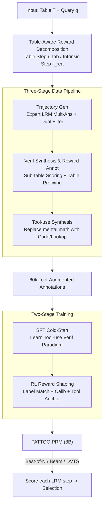

# TATTOO: Tool-Grounded Thinking PRM for Test-Time Scaling in Tabular Reasoning

**Conference**: ICLR 2026  
**OpenReview**: [https://openreview.net/forum?id=zc1ezBrr5m](https://openreview.net/forum?id=zc1ezBrr5m)  
**Code**: None  
**Area**: LLM Reasoning  
**Keywords**: Process Reward Model, Test-time Scaling, Tabular Reasoning, Tool Integration, Reward Shaping

## TL;DR
Aiming at the blind spots of general PRMs in tabular reasoning—specifically the inability to distinguish sub-table retrieval accuracy and the failure to capture long-distance schema dependencies—this paper proposes TATTOO. It is a generative PRM that decomposes rewards into "table operation rewards + intrinsic reasoning rewards" and invokes actual code/table-lookup tools during verification. Using 60k tool-augmented annotations for SFT cold-start followed by RL reward shaping, it improves downstream policy models by an average of 30.9% across 5 tabular reasoning benchmarks with only 8B parameters, surpassing the 72B Qwen2.5-Math-PRM.

## Background & Motivation
**Background**: Process Reward Models (PRMs) have become a core component of Test-Time Scaling (TTS). They score each step of a reasoning trajectory $r_i = R_\theta(a_i \mid T, q, \tau_{<i})$, aggregate them into a trajectory reward $r_\tau$, and work with strategies like Best-of-N, Beam Search, and DVTS to select or resample candidate answers. This paradigm has been repeatedly validated in mathematics, code, and scientific reasoning.

**Limitations of Prior Work**: Existing general PRMs almost fail when the reasoning target shifts from free text to **semi-structured tables**. The authors performed diagnostic experiments using Qwen2.5-Math-PRM-72B and Skywork-PRM-7B to score trajectories from DeepSeek-R1-Distill-Qwen-14B on TableBench. Results showed that once the number of candidates $N \geq 8$, the accuracy on three types of tabular tasks plateaus (e.g., fact-checking reached 79.19%, 79.82%, and 79.84% for $N=\{8,16,32\}$, showing almost no further growth), meaning additional compute was wasted.

**Key Challenge**: The authors sampled 500 cases where the PRM selected an incorrect answer and categorized 13 types of tabular errors into 4 reasoning steps. They found that 82% of errors were concentrated in **table retrieval steps** (47.7%) and **schema interaction steps** (34.3%), while pure intrinsic reasoning steps rarely failed. Two root causes were identified: ① For table retrieval steps, the reward distribution remains nearly unchanged even when the LRM's actual retrieved sub-table is replaced with a **random sub-table**, indicating the PRM cannot distinguish retrieval quality. ② Schema interaction steps often occur late in the trajectory while retrieval steps are at the beginning; due to autoregressive locality bias, the model's attention to distant retrieval content decays sharply. Since PRMs focus on local steps and miss long-range dependencies, these misinterpretations go undetected. Worse, PRMs often make their own arithmetic or table-lookup errors, introducing noise into the supervision signal.

**Goal**: To build a PRM that provides reliable step-level supervision for tabular reasoning—one that distinguishes table operation steps, utilizes distant retrieval context, and is not contaminated by its own arithmetic errors.

**Key Insight**: The authors discovered a simple but critical phenomenon: prepending the retrieved sub-table as a **table prefix** before the schema interaction step significantly improves PRM supervision quality and downstream performance (bypassing the need for long-range dependency modeling). The issue is that existing PRMs do not automatically identify schema interaction steps nor guarantee prefix correctness. This suggests that supervising tabular reasoning requires **table-aware reward design + tool-anchored verification** rather than just larger models.

**Core Idea**: Decompose step-level rewards into **table operation rewards and intrinsic reasoning rewards** for separate supervision. Replace the PRM's internal mental arithmetic with **external table tools** (code execution, DataFrame queries) during verification to provide precise, anchored supervision signals.

## Method

### Overall Architecture
TATTOO is a **generative** PRM. Given a table $T$, a query $q$, and a trajectory $\tau=(a_1,\dots,a_L)$ from a policy model, it step-by-step outputs a verification rationale $v_i$ and a corresponding reward $r_i$. The pipeline consists of two main parts: a three-stage data pipeline to create 60k high-quality step-level annotations with tool calls, followed by a two-stage training paradigm of "SFT cold-start + RL reward shaping." The trained PRM scores each step of an LRM using any TTS strategy during inference.

### Key Designs

**1. Table-Aware Reward Decomposition: Separate Supervision for Operations and Reasoning**

General PRMs score all steps using the same metric, making them insensitive to table-specific operations like retrieval or schema interaction. TATTOO splits the reward based on step types:

$$r_i = \begin{cases} r_{i,\text{rea}}, & a_i \in \text{Intrinsic Reasoning Step} \\ r_{i,\text{tab}}, & a_i \in \text{Retrieval or Schema Interaction Step} \end{cases}, \quad r_\tau = \frac{1}{L}\sum_{i=1}^{L} r_i$$

Where $r_{i,\text{rea}}$ measures text reasoning correctness and $r_{i,\text{tab}}$ measures table operation accuracy (taking values $\{-1, +1\}$). This creates a dedicated supervision channel for table operations. Theorem 4.1 provides theoretical support, proving that under a single natural policy gradient update, the contribution of this decomposable reward to policy improvement is bounded by the **sum** of the variances of $r_{i,\text{tab}}$ and $r_{i,\text{rea}}$ and their alignment with the advantage function $A^\pi$.

**2. Three-Stage Data Pipeline: Synthesizing Rationale, Prefix, and Tool Calls**

To train a tool-using table-aware PRM, the authors designed a scalable synthesis pipeline. ① **Trajectory Generation**: Use expert LRMs (DeepSeek-R1, Claude-Opus) to sample answers across TableInstruct, HybridQA, etc., then filter low-quality trajectories via manual annotation and expert LLM verification. ② **Verification Synthesis & Reward Annotation**: For retrieval steps, extract the retrieved sub-table and use an LLM-as-a-judge to score its relevance to the query for $r_{i,\text{tab}}$. For schema interaction steps, prepend the correct sub-table as a table prefix to the rationale and score the operations. ③ **Tool-use Synthesis**: Replace any manual reasoning involving table indexing or arithmetic with **actual tool calls and their execution output**. This uses Python/SQL for calculations and Polars/CSV readers for table access. This pipeline eliminates the primary blind spots (long-range dependencies and self-noise) identified in the diagnosis.

**3. Two-Stage Training: Learning Verification and Refining via Tool-Anchored RL**

First, **SFT cold-start** is performed on Qwen-3-8B using the 60k synthesized instances. The PRM learns to identify sub-table regions, dynamically prepend prefixes, and generate rationales with tool-calling patterns. The second stage uses a modified **GRPO** for policy optimization, replacing sparse rewards with a dense step-wise reward signal:

$$s_i = \underbrace{\mathbb{1}\{\hat{r}_i = r_i\}}_{\text{Label Matching}} - \lambda_{\text{cal}}\underbrace{\big(-\log R_\theta(r_i \mid T, q, \tau)\big)}_{\text{Confidence Calibration}} + \lambda_{\text{tool}}\underbrace{\text{support}(\hat{v}_i)}_{\text{Tool Anchoring}}$$

Where **Label Matching** forces predicted rewards $\hat{r}_i$ to match truth $r_i$; **Confidence Calibration** encourages higher probability for correct labels; and **Tool Anchoring** $\text{support}(\hat{v}_i)\in\{0,1\}$ checks if the rationale correctly incorporated tool outputs. Ablation shows RL is the performance key, raising average accuracy from 72.3% (SFT-only) to 78.5%.

## Key Experimental Results

### Main Results
The policy model was fixed as DeepSeek-R1-Distill-Qwen-14B across 5 tasks (TableBench NR/FC/DA, WikiTQ, MMQA) using Best-of-N.

| Verifier (Best-of-N, N=32) | Params | TB-NR | TB-FC | TB-DA | WTQ | MMQA |
|:---|:---|:---|:---|:---|:---|:---|
| Majority Vote | - | 66.5 | 77.4 | 26.1 | 67.0 | 20.1 |
| Skywork-PRM-7B | 7B | 70.1 | 78.3 | 29.1 | 68.6 | 25.3 |
| GenPRM | 32B | 74.2 | 79.4 | 30.7 | 73.1 | 26.4 |
| Qwen2.5-Math-PRM-72B | 72B | 75.3 | 79.8 | 32.4 | 72.6 | 28.6 |
| **TATTOO** | **8B** | **78.1** | **82.0** | **34.3** | **74.9** | **30.5** |

TATTOO achieved the best or second-best results across almost all tasks with 8B parameters, providing a 30.9% average improvement and up to 9× parameter efficiency compared to the 72B baseline. Crucially, it **does not plateau**: on TB-NR, it grew from 74.2% ($N=8$) to 78.1% ($N=32$), whereas Qwen2.5-72B stalled after $N=16$.

### Ablation Study

| Configuration | TB-NR (N=32) | TB-FC (N=32) | TB-DA (N=32) | Description |
|:---|:---|:---|:---|:---|
| TATTOO (SFT only) | 73.7 | 75.2 | 26.4 | Stage 1 SFT only |
| **TATTOO (Full)** | **78.1** | **82.0** | **34.3** | SFT + RL Reward Shaping |
| w/o Tool Anchoring | 74.6 | 76.3 | 30.3 | Remove $\lambda_{\text{tool}}$ term |
| w/o Calibration | 76.2 | 80.5 | 33.2 | Remove $\lambda_{\text{cal}}$ term |
| rule-based (Original GRPO) | 73.1 | 75.8 | 28.6 | Rule rewards instead of shaping |

### Key Findings
- **RL stage is indispensable**: Average accuracy improved from 72.3% to 78.5% (+10.2%). Replacing reward shaping with original GRPO yielded almost no gain over SFT.
- **Tool anchoring is the biggest contributor**: Removing it dropped TB-DA ($N=32$) by 4.0%, confirming that forcing the rationale to absorb tool outputs is vital to eliminating PRM arithmetic noise.
- **Cross-TTS generalization**: On Beam Search, TATTOO raised the mean from 45.0% to 54.8%, while other PRMs saturated earlier.

## Highlights & Insights
- **Diagnosis-driven design**: The paper systematically identifies blind spots (random sub-table tests + attention decay) and maps each design choice to a specific finding.
- **The "table prefix" trick**: A simple input modification (prepending retrieved sub-tables) bypasses the hard problem of long-range dependency modeling in PRMs.
- **Tools for Verification**: Unlike traditional methods using tools for inference, using tools for the **verifier** (PRM) offloads error-prone calculations to deterministic execution.
- **Reward Decomposition Theory**: The additive property of decomposed rewards provides a principled explanation for why splitting table operations from reasoning works.

## Limitations & Future Work
- Tool integration focuses on calculation and lookup; complex operations like multi-table joins or nested schemas are not fully explored.
- Data construction depends heavily on expert LRMs, limiting the quality ceiling and incurring high synthesis costs.
- Evaluation was primarily on DeepSeek-R1-Distill-Qwen-14B; generalizability across diverse model families requires further evidence.
- Theorem 4.1 provides intuition for a single natural policy gradient step; the gap between this and multi-step GRPO is a qualitative guide rather than a rigorous guarantee.

## Related Work & Insights
- **vs. General PRMs (Qwen2.5-Math / Skywork / GenPRM)**: These rely on uniform scoring which is insensitive to table-specific steps. TATTOO uses reward decomposition and tool-anchoring to supplement these gaps, allowing an 8B model to outperform 72B models.
- **vs. Table-R1 series**: Those focus on training the **policy model** for better reasoning via RL; TATTOO trains the **verifier** (PRM) to score any policy model at test-time.
- **vs. Generative PRMs (ThinkPRM / GenPRM)**: While they output rationales, they stop at SFT. TATTOO adds an RL reward shaping phase to align verification with tool use.

## Rating
- Novelty: ⭐⭐⭐⭐ Systematically applies "reward decomposition + tool-anchored verification" to tabular PRMs.
- Experimental Thoroughness: ⭐⭐⭐⭐ Covers 5 benchmarks and 3 TTS strategies; however, more policy models would be ideal.
- Writing Quality: ⭐⭐⭐⭐⭐ Excellent logical flow from diagnosis to motivation to method.
- Value: ⭐⭐⭐⭐ Highly practical for tabular test-time scaling, achieving a significant "small model beats large model" effect.

<!-- RELATED:START -->

## Related Papers

- [\[ICLR 2026\] Optimal Aggregation of LLM and PRM Signals for Efficient Test-Time Scaling](optimal_aggregation_of_llm_and_prm_signals_for_efficient_test-time_scaling.md)
- [\[ICLR 2026\] Test-Time Scaling with Reflective Generative Model](test-time_scaling_with_reflective_generative_model.md)
- [\[ICLR 2026\] TUMIX: Multi-Agent Test-Time Scaling with Tool-Use Mixture](tumix_multi-agent_test-time_scaling_with_tool-use_mixture.md)
- [\[ICLR 2026\] ATTS: Asynchronous Test-Time Scaling via Conformal Prediction](atts_asynchronous_test-time_scaling_via_conformal_prediction.md)
- [\[ICLR 2026\] T1: Tool-Integrated Verification for Test-Time Compute Scaling in Small Language Models](t1_tool-integrated_verification_for_test-time_compute_scaling_in_small_language_.md)

<!-- RELATED:END -->
