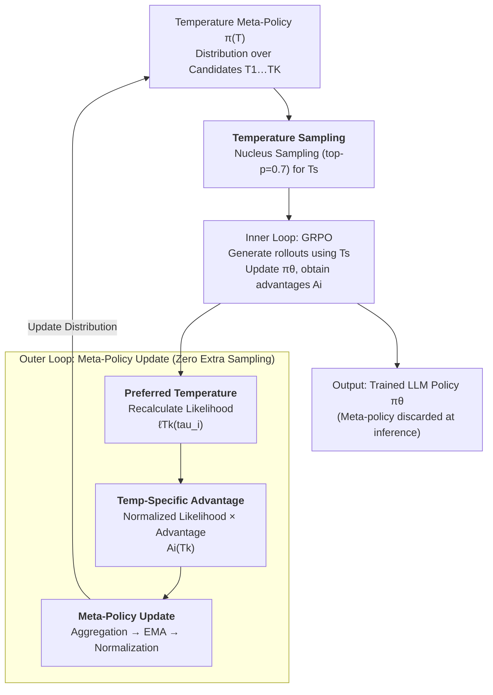

# Temperature as a Meta-Policy: Adaptive Temperature in LLM Reinforcement Learning

**Conference**: ICLR 2026  
**arXiv**: [2602.11779](https://arxiv.org/abs/2602.11779)  
**Code**: None  
**Area**: LLM Reasoning  
**Keywords**: Temperature adjustment, Meta-policy, GRPO, Adaptive exploration, Mathematical reasoning

## TL;DR

The authors propose TAMPO (Temperature Adaptive Meta Policy Optimization), which redefines sampling temperature as a learnable meta-policy. Through a bi-level loop, the method performs LLM policy optimization in the inner loop and adaptively updates the temperature distribution in the outer loop based on trajectory advantage signals. This approach requires zero extra rollouts and consistently outperforms fixed-temperature baselines on mathematical reasoning benchmarks.

## Background & Motivation

- Temperature is a core parameter in LLM sampling that controls the exploration-exploitation tradeoff.
    - High temperatures encourage diversity but introduce noise; low temperatures increase focus but may lead to premature convergence.
- Existing RL training methods (e.g., GRPO) treat temperature as a **fixed hyperparameter**, ignoring dynamic requirements during the training process.
- While entropy regularization and KL penalties also influence exploration, temperature directly modulates the sampling distribution, making it more transparent and controllable.
- **Key Challenge**: Temperature should be a learnable decision variable rather than a manually tuned hyperparameter.

## Method

### Overall Architecture

TAMPO addresses the long-standing issue in LLM reinforcement learning where sampling temperature is treated as a fixed hyperparameter. While temperature directly modulates the sampling distribution and determines the balance between exploration and exploitation, critic-free methods like GRPO use a single manually set temperature throughout training, ignoring both training progress and trajectory feedback. TAMPO defines the sampling temperature itself as a learnable meta-policy $\pi(T)$—maintaining a probability distribution over a set of candidate temperatures $\mathcal{T}=\{T_1,\dots,T_K\}$—and embeds it into the bi-level loop of standard GRPO training.

The workflow proceeds as follows: The outer layer selects a sampling temperature $T_s$ from $\pi(T)$ using nucleus sampling. The inner layer generates a batch of rollouts using $T_s$ and updates the LLM policy $\pi_\theta$ via GRPO. Subsequently, the outer layer **requires no additional sampling**; instead, it re-evaluates the same batch of rollouts to infer which temperature likely generated them, attributes trajectory quality to the temperatures, and updates $\pi(T)$ accordingly. Since the inference step only involves recalculating likelihoods for existing token sequences under different temperatures, the adaptive process **shares data and incurs zero extra rollouts**, resulting in training times nearly identical to fixed-temperature baselines.

### Key Designs

**1. Preferred Temperature: Inferring "Intended" Temperature from Trajectory Likelihood**

To optimize temperature, the first step is to find a signal for "which temperature is better" without resampling. TAMPO observes that each sampled trajectory implicitly encodes its own preferred temperature—the temperature under which it was most likely generated. For a trajectory $\tau_i$, the average log-likelihood under temperature $T$ is defined as $\ell_T(\tau_i) = \frac{1}{|\tau_i|} \sum_{t=1}^{|\tau_i|} \log \pi_{\theta,T}(o_{i,t} \mid s_{i,t})$. The temperature $T_i^\star = \arg\max_{T_k \in \mathcal{T}} \ell_{T_k}(\tau_i)$ that maximizes this likelihood is the "preferred temperature." This step only requires passing existing tokens through the model to scale logits by different virtual temperatures, forming the basis for zero-overhead adaptation. (The paper proves the trajectory likelihood is unimodal w.r.t. $T$, ensuring a unique preferred temperature).

**2. Temperature-Specific Advantage: Attributing Performance to Temperature**

Likelihood alone is insufficient; the meta-policy must know which temperature yields higher returns. TAMPO distributes the GRPO advantage $A_i$ of each trajectory to the candidate temperatures based on their relative likelihoods. For $K$ candidates, $\ell_{T_k}(\tau_i)$ is normalized via sparsemax into $\hat{\ell}_{T_k}(\tau_i)$ (summing to 1; sparsemax is preferred over softmax as it zeros out irrelevant temperatures to focus attribution). The temperature-specific advantage is then $\mathcal{A}_i^{(T_k)} = \hat{\ell}_{T_k}(\tau_i) \cdot A_i$. Positive advantage trajectories push rewards toward their most likely temperatures, while negative ones suppress them, providing a scalar signal for optimization.

**3. Meta-Policy Update: Aggregation, Smoothing, and Normalization**

To handle noisy signals from single batches, TAMPO converts advantages into a stable distribution in three steps. First, it aggregates within a batch: $\mathcal{A}_\mathcal{B}^{(T_k)} = \frac{1}{|\mathcal{B}|G} \sum_b \sum_i \mathcal{A}_{b,i}^{(T_k)}$. Second, it applies Exponential Moving Average (EMA) smoothing: $\bar{\mathcal{A}}_s^{(T_k)} = (1-\alpha)\bar{\mathcal{A}}_{s-1}^{(T_k)} + \alpha \mathcal{A}_\mathcal{B}^{(T_k)}$ to accumulate trends ($\alpha=0.05$ is found to be most stable). Finally, min-max normalization yields the temperature distribution $\pi_s(T_k) = \frac{\tilde{\mathcal{A}}_s^{(T_k)}}{\sum_j \tilde{\mathcal{A}}_s^{(T_j)}}$. This sidesteps the non-differentiability of temperature by treating it as an online advantage-ranking problem.

**4. Temperature Sampling: Exploring Exploration**

After obtaining $\pi(T)$, the next temperature is not selected greedily. Instead, nucleus sampling (top-p) is used to draw $T_s$ from $\pi(T)$, with $p=0.7$ providing the best balance. Experiments show that pure greedy sampling ($p=0$) performs worst, indicating that the meta-policy itself requires stochasticity to avoid premature convergence to a local preference. The meta-policy only maintains a list of advantage estimates for $K$ temperatures and is discarded after training, incurring no inference cost.

## Key Experimental Results

### Main Results: Mathematical Reasoning Benchmarks (DS-Qwen-1.5B)

| Method | Average | AIME24 | MATH-500 | AMC23 | Minerva | OlympiadBench |
|------|---------|--------|----------|-------|---------|---------------|
| DS-Qwen-1.5B (No RL) | 39.1 | 13.3 | 76.2 | 45.0 | 22.8 | 38.4 |
| GRPO ($T_s$: 0.9) | 42.0 | 20.0 | 75.2 | 50.0 | 26.1 | 38.7 |
| GRPO ($T_s$: 1.5) | 42.6 | 23.3 | 75.4 | 52.5 | 22.8 | 39.0 |
| GRPO ($T_s$: 0.9→1.5) | 42.8 | 16.7 | 76.6 | 55.0 | 24.6 | 41.0 |
| **TAMPO** | **44.5** | **23.3** | **76.8** | **55.0** | **27.9** | **39.6** |

### Ablation Study: EMA Coefficient $\alpha$

| $\alpha$ | Average | AIME24 | MATH-500 | AMC23 | Minerva | OlympiadBench |
|---------|---------|--------|----------|-------|---------|---------------|
| 0.01 | 41.6 | 20.0 | 75.2 | 50.0 | 25.4 | 37.5 |
| **0.05** | **44.5** | **23.3** | **76.8** | **55.0** | **27.9** | **39.6** |
| 0.10 | 43.6 | 23.3 | 75.4 | 57.5 | 23.2 | 38.8 |

### Ablation Study: Meta-Policy Sampling Strategy

| top-p | Average |
|-------|---------|
| 0.9 | 43.0 |
| **0.7** | **44.5** |
| 0.5 | 42.2 |
| 0 (greedy) | 40.9 |

### Key Findings

1. **Ours** exceeds the best fixed-temperature baseline by **+1.9%** (Pass@1) and **+1.7%** (Pass@8).
2. Learned temperature dynamics: After warmup, the policy prefers high temperatures (~1.3) to encourage exploration, then gradually decreases them.
3. Greedy sampling ($p=0$) leads to the worst results $\rightarrow$ temperature selection itself requires exploration.
4. Training time is identical to the baseline (~9h54min on 8×V100).
5. The method is equally effective on commonsense reasoning tasks.

## Highlights & Insights

- **Elevating temperature from hyperparameter to decision variable**: A novel problem formulation.
- **Zero extra rollouts**: Clever reuse of data through virtual temperature likelihood calculations.
- **Intuitive behavior**: The learned meta-policy matches the human intuition of shifting from high exploration to high exploitation.
- **High compatibility**: Can be integrated into any critic-free method like GRPO, DAPO, or REINFORCE++.
- **Negligible computational overhead**: Only requires maintaining advantage estimates for $K$ temperatures.

## Limitations & Future Work

- The candidate temperature set $\mathcal{T}$ still requires manual definition of range and granularity.
- The unimodal property of trajectory likelihood w.r.t. temperature might not hold in all scenarios.
- Main experiments were conducted on 1.5B models; more validation on larger models is needed.
- The temperature meta-policy is shared across different prompts; prompt-level adaptation was not explored.

## Related Work & Insights

- Critic-free RL: GRPO, DAPO, REINFORCE++
- Exploration-Exploitation: ε-greedy, temperature annealing, UCB, entropy regularization
- Meta-Policy: MLSH (Hierarchical RL), Meta-SAC (Automatic entropy coefficients)

## Rating

- **Novelty**: ⭐⭐⭐⭐⭐ — Novel formulation of temperature as a meta-policy.
- **Technical Depth**: ⭐⭐⭐⭐ — Clear theoretical derivation, despite a simple implementation.
- **Experimental Thoroughness**: ⭐⭐⭐⭐ — Comprehensive benchmarks and ablations, though model scale is limited.
- **Value**: ⭐⭐⭐⭐⭐ — Improves RL training results with zero additional costs.

<!-- RELATED:START -->

## Related Papers

- [\[ICLR 2026\] Stabilizing Policy Gradients for Sample-Efficient Reinforcement Learning in LLM Reasoning](stabilizing_policy_gradients_for_sample-efficient_reinforcement_learning_in_llm_.md)
- [\[ICLR 2026\] Generative Adversarial Reasoner: Enhancing LLM Reasoning with Adversarial Reinforcement Learning](generative_adversarial_reasoner_enhancing_llm_reasoning_with_adversarial_reinfor.md)
- [\[ICLR 2026\] Adaptive Social Learning via Mode Policy Optimization for Language Agents](adaptive_social_learning_via_mode_policy_optimization_for_language_agents.md)
- [\[ICLR 2026\] NFT: Bridging Supervised Learning and Reinforcement Learning in Math Reasoning](nft_bridging_supervised_learning_and_reinforcement_learning_in_math_reasoning.md)
- [\[ICLR 2026\] Slow-Fast Policy Optimization: Reposition-Before-Update for LLM Reasoning](slow-fast_policy_optimization_reposition-before-update_for_llm_reasoning.md)

<!-- RELATED:END -->
