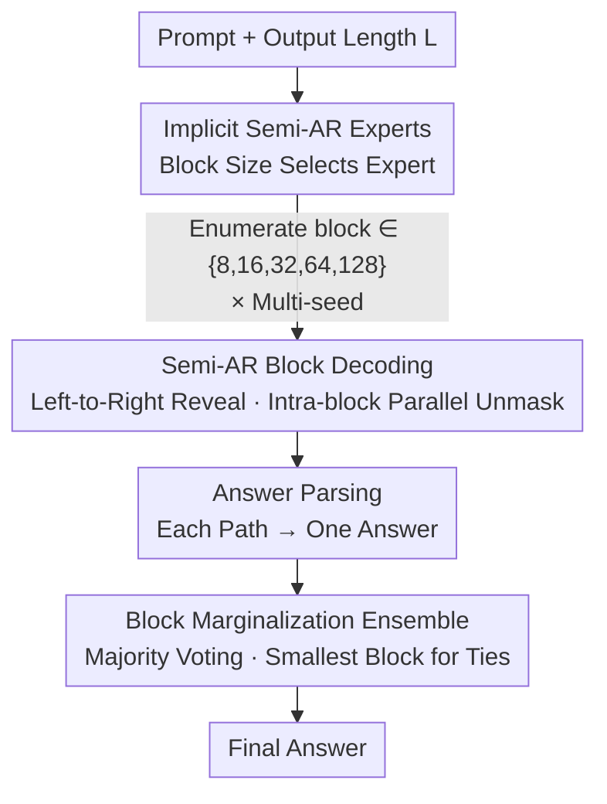

# Test-Time Scaling in Diffusion LLMs via Hidden Semi-Autoregressive Experts

**Conference**: ICLR 2026  
**OpenReview**: [https://openreview.net/forum?id=L5y7in91vd](https://openreview.net/forum?id=L5y7in91vd)  
**Code**: [https://github.com/junos-ai-org/Test-Time-Scaling](https://github.com/junos-ai-org/Test-Time-Scaling)  
**Area**: LLM Inference / Diffusion Models  
**Keywords**: Diffusion Language Models, Test-Time Scaling, Semi-autoregressive Decoding, Hidden Mixture-of-Experts, Majority Voting

## TL;DR
This paper discovers that Diffusion Language Models (dLLMs) implicitly learn a set of "semi-autoregressive experts" during training, where different block decoding orders activate different experts. Based on this, it proposes HEX, a training-free inference method that runs multiple generation paths via various block schedules and applies majority voting. It improves GSM8K accuracy from 24.72% to 88.10%, even outperforming models fine-tuned with GRPO reinforcement learning.

## Background & Motivation

**Background**: Unlike autoregressive models that generate tokens sequentially from left to right, Diffusion Language Models (dLLMs, such as LLaDA) use an iterative "mask-unmask" process, theoretically allowing tokens to be revealed in any order. This order flexibility is a core advantage of dLLMs over autoregressive models. During inference, the decision of "which positions to reveal first" (i.e., the masking schedule) directly determines generation quality.

**Limitations of Prior Work**: Mainstream inference methods rely on **model confidence** to select positions—revealing the top-K margin tokens in each step. While effective for tasks like Sudoku (7% → 90%), the authors found **counter-intuitive failures** in reasoning tasks like GSM8K: top-K margin achieves only 24.72%, significantly worse than random revelation (50.87%). Worse, confidence-based strategies prematurely and overconfidently fill the tail with `[AfterEoT]` (padding tokens after the end of text), generating backward from the end and causing over 55.5% of samples to "collapse" into a series of end tokens with almost no valid output.

**Key Challenge**: The training objective of dLLMs (Equation (1)) **averages equally** across all mask patterns, including many "pathological" sub-problems (e.g., predicting a large block of tokens with almost no context). These pathological conditions are poorly learned, causing the model to over-bias toward special tokens like `[AfterEoT]`. Training effectively turns the model into a collection of conditional distributions with varying quality—relying on a single fixed schedule is equivalent to betting on a potentially poorly-learned "expert."

**Goal**: To find an inference strategy that faithfully reflects what the model truly learned during training, avoids confidence collapse, and opens a new test-time scaling dimension for dLLMs.

**Key Insight**: The authors reinterpret the dLLM as an **implicit Mixture-of-Experts (MoE)**—where each "expert" corresponds to a conditional distribution $p_\theta(x_i \mid x_{\text{prompt}}, x[U])$ under a specific visible token subset $U$. In a toy example ("Who invented the telephone?"), the authors enumerate all 23 mask combinations for the first three tokens and find that most experts place probability peaks on the correct answer, while only a few provide incorrect or flat distributions. Since the majority of experts "know the answer," one should not trust a single expert but rather **marginalize across experts**.

**Core Idea**: Use semi-autoregressive (semi-AR) block sizes as "expert selectors"—changing the block size activates different experts. By running multiple block schedules and performing majority voting on final answers, the fragility of a single schedule is converted into a consensus mechanism. This is HEX (Hidden semi-autoregressive EXperts).

## Method

### Overall Architecture

HEX is a **training-free inference algorithm** applied directly to existing dLLMs (LLaDA-8B-Instruct in this paper) without parameter changes. Its core idea is: instead of debating "which decoding schedule is best," treat the "block size/order" as a **latent variable**, run a set of semi-autoregressive decodings with different blocks to obtain multiple answers, and let these answers "vote."

The process is: given a prompt, fix the output length $L$ (256 in experiments, corresponding to 128 unmasking steps); use a preset set of block sizes $\mathcal{B}=\{8,16,32,64,128\}$, with each size repeated using multiple random seeds (default 5 seeds each, totaling 25 paths); each path is decoded **left-to-right in a semi-autoregressive** manner—partitioning the sequence into continuous blocks and revealing them left to right, while performing parallel diffusion unmasking within each block; after decoding, convert the token sequences to text, parse the numerical answers (removing LaTeX, spaces, commas); and finally take the **most frequent answer** as the output, choosing the smallest block size in case of a tie.

### Key Designs

**1. Interpreting dLLM as an Implicit Semi-AR MoE: Block Size as Expert Dial**

This design directly addresses the "single schedule collapse" issue. Starting from the training objective, dLLMs learn a family of conditional distributions $\{p_\theta(x_i \mid x_{\text{prompt}}, x[U])\}$ indexed by the visible set $U$, where each $U$ acts as an "expert." Ideal inference would weightedly mix these experts via a gating weight $\pi(U\mid x_{\text{prompt}})$:

$$p_{\text{mix}}(x_i = a \mid x_{\text{prompt}}) = \sum_U \pi(U \mid x_{\text{prompt}})\, p_\theta(x_i = a \mid x_{\text{prompt}}, x[U]).$$

However, the number of experts is exponential (for the $N$-th token, there are $2^{N-1}$ contexts), and the gating $\pi(U)$ is unobservable. The key observation is: **different block sizes naturally correspond to different visible sets $U_b$**, so adjusting block size is equivalent to "switching experts." This reduces an abstract, exponential mixture problem into an actionable dial of "enumerating several block sizes."

**2. Semi-Autoregressive Left-to-Right Block Decoding: Preventing `[AfterEoT]` Collapse**

Pure random ordering or parallel decoding of a single large block creates "pathological partial contexts" rarely seen during training, causing the model to fill the tail with `[AfterEoT]` or repetitions. Semi-autoregressive (semi-AR) decoding fixes the block size $b$, partitions the sequence into continuous blocks $M_t = \{(t-1)b+1, \dots, \min(tb, n)\}$, and reveals them **block by block from left to right** (preserving natural linguistic prefix structure). Parallel diffusion denoising is still used **within** each block. This maintains causality ("left-to-right") while retaining intra-block parallel efficiency.

The effect is significant: the ablation table (Table 1) shows that non-semi-AR (single large block) has a collapse rate of 55.80% and accuracy of only 22.52% on GSM8K. Switching to semi-AR drops the collapse rate to **0.00%** and increases accuracy to 76.27% (similarly, MATH increases from 16.60% to 32.80%).

**3. Block Marginalization Ensemble + Majority Voting: Consensus over Confidence**

With "block-selected experts" and "semi-AR stability," an aggregation rule is needed to synthesize multiple expert predictions. Instead of estimating $p_{\text{mix}}$, HEX uses Monte Carlo approximation—sampling one path for each of a small set of block schedules $b\in\mathcal{B}$, querying one expert $U_b$ per path, and averaging:

$$p_{\text{mix}}(x_i = a \mid x_{\text{prompt}}) \approx \mathbb{E}_{b\sim\mathcal{B}}\big[p_\theta(x_i = a \mid x_{\text{prompt}}, x[U_b])\big],\qquad \hat{a} = \arg\max_a p_{\text{mix}}(x_i = a \mid x_{\text{prompt}}).$$

The implementation simplifies this further by **majority voting on final answers**. Different block schedules may make different mistakes but tend to agree on correct answers. Majority voting cancels out schedule-specific errors. Ablations (Table 3) confirm this: likelihood-based selection (choosing the candidate with the lowest NLL) performs poorly (60.84% on ARC-C, worse than random's 70.05%), while frequency-based majority voting reaches 74.57%.

## Key Experimental Results

### Main Results

Using LLaDA-8B-Instruct; output length 256, 128 unmasking steps, revealing 2 tokens per step. HEX uses block sizes $[8,16,32,64,128]$, temperature 0.9, and 5 seeds per size (25 paths total). Accuracy (%) on four reasoning benchmarks:

| Dataset | Top-k margin | Random | d1 (GRPO Tuned) | HEX (Ours) | Gain (vs. Best Baseline) |
|--------|--------------|--------|----------------|------------|------|
| GSM8K | 24.72 | 50.87 | 79.80 | **88.10** | +8.30 (vs. GRPO) |
| MATH500 | 16.40 | 16.80 | 37.20 | **40.00** | +2.80 (vs. GRPO) |
| ARC-C | 54.18 | 70.05 | 82.68 | **87.80** | +5.12 (vs. GRPO) |
| TruthfulQA | 28.36 | 42.40 | — | **57.46** | +15.06 (vs. Random) |

The highlight: HEX **requires zero training** yet comprehensively outperforms d1 (GRPO) which requires expensive reinforcement learning fine-tuning. Compared to top-K margin, accuracy on GSM8K increases by 3.56× (24.72% → 88.10%).

### Ablation Study

| Configuration | Key Metrics | Note |
|------|---------|------|
| Non-semi-AR (single large block) | GSM8K Acc 22.52%, Collapse 55.80% | Prone to `[AfterEoT]` collapse |
| Semi-AR block decoding | GSM8K Acc 76.27%, Collapse 0.00% | Collapse completely eliminated |
| Likelihood selection (lowest NLL) | ARC-C 60.84% | Worse than random decoding (70.05%) |
| HEX Majority Voting | ARC-C 74.57% | Consensus is more reliable than confidence |
| Dynamic blocks 5→30 | GSM8K 81.96%→84.15%, Tie rate halved | Higher block diversity is better |
| HEX ×5 seeds (Full) | GSM8K 88.10%, Tie rate 1.36% | Structured diversity (fixed blocks + seeds) is best |

### Key Findings
- **Semi-autoregressive constraints provide stability**: Removing them results in over 50% collapse, the root cause of confidence-method failure in reasoning tasks.
- **Consensus > Confidence**: Likelihood-based (NLL) reranking fails to beat random decoding, while majority voting provides the real gains—indicating that HEX's strength comes from "ensemble consistency" rather than "picking high-confidence samples."
- **Predictable Test-Time Scaling**: Accuracy monotonically increases and tie rates (ambiguity) steadily decrease as more voting samples are added, providing a dial to exchange compute for accuracy.
- **Structured Diversity is Optimal**: Fixed block sets with multiple seeds yield more gains than purely random dynamic block schedules.

## Highlights & Insights
- **Elevating "Decoding Order" to a new Test-Time Scaling Dimension**: Unlike autoregressive models that rely on CoT or self-consistency, this paper identifies a unique dimension for dLLMs—marginalizing mask/block schedules.
- **Explanatory power of "dLLM = Implicit MoE"**: This explains why models stop early (pathological experts bias toward `[AfterEoT]`), why they are overconfident yet wrong (trusting poorly-learned experts), and why random can beat confidence (unbiased sampling of experts).
- **Outperforming RL fine-tuning without training**: This suggests that reasoning capabilities are "latent" in dLLMs; the issue is the inference-time schedule choice rather than model capacity.
- **Transferability**: The idea of treating schedules/orders as latent variables and across-schedule ensemble voting can be transferred to any model with generation order flexibility.

## Limitations & Future Work
- **Inference Compute Overhead**: Running 25 paths (5 blocks × 5 seeds) is 25x more expensive than a single decode.
- **Task Scope**: Verified only on reasoning tasks with unique correct answers. Majority voting may not apply to open-ended generation (storytelling, dialogue, images).
- **Theoretical Gap**: While HEX uses Monte Carlo and majority voting to approximate the ideal expert mixture $p_{\text{mix}}$, the gating $\pi(U)$ is unobserved and approximation errors lack theoretical characterization.
- **Potential Improvements**: Block sets are currently manually fixed; adaptive selection or a lightweight learned gating could reach similar accuracy with fewer paths.

## Related Work & Insights
- **vs. Top-K margin (Kim et al. 2025)**: They rely on point-wise confidence for revealing tokens, which collapses in reasoning. HEX uses cross-schedule consensus.
- **vs. Random decoding (Nie et al. 2025b, LLaDA)**: Random revelation is unbiased but individual paths remain fragile. HEX upgrades random's "unbiasedness" to "unbiasedness + consensus."
- **vs. d1 (GRPO) Reinforcement Learning (Zhao et al. 2025)**: They use RL to improve reasoning. HEX achieves better results without training by unlocking capabilities already latent in the pre-trained model.
- **vs. AR Self-Consistency (Wang et al. 2022)**: Similar concept (multiple paths + voting), but HEX's diversity comes from the unique block schedule dimension of dLLMs rather than just temperature-based randomness.

## Rating
- Novelty: ⭐⭐⭐⭐⭐ The "dLLM = Implicit semi-AR MoE" perspective + block schedule as a scaling dimension is fresh and explanatory.
- Experimental Thoroughness: ⭐⭐⭐⭐ Solid results across four benchmarks and multiple ablations, though limited to reasoning tasks.
- Writing Quality: ⭐⭐⭐⭐⭐ Clear narrative connecting "counter-intuitive failure" to mechanism and method.
- Value: ⭐⭐⭐⭐⭐ Provides a plug-and-play, scalable method for dLLM inference that beats RL tuning.

<!-- RELATED:START -->

## Related Papers

- [\[ICLR 2026\] Plan and Budget: Effective and Efficient Test-Time Scaling on Reasoning LLMs](plan_and_budget_effective_and_efficient_test-time_scaling_on_reasoning_large_lan.md)
- [\[ICLR 2026\] Optimal Aggregation of LLM and PRM Signals for Efficient Test-Time Scaling](optimal_aggregation_of_llm_and_prm_signals_for_efficient_test-time_scaling.md)
- [\[ICLR 2026\] ROC-n-Reroll: How Verifier Imperfection Affects Test-Time Scaling](roc-n-reroll_how_verifier_imperfection_affects_test-time_scaling.md)
- [\[ICLR 2026\] Mode-conditioning unlocks superior test-time compute scaling](mode-conditioning_unlocks_superior_test-time_compute_scaling.md)
- [\[ICLR 2026\] CaTS: Calibrated Test-Time Scaling for Efficient LLM Reasoning](cats_calibrated_test-time_scaling_for_efficient_llm_reasoning.md)

<!-- RELATED:END -->
