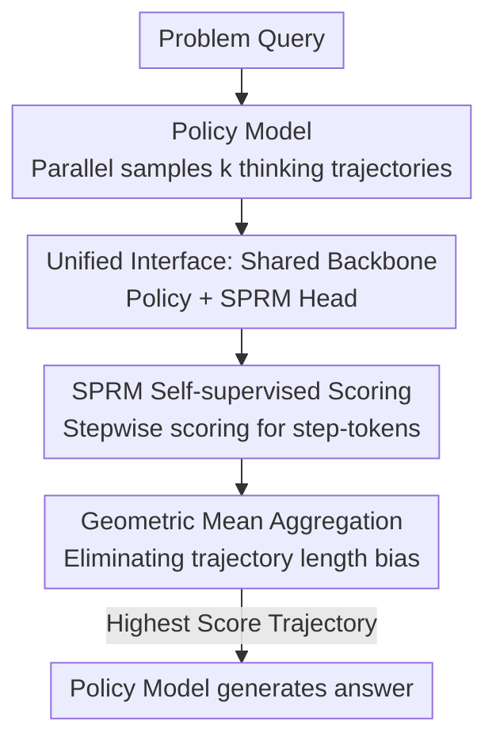

# Test-Time Scaling with Reflective Generative Model

**Conference**: ICLR 2026  
**OpenReview**: [https://openreview.net/forum?id=tF56uyxdDy](https://openreview.net/forum?id=tF56uyxdDy)  
**Code**: https://github.com/MetaStone-AI/XBai-o4/  
**Area**: LLM Inference  
**Keywords**: Test-Time Scaling, Process Reward Model, Self-supervised, Reasoning Trajectory Selection, Reflective Generation

## TL;DR
This paper proposes the Reflective Generative Model (RGM), which enables a single network to serve as both a policy model for generating reasoning trajectories and a process reward model for scoring them. By adding only a 50M parameter SPRM head and utilizing a self-supervised SPR Loss to bypass process-level annotations, a 32B model outperforms OpenAI o3-mini on AIME24 (84.2 vs. 79.6), with scoring performance exceeding 72B-class reward models.

## Background & Motivation

**Background**: Test-Time Scaling (TTS) is a primary method for enhancing reasoning capabilities and is categorized into two types. Internal TTS (sequential TTS) extends the thinking process via long Chain-of-Thought (CoT) for self-correction. External TTS (parallel TTS) samples multiple reasoning trajectories in parallel and employs a reward model as a "judge" to select the best one, using algorithms like Best-of-N, Beam Search, or Diverse Verifier Tree Search. Research indicates that Process Reward Models (PRM, step-level scoring) are more effective than Outcome Reward Models (ORM, final correctness only) for external TTS.

**Limitations of Prior Work**: The "policy model + independent PRM" paradigm in external TTS has two major drawbacks. First, **additional computation**: PRMs are often independent large models (frequently around 72B), doubling parameters and inference costs, which limits deployment. Second, **expensive annotation**: Training high-quality PRMs requires large-scale step-level annotations, which are difficult and costly to obtain accurately.

**Key Challenge**: While fine-grained PRMs are more useful, they typically require large independent verifiers and manual step-level labels—a sharp trade-off between performance and cost. Existing work using Monte Carlo estimation for automatic process labeling (supervised only by final answers) introduces noise; for instance, trajectories where the reasoning is incorrect but the final answer is luckily correct can contaminate labels.

**Goal**: Within the external TTS framework, the goal is to retain the benefits of process-level scoring while (1) eliminating the parameter/computational overhead of an independent PRM and (2) removing the dependence on manual step-level labels.

**Key Insight**: The policy model and PRM can share the same backbone. Both generating and scoring trajectories rely on an understanding of the reasoning process. Furthermore, process-level discrimination can be learned self-supervisedly using only the "final answer correctness" signal.

**Core Idea**: Propose a "Reflective Generative Form" where a single network shares a backbone and utilizes a lightweight task head to simultaneously perform "trajectory generation" and "trajectory scoring," learning process-level discrimination from outcome rewards via a self-supervised loss.

## Method

### Overall Architecture

RGM compresses the traditional two-stage "policy model + independent PRM" paradigm into a unified "shared backbone + lightweight scoring head" form. Formally, the reflective generative form is defined as:

$$\text{answer} = \text{LLM}_{\text{answer}}\Big(\arg\max_{i\in[1,k]} \text{LLM}_{\text{SPRM}}\big([\text{LLM}_{\text{thinking}}(\text{query})]_i\big)\Big)$$

In this setup, $\text{LLM}_{\text{answer}}$, $\text{LLM}_{\text{SPRM}}$, and $\text{LLM}_{\text{thinking}}$ **all share the same backbone**. The reasoning pipeline is: problem query → policy model parallel samples $k$ thinking trajectories → SPRM head on the shared backbone scores each step and aggregates them into a final score → select the trajectory with the highest score → policy model generates the final answer. During training, the policy model is optimized using GRPO, and the SPRM head is optimized using a self-supervised SPR Loss, enabling end-to-end joint training.

### Key Designs

**1. Unified Interface: Shared Backbone for Policy and PRM (50M Scorer)**

This design addresses the doubled computational cost of independent PRMs. Instead of a separate large reward model, RGM attaches a lightweight SPRM head to the shared backbone. This head is a binary classifier with the structure: $\text{Linear}(c, 2c) \to \text{ReLU} \to \text{Dropout}(0.5) \to \text{Linear}(2c, 1)$, where $c$ is the hidden state dimension, adding only ~50M parameters. Scoring uses the hidden representation from the **penultimate layer** rather than the final layer (which primarily encodes next-token logits), as the penultimate layer retains richer contextual semantics. This configuration allows a single network to perform generation and scoring in parallel, saving parameters and supporting end-to-end training. Experimentally, this 50M SPRM head outperforms 72B-class independent reward models.

**2. SPRM Self-supervised Process Reward: Step-level Discrimination from Final Answers**

This design eliminates expensive and noisy process labels. The SPRM is trained via a self-supervised SPR Loss without manual step-level labels:

$$\mathcal{L}_{\text{SPR}} = \frac{1}{N}\sum_{n=1}^{N} \mathbb{I}(y = \hat{y}_n)\cdot \text{BCELoss}(\text{Score}_n, \hat{y}_n), \quad \hat{y}_n = \mathbb{I}(\text{Score}_n > 0.5)$$

Where $y$ indicates final correctness, $\text{Score}_n$ is the process score for step $n$, and $\hat{y}_n$ is the pseudo-label generated by the SPRM. The indicator function $\mathbb{I}(y = \hat{y}_n)$ is crucial: **updates only occur when the pseudo-label matches the final answer's correctness**. This serves as a dynamic filter to exclude noise (e.g., correct answers with flawed steps). By optimizing only on "representative" correct or incorrect steps, the SPRM learns to distinguish process steps self-supervisedly. The paper notes an "aha moment" where correct and incorrect scores diverge during training, indicating the model has learned discrimination.

**3. Geometric Mean Aggregation: Eliminating Trajectory Length Bias**

Stepwise scores must be aggregated into a final trajectory score. **Step segmentation** is performed by reusing tokens from the tokenizer; tokens containing `.\n\n` are treated as step-tokens. For aggregation, while prior work like Lightman et al. used the **product** of scores, this penalizes longer trajectories. RGM employs the **geometric mean**:

$$S_{\text{final}} = \left(\prod_{n=1}^{N} \text{Score}_n\right)^{\frac{1}{N}} = \left(\prod_{n=1}^{N} \text{SPRM}(f_{\text{token}_n})\right)^{\frac{1}{N}}$$

Where $N$ is the number of steps and $f_{\text{token}_n}$ is the representation of the $n$-th step-token. Taking the $N$-th root counteracts the influence of trajectory length, allowing for fair comparison. Ablations show the geometric mean significantly outperforms the product and slightly exceeds the arithmetic mean.

### Loss & Training
The policy model uses GRPO (Group Relative Policy Optimization), while the SPRM head uses the SPR Loss. Training data is sampled from public math datasets (NuminaMath, OpenR1-Math-220k, DeepScaleR, etc.), filtered for difficulty, resulting in 40k samples. Training was conducted on 64 H200 GPUs with a batch size of 128 and 32k response length for 80 iterations (140 steps for QwQ-32B). Math inference used an output length of 38k with temperatures of 1.0 (GPT-OSS-20B) or 0.6.

## Key Experimental Results

### Main Results

Evaluation was conducted on math benchmarks (AIME24/25, BRUMO25, HMMT25) and one OOD coding benchmark (LiveCodeBench) using Pass@1 (average over 64 trials) with $k=8$ for TTS. Baseline rewards included Qwen2.5-Math-RM-72B (ORM) and Qwen2.5-Math-PRM-72B (PRM).

| Model | Method | AIME24 | AIME25 | HMMT25 | LiveCodeBench |
|------|------|--------|--------|--------|---------------|
| QwQ-32B | +PRM-72B | 83.3 | 72.3 | 51.7 | 63.0 |
| QwQ-32B | **+RGM8-54M** | **84.2** | **73.4** | **53.1** | **64.0** |
| R1-Distill-Qwen-7B | +PRM-72B | 60.1 | 47.3 | 29.9 | 42.8 |
| R1-Distill-Qwen-7B | **+RGM8-26M** | **66.3** | **48.3** | **33.4** | **44.1** |
| OpenAI o3-mini(med) | — | 79.6 | 74.8 | 53.0 | 67.4 |

QwQ-32B with a 54M RGM outperformed OpenAI o3-mini on AIME24 (84.2 vs. 79.6) and HMMT25 (53.1 vs. 53.0). The 7B model with RGM approaches o1-mini performance. Notably, the 50M SPRM outscored the 72B reward models globally and generalized to coding tasks even though it was trained on math.

### Ablation Study

| Configuration | Key Metrics (DeepScaleR-1.5B+RGM8) | Description |
|------|------|------|
| Geometric Mean (Full) | AIME24 53.1 / AIME25 35.7 / HMMT25 21.5 | Full aggregation method |
| Arithmetic Mean | AIME24 52.9 / AIME25 35.2 / HMMT25 21.1 | Slightly lower than Geometric Mean |
| Product | AIME24 44.2 / AIME25 31.1 / HMMT25 17.9 | Sensitive to length, major drop |
| Process-level (Full) | AIME24 53.1 / LiveCodeBench 26.6 | Using stepwise process scores |
| Outcome-level | AIME24 48.5 / LiveCodeBench 25.7 | Only using the final step score; 4.6pt drop |

SPR Loss also consistently outperformed standard BCELoss (using raw outcome labels for steps), providing wider score margins between correct and incorrect trajectories.

### Key Findings
- **Process-level vs. Outcome-level**: Degrading SPRM to an ORM (last step only) leads to a 4.6pt drop on AIME24, confirming the value of stepwise rewards.
- **Aggregation is Critical**: Switching from product to geometric mean recovered gains, as the product is biased toward shorter trajectories.
- **Scaling $k$**: Performance scales with $k$, and SPRM consistently beats 72B reward models across all sizes.
- **MCTS vs. Best-of-N**: Using SPRM for MCTS search was less effective than Best-of-N due to computational overhead and insufficient exploration in deep search spaces.

## Highlights & Insights
- **"One Network, Two Faces"**: Sharing a backbone for policy and PRM reduces the "two-model, two-stage" TTS paradigm to a "single model, single forward pass" format, drastically lowering costs.
- **Self-supervised De-labeling**: SPR Loss uses a cheap outcome signal and dynamic filtering to learn process-level awareness, bypassing expensive annotation.
- **Geometric Mean for Length Bias**: This simple aggregation trick is crucial for longer reasoning trajectories and can be applied to any stepwise scoring scenario.
- **Penultimate Layer Embeddings**: Using penultimate layer representations instead of final layer logits captures richer semantic information for scoring.

## Limitations & Future Work
- **Math-centric Training**: Process discrimination was learned from math data; while generalization was shown for coding, transferability to open-domain or multimodal tasks remains to be explored.
- **MCTS Limitations**: The SPRM currently works better for trajectory-level selection than guiding deep tree searches.
- **Coarse Step Segmentation**: Relying on tokens like `.\n\n` for segmentation might be fragile if output formats are inconsistent.
- **Future Directions**: Exploring semantic-level step segmentation and integrating SPRM scores into training-time trajectory shaping.

## Related Work & Insights
- **vs. Qwen2.5-Math-PRM-72B**: The latter is a 72B model requiring 500k process labels; Ours uses a 50M head with zero process labels, achieving higher accuracy with three orders of magnitude fewer parameters.
- **vs. DeepSeek-R1**: R1 relies on long CoT for internal correction but faces "false positive" noise where the answer is right but the process is wrong; Ours uses an explicit scorer with SPR Loss specifically designed to filter such noise.
- **vs. Math-Shepherd**: Math-Shepherd uses Monte Carlo estimation which is noisy; Ours uses pseudo-label consistency for lighter, more direct self-supervision.

## Rating
- Novelty: ⭐⭐⭐⭐⭐ (Unified architecture and SPR Loss address key TTS costs)
- Experimental Thoroughness: ⭐⭐⭐⭐⭐ (Wide range of models and benchmarks with multiple ablations)
- Writing Quality: ⭐⭐⭐⭐ (Clear definitions and insightful analysis)
- Value: ⭐⭐⭐⭐⭐ (50M head beating 72B models has high practical utility)

<!-- RELATED:START -->

## Related Papers

- [\[ICLR 2026\] Optimal Aggregation of LLM and PRM Signals for Efficient Test-Time Scaling](optimal_aggregation_of_llm_and_prm_signals_for_efficient_test-time_scaling.md)
- [\[ICLR 2026\] TATTOO: Tool-Grounded Thinking PRM for Test-Time Scaling in Tabular Reasoning](tattoo_tool-grounded_thinking_prm_for_test-time_scaling_in_tabular_reasoning.md)
- [\[ICLR 2026\] Mode-conditioning unlocks superior test-time compute scaling](mode-conditioning_unlocks_superior_test-time_compute_scaling.md)
- [\[ICLR 2026\] CaTS: Calibrated Test-Time Scaling for Efficient LLM Reasoning](cats_calibrated_test-time_scaling_for_efficient_llm_reasoning.md)
- [\[ICLR 2026\] ROC-n-Reroll: How Verifier Imperfection Affects Test-Time Scaling](roc-n-reroll_how_verifier_imperfection_affects_test-time_scaling.md)

<!-- RELATED:END -->
