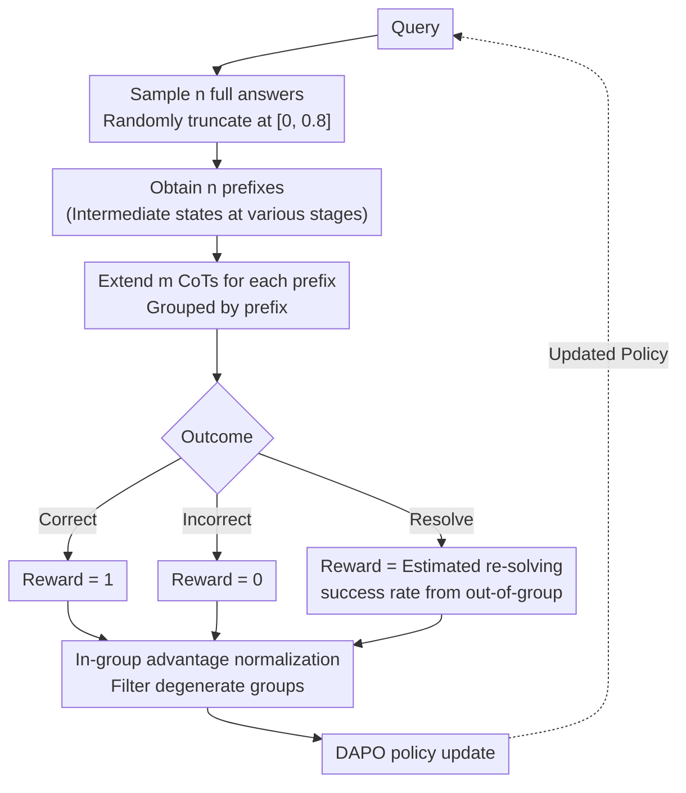

# $\textbf{Re}^{2}$: Unlocking LLM Reasoning via Reinforcement Learning with Re-solving

**Conference**: ICLR 2026  
**arXiv**: [2603.07197](https://arxiv.org/abs/2603.07197)  
**Code**: [PinzhengWang322/rl-resolving](https://github.com/PinzhengWang322/rl-resolving)  
**Area**: Reinforcement Learning  
**Keywords**: RLVR, LLM Reasoning, Chain-of-Thought Optimization, Re-solving, Overthinking

## TL;DR
This paper proposes the Re² method, which utilizes pure reinforcement learning to train LLMs to actively abandon invalid reasoning chains and restart the solving process. This approach increases the occurrence of rare "redo" behaviors from 0.5% to over 30%, significantly outperforming standard RLVR methods under the same training computation budget.

## Background & Motivation
The reasoning capabilities of Large Language Models (LLMs) can be enhanced through Reinforcement Learning with Verifiable Rewards (RLVR), which improves performance by increasing test-time computation. However, even after sufficient RLVR training, models remain prone to generating unnecessary and low-quality reasoning steps during Chain-of-Thought (CoT) generation, leading to an "overthinking" problem. This consumes a large number of tokens while potentially decreasing the final answer quality.

The key observation is: **when the initial direction or quality of a CoT is poor, the model often fails to reach the correct answer**, even if it generates several times more tokens than when the initial CoT quality is good. This reveals a critical issue—models trained with standard RLVR lack "stop-loss" and "restart" capabilities; they persistently follow reasoning paths that have already deviated.

**Core Idea**: Teach LLMs to flexibly abandon unproductive reasoning paths and restart the solving process when necessary, rather than always adhering to the final answer.

## Method

### Overall Architecture
Re² (Reinforcement Learning with Re-solving) aims to address the issue where models trained via standard RLVR struggle to get back on track once the CoT direction deviates. Its strategy is to provide the model with an additional action during reasoning—besides continuing to the final answer, it can **actively abandon the current path and restart the solving process** (re-solve). The challenge lies not in making the model "capable of restarting" (vanilla models already exhibit approximately 0.5% spontaneous redo behavior), but in **how to provide a grounded reward for the "restart" action**. While incorrect answers get 0 and correct answers get 1, what score should be assigned to "I choose to restart and haven't written the answer yet"?

Re² answers this using a pure reinforcement learning pipeline with "prefix grouping + three-way rewards," requiring no Supervised Fine-Tuning (SFT). For each question: multiple full answers are sampled and randomly truncated to obtain a batch of prefixes representing "intermediate reasoning states at different stages"; each prefix then spawns multiple CoT continuations; rewards are assigned based on the outcome (correct / incorrect / resolve), where the "resolve" reward is estimated using the statistical success rate of prefixes **outside the current group**; finally, in-group advantage normalization is performed according to DAPO to update the policy. The data flow for one training iteration is shown below:

### Key Designs

**1. Prefix Grouping Sampling: Creating "intermediate states" to estimate re-solving gains**

To reward a "restart," one must know "the approximate success probability of re-solving this problem from scratch"—but this probability cannot be estimated from a single trajectory. Re² samples $n$ full answers using the old policy for each problem, then randomly truncates each based on a ratio uniformly drawn from $[0, 0.8]$ to obtain $n$ **prefixes with varying progress** (intermediate reasoning states). Each prefix independently extends $m$ CoTs, and extensions from the same prefix are grouped together (the paper uses $n{=}8, m{=}8$). This grouping structure is a prerequisite for implementing the three-way rewards: when estimating the "re-solving success rate" for a specific prefix, the results from **other prefixes** (out-of-group, i.e., those not belonging to the current $\text{Pre}_i$) are used for empirical estimation, avoiding cyclic dependency on the current sample group. To encourage the base model to attempt restarting initially, a specific prompting strategy is employed.

**2. Three-way Reward: Assigning a score to "re-solving" based on out-of-group success rates**

This is the core of Re². For the $j$-th extension $O_{i,j}$ of the $i$-th prefix, the outcome $C_{i,j}$ has three possibilities: a correct answer, an incorrect answer, or a choice to re-solve. The first two follow standard RLVR (1 for correct, 0 for incorrect). The key is the third, "resolve": its reward is equal to the **expected accuracy of re-solving the problem**, estimated using the empirical probability $P_{\neq i}(\cdot)$ of correct/incorrect/resolve outcomes from the $(n{-}1) \cdot m$ out-of-group extensions. This is expanded as a geometric series based on a maximum of $R$ allowed re-solving rounds (the paper uses $R{=}5$):

$$r_{i,j}=\begin{cases}1, & C_{i,j}=\text{correct}\\[2pt]0, & C_{i,j}=\text{incorrect}\\[4pt]P_{\neq i}(\text{correct})\cdot\dfrac{1-P_{\neq i}(\text{resolve})^{R}}{1-P_{\neq i}(\text{resolve})}, & C_{i,j}=\text{resolve}\end{cases}$$

This design ensures that if the current trajectory is promising, the expected reward for completing the answer is higher, encouraging the model to continue. If the trajectory is already disorganized, the expected accuracy of "re-solving" exceeds the value of finishing the current path, pushing the model to abandon and restart. In other words, the value of restarting is not an artificial threshold but an adaptive score calculated from out-of-group samples based on problem difficulty.

**3. In-group Advantage Normalization + DAPO Update: Converting three-way rewards into optimizable gradients**

With the per-extension rewards, Re² follows the DAPO optimization process to convert them into policy updates. First, in-group advantage normalization is performed: $\hat{A}_{i,j}=\dfrac{r_{i,j}-\text{mean}(\{r_{i,j}\})}{\text{std}(\{r_{i,j}\})}$. "Degenerate groups" where all extension rewards are identical are filtered out (as they provide no contrastive signal). Then, the policy is updated using the clipped DAPO objective ($\varepsilon_\text{low}{=}0.2, \varepsilon_\text{high}{=}0.28$). The entire training introduces no new network modules and requires no SFT; it is this reward signal that causes the rare redo behavior (initially ~0.5%) to spontaneously climb to over 30% during training.

## Key Experimental Results

The training set is DAPO-Math-17K (17K math problems with integer answers for rule-based scoring). Baselines include vanilla models and DAPO. To ensure fairness, Re² and DAPO are trained with equal token generation budgets. Evaluation spans five benchmarks: AIME24 / AIME25 / AMC23 (math competitions), GSM8K (primary school word problems), and GPQA-Diamond (graduate-level scientific reasoning, out-of-domain).

### Main Results (Average accuracy across five benchmarks, gains relative to DAPO in parentheses)

| Model | Method | AIME24 | AIME25 | AMC23 | GSM8K | GPQA | Avg |
|------|------|--------|--------|-------|-------|------|-----|
| Qwen2.5-7B Base | + DAPO | 11.9 | 10.3 | 64.7 | 91.8 | 29.7 | 41.7 |
| Qwen2.5-7B Base | + Re² | 17.1 | 19.0 | 70.8 | 93.6 | 36.8 | **47.5 (+5.8)** |
| Qwen2.5-14B Base | + DAPO | 18.2 | 15.7 | 64.0 | 94.3 | 44.8 | 47.4 |
| Qwen2.5-14B Base | + Re² | 28.5 | 23.4 | 68.5 | 94.6 | 49.6 | **52.9 (+5.5)** |
| Qwen2.5-7B-Instruct | + DAPO | 16.0 | 8.6 | 62.3 | 92.6 | 35.4 | 43.0 |
| Qwen2.5-7B-Instruct | + Re² | 18.6 | 21.2 | 64.7 | 94.1 | 38.4 | **47.4 (+4.4)** |
| DeepSeek-R1-8B | + DAPO | 38.4 | 26.5 | 86.9 | 89.6 | 38.4 | 55.9 |
| DeepSeek-R1-8B | + Re² | 47.2 | 29.6 | 88.7 | 92.2 | 44.8 | **60.5 (+4.4)** |

> Re² consistently outperforms DAPO across 3B–14B base, instruct, and reasoning models ($p<0.05$), with gains also observed on the out-of-domain GPQA benchmark. AIME25 was released after the training of all tested models, ruling out data contamination.

### Ablation Study

| Configuration | Key Metrics | Description |
|------|---------|------|
| Vanilla Model | redo rate ~0.5% | Spontaneous re-solving is extremely rare before RL |
| After Re² Training | redo rate >30% | Pure RL (without SFT) amplifies rare behavior by ~60x |
| Training Scaling (AIME25) | Same token budget | Re² accuracy is consistently higher than DAPO at each training step |
| Test-time Scaling (AIME25) | Increasing sample count | Re² outperforms DAPO in majority voting; scaling curve is steeper |

> Key hyperparameters: 32 queries per step, $n{=}8$ prefixes per query, $m{=}8$ extensions per prefix, max $R{=}5$ re-solving rounds. Training sequence length 8192, evaluation extended to 16384.

### Key Findings
- When the initial CoT direction is poor, the model struggles to correct errors even with multiple times the normal token generation—this confirms the necessity of re-solving.
- Pure RL (without SFT) is sufficient to pull the redo rate from 0.5% to 30%+ by using three-way rewards that provide an estimated success rate rather than manual formatting labels.
- Re² demonstrates better test-time scaling: performance continues to improve with more samples, indicating that re-solving leads to more diverse and higher-quality reasoning paths.
- Improvements on the out-of-domain scientific reasoning benchmark GPQA-Diamond suggest the method does not merely overfit math problems.

## Highlights & Insights
- **Simple and Effective Design Philosophy**: Instead of designing complex reasoning structures, the model is empowered with the ability to "start over," aligning with natural human problem-solving behavior.
- **Pure RL Training without SFT Data**: Demonstrates that beneficial reasoning patterns can be effectively excavated and amplified from the model using only reinforcement learning, providing a new perspective for future LLM training.
- **In-depth Analysis of Overthinking**: Clearly reveals the vulnerability of standard RLVR models when the initial CoT direction is poor.
- **Test-time Computational Efficiency**: Re² not only improves pass@1 but also performs excellently in pass@k settings requiring multiple samplings, suggesting that the reasoning paths generated are more diverse.

## Limitations & Future Work
- The paper primarily focuses on mathematical reasoning; effectiveness in other domains like code generation or logical reasoning remains to be verified.
- The re-solving mechanism increases the average output length, which might be suboptimal for latency-sensitive inference scenarios.
- The decision of when to trigger re-solving is learned implicitly by the model, lacking explicit trigger condition analysis.
- For simple problems, the re-solving mechanism may introduce unnecessary computational overhead.
- Combining this with advanced CoT optimization methods (e.g., Tree-of-Thought) is a direction worth exploring.

## Related Work & Insights
- **RLVR Methods**: Methods such as DeepSeek-R1 improve LLM reasoning through verifiable rewards; Re² builds on this to address the overthinking problem.
- **CoT Optimization**: Unlike self-reflection or backtracking, Re² adopts a more thorough "restart" strategy rather than local correction.
- **Test-time Compute Optimization**: The test-time performance of Re² implies a positive impact of re-solving on sample diversity, showing synergy with best-of-N sampling strategies.
- **Insight**: Rare but beneficial behavior patterns inherent in the model can be effectively amplified during RL training; this idea could be generalized to other domains.

## Rating
- Novelty: ⭐⭐⭐⭐
- Experimental Thoroughness: ⭐⭐⭐⭐
- Writing Quality: ⭐⭐⭐⭐
- Value: ⭐⭐⭐⭐

## Related Papers

- [\[ICML 2026\] When to Re-Plan: Subgoal Persistence in Hierarchical Latent Reasoning](../../ICML2026/llm_reasoning/when_to_re-plan_subgoal_persistence_in_hierarchical_latent_reasoning.md)
- [\[ICLR 2026\] Stabilizing Policy Gradients for Sample-Efficient Reinforcement Learning in LLM Reasoning](stabilizing_policy_gradients_for_sample-efficient_reinforcement_learning_in_llm_.md)
- [\[ICLR 2026\] Generative Adversarial Reasoner: Enhancing LLM Reasoning with Adversarial Reinforcement Learning](generative_adversarial_reasoner_enhancing_llm_reasoning_with_adversarial_reinfor.md)
- [\[ICLR 2026\] RL of Thoughts: Navigating LLM Reasoning with Inference-Time Reinforcement Learning](rl_of_thoughts_navigating_llm_reasoning_with_inference-time_reinforcement_learni.md)
- [\[ICLR 2026\] Temperature as a Meta-Policy: Adaptive Temperature in LLM Reinforcement Learning](temperature_as_a_meta-policy_adaptive_temperature_in_llm_reinforcement_learning.md)

<!-- RELATED:END -->

<!-- RELATED:START -->

## Related Papers

- [\[ICLR 2026\] TRAPO: Enhancing LLM Reasoning with Semi-supervised Reinforcement Learning](trapo_a_semi-supervised_reinforcement_learning_framework_for_boosting_llm_reason.md)
- [\[ICML 2026\] When to Re-Plan: Subgoal Persistence in Hierarchical Latent Reasoning](../../ICML2026/llm_reasoning/when_to_re-plan_subgoal_persistence_in_hierarchical_latent_reasoning.md)
- [\[ICLR 2026\] Stabilizing Policy Gradients for Sample-Efficient Reinforcement Learning in LLM Reasoning](stabilizing_policy_gradients_for_sample-efficient_reinforcement_learning_in_llm_.md)
- [\[ICLR 2026\] Curriculum Reinforcement Learning from Easy to Hard Tasks Improves LLM Reasoning](curriculum_reinforcement_learning_from_easy_to_hard_tasks_improves_llm_reasoning.md)
- [\[ICLR 2026\] Generative Adversarial Reasoner: Enhancing LLM Reasoning with Adversarial Reinforcement Learning](generative_adversarial_reasoner_enhancing_llm_reasoning_with_adversarial_reinfor.md)

<!-- RELATED:END -->
