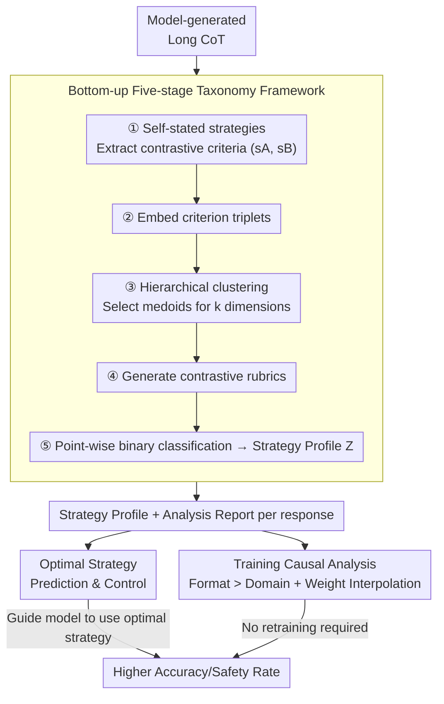

# The CoT Encyclopedia: Analyzing, Predicting, and Controlling the Thinking Process of Reasoning Models

**Conference**: ICLR 2026  
**OpenReview**: [https://openreview.net/forum?id=ugZKZ8vufv](https://openreview.net/forum?id=ugZKZ8vufv)  
**Area**: LLM Reasoning  
**Keywords**: Long Chain-of-Thought, Reasoning Strategy Taxonomy, Controllable Reasoning, Bottom-up Clustering, Safety Alignment  

## TL;DR
This paper proposes CoT Encyclopedia, a **bottom-up, data-driven** framework: it automatically mines reasoning strategy dimensions from model-generated long Chains-of-Thought (CoT), clusters them into interpretable contrastive rubrics, and uses them to predict and proactively guide the model toward optimal strategies. This approach improves accuracy and safety rates by 12.2–16.1% across 5 benchmarks and reveals the key insight that "training data format shapes reasoning style more significantly than the domain."

## Background & Motivation
**Background**: Long Chain-of-Thought (CoT) is a core component of modern Large Language Model (LLM) reasoning capabilities. Models generate numerous intermediate steps before answering, mixing various strategies (verification, backtracking, subgoal setting, backward chaining, etc.). However, understanding which strategies models use, how they vary across models/tasks, and whether they can be systematically controlled remains largely unexplored.

**Limitations of Prior Work**: Previous analyses of long CoT followed a **top-down** route—researchers manually defined a fixed set of strategy types (e.g., the four cognitive behaviors defined by Gandhi et al.: verification, backtracking, subgoal setting, and backward chaining) and used LLMs to detect them. While interpretable, this approach is limited by human intuition: it only identifies predefined categories and fails to capture the diverse emergent strategies of models. Furthermore, existing clustering methods primarily target short or medium-length CoT, leaving long-chain scenarios with interleaved strategies unaddressed.

**Key Challenge**: There is a contradiction between the **coverage** of predefined categories and the **practicality** of the analysis. This paper's experiments confirm that the distribution of the four predefined cognitive behaviors shows minimal variation across models ($p>0.05$, $|d|\approx 0.1$). This suggests that fixed taxonomies are insensitive to fine-grained reasoning differences and insufficient for guiding model improvement.

**Goal**: (1) Automatically discover reasoning strategy dimensions from data without human priors; (2) Transform analysis into actionable capabilities—predicting the best strategy for a given problem and guiding the model accordingly; (3) Clarify which training factors determine a model's reasoning style.

**Key Insight**: Instead of guessing what the model is thinking, the authors **let the model explain itself**. By prompting the model to describe the strategies used in a specific response in natural language and embedding these explanations into a semantic space for clustering, the underlying strategy dimensions of the data naturally emerge.

**Core Idea**: Use "bottom-up clustering + contrastive rubrics" instead of "top-down fixed categories" to transform reasoning from a black box into an analyzable, predictable, and controllable asset.

## Method

### Overall Architecture
The input to CoT Encyclopedia is a set of CoT responses $D=\{(x_i,y_i)\}_{i=1}^n$ ($x_i$ is the question, $y_i$ is the generated CoT), and the output is a **structured strategy profile** for each response along with a readable analysis report. The system consists of two layers: the bottom layer is a **five-stage reasoning taxonomy construction pipeline** (distilling contrastive rubrics from raw CoT and labeling responses), and the top layer consists of two applications—**prediction and control of optimal strategies**, and **causal analysis at the training side (Format vs. Domain + Weight Interpolation)**.

### Key Designs

**1. Bottom-up Five-stage Reasoning Taxonomy: Self-stated strategies clustered into interpretable dimensions**

This design directly addresses the "predefined category limitation." The framework decomposes taxonomy construction into five steps driven by LLMs:

- **① Criterion Identification**: Given a CoT dataset, prompt the LLM to brainstorm a set of classification criteria $C=\{c_1,\dots,c_N\}$. Each criterion $c_j$ is defined as a **pair of contrastive reasoning strategies** $(s_j^A, s_j^B)$ expressed in natural language. For example, "Reasoning Type" corresponds to $s^A=$ "Inductive" and $s^B=$ "Deductive." This step extracted **4,057 contrastive criteria** from responses of three 32B models.
- **② Criterion Embedding**: Each triplet is concatenated into a string and encoded via an embedding model: $e_j=E(\text{concat}(c_j, s_j^A, s_j^B))\in\mathbb{R}^d$, resulting in matrix $E\in\mathbb{R}^{N\times d}$.
- **③ Clustering & Compression**: To handle redundancy among the 4,057 criteria, **agglomerative hierarchical clustering based on cosine distance** compresses them into $k\ll N$ clusters. Crucially, each cluster is represented by its **medoid (an actual representative criterion from the cluster)** rather than a centroid to ensure interpretability. Six major dimensions converged across three benchmarks: Analytical Perspective (Top-down vs. Bottom-up), Scope of Approach, Reasoning Type (Inductive vs. Deductive), Idea Development (Multi-path vs. Single-path), Verification Focus (Hypothesis-driven vs. Data-driven), and Clarification Approach.
- **④ Rubric Generation**: For each representative medoid $c_\ell^*$, the LLM generates a rubric $R_\ell=(s_\ell^A, s_\ell^B)$ with detailed descriptions and binary classification guidelines.
- **⑤ Strategy Profile & Reporting**: For each response $y_i$ and rubric $\ell$, the LLM is prompted for a yes/no answer—$z_{i,\ell}=1$ indicates alignment with $s_\ell^A$, otherwise $0$. This yields a binary matrix $Z\in\{0,1\}^{n\times k}$, where each row is a strategy profile. Finally, the LLM synthesizes a natural language report (e.g., "The response exhibits a bottom-up style combined with data-driven verification...").

**2. Prediction & Control of Optimal Strategies: Transforming diagnosis into actionable improvement**

The design aims to predict which strategy should be used for a given problem and guide the model toward it. This involves two steps. First, the effectiveness of each strategy is estimated: across helpfulness and harmlessness criteria, the authors calculate $P(\text{Correct}\mid\text{Pattern})$ and $P(\text{Safe}\mid\text{Pattern})$ (using LLM-as-a-judge to **avoid data leakage**) to label strategies as "optimal" or "sub-optimal." Second, a binary classifier is trained for each criterion using **questions initially answered correctly** to learn the optimal strategies for tests on **questions initially answered incorrectly**. The classifier predicts the optimal strategy for failed questions, which is then included in the prompt for re-answering.

A core empirical finding supports this: **higher question similarity correlates with higher optimal strategy similarity**, and strategy variance narrows as question similarity increases. This allows the model to leverage success strategies from similar historical questions for new ones.

**3. Format Over Domain + Weight Interpolation: Revealing and manipulating the causes of reasoning styles**

The authors use Reinforcement Learning with Verifiable Rewards (RLVR) for controlled experiments. On NuminaMath, they synthesized the same content into **Multiple-Choice (MC)** and **Free-Form (FF)** formats to isolate the "format" variable, and compared the math domain with knowledge domains (OpenBookQA, QASC, SciQ) to isolate the "domain" variable. Using a 7B DeepSeek-R1-Distill model, they measured strategy distribution shifts using Cohen's $d$.

The counter-intuitive conclusion is that **strategy shifts caused by format differences are significantly larger than those caused by domain differences across all six criteria**. MC-trained models favor **structured, concise** answers and explore multiple options early (similar to Breadth-First Search). FF-trained models are **verbose, repetitive in verification**, follow a single path to the end, and frequently use filler words like "wait" (similar to Depth-First Search; FF uses "wait" tokens 4.6x more than MC). Furthermore, by **linearly interpolating the weights of MC and FF models**, the reasoning strategy **shifts smoothly** with the merging ratio, allowing the adjustment of reasoning styles for different tasks **without additional training**.

## Key Experimental Results

### Main Results: Performance gain through strategy guidance
The following table compares five settings on samples that were initially incorrect or unsafe.

| Benchmark | Metric | Un-guided | Guided-Suboptimal | Guided-Dataset Optimal | Guided-Question Optimal |
| :--- | :--- | :--- | :--- | :--- | :--- |
| GPQA-Diamond | Acc. | 61.5 | 60.4 | 70.1 | 72.0 |
| MMLU-Redux | Acc. | 74.0 | 72.2 | 79.1 | 81.3 |
| MATH-500 | Acc. | 78.2 | 75.6 | 84.3 | 87.7 |
| XSTest | Safe | 82.3 | 68.1 | 94.0 | 95.5 |
| WildGuard | Safe | 79.2 | 63.4 | 89.9 | 92.4 |

Question-specific optimal strategies consistently outperform dataset-level ones, with overall improvements of 12.2–16.1%.

### Ablation Study: Format vs. Domain / MC vs. FF

| Comparison | MC Trained | FF Trained | Note |
| :--- | :--- | :--- | :--- |
| Multi-path exploration | 75.4% | 57.4% | MC behaves like BFS |
| Avg. Length (tokens) | 1301 | 2561 | FF is more verbose |
| Total 'wait' count | 943 | 4383 | FF repeats verification |
| Avg 'wait' per response | 1.89 | 8.76 | FF is 4.6x higher |

### Key Findings
- **Failure of Predefined Taxonomies**: Predefined cognitive behaviors show minimal differences ($|d|\approx 0.1$), whereas the proposed framework's criteria reach an effect size of 0.4.
- **Predictability of Strategy**: Optimal strategies are predictable based on question similarity.
- **Fine-grained Safety Value**: Strategies that encourage "malicious" intent or prioritize "technical" over "moral" considerations significantly lower safety rates.
- **Weight Interpolation Control**: Strategy transitions are smooth, allowing for "customizing" reasoning styles by task.

## Highlights & Insights
- The **bottom-up design** of letting the model describe strategies is clever: it delegates taxonomy definition to data, capturing emergent strategies missed by human intuition while maintaining interpretability through medoids.
- The experimental design for control (learning from successes, testing on failures) is rigorous and avoids data leakage via LLM-as-a-judge.
- The **"Format Over Domain"** insight is a major "Aha!" moment: while the community focuses on domain coverage, this study shows that **presentation format (MC vs. FF)** is the primary driver of reasoning style (BFS vs. DFS).
- **Transferable Trick**: Linear weight interpolation allows for smooth tuning of reasoning behavior without fine-tuning, applicable to task-tailored deployments.

## Limitations & Future Work
- **Reliance on GPT-4o as a Judge**: Strategy evaluations may inherit the judge's biases.
- **Limited Scope**: Experiments focused on three benchmarks and model families; broader scenarios like code generation or multi-modal tasks are yet to be validated.
- **Instruction Following Dependence**: Guidance relies on the model's ability to follow style instructions, which may be weaker in smaller models.
- **Future Directions**: Integrating multiple judges or human calibration and expanding the taxonomy to more tasks are key to confirming generalizability.

## Related Work & Insights
- **vs. Predefined Cognitive Analysis (Gandhi et al., 2025)**: While they use top-down detection, this work uses bottom-up discovery, achieving higher sensitivity to fine-grained differences (Effect size 0.4 vs. 0.1).
- **vs. Reasoning Visualization (Wen et al. 2025; Zhou et al. 2025)**: These provide qualitative insights; this paper provides a direct mechanism for behavioral control.
- **vs. CoT Monitoring (Korbak et al., 2025)**: This work advances from "can we monitor CoT" to "how to decompose and control" reasoning patterns.

## Rating
- Novelty: ⭐⭐⭐⭐⭐ 
- Experimental Thoroughness: ⭐⭐⭐⭐ 
- Writing Quality: ⭐⭐⭐⭐⭐ 
- Value: ⭐⭐⭐⭐⭐ 

<!-- RELATED:START -->

## Related Papers

- [\[NeurIPS 2025\] Controlling Thinking Speed in Reasoning Models](../../NeurIPS2025/llm_reasoning/controlling_thinking_speed_in_reasoning_models.md)
- [\[ICLR 2026\] Predicting LLM Reasoning Performance with Small Proxy Model](predicting_llm_reasoning_performance_with_small_proxy_model.md)
- [\[ICLR 2026\] On the Thinking-Language Modeling Gap in Large Language Models](on_the_thinking-language_modeling_gap_in_large_language_models.md)
- [\[ICLR 2026\] Adaptive Thinking: Large Language Models Know When to Think in Latent Space](adaptive_thinking_large_language_models_know_when_to_think_in_latent_space.md)
- [\[ICLR 2026\] Thinking-Free Policy Initialization Makes Distilled Reasoning Models More Effective and Efficient Reasoners](thinking-free_policy_initialization_makes_distilled_reasoning_models_more_effect.md)

<!-- RELATED:END -->
