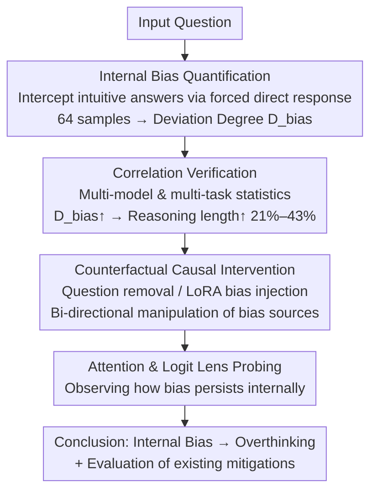

# The First Impression Problem: Internal Bias Triggers Overthinking in Reasoning Models

**Conference**: ICLR 2026 (Poster)  
**arXiv**: [2505.16448](https://arxiv.org/abs/2505.16448)  
**Authors**: Renfei Dang, Zhening Li, Shujian Huang, Jiajun Chen (Nanjing University)  
**Code**: None  
**Area**: LLM Reasoning  
**Keywords**: Overthinking, Internal Bias, Reasoning Models, Causal Intervention, Attention Mechanism

## TL;DR

Reasoning models form a "first impression" (internal bias) regarding the answer the moment they see a question. When this intuitive guess conflicts with subsequent systematic reasoning, the model enters a cycle of self-doubt and re-checking, causing reasoning length to expand by 21%–43%. Existing mitigation methods fail to fundamentally eliminate this effect.

## Background & Motivation

Reasoning models like DeepSeek-R1 and OpenAI o1 achieve breakthrough performance in complex reasoning tasks through internal Chain-of-Thought (CoT) for self-reflection and error correction. However, they face a prominent efficiency bottleneck—**overthinking**: generating a large number of redundant reasoning steps (e.g., repeated "Wait...", "Let me re-check..."), which wastes computational resources without improving accuracy, and sometimes even degrades answer quality.

Existing research primarily describes overthinking at the **external behavior** level (e.g., mismatch between reasoning tokens and problem difficulty). However, the reason **why models fall into these meaningless reflection loops** remains unexplained. Drawing inspiration from the **anchoring effect** in cognitive psychology, this paper proposes a novel causal explanation—**"The First Impression Problem"**:

- After receiving an input question but **before** the `<think>` reasoning officially begins, an initial guess about the answer (termed **internal bias**) is already encoded in the model's hidden states.
- This "first impression" is not necessarily output explicitly but persists in the model's intermediate representations.
- When this initial guess conflicts with the conclusion derived from subsequent reasoning, the model struggles to "let go," repeatedly revisiting the original question and performing self-correction, which leads to redundant reflection.
- In extreme cases, the model may trap itself in **parroting**—constantly repeating the same reasoning steps without ever converging on a final answer.

## Method

### Overall Architecture

Rather than proposing a new model, this paper constructs a progressive empirical chain to demonstrate the "first impression" hypothesis. It addresses the core question: why reasoning models fall into meaningless reflection loops. The authors systematically expose this invisible "first impression": first, by quantifying internal bias through forced direct answering; then, by verifying the statistical correlation between this bias and reasoning length across multiple models and tasks; followed by using two sets of counterfactual interventions to establish causality; and finally, by using attention and Logit Lens probing to open the black box and observe how bias manifests internally, while evaluating why existing mitigation methods fail. Each of the four stages builds on the previous one, with the output of the first stage (bias measurement $D_{bias}$) serving as the independent variable for the next.

### Key Designs

**1. Internal Bias Quantification: Intercepting the "Intuitive Answer" before Reasoning**

To study the first impression, the invisible preliminary guess must be converted into a measurable value. The authors employ a **Direct Answer** method: prepending a forced direct response prompt like "Answer without thinking more:" to intercept the output before the `<think>` block starts, obtaining an intuitive answer $a_{bias}$. To reduce noise, 64 samples are drawn for each question to form an internal bias distribution $\tilde{a}_{bias}$. A **Deviation Degree** $D_{bias}$ is then defined to characterize the distance between the intuition and the final reasoning answer $a_{final}$: for numerical tasks, it is the Mean Absolute Error $D_{bias} = \text{mean}(|a_{bias} - a_{final}|)$; for multiple-choice tasks, it is the inconsistency rate. A larger $D_{bias}$ indicates a stronger conflict between the first impression and systematic reasoning.

**2. Correlation Verification: High Bias Costs occur after the First Answer**

Statistics across models like DeepSeek-R1-671B, QwQ-32B, and distilled R1 versions on benchmarks like AIME and KnowLogic show that as $D_{bias}$ increases, reasoning length rises significantly, with the **relative length increase $R_\Delta$ consistently falling between 21.0%–43.1%**. More tellingly, measurements of the **First Answer Position** reveal that models reach their first logical conclusion at nearly the same time regardless of bias level. The extra tokens are almost **entirely** composed of repeated checks and self-doubt following that initial conclusion. This points to the model's inability to let go of its first impression after reaching an answer, rather than the reasoning task itself being inherently more difficult.

**3. Counterfactual Causal Intervention: Validating Causality via Bi-directional Manipulation**

Since correlation does not imply causation, two complementary counterfactual experiments were designed. The first is **Question Removal**: as soon as the model generates its first complete answer, the original question is removed from the context, forcing the model to decide whether to continue reflecting based only on its generated reasoning chain. Using a redundancy reduction ratio $r = (L_{ori} - L_{rem}) / (L_{ori} - P_{first})$, results on AIME 2024 showed that redundant tokens **decreased by 53.5%** with no loss in accuracy. Removing the bias source stops the reflection. The second is **Bias Injection**: LoRA is used to inject incorrect biases into easy problems (Low2Wrong) and correct biases into difficult problems (High2Correct). The former induced massive redundant reflection in simple problems, while the latter significantly mitigated overthinking in hard problems. These bi-directional results establish a causal link between internal bias and overthinking.

**4. Attention and Logit Lens Probing: Visualizing Internal Bias Conflicts**

Interpretability methods were used to uncover the mechanism. Attention dynamics show that at the exact moment the model triggers reflection (e.g., outputting "Wait..."), its attention weight on the original input question surges to over **4 times** that of normal reasoning—the model "re-visits" the question to re-activate its first impression. Logit Lens reveals a striking image: for a sample where the model eventually reasons correctly that $a_{final}=3$ but had an internal bias of $a_{bias}=5$, the internal decoding probability of the biased answer "5" **consistently exceeds** the correct answer "3" in the intermediate to late layers, even after "3" has been explicitly written in the reasoning chain. This reveals a persistent **cognitive dissonance** where intuition and logic compete internally, serving as the microscopic root of overthinking.

## Key Experimental Results

### Bias-Overthinking Correlation Experiments

Verification of the relationship between $D_{bias}$ and reasoning length across models and tasks:

| Model | Task | Low Bias Group Length | High Bias Group Length | Relative Gain $R_\Delta$ |
|------|------|:---------:|:---------:|:---------:|
| DeepSeek-R1-671B | AIME | Baseline | Significant Increase | 21.0%–43.1% |
| QwQ-32B | AIME | Baseline | Significant Increase | Within Range |
| DeepSeek-R1 Distill | KnowLogic | Baseline | Significant Increase | Within Range |
| Consistent across models | Multi-task | Baseline | Significant Increase | **All >20%** |

Key Observation: Both groups reach the **first complete answer** at nearly the same position; the extra tokens are concentrated in the redundant reflection interval following the first answer.

### Counterfactual Intervention Results

| Intervention | Action | Redundant Reasoning Change | Impact on Accuracy |
|---------|---------|:---------:|:---------:|
| Question Removal | Delete question after first answer | **Decreased 53.5%** (AIME 2024) | Stable/Slight Rise |
| Low2Wrong Injection | Inject incorrect bias via LoRA | **Significant Increase** | Decrease |
| High2Correct Injection | Inject correct bias via LoRA | **Significant Decrease** | Increase |

### Evaluation of Existing Mitigation Methods

| Method | Type | Reduces Length? | Eliminates Bias Impact ($R_\Delta$)? | Impact on Accuracy |
|------|------|:---------:|:---------:|:---------:|
| FCS (SFT+DPO) | Training-time | Yes (avg length) | No, $R_\Delta$ persists/worsens | May drop on complex tasks |
| SEAL | Inference-time | Yes | No, bias impact persists | Stable |
| PROBE | Inference-time | Yes | No, bias impact persists | Stable |
| Attention Early Exit (Ours) | Inference-time | Yes | **Partially Effective**: $R_\Delta$ 31.5% → 9.4% | Minimal precision loss |

Core Conclusion: Methods like FCS, SEAL, and PROBE essentially just "truncate" the reasoning chain without resolving the underlying conflict between internal bias and systematic reasoning. Only the proposed **Attention Early Exit** mechanism—which monitors normalized attention to the original question and terminates reasoning if a threshold is exceeded—shows preliminary success in addressing the root cause.

## Highlights & Insights

1.  **Mapping Cognitive Psychology to LLM Mechanisms**: By mapping the "anchoring effect" and Kahneman’s System 1/System 2 theory to reasoning model behaviors, the study finds that models exhibit a human-like conflict between fast intuition (System 1) and slow reasoning (System 2). This provides a new path for understanding LLM behavior through cognitive science.
2.  **Rigorous Causal Inference Design**: The study goes beyond correlation analysis by using two complementary counterfactual interventions (removing the bias source and injecting bias) to establish causality from both directions. The LoRA bias injection experiment is particularly elegant as it controls for both problem difficulty and bias direction.
3.  **Significant Value of "Negative Results"**: Systematically demonstrating that existing methods like FCS, SEAL, and PROBE fail to eliminate the influence of internal bias is a major finding. It suggests that superficial truncation of reasoning chains does not address the root problem, necessitating solutions at the architectural or training level.
4.  **"Cognitive Dissonance" Revealed by Logit Lens**: The discovery that a biased initial guess maintains a higher decoding probability in intermediate layers even after the correct answer has been explicitly reasoned out is fascinating. it reveals the parallel competitive dynamics of "intuition" and "logic" within reasoning models.

## Limitations & Future Work

1.  **Lack of a Fundamental Solution**: While the Attention Early Exit mechanism shows promise (reducing $R_\Delta$ from 31.5% to 9.4%), it remains an external inference-time intervention. Future work could explore "bias decoupling" objectives during the RL training phase.
2.  **Limited Model Coverage**: Experiments were primarily conducted on open-source reasoning models like DeepSeek-R1 and the Qwen series. Applicability to closed-source models like o1 or Claude remains unknown, and bias formation may differ across training paradigms (pure RL vs. SFT+RL).
3.  **Task Scope Focused on Deterministic Reasoning**: Experiments were concentrated on tasks with clear correct answers like Mathematics (AIME) and Logic (KnowLogic). Overthinking in open-ended generation or creative writing has not been explored, and bias quantification in these scenarios requires new designs.
4.  **Completeness of Bias Extraction**: The forced direct answer prompt might not capture all forms of bias information in hidden states. More refined probing methods (e.g., training a probing classifier on hidden states) might provide more accurate estimates.
5.  **Future Directions**: Designing explicit System 1 / System 2 architectures to decouple intuitive and reasoning paths internally, or researching attention regularization techniques to reduce excessive focus on original inputs during reasoning.

## Related Work & Insights

-   **Overthinking Analysis**: Chen et al. (2024) "Do not think that much for 2+3=?" first described overthinking in o1-like models; this paper delves deeper into the internal mechanisms.
-   **Reasoning Unfaithfulness**: Arcuschin et al. (2025) found that CoT reasoning is not always faithful and that final answers can be shaped by implicit biases rather than the reasoning chain, which corroborates the findings of this study.
-   **Circuit Tracing**: Research from Anthropic suggests LLMs may have independent "fast estimation" neural circuits, providing mechanistic evidence for the "internal bias" discussed here.
-   **Reasoning Efficiency Optimization**: Methods such as SEAL (hidden state guidance) and PROBE (confidence probing) are shown by this study to address symptoms rather than the root cause.
-   **Inspiration**: **Cognitive science-driven behavior analysis of LLMs** is a promising research route; the System 1/System 2 distinction could inspire entirely new reasoning model architectures.

## Rating

-   Novelty: ⭐⭐⭐⭐⭐ (The "First Impression Problem" is an original discovery; the bridge between cognitive psychology and LLM mechanism analysis is highly innovative.)
-   Experimental Thoroughness: ⭐⭐⭐⭐⭐ (Correlation analysis + bi-directional causal intervention + attention/Logit Lens interpretability + mitigation evaluation + new solution exploration forms a complete and rigorous chain.)
-   Writing Quality: ⭐⭐⭐⭐ (Concepts are clearly articulated, the "first impression" analogy is intuitive, and the narrative logic of the progressive experiments is smooth.)
-   Value: ⭐⭐⭐⭐⭐ (Understanding the root cause of overthinking is a milestone for reasoning models, providing direct guidance for future design and training paradigms.)

<!-- RELATED:START -->

## Related Papers

- [\[ICLR 2026\] Your Models Have Thought Enough: Training Large Reasoning Models to Stop Overthinking](your_models_have_thought_enough_training_large_reasoning_models_to_stop_overthin.md)
- [\[ICML 2025\] Adversarial Manipulation of Reasoning Models using Internal Representations](../../ICML2025/llm_reasoning/adversarial_manipulation_of_reasoning_models_using_internal_representations.md)
- [\[ICLR 2026\] Overthinking Reduction with Decoupled Rewards and Curriculum Data Scheduling](overthinking_reduction_with_decoupled_rewards_and_curriculum_data_scheduling.md)
- [\[NeurIPS 2025\] The Virtues of Brevity: Avoid Overthinking in Parallel Test-Time Reasoning](../../NeurIPS2025/llm_reasoning/the_virtues_of_brevity_avoid_overthinking_in_parallel_test-time_reasoning.md)
- [\[ICLR 2026\] Sample Smart, Not Hard: Correctness-First Decoding for Better Reasoning in LLMs](sample_smart_not_hard_correctness-first_decoding_for_better_reasoning_in_llms.md)

<!-- RELATED:END -->
## Related Papers

- [\[ICLR 2026\] Your Models Have Thought Enough: Training Large Reasoning Models to Stop Overthinking](your_models_have_thought_enough_training_large_reasoning_models_to_stop_overthin.md)
- [\[ICLR 2026\] Sample Smart, Not Hard: Correctness-First Decoding for Better Reasoning in LLMs](sample_smart_not_hard_correctness-first_decoding_for_better_reasoning_in_llms.md)
- [\[ICLR 2026\] Overthinking Reduction with Decoupled Rewards and Curriculum Data Scheduling](overthinking_reduction_with_decoupled_rewards_and_curriculum_data_scheduling.md)
- [\[ICLR 2026\] OR-PRM: A Process Reward Model for Algorithmic Problem in Operations Research](or-prm_a_process_reward_model_for_algorithmic_problem_in_operations_research.md)
- [\[ICML 2025\] Adversarial Manipulation of Reasoning Models using Internal Representations](../../ICML2025/llm_reasoning/adversarial_manipulation_of_reasoning_models_using_internal_representations.md)

<!-- RELATED:END -->
