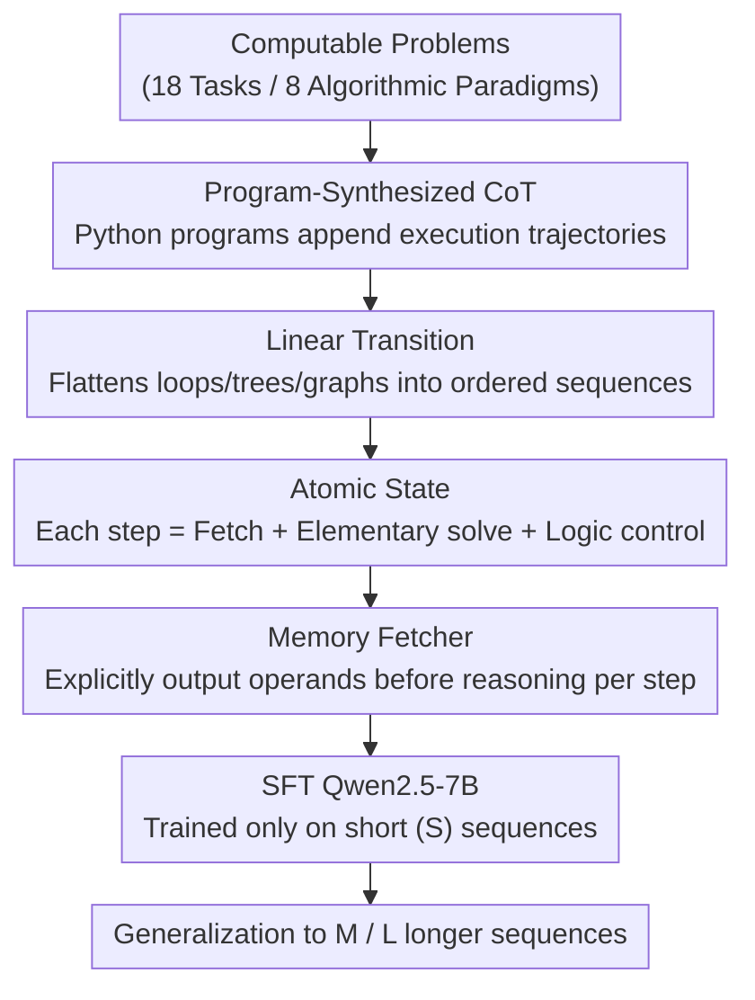

# The Imitation Game: Turing Machine Imitator is Length Generalizable Reasoner

**Conference**: ICLR 2026  
**OpenReview**: [https://openreview.net/forum?id=i2IQRtYchF](https://openreview.net/forum?id=i2IQRtYchF)  
**Code**: None  
**Area**: LLM Reasoning  
**Keywords**: Length Generalization, Turing Machine Imitation, Chain-of-Thought Synthesis, Computable Problems, Supervised Fine-Tuning

## TL;DR
This paper proposes TAIL (Turing mAchine Imitation Learning), which uses Python programs to automatically synthesize Chain-of-Thought (CoT) data that mimics the execution process of a Turing Machine. By decomposing reasoning into three structures—linear expansion, atomic states, and explicit data fetching—and fine-tuning Qwen2.5-7B solely on synthetic data, the model achieves stable generalization to sequences longer than those seen during training across 18 algorithmic tasks, even surpassing DeepSeek-R1 (671B).

## Background & Motivation
**Background**: Length generalization—the ability of a model to process longer inputs than those encountered during training—is a core benchmark for evaluating the reasoning capabilities of Transformer-based Large Language Models (LLMs). While Chain-of-Thought (CoT) significantly enhances complex reasoning, recent studies consistently find that once input length exceeds the training distribution, LLMs often explore and fall into "shortcuts," ultimately failing on long sequences.

**Limitations of Prior Work**: Existing efforts primarily follow a data-driven approach by modifying CoT structures to enhance generalization, such as adding Index Hints for symbolic reasoning or using Reversed Format for arithmetic. However, these techniques are **task-specific**—Index Hints only benefit bit-alignment tasks, and Reversed Format is only suitable for problems like addition—meaning they cannot be transferred to a broader range of tasks and offer limited gains.

**Key Challenge**: The absence of a **universal and effective** CoT structure. The authors observe a commonality among these tasks: they can all be solved by a well-defined, deterministic algorithmic process, and algorithms naturally handle inputs of arbitrary length. The authors refer to such tasks as "Computable Problems." Since all computable problems can be solved by a Turing Machine (Church-Turing thesis), making an LLM **faithfully imitate the execution of a Turing Machine program** within its CoT should theoretically provide length generalization independent of the specific task.

**Goal**: To identify a CoT structure reusable across tasks that allows LLMs to perform basic operations on a "memory tape" step-by-step like a Turing Machine, rather than relying on memorizing surface patterns or taking shortcuts.

**Core Idea**: Use three core properties of Turing Machine execution—linear expansion of states, atomicity of single steps, and explicit reading/writing of tape data—to constrain CoT generation. Furthermore, since Turing Machine execution can be deterministically reproduced by code, Python programs are used to directly synthesize this CoT training data.

## Method

### Overall Architecture
The core assertion of TAIL is that **length generalization does not require a "human-like" thinking style, but rather a CoT that is structurally aligned with a Turing Machine's execution trajectory**. Formally, a Turing Machine is defined as a 7-tuple $M=(Q,\Sigma,\Gamma,\delta,q_0,B,F)$, where its transition function $\delta(q_s,a)=(q_{s+1},b,D)$ denotes reading symbol $a$ in state $q_s$, writing $b$, moving the head, and transitioning to $q_{s+1}$. The execution of a complete program is a linear expansion of states $q_0\to q_1\to\cdots\to q_n$. The authors align each CoT step $x_i$ to a Turing Machine state $q$, making the entire CoT $x_0\to x_1\to\cdots\to x_n$ a complete unfolding of state transitions.

The pipeline is as follows: for each computable task, a Python program is written to solve it. `append` statements are inserted according to the algorithmic steps so that the program outputs a string representing a CoT with the three Turing Machine properties. Qwen2.5-7B is fine-tuned using this synthetic data (SFT) to acquire length generalization. The three core modules, from macro to micro, are: **Linear Transition** (defining the overall structure), **Atomic State** (constraining step granularity), and **Memory Fetcher** (solving cross-distance data retrieval).

### Key Designs

**1. Program-Synthesized CoT: Printing Turing Machine Trajectories as Training Data**

A major pain point in existing data-driven methods is the manual design of CoT formats, which is neither universal nor guaranteed to follow algorithmic logic. TAIL's key shift is moving away from humans or LLMs "writing" CoT and instead **letting deterministic Python programs "run" the CoT**. A standard solver is written for each task, with string `append` statements inserted at key algorithmic steps. The resulting string is a complete, error-free CoT that strictly reflects the execution flow. This allows the three core modules to be explicitly injected at the program level—treating each algorithmic step as an atomic state, flattening the process into a linear transition, and printing current operands as memory fetching. The authors argue TAIL is **task-universal**: any task solvable by a program can generate such a CoT, whereas Index Hint / Reversed Format are too structurally specific to transfer.

**2. Linear Transition: Flattening Control Structures to Block Shortcuts**

According to the RASP-Generalization conjecture, Transformers struggle with complex control structures like loops. Linear transition requires, at a macro level, that structures like trees, graphs, and loops be **completely and non-redundantly expanded linearly** into an ordered sequence of reasoning steps, much like how a Turing Machine flattens a loop-heavy program into sequential transitions $q_1\to q_2\to\cdots\to q_n$. This eliminates shortcuts; traditional CoT often packs massive computations into "oversized subtasks," allowing the model to jump to a result without reaching it. By forcing every step to be explicitly traversed, the model must faithfully reproduce the algorithm, seamlessly extrapolating the "process learned on short sequences" to long ones.

**3. Atomic State: Minimizing Single Steps to Avoid Internal Shortcuts**

Linear transition only dictates that "steps must be linear," not "how large each step is." Overly large steps increase learning difficulty and induce shortcuts within the step itself. Atomic State draws from the fixed structure of Turing Machine states—Read, Write, Transition—to standardize each reasoning step into: operand retrieval (via Memory Fetcher), an elementary solution, and logical control statements. Based on the RASP-L hypothesis, each atomic state must satisfy achievability and simplicity, implemented as "a single algorithmic step without internal loops." By slicing reasoning into this minimal granularity, every step remains simple enough for the Transformer to execute stably; as length increases, only the number of steps grows linearly, rather than the difficulty of individual steps.

**4. Memory Fetcher: Decoupling "Data Retrieval" from "Computation"**

Autoregressive models can only append tokens and cannot modify previously generated tokens in place; thus, the LLM context is essentially an ever-growing memory tape. As reasoning progresses, required operands drift further from the current position. Attempting to both "find data" across long-range attention and "compute" in the same step significantly increases difficulty. The Memory Fetcher splits this: (1) it **explicitly outputs all operands needed for the current step** at the beginning of each atomic state, and (2) it performs local reasoning based on these nearby operands. For example, in 0/1 Knapsack DP, it retrieves `dp[9][5]=16` and `dp[9][11]=15` into the current step before calculating `dp[10][11]=16`. Attention visualization confirms that with a Memory Fetcher, write-operation attention is concentrated on operands within the same state (strong, focused local attention), resembling Turing Machine read/writes.

### A Complete Example: One Step of 0/1 Knapsack DP
Consider a 0/1 Knapsack problem where a gardener has 11 square meters. The model identifies this as a DP problem and **linearly expands** the table-filling process into an ordered sequence of Step 1 → Step 2 → … (Linear Transition). Inside the **Atomic State** `Step 1. Consider dp[10][11]`: it first explicitly writes operands `dp[9][5]+6=16` and `dp[9][11]=15` via the Memory Fetcher, performs the elementary solving of "take or leave item 10," and finally `Return back to dp[10][11]` to get `dp[10][11]=16`. The entire CoT is a linear concatenation of such atomic states, isomorphic to a Turing Machine state transition.

## Key Experimental Results

### Main Results
The dataset covers 8 categories of algorithmic paradigms and 18 tasks. For each task, 100k training samples and 500 evaluation samples are synthesized for three length tiers: Short (S), Medium (M), and Long (L). Models are trained only on S and evaluated on M/L to detect performance drops. Metrics are zero-shot pass@1 accuracy with greedy decoding.

| Task (Big Integer Addition) | S | M | L | Description |
|------|------|------|------|------|
| Index Hint | 57.0 | 34.5 | 24.0 | Prior data-driven method |
| Reversed Format | 39.5 | 35.5 | 35.0 | Prior data-driven method |
| **TAIL (Ours)** | **97.0** | **92.5** | **86.5** | Nearly no drop on long sequences |

Across 18 tasks, TAIL-7B outperforms Qwen2.5-7B Base, Qwen2.5-7B Instruct, and DeepSeek-R1 (671B) in both accuracy and length generalization, with CoT lengths often shorter than those of the reasoning models. The authors attribute this to reasoning models relying on "trying multiple paths + shortcutting," whereas TAIL mandates step-by-step algorithmic execution.

### Ablation Study
Representative tasks were selected from four algorithm categories, with pass@1 evaluated on sequences exceeding training length (average of M/L):

| Configuration | Simulation (M/L) | Iteration (M/L) | Greedy (M/L) | Description |
|------|------|------|------|------|
| Qwen2.5-7B Base | 47.4 / 38.6 | 12.4 / 17.0 | 11.2 / 13.0 | Baseline (no fine-tuning) |
| w/o Atomic State | 82.6 / 73.6 | 77.2 / 61.2 | 77.4 / 61.0 | Removed Atomic State |
| w/o Linear Transition | 80.0 / 75.4 | 76.2 / 54.0 | 77.4 / 74.2 | Removed Linear Transition |
| w/o Memory Fetcher | 90.2 / 88.0 | 73.8 / 67.6 | 80.8 / 74.8 | Removed Memory Fetcher |
| **TAIL (Full)** | **94.2 / 90.0** | **90.0 / 84.4** | **90.2 / 71.8** | Three modules combined |

### Key Findings
- **Removing any module significantly degrades long-sequence performance**: The magnitude of the drop depends on the task structure—Memory Fetcher is critical for iteration (e.g., Population Growth), whereas recursive tasks benefit most from Linear Transition.
- **"Thinking style" is largely irrelevant**: Minimalist TAIL-CoT (containing only the three modules with no anthropomorphic language) performed nearly identically to the polished TAIL-CoT-styled version. This suggests length generalization stems from the Turing Machine structure, not natural language narrative style.
- **Length generalization activation**: By maintaining the same total sample count but including a very small fraction of long sequences (e.g., S:M:L = 8:1:1), performance on long sequences saturated quickly for most tasks. This contradicts previous beliefs that training data length must be balanced.

## Highlights & Insights
- **Reducing "Length Generalization" to "Turing Machine Imitation"**: Uses the Church-Turing thesis to provide a theoretical anchor for a "universal CoT structure," which is more fundamental than per-task formatting.
- **Synthesis via Programs instead of LLMs**: Deterministic programs ensure every CoT is error-free and structurally sound, bypassing the noise and uncontrollable formatting of distillation.
- **Mechanistic Evidence**: Attention visualization shows that write operations focus on operands fetched within the same state, providing observable evidence that the LLM is mimicking Turing Machine read/writes.
- **Transferable Trick**: The Memory Fetcher's "explicitly fetch, then reason" decoupling can be applied to any task requiring long-distance intermediate results (e.g., multi-hop QA) to alleviate retrieval burdens in long contexts.

## Limitations & Future Work
- **Scoped to Computable Problems**: The method assumes a task can be solved by a deterministic program; it is not applicable to open-ended reasoning (e.g., common sense or creative tasks).
- **Dependency on Manual Solvers**: Each task requires a human to write a correct Python solver to generate the CoT, which introduces human labor and potential for global data pollution if the solver is incorrect.
- **Increased CoT Length**: Atomic states flatten reasoning into many small steps. While shorter than some reasoning models, the step count for extremely long inputs may still pose inference overhead.
- **Validated only on Qwen2.5-7B**: The performance of this structure on smaller/larger models or during the pre-training phase has not been fully explored.

## Related Work & Insights
- **vs Index Hint / Reversed Format**: These are specialized CoT formats for narrow tasks (bit-matching/arithmetic). TAIL uses a universal computation model to unify CoT construction across all computable problems, leading by a wide margin (86.5% vs 24–35% on long-sequence addition).
- **vs Reasoning Models like DeepSeek-R1**: Reasoning models rely on anthropomorphic "styles" and trial-and-error, which are prone to shortcuts. TAIL proves that the key to length generalization is structured execution, not linguistic style.
- **vs Transformer Turing-Completeness Theory**: Prior work proved Transformers are Turing-complete with enough CoT, but did not provide a concrete method to construct such CoT across diverse tasks; TAIL implements this as three programmable modules.

## Rating
- Novelty: ⭐⭐⭐⭐⭐ Unifying CoT design for length generalization via Turing Machine imitation is a fresh perspective with theoretical support.
- Experimental Thoroughness: ⭐⭐⭐⭐ 18 tasks, three-module ablation, data ratios, and attention visualization; however, only validated on a single 7B model.
- Writing Quality: ⭐⭐⭐⭐ Clear logic from theory to method to experiments with intuitive diagrams.
- Value: ⭐⭐⭐⭐⭐ Provides a reusable and programmable universal paradigm for enabling length generalization in LLMs.

<!-- RELATED:START -->

## Related Papers

- [\[ICLR 2026\] ∇-Reasoner: LLM Reasoning via Test-Time Gradient Descent in Latent Space](nabla-reasoner_llm_reasoning_via_test-time_gradient_descent_in_latent_space.md)
- [\[ICLR 2026\] Generative Adversarial Reasoner: Enhancing LLM Reasoning with Adversarial Reinforcement Learning](generative_adversarial_reasoner_enhancing_llm_reasoning_with_adversarial_reinfor.md)
- [\[ICLR 2026\] When More Is Less: Understanding Chain-of-Thought Length in LLMs](when_more_is_less_understanding_chain-of-thought_length_in_llms.md)
- [\[ICLR 2026\] Generalizable End-to-End Tool-Use RL with Synthetic CodeGym](generalizable_end-to-end_tool-use_rl_with_synthetic_codegym.md)
- [\[ICLR 2026\] InftyThink: Breaking the Length Limits of Long-Context Reasoning in Large Language Models](inftythink_breaking_the_length_limits_of_long-context_reasoning_in_large_languag.md)

<!-- RELATED:END -->
