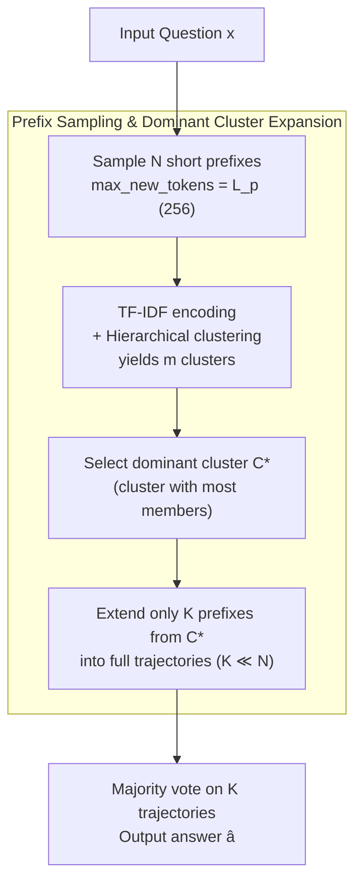

# The Path of Least Resistance: Guiding LLM Reasoning Trajectories for Efficient Consistency

**Conference**: ICLR 2026  
**arXiv**: [2601.21494](https://arxiv.org/abs/2601.21494)  
**Code**: None  
**Area**: LLM/NLP  
**Keywords**: self-consistency, inference efficiency, prefix clustering, reasoning, token reduction

## TL;DR

Proposes PoLR (Path of Least Resistance), the first inference-time method leveraging reasoning prefix consistency. By clustering short prefixes and only extending the dominant cluster, it serves as an efficient alternative to Self-Consistency, reducing token usage by up to 60% and latency by 50%.

## Background & Motivation

**Background**: Self-Consistency (SC) decoding significantly improves LLM reasoning accuracy by sampling multiple reasoning trajectories and selecting the final answer via majority voting. However, it incurs massive computational overhead—every trajectory must be fully expanded. Existing improvements like Adaptive Consistency (AC) and Early-Stopping SC (ESC) stop early when consensus is reached on the final answer, but share a fundamental limitation: **answer-level consistency is only observable after the full reasoning trajectory is generated**, failing to exploit the rich structural information available in the early stages of reasoning.

**Key Insight**: The core observation of PoLR is that **reasoning trajectory prefixes (the first few steps) already contain strong signals regarding the final solution**, a phenomenon termed "prefix consistency." Reasoning trajectories sharing the same prefix reach nearly the same accuracy as full SC, implying that the massive token cost spent on extra trajectories rarely contributes to the final answer.

## Method

### Overall Architecture

PoLR addresses a specific problem: SC expands all $N$ trajectories to the end, resulting in high accuracy but massive token waste, as most trajectories are eventually discarded by the majority vote. The Mechanism of PoLR is to insert an "early-branching" step into the SC pipeline: first sample a batch of **short reasoning prefixes**, cluster them by content, and only expand the dominant cluster (the one with the most members) into full trajectories for majority voting. This prunes most samples at the prefix stage, saving tail-end tokens. The process involves: sampling $N$ short prefixes → TF-IDF encoding and hierarchical clustering → selecting the dominant cluster $C^*$ → continuing only $K$ trajectories from $C^*$ → majority voting for the final answer.

### Key Designs

**1. Prefix Sampling & Dominant Cluster Expansion: Moving trajectory selection to early reasoning**

The waste in SC stems from expanding all $N$ trajectories before voting. PoLR shifts the decision of "which trajectories are worth completing" to the prefix stage. It first generates $N$ short prefixes $p_i = \text{Prefix}(\mathcal{M}(x, t_i), L_p)$ by limiting `max_new_tokens` to $L_p$. Each prefix is encoded into a sparse vector using TF-IDF bag-of-words and grouped via agglomerative hierarchical clustering into $\mathcal{C} = \{C_1,\dots,C_m\}$. The dominant cluster $C^* = \arg\max_{C_j}|C_j|$ is chosen, and only $K$ prefixes from it are continued into full trajectories $r_k = \mathcal{M}(x\,\vert\,p_k)$. The final answer is obtained via standard majority voting $\hat{a} = \arg\max_y \sum_{k=1}^K \mathbf{1}[a_k = y]$. The design choices prioritize lightness: TF-IDF is model-agnostic and runs on CPU in milliseconds, as neural encoders provide negligible accuracy gains relative to their clustering overhead. Hierarchical clustering suits scenarios where $N$ is small (11–51 in experiments) without pre-specifying the number of clusters. When $K=N$ and clustering is skipped, PoLR reverts to standard SC.

**2. Token Efficiency: Quantifying the saved tokens**

To quantify gains and facilitate theoretical analysis, PoLR defines token efficiency as the proportion of tokens saved relative to SC:

$$\eta = 1 - \frac{T_{\text{PoLR}}}{T_{\text{SC}}} = 1 - \frac{N \cdot \ell_p + K \cdot (\ell_f - \ell_p)}{N \cdot \ell_f}$$

where $\ell_p$ is the average prefix length, $\ell_f$ is the full trajectory length, $T_{\text{SC}} = N\cdot\ell_f$, and $T_{\text{PoLR}} = N\cdot\ell_p + K\cdot(\ell_f-\ell_p)$. The first term $N\cdot\ell_p$ is the fixed cost for $N$ prefixes, and the second term is the incremental cost of expanding only $K$ trajectories to completion. Since $K \ll N$, this second term eliminates the tail overhead of most trajectories, driving efficiency.

**3. Mutual Information Alignment & Structural Skewness: Decoupling "why accuracy holds" and "why it saves"**

PoLR explains its safety and efficiency using two independent properties. Safety depends on **correctness alignment**: let $Y\in\{0,1\}$ indicate trajectory correctness and $Z$ indicate the cluster assignment. If $I(Z;Y)>0$ (cluster assignment weakly predicts correctness), expanding the dominant cluster does not systematically discard the correct answer. Efficiency depends on **structural skewness**: defining the skewness rate $\kappa = |C^*|/N$, a lower bound for token efficiency is $\eta \geq 1 - \frac{K}{M}\cdot\kappa^{-1}$. This means the more prefixes concentrate in the dominant cluster (higher $\kappa$), the greater the savings. In practice, Normalized Mutual Information (NMI) remains low ($\leq 0.18$) while efficiency hits 50–58%, indicating that the primary gains come from strong structural skewness (trajectories converging early) rather than a strong correlation between clusters and correctness.

### Loss & Training

PoLR is a pure inference-time method involving no training or fine-tuning; its optimization goal is to minimize token consumption subject to maintaining SC accuracy.

## Key Experimental Results

### Main Results

Evaluated across multiple LLM families on GSM8K, Math500, AIME24/25, and GPQA-Diamond:

| Model | Dataset | N | SC Acc | PoLR Δ | η (%) | Overhead kt (ms) |
|------|--------|---|--------|--------|-------|-------------|
| QWQ32B | GSM8K | 51 | 90.8% | -0.3 | 47.6 | 11.2 |
| DSQ7B | Math500 | 31 | 89.6% | +0.1 | 48.5 | 5.1 |
| QWQ32B | GPQA-D | 51 | 68.7% | +1.5 | 53.8 | 11.2 |
| DSQ7B | AIME25 | 31 | 33.7% | +2.7 | - | - |
| Phi-4-15B | AIME25 | 31 | 32.0% | +4.0 | - | - |
| QWQ32B | Math500 | 51 | 91.8% | +0.2 | 51.8 | 11.2 |

**Key Findings**:
- Token efficiency η usually ranges from 40–60%, effectively halving token consumption.
- Clustering overhead kt is only a few milliseconds, translating savings directly into faster inference.
- Accuracy is maintained or occasionally improved, as PoLR emphasizes dominant consistent reasoning clusters, filtering out noisy trajectories.
- The 10-point drop for QWQ32B on AIME25 was an outlier (3 cases out of only 30 samples).

### Ablation Study

Preliminary analysis (Math500, GSM8K, DSQ7B, 40 samples) validating prefix consistency:

| Dataset | $L_p$ | Expansion Rate | Accuracy | Exact Prefix Match |
|--------|-------|--------|--------|-------------|
| Math500 | SC | 1.00 | 89.8 | - |
| Math500 | 32 | 0.64 | 89.8 | 125 |
| Math500 | 128 | 0.48 | 89.2 | 5 |
| GSM8K | SC | 1.00 | 79.7 | - |
| GSM8K | 32 | 0.52 | 79.7 | 135 |
| GSM8K | 128 | 0.47 | 79.3 | 30 |

### Key Findings

1. PoLR is robust across different clustering methods, prefix lengths, and cluster selection strategies.
2. PoLR is fully complementary to adaptive inference methods (AC, ESC) and can serve as a front-end filter.
3. Effectiveness is consistent across model families and scales (1.5B–32B).
4. Demonstrates consistent gains on non-mathematical tasks (StrategyQA).

## Highlights & Insights

1. **"Less is More" Efficiency Paradigm**: Prefix clustering reveals that LLMs encode structural consistency early in reasoning, making much of the subsequent computation redundant.
2. **Elegant Theoretical Framework**: The decoupled analysis of correctness alignment (safety) and structural skewness (efficiency) provides clear insights.
3. **Zero Training Overhead**: The lightweight combination of TF-IDF and hierarchical clustering makes the method a true plug-and-play replacement.
4. **Complementary Design**: Positioned as a pre-filter for SC, it can be layered with other methods like AC or ESC.

## Limitations & Future Work

1. **Fluctuation on Small Benchmarks**: Significant drops on AIME25 for QWQ32B highlight risks in low-sample, high-difficulty scenarios.
2. **Manual Prefix Length $L_p$**: While 256 is generally effective, adaptively determining the optimal prefix length remains an open problem.
3. **Reliance on Structural Skewness**: If reasoning paths for a problem are highly diverse ($\kappa \approx 1/m$), efficiency gains diminish.
4. **Limited to Open-Source Models**: Validation on closed-source models like GPT-4 is pending.

## Related Work & Insights

- **Self-Consistency** (Wang et al., 2023): Direct baseline for PoLR.
- **Adaptive Consistency** (Aggarwal et al., 2023): Stops generation on demand but still relies on full trajectories.
- **Early-Stopping SC** (Li et al., 2024): Similar limitations.
- **Prefix Consistency** (Ji et al., 2025): Utilizes prefixes during training, requiring fine-tuning.

The core insight of PoLR is that **the critical window for optimizing reasoning efficiency is not at the end (when to stop), but at the beginning (where to branch)**. This insight may inspire other methods to leverage reasoning prefix signals.

## Rating

- Novelty: ⭐⭐⭐⭐ — First inference-time method to replace SC using prefix consistency.
- Experimental Thoroughness: ⭐⭐⭐⭐⭐ — Comprehensive evaluation across 5 benchmarks, 6 models, and various configurations with 10 repetitions.
- Writing Quality: ⭐⭐⭐⭐ — Tight integration of theory and experiments; clear structure.
- Value: ⭐⭐⭐⭐ — Practical, plug-and-play acceleration for efficient reasoning.

<!-- RELATED:START -->

## Related Papers

- [\[ICLR 2026\] The Path of Least Resistance: Guiding LLM Reasoning Trajectories with Prefix Consensus](the_path_of_least_resistance_guiding_llm_reasoning_trajectories_with_prefix_cons.md)
- [\[ICLR 2026\] Rethinking LLM Reasoning: From Explicit Trajectories to Latent Representations](rethinking_llm_reasoning_from_explicit_trajectories_to_latent_representations.md)
- [\[ICLR 2026\] A State-Transition Framework for Efficient LLM Reasoning](a_state-transition_framework_for_efficient_llm_reasoning.md)
- [\[ICLR 2026\] Off-Trajectory Reasoning: Can LLMs Collaborate on Reasoning Trajectories?](off-trajectory_reasoning_can_llms_collaborate_on_reasoning_trajectories.md)
- [\[ICLR 2026\] Stabilizing Policy Gradients for Sample-Efficient Reinforcement Learning in LLM Reasoning](stabilizing_policy_gradients_for_sample-efficient_reinforcement_learning_in_llm_.md)

<!-- RELATED:END -->
