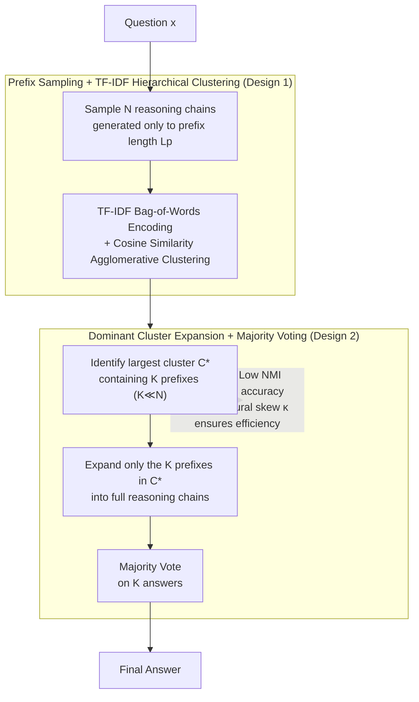

# The Path of Least Resistance: Guiding LLM Reasoning Trajectories with Prefix Consensus

**Conference**: ICLR 2026  
**arXiv**: [2601.21494](https://arxiv.org/abs/2601.21494)  
**Code**: To be confirmed  
**Area**: LLM Reasoning  
**Keywords**: Self-consistency decoding, prefix consensus, reasoning efficiency, clustering pruning, test-time compute

## TL;DR
The authors propose PoLR (Path of Least Resistance), the first test-time method utilizing reasoning prefix consistency. By clustering short prefixes and expanding only the dominant cluster to replace standard Self-Consistency, it reduces token usage by 40%–60% and latency by up to 50% while maintaining or even improving accuracy across benchmarks such as GSM8K, Math500, AIME, and GPQA.

## Background & Motivation
Self-Consistency (SC) decoding is a powerful baseline for LLM reasoning: it samples multiple reasoning chains and performs a majority vote on the final answers, significantly outperforming greedy decoding. However, SC incurs massive computational overhead because all $N$ reasoning chains must be fully expanded to completion, even though many are redundant.

Existing improvements (e.g., Adaptive Consistency, Early-Stop SC) attempt to stop early when sufficient consensus is observed in final answers. However, these methods face a fundamental limitation: answer consistency can **only be observed after the full reasoning chain is generated**, failing to exploit structural information in the early stages of reasoning.

Recent research has identified a key phenomenon—**prefix consistency**: the first $L$ tokens of reasoning chains often exhibit high similarity across samples, and this early consistency correlates strongly with final answer correctness. While Ji et al. (2025) utilized this during training, it requires expensive fine-tuning.

Core Idea: Since reasoning prefixes already encode strong signals regarding the final answer, one can identify dominant reasoning patterns **at test time** by clustering short prefixes. By expanding only the chains within the dominant cluster and safely discarding redundant paths, computation is allocated to the most promising reasoning directions. Similar to physical systems following the "path of least resistance," PoLR focuses resources on the most probable trajectories.

## Method

### Overall Architecture
The core observation of PoLR is that running all $N$ reasoning chains to completion is wasteful, as the first few hundred tokens already reveal the intended path. Consequently, PoLR first samples $N$ short prefixes (length $L_p$), clusters them to identify the "dominant cluster," and only expands the $K$ chains ($K \ll N$) within this cluster into full reasoning chains for majority voting. Computation is concentrated on the most frequent and likely correct "path of least resistance." The pipeline operates purely at test time without training, with the only addition being a millisecond-level clustering overhead.

### Key Designs

**1. Prefix Sampling + TF-IDF Hierarchical Clustering: Probing reasoning paths at minimal cost**

For a question $x$, $N$ reasoning chains are sampled, but each is stopped at $L_p$ (default 256) tokens, yielding a set of short prefixes. Since full chains often consist of thousands of tokens, this sampling step significantly reduces costs. Instead of expensive neural encoders, PoLR uses TF-IDF bag-of-words to encode prefixes into sparse vectors and applies Agglomerative Hierarchical Clustering with cosine similarity. This choice offers two benefits: it does not require a predefined number of clusters $m$, as the dendrogram provides interpretable grouping; and TF-IDF is lightweight and model-insensitive, running purely on CPU. Comparative experiments show that neural encoders like Sentence Transformers increase clustering overhead by several orders of magnitude without significant accuracy gains.

**2. Dominant Cluster Expansion + Majority Voting: Concentrating compute on common patterns**

Given clusters $\{C_1,\dots,C_m\}$, PoLR selects the dominant cluster $C^\* = \arg\max_j |C_j|$ and continues the autoregressive generation of all $K$ prefixes within it ($r_k = M(x \mid p_k)$) to form full chains. Majority voting is then performed only on these $K$ answers. The intuition is that the dominant cluster represents the logic the model most frequently converges upon, and the correct answer is highly likely to reside there. Small, fragmented clusters often represent noise or divergent reasoning; discarding them early saves computation and filters noise, which explains why PoLR occasionally outperforms standard SC accuracy. Token efficiency is defined as $\eta = 1 - \dfrac{N\cdot\ell_p + K\cdot(\ell_f - \ell_p)}{N\cdot\ell_f}$. When $K \ll N$ and $\ell_p \ll \ell_f$, the gain from skipping $N-K$ chains is substantial.

**3. Decoupling Correctness Alignment and Structural Skew: Explaining efficiency despite weak correlation**

PoLR argues that "maintaining accuracy" and "improving efficiency" are independent conditions. Accuracy is maintained by **correctness alignment**: as long as there is even weak mutual information $I(Z;Y) > 0$ between cluster assignment $Z$ and answer correctness $Y$, restricting computations to the dominant cluster does not systematically degrade accuracy. In experiments, this normalized mutual information (NMI) is low ($\le 0.18$), suggesting prefixes do not "know" if they are correct, yet it is sufficient. Efficiency is driven by **structural skew**: gain depends on the dominance of the cluster $\kappa = |C^\*|/N$. Proposition 1 provides an efficiency lower bound $\eta \ge 1 - (K/m)\cdot\kappa^{-1}$. Decoupling these conditions is key: accuracy requires only a "weak signal," while efficiency stems from "strong skew." Even with low NMI, the high concentration of prefix distributions enables token savings of over 50%.

### Loss & Training
PoLR is a pure test-time method and **requires no training or fine-tuning**. All logic is embedded in the inference pipeline. The additional clustering overhead is negligible ($k_t = 2\text{–}17$ms) compared to the generation cost of thousands of tokens. The primary hyperparameter is the prefix length, with a default of $L_p = 256$.

## Key Experimental Results

### Main Results

| Dataset | Model | N | SC Acc | PoLR Δ | Token Efficiency η | Clustering Overhead k_t |
|---------|-------|---|--------|--------|--------------------|------------------------|
| GSM8K   | QWQ32B | 51 | 90.8%  | −0.3%  | 47.6%              | 11.2ms                 |
| Math500 | QWQ32B | 51 | 91.8%  | +0.2%  | 51.8%              | 11.2ms                 |
| Math500 | DSQ7B  | 31 | 89.6%  | +0.1%  | 48.5%              | 5.1ms                  |
| AIME25  | DSQ7B  | 31 | 35.3%  | +0.0%  | 48.4%              | 3.9ms                  |
| AIME25  | Phi-4-15B| 31 | 32.0%  | **+4.0%** | 54.8%              | 5.9ms                  |
| GPQA-D  | QWQ32B | 51 | 68.7%  | **+1.5%** | 53.8%              | 17.4ms                 |
| GPQA-D  | MiMo-7B| 51 | 65.7%  | −0.5%  | 51.4%              | 9.0ms                  |

PoLR maintains or exceeds SC accuracy in most settings, with token efficiency typically between 40%–60% and millisecond-level clustering overhead.

### Ablation Study (Complementarity with Adaptive Methods, GPQA-Diamond)

| Method | DSQ7B N=31 Acc | PExp | QWQ32B N=31 Acc | PExp |
|--------|----------------|------|-----------------|------|
| SC     | 55.25          | 31.00| 68.19           | 31.00|
| AC     | 55.20          | 13.54| 67.93           | 13.00|
| **PoLR+AC** | **55.56** | **10.53**| **68.33**     | **8.72** |
| ESC    | 54.85          | 14.74| 67.73           | 14.89|
| **PoLR+ESC** | **54.85** | **10.71**| **67.73**    | **9.10** |

PoLR acts as a complementary front-end filter for AC/ESC, further reducing paths by ~31%, leading to total computation savings of ~75% relative to SC.

### Key Findings
- **Prefixes encode early consensus**: On Math500 with $L_p=32$, 64% of chains share prefixes (EPM=125/500), yielding accuracy identical to full SC (89.8%).
- **Efficiency driven by structural skew**: NMI (cluster-correctness mutual information) is only $\le 0.18$, but high structural skew ($\kappa$) ensures efficiency remains between 50%–58%.
- **Consistency across models and scales**: Validated across DSQ1.5B, DSQ7B, QWQ32B, MiMo-7B, Phi-4-15B, and Qwen2.5-Math-7B.
- **Improved accuracy**: PoLR improves accuracy on AIME25 by +2.7% for DSQ7B and +4.0% for Phi-4-15B by filtering noisy reasoning paths.
- **Robustness**: Agglomerative clustering, K-Means, and DBSCAN all perform well. TF-IDF matches neural encoders in quality at a fraction of the cost.

## Highlights & Insights
- "Prefix consistency" is an underrated test-time signal—many chains reach consensus on solution strategy in the first steps.
- The theoretical analysis elegantly separates "Safety" (Correctness Alignment, low NMI suffices) from "Efficiency" (Structural Skew is key).
- The plug-and-play, training-free design allows it to serve as a pre-processing step for any SC variant.
- Negligible clustering overhead makes it a "free lunch" for improving inference efficiency.

## Limitations & Future Work
- Occasional large accuracy drops on high-difficulty scenarios in small datasets (e.g., −10% on AIME25/QWQ32B).
- Prefix length $L_p$ is a hyperparameter; while 256 works generally, the optimal value may be task-specific.
- Theoretical guarantees are approximate (empirical correlation between NMI/skew) and lack strict PAC bounds.
- Potentially less effective for highly creative or exploratory tasks (e.g., open-ended generation) where prefixes are naturally diverse.
- Currently evaluated only on Math/STEM/Common-sense reasoning.

## Related Work & Insights
- Complementary to Adaptive Consistency and Early-Stop SC—PoLR prunes *before generation*, while they truncate *after*.
- While Ji et al. (2025) leveraged prefix consistency during training, PoLR is the first to utilize it at test time without fine-tuning.
- Insight: Prefix consistency suggests LLMs "know" the solution path early on; subsequent generation is largely confirmatory, which may indicate a fundamental bottleneck in reasoning token efficiency.

## Rating
- Novelty: ⭐⭐⭐⭐ First method to utilize prefix consistency at test time; simple and elegant concept.
- Experimental Thoroughness: ⭐⭐⭐⭐ 5 benchmarks × 6 models × multiple $N$ values, including complementarity and robustness analyses.
- Writing Quality: ⭐⭐⭐⭐ Clear motivation, good alignment between theory and experiments, intuitive visualizations.
- Value: ⭐⭐⭐⭐ Practical improvement for SC decoding with significant token savings, ready for production deployment.

<!-- RELATED:START -->

## Related Papers

- [\[ICLR 2026\] The Path of Least Resistance: Guiding LLM Reasoning Trajectories for Efficient Consistency](the_path_of_least_resistance_guiding_llm_reasoning_trajectories_for_efficient_co.md)
- [\[ICLR 2026\] Rethinking LLM Reasoning: From Explicit Trajectories to Latent Representations](rethinking_llm_reasoning_from_explicit_trajectories_to_latent_representations.md)
- [\[ICLR 2026\] Off-Trajectory Reasoning: Can LLMs Collaborate on Reasoning Trajectories?](off-trajectory_reasoning_can_llms_collaborate_on_reasoning_trajectories.md)
- [\[ICLR 2026\] Plan and Budget: Effective and Efficient Test-Time Scaling on Reasoning LLMs](plan_and_budget_effective_and_efficient_test-time_scaling_on_reasoning_large_lan.md)
- [\[ICLR 2026\] Predicting LLM Reasoning Performance with Small Proxy Model](predicting_llm_reasoning_performance_with_small_proxy_model.md)

<!-- RELATED:END -->
