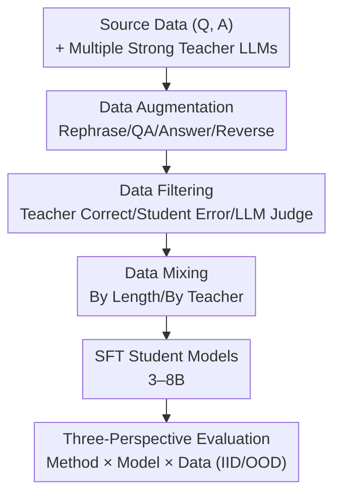

# The Quest for Efficient Reasoning: A Data-Centric Benchmark to CoT Distillation

**Conference**: ICLR 2026  
**OpenReview**: [https://openreview.net/forum?id=Dud8FtScW7](https://openreview.net/forum?id=Dud8FtScW7)  
**Code**: Open-sourced (provided as an anonymous repository in the paper)  
**Area**: LLM Reasoning / Chain-of-Thought Distillation / Data-Centric Methods / Benchmark  
**Keywords**: CoT Distillation, Data Augmentation, Data Filtering, Data Mixing, Small Model Reasoning

## TL;DR
This paper proposes DC-CoT—the first **data-centric** benchmark for systematically evaluating Chain-of-Thought (CoT) distillation. It places three types of data operations—augmentation, filtering, and mixing—into a unified framework. Through large-scale empirical studies across multiple teacher-student model pairs and reasoning tasks, it concludes that "Data Augmentation (especially Reverse Thinking) yields the highest gains, Filtering ensures quality, and Mixing has limited impact."

## Background & Motivation

**Background**: Large Language Models (LLMs) demonstrate strong multi-step reasoning performance via Chain-of-Thought (CoT) prompting. however, the strongest reasoning capabilities are often bound to expensive models with tens or hundreds of billions of parameters. Knowledge Distillation (KD) has thus become a mainstream method for transferring reasoning capabilities to small models (3–8B). Within this, the "data-centric" route—augmenting, filtering, and mixing teacher-generated CoT—is increasingly popular due to being **architecture-agnostic, low-cost, and requiring only black-box text**.

**Limitations of Prior Work**: Specific techniques on this route (question rephrasing, answer augmentation, reverse thinking, teacher correctness filtering, LLM-as-a-judge filtering, length/teacher mixing, etc.) are scattered across various papers. Each uses different teacher-student combinations and datasets, **lacking a unified, controlled benchmark** to horizontally answer "which operation is useful, for whom, and when." Practitioners face a collection of tricks without clear guidance for selection.

**Key Challenge**: Distillation effectiveness is simultaneously constrained by three sets of factors: **the data operation used (method), the teacher-student pairing (model), and the quantity and distribution of data (data)**. These three have never been compared within the same coordinate system. Any single paper offers only a local slice of the problem.

**Goal**: Systematically evaluate CoT distillation through three research perspectives: ① Method: How to categorize data operations and which yields higher gains; ② Model: How the relative scale/architecture of teacher and student models affects performance; ③ Data: How IID vs. OOD, difficulty levels, and data volume influence results.

**Key Insight**: Instead of proposing yet another distillation method, it is better to **build a "controlled experimental platform for data operations."** By fixing other variables and adjusting each data operation one by one, the true performance changes of small models can be observed on a unified task set.

**Core Idea**: Use an abstract transformation $D_{target} = M(D_{source}, \Theta)$ to uniformly describe all data operations. Instantiate $M$ as three categories—Augmentation, Filtering, and Mixing—and run the "first large-scale empirical map of CoT distillation" across a matrix of multiple teachers, students, and tasks.

## Method

### Overall Architecture

DC-CoT is not a new algorithm but a **benchmark pipeline + experimental matrix**. Its core concept is treating "teacher-produced CoT data" as raw material that can be manipulated. First, several strong teachers (Gemini-1.5-Pro, GPT-4, Claude-3.5, GPT-4.1-mini, o4-mini) generate CoT for the source data. This data is then processed through **three types of data operations** $M$—Augmentation, Filtering, and Mixing—to obtain the training set $D_{target}$. This set is used to SFT student models (Llama-3.1-8B, Mistral-7B, Gemma-7B, Qwen-2.5, etc., in the 3–8B range). Finally, evaluation is conducted across text, agent, and vision reasoning tasks, distinguishing between IID and OOD. The entire process is organized into controlled experiments from the perspective of "Method, Model, and Data" to answer 10 research questions.

### Key Designs

**1. Data Augmentation: Expanding reasoning trajectory diversity via four operations**

Augmentation addresses the pain point where single vanilla CoT trajectories expose students to overly simplistic reasoning patterns, leading them to "memorize answers" rather than "learn reasoning." DC-CoT divides augmentation into four independent operations. **Question Rephrasing** has the teacher $T$ generate $L$ rephrased versions $\{\hat{Q}_i^j = T(Q_i, P_{reph})\}$ while maintaining the original meaning and answer $A_i^*$. Each rephrased question then generates a CoT and answer, kept only if $\hat{A}_i^j$ matches the original. **Question Augmentation** goes further, generating **entirely new parallel reasoning problems** $Q_{new} = T(Q, P_{QA})$ (e.g., changing values or subjects) based on a seed question, forcing students to learn the underlying reasoning pattern. **Answer Augmentation** fixes $(Q_i, A_i^*)$ and lets the teacher generate $L$ different CoT trajectories leading to the correct answer $\{(R_i^k, A_i^k) = T(Q_i, P_{AA}, \text{temp})\}$, allowing students to learn from the "intersection" of multiple valid logics. **Reverse Thinking** is the most distinctive: for each $(Q_i, A_i)$, it generates a forward reasoning $R_f$ (filtered by ground truth), then uses $(Q_i, A_i)$ to derive a **backward question** $Q_b$ and its reverse reasoning $R_b$. Finally, a consistency check $c = T(Q_i, A_i, Q_i^b, R_i^b, P_{con})$ is performed, keeping only the quadruplet $(Q_i, R_i^f, Q_i^b, R_i^b)$ if $c=1$. This forces students to learn **bidirectional reasoning**, yielding the greatest improvement in math/logic tasks requiring "reverse derivation."

**2. Data Filtering: Picking high-value samples from teacher CoT pools**

Not all CoTs are equally useful; some contain noise or are simply incorrect. Filtering aims to retain the most valuable subset for learning. **Filtering by Teacher Correctness** is the most direct, keeping only samples where the teacher's final answer matches the ground truth $D_{target} = \{(Q_i, R_i, A_i) \mid A_i = A_i^*\}$. **Filtering by Student Error** does the opposite, specifically choosing instances where the **student originally answered incorrectly** $D_{target} = \{(Q_i, R_i, A_i) \mid \hat{A}_i \neq A_i^*\}$, concentrating learning on the student's weaknesses. **LLM-as-a-Judge** uses an external LLM to score each CoT $Score_i = L_{judge}(A_i, R_i, Q_i, P_{eval})$ based on dimensions like coherence, correctness, and clarity, keeping only samples where $Score_i \geq \tau$.

**3. Data Mixing: Adjusting training set distribution by length or teacher source**

Mixing aims to combine CoTs with different distributions or characteristics into a more diverse training set. **Length-based Mixing** uses a ratio $\alpha$ to blend CoTs of different reasoning lengths, providing students with a balanced "simple-to-complex" curriculum to bridge the learnability gap. **Teacher-based Mixing** mixes CoTs from different teachers at a ratio $\alpha$, exposing students to complex examples while avoiding being "overwhelmed" by a single, overly powerful teacher.

**4. Three-Perspective Evaluation Protocol: Answering 10 research questions via Method × Model × Data**

The standard protocol is the core contribution. The **Method perspective** compares the three operation categories using a unified task set. The **Model perspective** traverses multiple teachers (including small teachers like o4-mini) and multiple students (including R1-distilled Llama and Dense/MoE architectures) to test "teacher-student matching." The **Data perspective** sweeps seed data volume (25%→100%) and systematically tests IID→OOD transfer (e.g., SQA→BoolQ, MATH→GSM8K). Tasks cover text (SQA/CSQA/ARC/GSM8K/MATH/ANLI/Date), agent (WebArena), and vision (Visual-CoT/OK-VQA/CLEVR).

## Key Experimental Results

### Main Results

The table below shows the average accuracy on text tasks for a Llama-3.1-8B student under three types of data operations (selected results, mean of three runs):

| Category | Representative Method | Text Avg Acc(%) | Gain vs. Vanilla CoT |
|----------|----------|-----------------|------------------|
| Baseline | Vanilla CoT | 34.11 | — |
| Augment | Rephrase Question | 49.56 | Significant |
| Augment | Answer Aug | 57.58 | Significant |
| Augment | **Reverse Thinking** | **66.45** | **+24.64%↑ (Avg of 8 tasks)** |
| Filter | Teacher Correctness | 44.73 | +1.93↑ |
| Filter | Judge LLM | 41.04 | Slight drop |
| Mixing | Teacher Mixing | 41.97 | −0.83%↓ |
| Mixing | Length Mixing | 41.43 | −1.37%↓ |

Black-box vs. White-box distillation comparison (ARC-Challenge, teacher Llama-3.1-70B):

| Method | Access Required | Acc(%) |
|------|----------|--------|
| Teacher Baseline | Weights/Logits | 92.4 |
| Standard KD (KL Div) | Weights/Logits | 64.8 |
| Vanilla CoT (SFT) | Black-box Text | 60.4 |
| **Ours (Reverse)** | **Black-box Text** | **69.2** |

Reverse Thinking augmentation using only black-box text outperforms standard white-box KD requiring logits, suggesting that for reasoning tasks, **explicitly transferring reasoning steps is more effective than aligning output distributions via divergence**.

### Ablation Study

Impact of seed data volume on Llama-3.1-8B text average (Teacher: Gemini-1.5-Pro):

| Data Vol | Vanilla CoT | Reverse | Notes |
|--------|-------------|---------|------|
| 25% | 64.48 | 60.78 | Vanilla superior at low volume |
| 50% | 65.33 (Peak)| 64.62 | Vanilla peaks then declines |
| 75% | 57.99 | 70.64 | Vanilla drops significantly |
| 100% | 49.28 | **75.36** | Reverse scales monotonically |

### Key Findings
- **Augmentation > Filtering > Mixing**: For 7–8B students, "creating diverse reasoning" is more valuable than "selecting/reordering existing data." Reverse Thinking leads across the board, especially in structured logic tasks.
- **Learnability Gap**: Students do not necessarily learn best from the strongest teachers. Qwen-2.5-VL-3B performs better when distilled from GPT-4-mini (45.44%) than from the larger GPT-4 (42.92%)—the CoT of massive teachers is often too complex for small models to digest.
- **Prior Distillation History Hinders Progress**: Llama-3.1-8B-R1 (already distilled via DeepSeek-R1) performs slightly worse than the original Llama-3.1-8B when distilled by a new teacher, suggesting existing specialization can interfere with new teacher knowledge.
- **Traditional Scaling Law is Not Universal**: Vanilla CoT performance peaks at 50% (or even 25%) volume and then declines as data increases (due to noise/low-info samples), whereas high-quality augmentations like Reverse scale monotonically.
- **OOD Transfer is Generally Positive but Asymmetric**: Fine-tuning on source tasks usually lifts OOD target performance (e.g., MATH→GSM8K from 19.64 to 80.74), but the reverse (GSM8K→MATH) is less effective.

## Highlights & Insights
- **Abstracting "Data Operations" as $M(D_{source},\Theta)$**: This allows disparate techniques to be compared in a unified coordinate system. The benchmark's value comes from this "controlled variable" design.
- **Black-box Outperforms White-box**: DC-CoT (Reverse) at 69.2% beating standard KD at 64.8% is highly significant for real-world scenarios where teacher weights are inaccessible.
- **Quantifying the "Stronger Teacher $\neq$ Better Student" Phenomenon**: The learnability gap is presented with concrete numbers, suggesting that distillation should focus on "capacity matching" rather than simply chasing the largest teacher.
- **Recipe by Task Type**: Structured Logic (Math/Code) → Reverse + Teacher Correctness Filtering; Open Language (Common Sense/NLI) → Answer Augmentation + LLM Judge; Agent/Vision → LLM Judge to ensure alignment between rationale and observations.

## Limitations & Future Work
- Current coverage is limited to Transformer architectures; future work should expand to non-Transformer architectures.
- Limitations found: Conclusions are primarily based on 3–8B students. It remains uncertain if "Augmentation is strongest, Mixing is weakest" holds for larger students or more difficult tasks.
- The overall weakness of mixing strategies might be due to sub-optimal $\alpha$ ratios or search spaces for teacher combinations; the benchmark provides a snapshot under default configurations rather than a performance upper bound.

## Related Work & Insights
- **vs. Classic Logit-based KD**: Classic KD requires teacher weights/logits for soft label alignment. DC-CoT uses pure black-box text to transfer explicit reasoning steps, performing better on ARC.
- **vs. RevThink / MetaMath / I-SHEEP**: These are sources for specific operations within DC-CoT. The difference lies in incorporating them into a controlled benchmark to provide horizontal evidence of their relative strengths.
- **vs. General Instruction Tuning (Self-Instruct, etc.)**: Question augmentation is strictly constrained to "parallel reasoning problems" rather than generalized instructions, targeting reasoning patterns rather than answer memorization.

## Rating
- Novelty: ⭐⭐⭐⭐ The first data-centric CoT distillation benchmark.
- Experimental Thoroughness: ⭐⭐⭐⭐⭐ Large-scale matrix across multiple teachers, students, and tasks.
- Writing Quality: ⭐⭐⭐⭐ Clear logic, though some tables are dense.
- Value: ⭐⭐⭐⭐⭐ Extremely practical for practitioners distilling reasoning into small models.

<!-- RELATED:START -->

## Related Papers

- [\[ICLR 2026\] CoT-Evo: Evolutionary Distillation of Chain-of-Thought for Scientific Reasoning](cot-evo_evolutionary_distillation_of_chain-of-thought_for_scientific_reasoning.md)
- [\[ICLR 2026\] OpenThoughts: Data Recipes for Reasoning Models](openthoughts_data_recipes_for_reasoning_models.md)
- [\[ICLR 2026\] On The Fragility of Benchmark Contamination Detection in Reasoning Models](on_the_fragility_of_benchmark_contamination_detection_in_reasoning_models.md)
- [\[ICLR 2026\] KaVa: Latent Reasoning via Compressed KV-Cache Distillation](kava_latent_reasoning_via_compressed_kv-cache_distillation.md)
- [\[ICLR 2026\] The CoT Encyclopedia：分析、预测并控制推理模型的思考方式](the_cot_encyclopedia_analyzing_predicting_and_controlling_how_a_reasoning_model_.md)

<!-- RELATED:END -->
