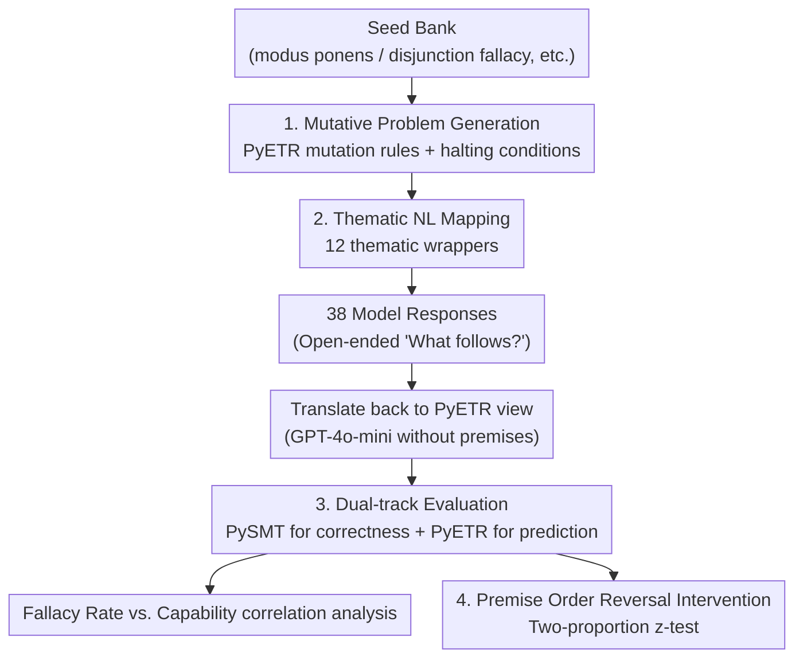

# Theory-Grounded Evaluation of Human-Like Fallacy Patterns in LLM Reasoning

**Conference**: ICLR 2026  
**OpenReview**: [https://openreview.net/forum?id=1HjzhdTEC7](https://openreview.net/forum?id=1HjzhdTEC7)  
**Code**: PyETR (ETR open-source implementation, upon which the paper constructs the generation pipeline)  
**Area**: LLM Reasoning  
**Keywords**: Reasoning evaluation, Cognitive fallacy, Erotetic theory, Data contamination resistance, Order effects

## TL;DR
This paper utilizes Erotetic Reasoning Theory (ETR) from cognitive science and its open-source implementation, PyETR, to programmatically generate 383 formal reasoning problems. Evaluating 38 models, the study reveals a counterintuitive phenomenon: as model capability (Chatbot Arena Elo) increases, the proportion of logical errors that "exactly match ETR-predicted human-like fallacies" rises, while overall logical accuracy remains uncorrelated with capability.

## Background & Motivation

**Background**: LLMs demonstrate exceptional performance across increasingly complex tasks, with scores on reasoning benchmarks steadily climbing. Current evaluations predominantly focus on "error rates"—measuring how many problems are answered correctly.

**Limitations of Prior Work**: Focusing solely on error rates neglects a critical dimension—**how the models fail**. Human reasoning errors are not random noise but systematic, reproducible fallacies (e.g., conjunction fallacy, disjunction fallacy, being misled by irrelevant cues), which cognitive science has characterized via specific trigger conditions for decades. However, LLM evaluation rarely asks: when a model fails, does its error fall into these human-like patterns? Furthermore, static reasoning benchmarks face data contamination—problems may have already entered the training set, meaning scores no longer reflect genuine reasoning ability.

**Key Challenge**: To answer whether "LLMs fail like humans," one needs a task where the **correct answer is known a priori, and the 'expected human error' is also predicted**. Additionally, these problems must be continuously regenerable to avoid contamination. Standard benchmarks fail on both counts—they neither predict specific fallacies nor offer infinite regeneration.

**Goal**: (1) Identify a cognitive theory that formally predicts human fallacies and turn it into a problem generator; (2) Create a batch of infinitely regenerable, contamination-resistant reasoning problems; (3) Quantify "error composition" across a large set of models rather than just measuring error rates.

**Key Insight**: The authors leverage Erotetic Reasoning Theory (ETR). ETR explains both human reasoning capabilities and systematic errors through a unified mechanism: humans maintain a set of **disjunctive candidate answers** and filter these candidates based on "best match" as new information arrives. While efficient, this filtering can prematurely discard relevant candidates, leading to characteristic fallacies. Crucially, ETR is not merely qualitative; it possesses a mathematical formalization and an open-source implementation, PyETR, which can **precisely determine** if a problem will trigger a fallacy and what the human-like erroneous conclusion will be.

**Core Idea**: Treat ETR/PyETR as a "fallacy factory"—programmatically generate problems where ETR predicts a failure and a specific error type, then measure the proportion of model errors that hit these predictions to quantify the overlap between LLM errors and human fallacies.

## Method

### Overall Architecture

The workflow is a pipeline: starting from a small "seed bank," mutation rules are applied to expand it into hundreds of formal reasoning problems (each with an ETR-predicted fallacy answer). These formal "views" are translated into natural language questions across 12 thematic wrappers and submitted to 38 models. The natural language responses are translated back into PyETR formalisms and labeled using two independent criteria: logical correctness (determined by the PySMT solver) and ETR-predicted fallacy (determined by PyETR). Finally, a "Fallacy Rate" metric is defined to analyze the correlation with model capability, supplemented by an intervention experiment that reverses premise order to test for order effects.

### Key Designs

**1. Mutative Problem Generation: Turning Cognitive Theory into an Infinite Fallacy Factory**

Standard benchmarks are fixed, making them prone to contamination and unable to guarantee they target human-like fallacies. This work starts with a seed bank from the book *Reason and Inquiry* (templates like modus ponens, modus tollens, quantified modus ponens, disjunction fallacy), then defines a set of **mutation functions** for ETR views: introducing new predicates/constants/variables, replaced constants with $\forall/\exists$ quantifiers, conjunctive insertion of new atoms, disjunctive addition of states, and adding/removing negation (7 types in total). The process is iterative: randomly draw a view from the seed bank, apply a random number of mutations, and if PyETR determines the problem still has a non-trivial answer, it is added to the premise list. Halting conditions ensure: (1) appropriate scale (total atoms between 4–11); (2) ETR-predicted conclusion is a single categorical conclusion (no disjunctions); (3) ETR-predicted conclusion is a **logical fallacy**. 383 problems were ultimately retained. Because problems are mechanically generated and span multiple domains and structures, they are inherently resistant to memorization and contamination.

**2. Thematic Natural Language Mapping: Eliminating Content Effects and Contamination**

Feeding formal views directly to models is unnatural and introduces bias based on symbol familiarity. The authors designed 12 themes (e.g., "Alchemist studying mysterious substances," "Researcher identifying new organisms") and established fixed mappings from logical elements to thematic elements: predicates (e.g., $Q(x), R(y)$) map to attributes ("is transmuting," "is warping time"), and variables map to entities ("cosmic dust," "liquid silver"). This ensures the same logical structure is wrapped in entirely different stories, serving to test robustness against content effects and mitigate contamination via novel scenarios. The prompt structure includes a thematic preamble, NL premises, and the standardized question "What, if anything, follows?", explicitly allowing for "nothing follows" to avoid inducing forced conclusions.

**3. Dual-track Evaluation and Fallacy Rate: Formalizing "Human-Like Error" as a Computable Metric**

Model conclusions in natural language are translated back to formal views using GPT-4o-mini as a translation layer. Crucially, the **translator does not see the original premises** (it only translates the conclusion to prevent the translator from "reasoning" for the model). Labels are then assigned: logical correctness is checked via PySMT (verifying if the negation of the conclusion is inconsistent with premises). ETR-predictability is determined via PyETR's `default_procedure_does_it_follow`. The core metric, "Human-Like Fallacy," is defined as an answer that is **both ETR-predicted and logically incorrect**:

$$\mathrm{HumanLikeFallacy}(m,p)=\begin{cases}1 & \text{ETR-predicted}(m,p)\wedge\neg\mathrm{LogicallyCorrect}(m,p)\\0 & \text{otherwise}\end{cases}$$

The "Fallacy Rate" is defined as the proportion of human-like fallacies among the model's **total logical errors** (the denominator is the number of errors, not the number of problems):

$$\mathrm{FallacyRate}(m)=\frac{\sum_{p\in P}\mathrm{HumanLikeFallacy}(m,p)}{\sum_{p\in P}\neg\mathrm{LogicallyCorrect}(m,p)}$$

This shifts the analysis from error rate to **error composition**, serving as the methodological core of the paper.

**4. Premise Order Reversal Intervention: Testing LLM Non-Commutativity**

In classical logic, premise order does not affect the valid conclusion. However, human reasoning exhibits order effects—reversing premises can lead to different logical answers and often "blocks" fallacies. The authors re-evaluated the same problems with reversed premise orders, using a **two-proportion z-test** for each model to measure if the proportion of fallacies blocked (turning into correct answers) was significant. This intervention serves as a direct test of ETR’s order-sensitivity predictions and provides evidence of human-like non-classicality in LLM reasoning.

### Loss & Training

This is an evaluation/analysis paper and does not involve model training. Evaluation used the Eleuther LM Evaluation Harness framework, with all models called via the OpenRouter API. Output token limits were set to 3000, with reasoning models allocated 2400 "thinking" tokens to ensure fairness. Capability proxies primarily used Chatbot Arena Elo, supplemented by training compute estimates and HELM Capabilities scores for robustness cross-validation.

## Key Experimental Results

### Main Results

The core finding is that "higher capability leads to more human-like errors," a trend consistent across three capability proxies:

| Capability Proxy | Correlation Test | Coefficient | p-value | Conclusion |
|------------------|------------------|-------------|---------|------------|
| Chatbot Arena Elo (38 models) | Spearman ρ | 0.360 | 0.0265 | Fallacy Rate increases significantly with capability |
| Chatbot Arena Elo (Exp. Fit) | Pearson r | 0.407 | 0.0113 | Same as above, tighter fit |
| Training Compute (19 models) | Spearman ρ | 0.489 | 0.0334 | Significant positive correlation, robust |
| HELM Capabilities (9 models) | Exp. Fit r | 0.796 | 0.0103 | Significant, robust |

In stark contrast, **overall accuracy is completely unrelated to capability**: Elo vs. logical correctness shows Pearson $r=0.004,\ p=0.981$ and Spearman $\rho=-0.04,\ p=0.777$. Stronger models did not perform better on this dataset; they simply failed in a more "human" way.

### Ablation Study

| Analysis | Key Data | Description |
|----------|----------|-------------|
| Overall Logical Accuracy (Table 3) | Mean 40.6%, σ=16.7%, Range 18.6%–91.7% | Models generally struggled with this dataset with high variance |
| Premise Order Reversal (Table 4, 38 models) | Most models saw significant fallacy blocking, e.g., gpt-3.5-turbo-1106 blocked 88.46% (z=4.36), claude-3.5-sonnet blocked 65.08% (z=4.74, p=2.09e-06) | Reversing premises significantly reduced fallacy generation, consistent with human order effects |

### Key Findings

- **Capability ↑, Accuracy Constant, Error Composition More Human**: This is the most counterintuitive discovery—scaling makes models stronger on standard benchmarks but doesn't make them more "rationally correct" on these controlled problems; instead, it pushes errors toward predictable human fallacy patterns.
- **Error Analysis Confirms ETR Mechanism**: Manual inspection shows models often "fixate on recurring objects," ignore disjunctive candidates to draw categorical conclusions, and fail at quantifier constraints under redundant information—failures predicted by ETR’s "premature filtering" mode.
- **Strong and Robust Order Effects**: For most models, simply reversing the premise order significantly blocked fallacies, indicating that LLM reasoning, like human reasoning, is non-commutative rather than purely classical.

## Highlights & Insights
- **Cognitive Theory as a Problem Compiler**: Using PyETR’s `default_procedure_does_it_follow` to both generate problems and predict errors ensures that the "correct answer" and "how humans fail" are known a priori—something standard benchmarks cannot provide.
- **Evaluation Shift from Error Rate to Error Composition**: By setting the denominator to "number of logical errors," FallacyRate characterizes "human-likeness" specifically. This perspective is transferable to any evaluation scenario with predictable error modes (e.g., safety, factuality).
- **Blind Translation Layer**: Using a small model to formalize conclusions without seeing the premises cleanly decouples "reasoning ability" from "answer formatting/phrasing," preventing the evaluation from being contaminated by expression styles.

## Limitations & Future Work
- **Correlation, Not Causation**: The authors emphasize that results are correlational. They do not claim a specific causal mechanism; stronger models might fail like humans because they are trained on human reasoning traces or because RLHF converges reasoning behavior.
- **Ceiling Effect on Accuracy**: The lack of correlation between accuracy and capability might be a ceiling effect if the dataset is simply too difficult for all current models to master.
- **Predicate Constraints and Sample Size**: For NL simplicity, only monadic (unary) predicates were used, which are less expressive than full First-Order Logic. The 383-problem set size was restricted by re-run costs.
- **Moderate Effect Size**: A ρ=0.360 is not extremely strong; while the robustness across architectures suggests a fundamental relationship, the effect size warrants caution.

## Related Work & Insights
- **vs. Traditional Reasoning Benchmarks (e.g., Syllogisms)**: While previous work measures error rates on fixed sets, this work analyzes error composition using a regenerable, contamination-resistant pipeline.
- **vs. Early ETR-on-LLM Work (Koralus & Wang-Máscianica, 2023)**: This work expands the previous research (limited to GPT models) by using PyETR to implement a domain-agnostic, regenerable pipeline across 38 models.
- **vs. Mental Model Theory**: ETR reproduces predictions of mental model theory in deductive tasks. This paper adopts its formalization to bring human fallacy prediction to LLM evaluation, bridging cognitive science and AI assessment.

## Rating
- Novelty: ⭐⭐⭐⭐⭐ Turning formal cognitive theory (PyETR) into a contamination-resistant generator and proposing the "error composition" perspective is highly novel.
- Experimental Thoroughness: ⭐⭐⭐⭐ Extensive coverage with 38 models and three proxy checks, plus intervention experiments, though limited by monadic predicates.
- Writing Quality: ⭐⭐⭐⭐⭐ Clear articulation of motivation, theory, and stats; very honest regarding limitations and causality.
- Value: ⭐⭐⭐⭐⭐ Provides a reusable pipeline and new metrics, offering counterintuitive evidence on whether scaling yields more rational reasoning.

<!-- RELATED:START -->

## Related Papers

- [\[CVPR 2026\] Human-like Abstract Visual Reasoning via Understanding and Solving Reasoning Loop](../../CVPR2026/llm_reasoning/human-like_abstract_visual_reasoning_via_understanding_and_solving_reasoning_loo.md)
- [\[ICLR 2026\] SceneCOT: Eliciting Grounded Chain-of-Thought Reasoning in 3D Scenes](scenecot_eliciting_grounded_chain-of-thought_reasoning_in_3d_scenes.md)
- [\[ICLR 2026\] Expanding Reasoning Potential in Foundation Model by Learning Diverse Chains of Thought Patterns](expanding_reasoning_potential_in_foundation_model_by_learning_diverse_chains_of_.md)
- [\[ICLR 2026\] TATTOO: Tool-Grounded Thinking PRM for Test-Time Scaling in Tabular Reasoning](tattoo_tool-grounded_thinking_prm_for_test-time_scaling_in_tabular_reasoning.md)
- [\[ICML 2026\] Scaling-Aware Adapter for Structure-Grounded LLM Reasoning](../../ICML2026/llm_reasoning/scaling-aware_adapter_for_structure-grounded_llm_reasoning.md)

<!-- RELATED:END -->
