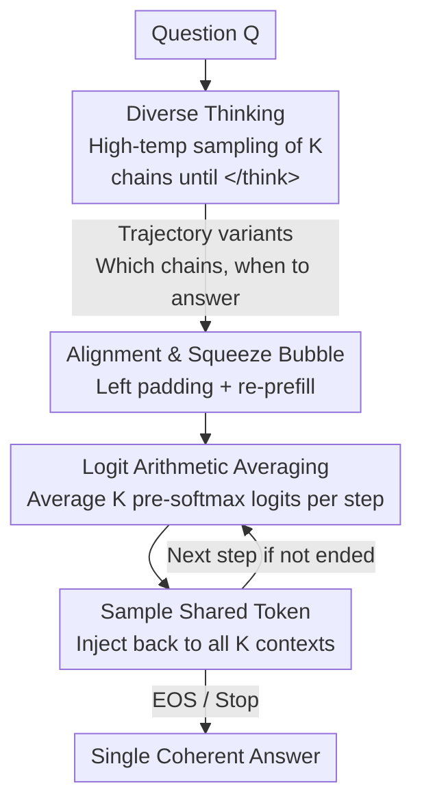

# Think in Parallel, Answer as One: Logit Averaging for Open-Ended Reasoning

**Conference**: ICLR 2026  
**OpenReview**: [https://openreview.net/forum?id=hvit36Dyzl](https://openreview.net/forum?id=hvit36Dyzl)  
**Code**: None (Paper promises to open-source the one-step variant after vLLM v1 support stabilizes)  
**Area**: LLM Inference  
**Keywords**: Parallel Test-time Scaling, Logit Ensemble, Open-Ended Reasoning, Majority Voting, Thought Traces

## TL;DR
THINKMERGE is proposed: it allows an LLM to run $K$ reasoning chains in parallel. After each chain finishes its "thinking" phase, their next-token logits are arithmetically averaged and sampled during the "answer" stage. This extends "Majority Voting" from closed-ended questions to open-ended tasks like code generation and deep research agents where a "majority" cannot be defined. It is training-free and plug-and-play.

## Background & Motivation

**Background**: Test-time compute scaling is a primary trend for improving LLM capabilities. One route is "sequential scaling"—letting the model generate longer "think" blocks (e.g., o1, DeepSeek-R1) to repeatedly hypothesize, derive, and self-correct. Another complementary route is "parallel scaling"—running multiple reasoning chains simultaneously and aggregating evidence, with the most effective method being "majority voting" (self-consistency) on closed-ended questions.

**Limitations of Prior Work**: Majority voting only holds when the "answer is a comparable discrete label"—math fill-in-the-blanks or multiple-choice questions can be counted for a final answer. However, many real-world tasks are **open-ended**: code generation produces executable programs, and deep research agents perform MCP tool calls, multi-step planning, and long-form explanations. In such tasks, "voting on the full output" is impossible to define because valid solutions rarely match verbatim, leaving no canonical answer to count.

**Key Challenge**: The gains brought by parallel sampling are real—preliminary research in the paper indicates that Pass@$N$ increases with $N$ across both closed (AIME/GPQA) and open-ended (LiveCodeBench) tasks, with gains **concentrated on hard samples** (Pass@$N$ rises fastest in hard subsets). While closed-ended questions use voting to convert this "at least one correct" coverage gain into accuracy, open-ended tasks waste this compute due to the failure of voting mechanisms.

**Goal**: Design an open-ended ensemble mechanism that does **not depend on voting for the full output**, converting the dividends of parallel thinking into accuracy/success rates on open-ended tasks.

**Key Insight**: Since voting at the "complete solution" level is impossible, the focus should shift to the token level. Under the "think-then-answer" paradigm, $K$ reasoning chains are treated as $K$ experts. Their predictions for the next token are fused only during the **answering stage**, while the thinking stage remains fully diverse.

**Core Idea**: Replace "voting on complete answers" with "per-token arithmetic averaging in the logit space," allowing the model to "think in parallel, but answer as one."

## Method

### Overall Architecture

THINKMERGE is a training-free, plug-and-play decoding strategy. The process consists of two stages: **(I) Diverse Thinking**—given a question $Q$, $K$ independent reasoning chains $R_1,\dots,R_K$ are sampled from the model's distribution at a high temperature until the end-of-thought delimiter (e.g., `</think>`); **(II) Ensemble Answering**—once sufficient chains reach the delimiter, they enter a shared answering stage. In **each auto-regressive step** $i$, the next-token pre-softmax logits for $K$ contexts $(Q,R_k,y_{<i})$ are queried individually. These are arithmetically averaged and then passed through softmax to sample a token. This **same token is then injected back into each chain**, ensuring all chains are conditioned on the same generated answer for the next step. This proceeds token-by-token until EOS.

To align decoding for multiple chains during the answering stage, the "question + thinking" contexts of varying lengths are left-padded to the same length and "re-prefilled" (the paper calls this "squeeze bubble" to eliminate compute bubbles caused by staggered trajectories), thereby constructing an aligned KV cache. The entire pipeline can be directly mounted on vLLM/SGLang for online/offline inference with standard sampling controls like Top-p/Top-k/temperature/repetition penalty.

### Key Designs

**1. Arithmetic Averaging in Logit Space: Moving "Expert Voting" Down to Pre-softmax**

This is the core of the work, directly addressing the pain point that "open-ended tasks cannot vote on complete solutions." At each answering step, for each chain $k$, the logit vector $z_i^{(k)}=M_\theta(Q,R_k,y_{<i})\in\mathbb{R}^{|V|}$ is obtained over the vocabulary. An arithmetic average is taken in the **logit space (before softmax)**, followed by normalization and sampling:

$$\bar{z}_i=\frac{1}{K}\sum_{k=1}^{K} z_i^{(k)},\qquad \bar{P}_\theta(y_i\mid Q,R_{1..K},y_{<i})=\mathrm{softmax}(\bar z_i)[y_i].$$

Fusion occurs at the logit level rather than the probability level because it is equivalent to a geometric combination in the Product-of-Experts style (pre-softmax addition $\approx$ product of probabilities before normalization). This allows tokens that "none of the experts oppose" to win, making it easier to converge on high-quality consensus answers compared to simple probability averaging. Furthermore, implemented as a logit processor in the standard decoding stack, it is **completely transparent** to and compatible with subsequent sampling controls like Top-k/temperature/penalties. Crucially, it only acts during the **answering stage**—the thinking stage remains independent and diverse, so it preserves parallel exploration while outputting a single coherent solution.

**2. Two-Stage Map-Reduce Implementation and Bubble Squeezing**

To address compute waste caused by misaligned chain lengths, the paper provides two implementations. The default **Two-Stage (Map-Reduce)** scheme: the Map stage batch-generates $K$ chains to the delimiter; the Reduce stage left-pads all "question + thinking" contexts to a uniform length and re-prefills them to build an aligned KV cache before incrementally averaging logits to decode a shared answer. While re-prefilling seems like extra overhead, prefilling in modern inference systems is extremely fast relative to decoding, essentially negligible. The alignment benefit of "squeezing bubbles" far outweighs the cost and facilitates controlled ablation. Another **One-Step (Flex-Attention)** scheme treats $K$ sequences as one batch, using flexible attention masks to block padding tokens from shorter chains while waiting for longer ones, then averages logits directly after the delimiter. Both require minimal changes to be mounted on vLLM/SGLang online services or offline batching.

**3. Four Orthogonal Trajectory Handling Variants: Determining "Which Chains and When to Answer"**

What to fuse and when to start answering significantly impacts performance. The paper breaks this down into four orthogonal strategies. **(A) Direct-Merge**: Merge immediately once all $K$ chains reach the delimiter; this is the default for most experiments. **(B) K Early-Ready**: Start answering as soon as $K$ chains out of $N(>K)$ reach the delimiter ($|R_{ready}|\ge K$), sacrificing some diversity for lower tail latency, suitable for online services. **(C) Trimming (Remove Redundant Suffixes)**: Addressing the model's tendency to produce degenerate repetitive segments like "Wait/Hmm/Alternatively" at the end of thoughts, regex matching is used to detect and remove the longest repetitive suffix $\tilde R_k=\mathrm{trim}(R_k)$ to prevent these misleading terms from being over-weighted during answering. **(D) Shortest-K Merge (Resisting Over-thinking)**: First generate a pool of $N=64$ trajectories, sort them by pre-delimiter length, and select the shortest $K$ for fusion $S=\mathrm{argsort}(\{\mathrm{len}(R_k)\}_{1:K})$. This utilizes the length-quality inductive bias that "shorter chains are often better" to avoid drift and repetition. Unlike Early-Ready, this requires waiting for all $N$ chains to select the global shortest, swapping latency for an anti-overthinking bias. Experiments show these variants are not universal: Trimming is unstable across models/tasks and is omitted for open-ended experiments; Shortest-K is strong in math but may harm executability in code tasks by cutting off necessary boilerplate (imports, helper functions).

## Key Experimental Results

### Main Results

On closed-ended tasks (AIME'25 / GPQA Diamond), THINKMERGE matches or slightly outperforms Majority Voting (MV). On open-ended tasks (LiveCodeBench, Deep Research Agents), it consistently improves over single-chain baselines.

| Task | Model / Setting | Baseline / MV | THINKMERGE | Gain |
|------|-----------|-----------|-----------|------|
| AIME'25 | Qwen3-4B, K=4 (All-Reduce) | MV 68.0 | Direct-Merge 72.0 | +4.0 |
| AIME'25 | Qwen3-14B, K=8 (All-Reduce) | MV 74.0 | Direct-Merge 78.0 | +4.0 |
| GPQA | R1-Distill-7B, K=2 | MV 44.9 | 49.2 | +4.3 |
| LiveCodeBench (Total) | DeepCoder-14B | 55.32 | 61.09 (Shortest-K, K=2) | +5.77 |
| LiveCodeBench (Total) | Qwen3-8B | 57.14 | 59.57 (All-Merge, K=2) | +2.43 |
| LiveCodeBench (Hard) | DeepCoder-14B | 20.69 | 28.97 | +8.28 |
| LiveCodeBench (Hard) | Qwen3-8B | 24.14 | 31.72 | +7.58 |
| XbenchDeepSearch | WebSailor-32B | 50.40 | 57.60 (N=8) | +7.20 |
| GAIA | WebSailor-32B | 46.64 | 51.46 (N=4) | +4.82 |

### Ablation Study

| Configuration | Key Phenomenon | Explanation |
|------|---------|------|
| Direct-Merge (A) | Stable gains by default | Merging immediately after K chains reach delimiter, most versatile |
| Shortest-K (D) | Strong for math, unstable for code | Short chain bias in code may truncate necessary scaffolding |
| Trimming (C) | Performance fluctuates by model/task | Regex rules are fragile; omitted in open-ended experiments |
| Answer Temp $T_{ans}=0.3$ | Most cells flat or slightly dropped | Thought stage is already diverse; "cooling" during answering is unnecessary |
| WebSailor-3B (Small), N↑ | Sharp collapse (e.g., GAIA 32→15→5) | Fusing multiple low-quality chains from weak models amplifies noise |

### Key Findings
- **Gains Concentrate on Hard Problems**: When LiveCodeBench is stratified by difficulty, improvements come almost entirely from Medium/Hard levels, as Easy problems are already saturated. This aligns with the rule in closed tasks that "hard samples benefit more from increased sampling."
- **"Less is More" for Open-ended Code**: The most reliable gains occur at small $K$ (usually $K=2$). As $K$ increases, marginal returns diminish or even reverse, unlike closed tasks where larger $K$ is typically better.
- **"Shortest Chain" Bias is Not Universal**: In math, short chains avoiding redundant self-reflection is a strong prior. However, code generation requires complete scaffolding; blindly choosing the shortest can result in missing components.
- **Model Capacity is a Threshold**: WebSailor-32B generally benefits, while the 3B small model's success rate crashes as $N$ increases—fusing poor-quality chains only amplifies errors.

## Highlights & Insights
- **Turning a Voting Problem into a Decoding Problem**: The core insight is that while open-ended tasks cannot vote on complete solutions, they can vote on the next-token distribution. Lowering the aggregation granularity from "solution" to "token" bypasses the obstacle of non-existent canonical answers.
- **Fusion in Logit Space, Not Probabilities**: Addition before softmax is equivalent to PoE geometric averaging, allowing tokens supported by "all chains" to win. It is naturally compatible with Top-p/Top-k/temperature/penalties, allowing it to be implemented as a drop-in logit processor with near-zero intrusion.
- **Decoupling Diverse Thinking and Unified Answering**: Fusing only during the answering stage while keeping the thinking stage independent preserves parallel exploration while ensuring a single coherent output. "When to fuse" is more critical than "what to fuse."
- **Engineering Value of "Squeeze Bubble"**: Left padding + re-prefill aligns staggered trajectories. By exploiting the reality that "prefill is much faster than decode," the extra overhead for aligned multi-chain decoding becomes negligible, making the method feasible for high-throughput inference stacks.

## Limitations & Future Work
- **Compute Scaled by $K$**: Inherently requires $K$ forward passes. In open-ended code tasks, only small $K$ is optimal, indicating sensitivity to the compute-to-reward ratio.
- **Small Models May Collapse**: WebSailor-3B degrades sharply under multiple chains; the method depends on the base model's single-chain quality. Fusing weak models amplifies noise.
- **Variant Tuning Burden**: The performance of the four variants (especially Trimming) fluctuates wildly across models/tasks, lacking a robust universal rule. The "short = good" assumption of Shortest-K fails in code.
- **Dependence on Unified Vocabulary and Think-then-Answer Paradigm**: The method holds under the premise of a single model, shared vocabulary, and explicit delimiters. Cross-model or cross-vocabulary fusion is outside this scope.
- **Code Not Yet Available**: The one-step variant is promised only after vLLM v1 upstream stability, making reproduction currently difficult.

## Related Work & Insights
- **vs. Majority Voting / Self-Consistency**: Voting selects the mode at the "solution" level, applicable only to closed tasks. Ours fuses at the "token logit" level, extending parallel benefits to open-ended tasks without needing comparable canonical answers.
- **vs. Model Aggregation (LLM-Blender / GraphRAG)**: These train a ranker or use an additional LLM prompt to compare/summarize candidates, requiring SFT and at least one extra forward pass on long concatenated sequences. Ours is training-free and fuses directly in the logit layer during decoding, producing an integrated answer in a single decode pass.
- **vs. Probability-level / PoE Ensembles (M-Ped / EVA / Wicks et al.)**: Previous token-level ensembling mostly targeted "multiple prompts" or "multiple models," often for closed generation like translation. Ours treats $K$ CoT traces from a single model as experts, fusing pre-softmax logits only during the answering stage while maintaining full diversity in thinking, and applies this PoE approach systematically to open-ended reasoning and agentic deep research.

## Rating
- Novelty: ⭐⭐⭐⭐ "Token-logit fusion replacing full-solution voting" cleanly extends parallel test-time scaling to open-ended tasks.
- Experimental Thoroughness: ⭐⭐⭐⭐ Covers math, science, code, and deep research across multiple models and $K$ values with variant ablation, though gains on some tasks are small and strategy-dependent.
- Writing Quality: ⭐⭐⭐⭐ Motivation, preliminary studies, method, and variants progress logically; diagrams are clear.
- Value: ⭐⭐⭐⭐ Training-free, plug-and-play, compatible with mainstream stacks, and provides real gains on open-ended tasks with high engineering feasibility.

<!-- RELATED:START -->

## Related Papers

- [\[ICLR 2026\] Reverse-Engineered Reasoning for Open-Ended Generation](reverse-engineered_reasoning_for_open-ended_generation.md)
- [\[ICLR 2026\] ShinkaEvolve: Towards Open-Ended and Sample-Efficient Program Evolution](shinkaevolve_towards_open-ended_and_sample-efficient_program_evolution.md)
- [\[ICLR 2026\] Generalized Parallel Scaling with Interdependent Generations](generalized_parallel_scaling_with_interdependent_generations.md)
- [\[ICLR 2026\] Continuous Chain of Thought Enables Parallel Exploration and Reasoning](continuous_chain_of_thought_enables_parallel_exploration_and_reasoning.md)
- [\[ICLR 2026\] Reasoning with Sampling: Your Base Model is Smarter Than You Think](reasoning_with_sampling_your_base_model_is_smarter_than_you_think.md)

<!-- RELATED:END -->
