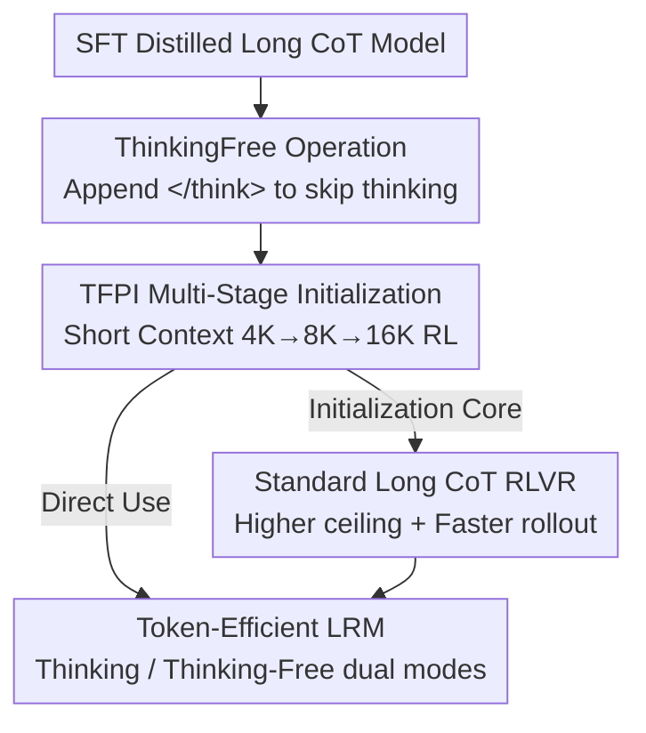

# Thinking-Free Policy Initialization Makes Distilled Reasoning Models More Effective and Efficient Reasoners

**Conference**: ICLR 2026  
**OpenReview**: [https://openreview.net/forum?id=RKYO6R8Jgb](https://openreview.net/forum?id=RKYO6R8Jgb)  
**Code**: Available (GitHub repository and HuggingFace model links provided in the paper)  
**Area**: LLM Reasoning  
**Keywords**: RLVR, Long CoT, Efficient Reasoning, Policy Initialization, Token Efficiency

## TL;DR
Inserting a cheap initialization stage called TFPI between SFT-distilled long CoT models and standard RLVR—by simply appending `</think>` during rollouts to skip explicit thinking and using multi-stage RL with short contexts—enables models to be both more accurate and token-efficient in slow-thinking mode. This also improves the convergence speed and performance ceiling of subsequent standard RLVR (a 4B model achieves 89.0% on AIME24 using less than 4K H20 hours).

## Background & Motivation

**Background**: Reinforceable Learning with Verifiable Rewards (RLVR) is the mainstream approach for training Large Reasoning Models (LRMs), allowing models to spontaneously generate long chains of thought (CoT) to solve complex problems. Practically, starting RLVR from an SFT-distilled long CoT model results in faster convergence and better performance than starting from a base model.

**Limitations of Prior Work**: Distilled LRMs generate extremely long responses during the RLVR rollout phase, necessitating a very large training context window (often 32K–52K), which incurs massive computational overhead—for example, scaling a 4B model's context from 40K to 52K requires approximately 8K H800 GPU hours. A common mitigation is "multi-stage RLVR," starting with a shorter context and gradually increasing it. However, existing work indicates that **starting with an excessively short context causes irreversible performance degradation**, and even with multiple stages, total compute remains high.

**Key Challenge**: There is a hard trade-off between the "accuracy" of long CoT and the "context length/compute" of training. Standard RLVR collapses when long reasoning is hard-truncated in short contexts (e.g., Qwen3-4B avg@32 drops by over 40% at 4K context). The root cause is that standard RLVR destroys slow-thinking capabilities by truncating long reasoning paths.

**Goal**: To find an initialization method that enables stable training under **short context / low compute** conditions without harming (and ideally enhancing) slow-thinking capabilities, leading to faster convergence and a higher ceiling for subsequent standard RLVR.

**Key Insight**: Ours makes two critical observations. First, appending an empty `</think>` to the distilled LRM input (the "ThinkingFree operation") makes the model skip long explicit thinking, immediately cutting reasoning tokens by over 70%. Second—and most counter-intuitively—**training with these ThinkingFree rollouts, even with only a 4K context, actually improves accuracy and reduces tokens when evaluating in the normal slow-thinking mode**. The model does not collapse in short contexts because ThinkingFree forces it to generate "complete but refined" answers rather than "truncated" long chains of thought.

**Core Idea**: Pack the "ThinkingFree rollout + multi-stage short-context RL" into a lightweight initialization stage called Thinking-Free Policy Initialization (TFPI), serving as a bridge between distillation and standard RLVR.

## Method

### Overall Architecture

TFPI is positioned as a **cheap initialization stage inserted between "SFT long CoT distillation" and "standard long CoT RLVR."** The pipeline is: after obtaining an SFT-distilled long CoT model, run TFPI—transforming each input query $x$ into $x'$ via the ThinkingFree operation (skipping explicit thinking) in the rollout stage, and performing RL with short contexts following a multi-stage schedule (e.g., 4K→8K→16K). After TFPI, the resulting policy can be used directly as a token-efficient model or as an initialization point for standard long-context RLVR to further raise the performance ceiling. The process requires no specialized length rewards or complex techniques, just a ThinkingFree rewrite of the standard RLVR input.

### Key Designs

**1. ThinkingFree Operation: Appending an empty `</think>` to skip explicit thinking**

This targets the pain point where distilled LRMs have long reasoning tokens, forcing large training contexts. ThinkingFree is defined as an operator transforming query $x$ into $x'=\text{ThinkingFree}(x)$: based on the standard chat template (thinking mode, `<|im_start|>assistant\n`), an empty thinking block `<think>\n\n</think>` is appended at the start of the assistant response. This forces the model to have "empty thinking content," skipping long internal reasoning to produce a refined answer. This rewrite explicitly controls the presence of thinking content without **changing the correct answer**, so the reward $r(x',y)=r(x,y)$ is fully reusable. On AIME25, DS-1.5B and Qwen3-4B tokens were reduced by over 70% (e.g., DS-1.5B from 16.5K to 4.4K). This is effective for both pure distilled long CoT models (DS-1.5B) and fused fast-slow models (Qwen3-4B).

**2. TFPI: Multi-stage policy initialization using ThinkingFree rollouts**

This addresses the pain point where short-context standard RLVR causes model collapse. TFPI replaces the input in the RLVR objective with the ThinkingFree version:

$$J_{\text{TFPI}}(\theta)=\mathbb{E}_{x\sim D}\left[J_{\text{RLVR}}(\theta, x')\right],\quad x'=\text{ThinkingFree}(x)$$

In the rollout phase, $G$ responses $\{y_i\}\sim\pi_{\theta_{\text{old}}}(\cdot\mid x')$ are sampled for each $x'$. The importance ratio $r_{i,t}(\theta)$ and advantage $\hat A_{i,t}$ are recalculated based on $x'$. The underlying RLVR algorithm is instantiated as DAPO. Crucially, because ThinkingFree ensures each rollout is a "complete/refined answer" rather than "truncated thinking," training can start with very short contexts without degradation. Evaluation shows that "verification behaviors after `</think>`" learned during ThinkingFree training transfer back to the internal slow-thinking verification, making the model stronger even in the thinking mode.

**3. TFPI+RL: TFPI as a cheap precursor to standard RLVR**

This addresses the high cost and low ceiling of direct long-context RL. Since TFPI uses fewer tokens and less compute (total multi-stage compute is <20% of 32K standard RL), it is used as an initialization point for subsequent standard long CoT RLVR (denoted as "TFPI+RL"). This provides two benefits: **raising the performance ceiling** (TFPI models continue to improve during RL, e.g., Qwen3-4B AIME25 70.6%→76.0%) and **accelerating rollouts** (TFPI models naturally produce shorter outputs, reducing average rollout tokens from 9K+ to 6K). Parameter analysis shows TFPI aligns the update direction with the final "Direct RL" direction using a much cheaper path.

### Loss & Training

The base algorithm is DAPO (a GRPO variant). All methods share hyper-parameters (batch size 256, learning rate $1\times10^{-6}$, no warm-up, temperature 1, 8 rollouts per problem), trained on the Polaris-53K dataset using the VeRL library. For fair comparison, **the total training compute of the three TFPI stages is strictly equal to "Direct RL."** Notably, TFPI does not require specialized length rewards; token savings are a natural byproduct of the ThinkingFree mode.

## Key Experimental Results

### Main Results

Under identical compute, overall accuracy (Overall Avg.) of TFPI (initialization phase only, evaluated in thinking mode) vs. Direct RL:

| Model | Initial Model | Direct RL | TFPI Stage 1 | TFPI Stage 3 |
|------|---------|-----------|-------------|-------------|
| DS-1.5B | 22.0 | 25.3 | 26.7 | **29.2** |
| Qwen3-4B | 60.3 | 60.2 | 60.8 | **63.8** |
| DS-7B | 42.2 | 43.0 | 45.6 | **47.8** |

TFPI outperforms Direct RL across configurations: Qwen3-4B +3.6%, DS-7B +4.8%. Even when trained on Polaris-53K (pure math), cross-domain transfer occurs—DS-1.5B GPQA rose from 16.3% to 29.6%.

TFPI+RL further raises the performance ceiling:

| Model | AIME24 | AIME25 | LiveCode | Overall |
|------|--------|--------|----------|---------|
| Qwen3-4B Direct RL | 78.8 | 71.5 | 54.3 | 62.0 |
| Qwen3-4B TFPI Stage 3 | 79.9 | 70.6 | 57.0 | 63.8 |
| Qwen3-4B TFPI+RL | 80.8 | 76.0 | 55.7 | **65.7** |
| Qwen3-4B-2507 TFPI only | **89.0** | 81.2 | **65.5** | **70.6** |

Qwen3-4B-2507 using only TFPI (4K→8K→16K) achieved 89.0% on AIME24 and 65.5% on LiveCode, **surpassing Qwen3-235B-Thinking in math and code** with only ~1.5K H800 hours.

### Key Experimental Results (Token Efficiency)

DS-1.5B in thinking-free mode vs. other high-efficiency reasoning baselines (accuracy / average tokens):

| Configuration | AIME24 Acc | AIME24 Toks | Overall Acc | Overall Toks |
|------|-----------|-------------|-------------|--------------|
| DS-1.5B (Thinking) | 29.6 | 16.7K | 19.4 | 14.3K |
| DS-1.5B (Thinking-Free) | 12.4 | 5.7K | 8.0 | 3.6K |
| TFPI Stage 1 | 21.9 | 1.6K | 19.7 | 1.3K |
| TFPI Stage 3 | **37.5** | 5.3K | **28.5** | 4.4K |

TFPI Stage 3 increased Thinking-Free AIME24 accuracy from 12.4% to 37.5% with only 5.3K tokens, placing it firmly on the Pareto front without length rewards.

### Ablation Study

| Configuration | Overall (Qwen3-4B) | Description |
|------|-------------------|------|
| TFPI 4K→8K→16K | 63.8 | Best schedule |
| TFPI 8K→16K | 62.4 | Removed 4K stage |
| TFPI 16K only | 61.9 | Single stage |
| Multi-Stage Direct RL | 52.9 | Same schedule, no ThinkingFree |

### Key Findings
- **ThinkingFree is the true source of gain, not multi-stage schedules**: Direct RL using the 4K→8K→16K schedule (without ThinkingFree) scored only 52.9%, much lower than TFPI’s 63.8%.
- **Robust to schedules but 4K start is best**: All TFPI schedules outperformed Direct RL. The 4K start is hypothesized to benefit from implicit curriculum via dynamic sampling.
- **Behavioral/Parameter Explanations**: Behavior-wise, verification step ratios drop in Stage 1 (compression) and rebound in Stage 2/3 (exploration), transferring to slow-thinking. Parameter-wise, TFPI explores the space faster and aligns with the Direct RL endpoint.
- **Scaling**: Effective on Qwen3-14B (Direct RL 66.8% vs. TFPI 67.8%, with 23.8% fewer tokens). Answer segment lengths ($|y_{\text{ans}}|$) remain stable, avoiding "pathological slow thinking."

## Highlights & Insights
- **Token efficiency as a free byproduct**: Unlike methods that use length rewards or budget control to force short outputs—often sacrificing accuracy—Ours shows that the thinking-free mode naturally provides a high-efficiency variant.
- **Counter-intuitive core discovery**: Training with "empty thinking" makes "explicit thinking" evaluation stronger. This transfer from post-`</think>` verification to internal thinking provides insights into what CoT actually contributes.
- **Simplicity and Effectiveness**: Only the rollout input template is modified. No algorithm changes or extra reward terms are needed to solve context collapse, high compute, and token length issues simultaneously.

## Limitations & Future Work
- **Single training data source**: TFPI was trained only on Polaris-53K (math). Cross-domain transfer exists but fluctuates; multi-domain data might stabilize TFPI.
- **Data difficulty**: For Qwen3-14B, Direct RL barely improved because the data was too easy (rollout accuracy 78%). Harder data is needed for scaling.
- **Empirical mechanism**: Behavioral and parameter analyses provide correlation but lack rigorous causal proof for why empty-thinking training transfers to CoT.

## Related Work & Insights
- **vs. Multi-stage RLVR (Polaris / DeepScaleR)**: These use the "short→long" schedule but truncate long CoT, causing degradation in short windows. TFPI ensures complete refined responses at 4K.
- **vs. Length Reward Methods (L1, AdaptThink, etc.)**: These trade accuracy for efficiency via reward shaping. TFPI achieves higher accuracy and lower tokens on the Pareto front naturally.
- **vs. Pre/Mid-training RL acceleration**: Inspired by adding cheap stages before main training, TFPI specifically addresses the SFT-to-RLVR transition for distilled LRMs.

## Rating
- Novelty: ⭐⭐⭐⭐ Appending `</think>` for initialization is simple yet solves context collapse effectively.
- Experimental Thoroughness: ⭐⭐⭐⭐⭐ Covers 1.5B–14B models, math/code/instruction benchmarks, compute alignment, and dual-layer analysis.
- Writing Quality: ⭐⭐⭐⭐ Clear chain of observation → method → analysis.
- Value: ⭐⭐⭐⭐⭐ High engineering value; can be integrated into any RLVR pipeline to save compute and raise ceilings.

<!-- RELATED:START -->

## Related Papers

- [\[ICLR 2026\] DRPO: Efficient Reasoning via Decoupled Reward Policy Optimization](drpo_efficient_reasoning_via_decoupled_reward_policy_optimization.md)
- [\[ACL 2026\] RSAT: Structured Attribution Makes Small Language Models Faithful Table Reasoners](../../ACL2026/llm_reasoning/rsat_structured_attribution_makes_small_language_models_faithful_table_reasoners.md)
- [\[ICLR 2026\] A State-Transition Framework for Efficient LLM Reasoning](a_state-transition_framework_for_efficient_llm_reasoning.md)
- [\[ICLR 2026\] Plan and Budget: Effective and Efficient Test-Time Scaling on Reasoning LLMs](plan_and_budget_effective_and_efficient_test-time_scaling_on_reasoning_large_lan.md)
- [\[AAAI 2026\] SAPO: Self-Adaptive Process Optimization Makes Small Reasoners Stronger](../../AAAI2026/llm_reasoning/sapo_self-adaptive_process_optimization_makes_small_reasoners_stronger.md)

<!-- RELATED:END -->
