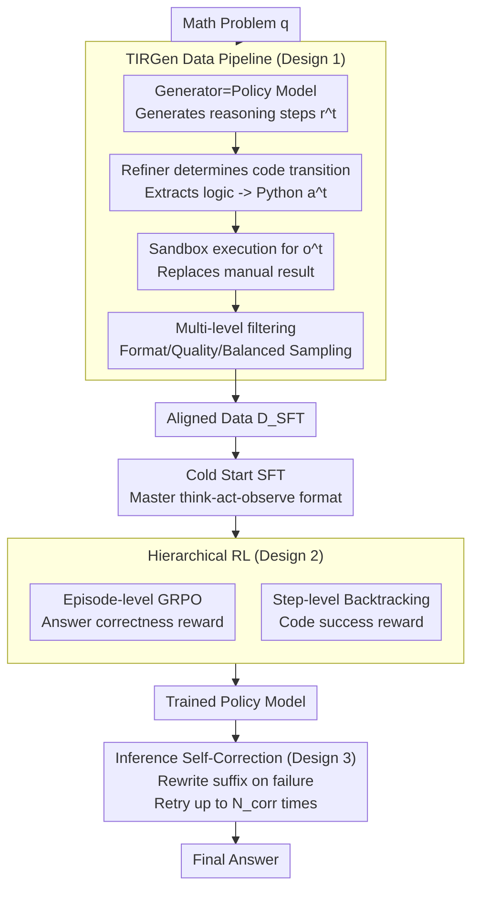

# THOR: Tool-Integrated Hierarchical Optimization via RL for Mathematical Reasoning

**Conference**: ICLR 2026  
**arXiv**: [2509.13761](https://arxiv.org/abs/2509.13761)  
**Code**: [GitHub](https://github.com/JingMog/THOR)  
**Area**: LLM Reasoning  
**Keywords**: tool-integrated reasoning, hierarchical RL, GRPO, code generation, self-correction, mathematical reasoning

## TL;DR

The THOR framework is proposed, which systematically addresses three major challenges in tool-integrated mathematical reasoning—data construction, fine-grained optimization, and reasoning enhancement—through three core components: the TIRGen data construction pipeline, hierarchical reinforcement learning (joint episode-level and step-level optimization), and a self-correction reasoning mechanism. It achieves SOTA performance among models of the same scale on benchmarks such as MATH500 and AIME.

## Background & Motivation

1. As probabilistic next-token predictors, LLMs are naturally flawed in tasks requiring high-precision numerical computation, equation solving, and symbolic operations, as probabilistic sampling errors accumulate during multi-step calculations.

2. Tool-Integrated Reasoning (TIR) is an effective paradigm to compensate for this, but it faces three core challenges:
    - **Data Construction Difficulty**: Synthesizing data with prompts from external large models like GPT-4o leads to style mismatch issues and poor performance on reasoning models like DeepSeek-R1. Rule-based injection methods like START suffer from redundant code calls due to imprecise placement.
    - **Coarse Optimization Granularity**: Existing RL methods (Agent-R, ToRL, ReTool) only perform episode-level optimization using final answer correctness as the sole reward signal, leading to severe sparse reward problems in long reasoning chains where intermediate code steps receive no fine-grained updates.
    - **Lack of Error Correction**: Single-pass reasoning ignores immediate feedback from tool execution. When code execution fails, the model should backtrack and correct rather than continuing blindly.

3. SFT methods (Toolformer, AIMO-2) require large amounts of high-quality demonstration data and exhibit poor generalization.

4. **Key Insight**: The execution success rate of intermediate tool calls is a strong predictor of final answer correctness, providing a natural and dense reward signal for step-level optimization.

## Method

### Overall Architecture

THOR decomposes tool-integrated mathematical reasoning into three sequential engineering phases: data, training, and inference. First, the TIRGen pipeline automatically generates tool-call data $\mathcal{D}_{SFT}$ aligned with the policy model's distribution. This data is used for a cold-start SFT, followed by hierarchical reinforcement learning that combines episode-level and step-level optimization. Finally, a self-correction module is utilized during inference to backtrack based on execution feedback. All three phases share a consistent interaction format: given a question $q$, the model generates an alternating think-act-observe sequence $\tau=(r^1, a^1, o^1, \ldots, r^n)$, where $r^t$ is a natural language reasoning step, $a^t$ is a code action, and $o^t$ is the sandbox execution result. The core insight throughout is that the success of intermediate code calls is a strong predictor of final answer correctness, transforming a problem with sparse "correct/incorrect" signals into a dense optimization problem with step-by-step feedback.

### Key Designs

**1. TIRGen Data Construction Pipeline: Aligning training data with the policy model's reasoning style**

Synthesizing TIR data with external models like GPT-4o often suffers from style mismatch with the reasoning model, leading to performance degradation in models like DeepSeek-R1. TIRGen adopts a Generator-Refiner division of labor: the Generator is the policy model itself, responsible for generating natural language reasoning steps (up to step length $L_{step}$), preserving its original style. The Refiner determines step-by-step if a part is suitable for conversion to code (e.g., numerical calculation, equation solving), extracts the pure logic $r_{logic}^t$ to translate into executable Python code $a^t$, and executes it in a sandbox to get observation $o^t$ to replace the manual calculation result. Crucially, the Refiner only sees single reasoning steps without the full problem or gold answer, ensuring the produced data stays within the Generator's policy distribution. The task is split into "high-level reasoning" and "basic instruction following + code generation," reducing dependence on huge external models. Multi-level filtering (format checks, quality filters for sympy/numpy or control flow, balanced sampling by difficulty, and removal of simple CoT-solvable problems) ensures only samples that truly benefit from tools are retained.

**2. Hierarchical RL: Supplementing long reasoning chains with dense rewards via code execution success**

Existing RL methods (ToRL, ReTool, etc.) perform only episode-level optimization, using final correctness as the sole reward. This leads to sparse rewards where intermediate code steps are not fine-grained updated. THOR uses $\mathcal{D}_{SFT}$ for cold-start SFT to master the think-act-observe format, followed by two-level joint optimization. Episode-level optimization uses GRPO with answer correctness as the reward ($\mathcal{R}_i=1$ if correct, $0$ otherwise), filtering out trajectories that failed due to environment issues to avoid mis-penalization. Advantages are calculated via group normalization:

$$A_i=\frac{\mathcal{R}_i-\text{mean}(\mathcal{R})}{\text{std}(\mathcal{R})}$$

Step-level optimization focuses on backtracking for failed code steps: it splits the failed reasoning $r^t$ into a prefix $r_{pre}^t$ and a suffix $r_{suf}^t$ (length $L_{suf}$). Keeping the prefix context fixed, it regenerates the suffix and code action, using code execution success as a step-level reward. This enables dense feedback at each step. Additionally, inspired by VAPO, an NLL loss $\mathcal{L}_{NLL}$ with coefficient $\alpha$ is added for positive advantage samples to directly strengthen their likelihood.

**3. Inference Self-Correction: Low-overhead backtracking and suffix rewriting upon execution failure**

Single-pass reasoning wastes immediate tool feedback. THOR reuses the backtracking capability learned during step-level training at inference time: when a code action $a^t$ fails, the reasoning $r^t$ is split into $r_{pre}^t$ and $r_{suf}^t$. Based on the history up to $r_{pre}^t$, it regenerates a new suffix $\hat{r}_{suf}^t$ and corrected action $\hat{a}^t$, retrying up to $N_{corr}$ times. Since only the suffix is rewritten rather than the entire trajectory, the additional computational cost is minimal, resulting in a lower average token count compared to ToRL and ReTool.

### Loss & Training

The training process involves cold-start SFT followed by joint RL. The total loss is the sum of episode-level and step-level terms:

$$\mathcal{L}(\theta) = \mathcal{L}_{\pi_\theta}^{epis}(\theta) + \mathcal{L}_{\pi_\theta}^{step}(\theta)$$

Both levels utilize the GRPO clipped surrogate objective combined with VAPO-style NLL loss. The episode-level $\mathcal{L}^{epis}$ uses final answer rewards and an indicator function $I(s_{i,t})$ to ensure gradients are only computed for model-generated tokens rather than environment observations $o^t$. The step-level $\mathcal{L}^{step}$ uses code execution success rewards, where each sample contains a single think-act-observe loop to ensure dense and learnable feedback.

## Key Experimental Results

### Main Results (Math Benchmarks Avg@4)

| Model | MATH500 | AIME24 | AIME25 | AMC | Minerva | OlympiadBench | Average |
|------|---------|--------|--------|-----|---------|---------------|------|
| QwQ-32B | 96.4 | 79.2 | 72.0 | - | - | - | - |
| DeepSeek-R1-Distill-32B | 94.3 | 72.6 | 60.2 | - | - | - | - |
| ToRL-Qwen-32B | 95.6 | 75.2 | 67.3 | - | - | - | - |
| ReTool-32B | 95.2 | 72.5 | 67.5 | - | - | - | - |
| **THOR-32B** | **97.5** | **82.2** | **76.0** | - | - | - | **Best** |

**Key Findings**:

1. ⭐⭐⭐ **THOR leads across the board among same-scale models**: Reaching 97.5% on MATH500, 82.2% on AIME24, and 76.0% on AIME25, outperforming all same-scale baselines.
2. ⭐⭐⭐ **Strong cross-architecture generalization**: THOR is effective for both reasoning models (QwQ-32B base) and non-reasoning models (Qwen-2.5-32B base), across various parameter scales (1.5B/7B/32B).
3. ⭐⭐ **Simultaneous improvement in code benchmarks**: Positive gains are observed on HumanEval, MBPP, and LiveCodeBench, indicating that step-level code optimization enhances general code generation capabilities.
4. ⭐⭐ **Low inference overhead**: Self-correction is only triggered upon failure and only regenerates suffixes, leading to an average token count lower than ToRL and ReTool.

### Ablation Study

| Configuration | MATH500 | AIME24 | AIME25 | Trend |
|------|---------|--------|--------|----------|
| Full THOR | **97.5** | **82.2** | **76.0** | Full Framework |
| − Step-level RL | 96.8 | 78.5 | 72.7 | ↓ Significant degradation |
| − Self-Correction | 96.4 | 80.3 | 73.5 | ↓ Inference drop |
| − TIRGen (using GPT-4o data) | 95.9 | 76.8 | 70.3 | ↓ Significant degradation |
| Cold Start SFT only | 94.2 | 68.3 | 58.7 | ↓ Massive degradation |

**Key Findings**:

1. ⭐⭐⭐ **Step-level RL contributes most**: Removing it leads to a 3.7-point drop on AIME24 and a 3.3-point drop on AIME25, validating the effectiveness of intermediate code success as a dense reward.
2. ⭐⭐ **TIRGen data alignment is crucial**: Using GPT-4o synthetic data drops AIME25 by 5.7 points, showing that policy-aligned training data is superior to out-of-distribution data.
3. ⭐⭐ **Self-correction is highly effective on difficult problems**: It contributes a 2.5-point gain on AIME25 (the hardest benchmark), as harder problems are more prone to code execution failures requiring correction.

### Key Findings

The paper statistically validates the core insight—the success rate of intermediate tool calls is highly correlated with final answer correctness. Trajectories where all code calls succeed have significantly higher final correctness than those with execution failures, providing a theoretical basis for step-level optimization.

## Highlights & Insights

1. ⭐⭐⭐ **Systematic Framework Design**: The three phases (data, training, inference) are complementary, with TIRGen for data, hierarchical RL for optimization, and self-correction for inference.
2. ⭐⭐⭐ **Dense Rewards via Hierarchical RL**: Using code execution success as a step-level reward signal effectively mitigates the sparse reward problem in long reasoning chains.
3. ⭐⭐ **Generator-Refiner Data Construction**: The design where the Refiner only sees single steps without the full problem cleverly achieves policy alignment while reducing dependence on external large models.
4. ⭐⭐ **Low-Overhead Self-Correction**: Only regenerating suffixes instead of whole trajectories keeps the computational cost minimal.
5. ⭐ **Broad Model Applicability**: Effective across both reasoning and non-reasoning models of various scales.

## Limitations & Future Work

1. ⭐⭐ **Limited Tool Types**: Currently only supports the Python code executor, not extended to symbolic solvers (Mathematica), search engines, etc.
2. ⭐⭐ **Fixed Backtracking Strategy**: The suffix length $L_{suf}$ is a fixed hyperparameter and does not adaptively adjust based on error types—being too long wastes computation, while being too short may fail to fix the root error.
3. ⭐ **Domain Restriction**: The effectiveness in broader reasoning tasks like scientific or logical reasoning has not been verified.
4. ⭐ **Limited Self-Correction Retries**: $N_{corr}$ retries may still fail to fix some systematic errors; there is no mechanism to abandon the current path and switch routes.

## Summary

THOR is an end-to-end framework for enhancing tool-integrated mathematical reasoning. Its core contributions include: (1) the TIRGen pipeline for generating high-quality TIR data aligned with the policy model; (2) hierarchical RL that combines episode-level (answer reward) and step-level (code execution reward) optimization to mitigate sparse rewards; and (3) a self-correction mechanism for low-overhead online correction using tool feedback. The framework achieves SOTA on multiple math and code benchmarks for its size, offering a systematic solution for tool-integrated reasoning.

<!-- RELATED:START -->

## Related Papers

- [\[ICLR 2026\] Toward Effective Tool-Integrated Reasoning via Self-Evolved Preference Learning](toward_effective_tool-integrated_reasoning_via_self-evolved_preference_learning.md)
- [\[ICLR 2026\] SimpleTIR: End-to-End Reinforcement Learning for Multi-Turn Tool-Integrated Reasoning](simpletir_end-to-end_reinforcement_learning_for_multi-turn_tool-integrated_reaso.md)
- [\[CVPR 2026\] Scaling Agentic Reinforcement Learning for Tool-Integrated Reasoning in VLMs](../../CVPR2026/llm_reasoning/scaling_agentic_reinforcement_learning_for_tool-integrated_reasoning_in_vlms.md)
- [\[ICLR 2026\] AgentMath: Empowering Mathematical Reasoning for Large Language Models via Tool-Augmented Agent](agentmath_empowering_mathematical_reasoning_for_large_language_models_via_tool-a.md)
- [\[ICLR 2026\] T1: Tool-Integrated Verification for Test-Time Compute Scaling in Small Language Models](t1_tool-integrated_verification_for_test-time_compute_scaling_in_small_language_.md)

<!-- RELATED:END -->
