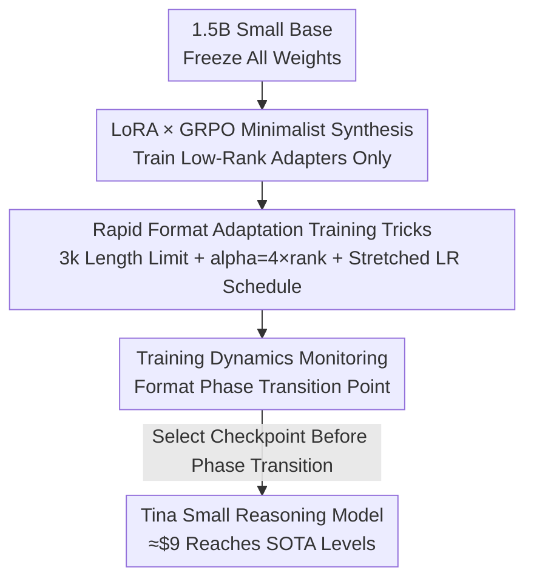

# Tina: Tiny Reasoning Models via LoRA

**Conference**: ICLR 2026  
**OpenReview**: [https://openreview.net/forum?id=P2OXYO3bEe](https://openreview.net/forum?id=P2OXYO3bEe)  
**Code**: https://github.com/shangshang-wang/Tina  
**Area**: LLM Reasoning  
**Keywords**: LoRA, Reinforcement Learning, GRPO, Small Model Reasoning, Cost Efficiency

## TL;DR
On a tiny 1.5B model, LoRA was used for RL (GRPO) post-training. By spending only \$9, the mathematical reasoning capability was trained to be comparable to or even better than the full-parameter SOTA of the same base model. The "Rapid Reasoning Format Adaptation" hypothesis is proposed to explain why this low-cost approach is effective.

## Background & Motivation
**Background**: Two mainstream routes exist to equip language models with robust multi-step reasoning: first, SFT distillation, where small models imitate the reasoning trajectories of strong models like o1/R1; second, RL (such as GRPO used by DeepSeek-R1), where models explore logical paths themselves from verifiable reward signals. RL is generally considered to learn more robust reasoning, but it comes with complex pipelines and expensive computational costs.

**Limitations of Prior Work**: Existing open-source reasoning replication efforts (STILL-3, DeepScaleR, Open-RS, etc.) almost exclusively use **full-parameter training**, often costing thousands of dollars and dozens to hundreds of GPU hours. Consequently, the fundamental question of "what are the minimum resources required to inject reasoning capabilities via RL" has not been thoroughly investigated.

**Key Challenge**: Knowledge capacity primarily grows with parameter scale, whereas reasoning ability might be decoupled from the number of parameters. This implies that small models may harbor untapped reasoning potential, and parameter-efficient methods (like LoRA) could inject specific capabilities without destroying existing knowledge. However, no systematic verification has explored how far RL reasoning can be pushed under an extremely minimal compute budget.

**Goal**: To push efficiency to the limit, answer "what are the minimum resource requirements for RL-injected reasoning," and explain why such low costs can work.

**Key Insight**: Leverage two efficiency levers simultaneously—a **compact base model** (DeepSeek-R1-Distill-Qwen-1.5B) and **training only LoRA low-rank adapters during the RL phase**. The authors wager that the essence of RL rewards is to make the model output conform to a verifiable "reasoning format/structure," and LoRA excels at learning such structural patterns with minimal parameters while preserving the base model's vast knowledge.

**Core Idea**: Directly synthesize LoRA and GRPO—freeze the base model and train only the low-rank adapters using RL. This allows the small model to "quickly learn the reasoning format rather than re-learning knowledge," thereby achieving strong reasoning at an extremely low compute cost.

## Method

### Overall Architecture
Tina is not a complex new algorithm; its contribution lies in a minimalist recipe combined with an explanation for its effectiveness. The pipeline is straightforward: take an already small 1.5B base (DeepSeek-R1-Distill-Qwen-1.5B), freeze all original weights, and **only insert and train LoRA low-rank adapters during the RL phase**. The RL algorithm uses GRPO (a PPO variant that removes the value network and uses group-relative advantage). Rewards come from the verifiable correctness of math answers plus format rewards. Combined with several training tricks specifically tuned for "rapid format adaptation," the entire training runs on 2 L40S GPUs, with a single RL step usually completing within one minute.

Key insights derived from observing training dynamics: a clear "phase transition point" appears in format-related metrics (format rewards, completion length), and **the best checkpoint occurs exactly before this phase transition point**—this both guides model selection and supports the core hypothesis.

### Key Designs

**1. LoRA × GRPO Minimalist Synthesis: Completing RL Reasoning Post-training with Minimal Parameters**

Addressing the pain point that "full-parameter RL reasoning is too expensive," Tina introduces parameter-efficient fine-tuning directly into RL. The base weights $W_0 \in \mathbb{R}^{d\times k}$ are frozen throughout, and only a pair of low-rank matrices $A \in \mathbb{R}^{d\times r}$ and $B \in \mathbb{R}^{r\times k}$ ($r \ll \min(d,k)$) are trained. The forward pass is modified from $h(x)=W_0 x$ to $\hat h(x)=W_0 x + ABx$. The RL algorithm utilizes GRPO: for each question $q$, a group of $G$ outputs is sampled from the old policy. The standardized value of the intra-group reward is used as the advantage $A_i = \frac{r_i - \mathrm{mean}(\{r\})}{\mathrm{std}(\{r\})}$, and optimization is performed using a clipped objective with a KL penalty:

$$\mathbb{E}\left[\frac{1}{G}\sum_{i=1}^{G}\Big(\min(\delta_i A_i,\ \mathrm{clip}(\delta_i, 1-\epsilon, 1+\epsilon)A_i) - \beta\, D_{\mathrm{KL}}(\pi_\theta\|\pi_{\mathrm{ref}})\Big)\right]$$

where $\delta_i = \pi_\theta(o_i\mid q)/\pi_{\theta_{\mathrm{old}}}(o_i\mid q)$. GRPO eliminates the independent value network and estimates advantage via group baselines, which is inherently more efficient than PPO. This is effective because reasoning tasks naturally provide verifiable rewards (correctness and formatting), and LoRA compresses the "direction of adjustment" into a low-rank space. Training less than 1% of the parameters with one-minute steps, the optimal checkpoint can be reproduced for just \$9, a reduction of approximately 260x compared to baseline estimates. The modularity of LoRA offers the additional benefit of mounting reasoning behavior like a switch without maintaining multiple full model copies.

**2. Training Tricks for "Rapid Format Adaptation": Forcing the Model to Learn Reasoning Structures Quickly**

Simply applying standard LoRA configurations may not yield fast adaptation. The authors deliberately deviate from conventions by using three fixed tricks without hyperparameter searching to accelerate the model's absorption of new reasoning formats. First, **limiting the completion length to 3k tokens**: this forces the model to use concise, well-structured reasoning paths to reach the correct answer, encouraging efficient expression while reducing compute per sample. Second, **setting LoRA alpha to 4 times the rank** (e.g., rank 32, alpha 128) rather than the conventional 2 times—the enlarged alpha makes the model "lean" more strongly towards adopting the LoRA-learned adaptations, aligning faster with the RL-reinforced reasoning structure. Third, **stretching the learning rate decay schedule over twice the training steps**, ensuring a relatively higher learning rate at each step within the actual training interval, further accelerating the adaptation of LoRA parameters to reward signals. All three serve one goal: to acquire the reasoning format as quickly as possible with minimal compute.

**3. Rapid Reasoning Format Adaptation Hypothesis and Phase Transition: Explaining the Efficiency**

Beyond the recipe, the authors address why LoRA is both effective and efficient here. The core hypothesis is "Learning Structure/Format, Preserving Knowledge": RL reasoning heavily rewards the model's ability to generate outputs following verifiable formats (e.g., step-by-step reasoning chains), and LoRA is exceptionally good at capturing such structural and stylistic patterns with very few parameter changes and minimal FLOPs. Simultaneously, because only a fraction of weights is modified, the mass of knowledge accumulated during pre-training is largely preserved. Thus, LoRA teaches "how to format existing knowledge into effective reasoning trajectories" rather than expensively re-learning concepts.

The key evidence supporting this hypothesis is the **format phase transition**: format-related metrics (format rewards, completion length) show a sharp turning point during training, whereas accuracy rewards drift smoothly without a corresponding inflection point. Crucially, **the checkpoint with the highest reasoning accuracy on held-out sets always appears at or before this phase transition point**. This indicates that LoRA first rapidly optimizes the model to meet format requirements; continuing to optimize for format thereafter may lead to instability and no longer yields better reasoning. Ablations further verify this: when the completion limit is relaxed to 10k, the generated length still only reaches about 4k and the phase transition occurs as usual (proving it is not an artifact of the length limit); however, **if only format rewards are used and accuracy rewards are removed, the phase transition disappears**. This suggests the dynamic is an emergent property of the interaction between LoRA's rapid format adaptation and the "drive for correctness."

### Loss & Training
The training objective is the GRPO objective described above (clipping ratio + KL penalty). Rewards consist of answer correctness rewards plus format rewards. Hardware used: 2×NVIDIA L40S (approx. \$1/GPU·hour). All experiments used a single fixed hyperparameter set; the best checkpoint is typically reached at 19%–57% of one epoch.

## Key Experimental Results

### Main Results
On six math/science reasoning benchmarks (AIME24/25, AMC23, MATH500, GPQA Diamond, Minerva), Tina (LoRA) is compared against full-parameter SOTA of the same base (Baseline represents the average score of full-parameter RL):

| Tina Model | Best Step (of 1 epoch) | AIME24 | Average | Prev. SOTA (Full-Param) Avg |
| ----------- | ----------------------- | ------ | ------- | --------------------------- |
| Tina-STILL-3-1.5B-preview | 53% | 36.67 | 48.16 | 44.86 |
| Tina-DeepScaleR-1.5B-Preview | 19% | 43.33 | 48.38 | 48.74 |
| Tina-Open-RS1 | 34% | 43.33 | 48.56 | 44.47 |
| **Tina-Open-RS2** | 51% | 43.33 | **50.60** | 41.60 |
| Tina-Open-RS3 | 57% | 36.67 | 49.45 | 46.06 |

The best Tina model achieved a zero-shot Pass@1 of 43.33% on AIME24, a >20% reasoning improvement over the base. Reproducing this best checkpoint costs only \$9 (approx. 260x cost reduction); reproducing all experiments in the paper costs just \$798. Almost all Tina models surpassed the average scores of their corresponding full-parameter baselines.

### Ablation Study

| Configuration | Key Metric (Avg) | Description |
| ------------- | ---------------- | ----------- |
| Tina-Open-RS (7k data) | 50.60 | 7k small dataset reached highest, exceeding 93.7k of OpenR1 (49.26). |
| LoRA rank 16 / 32 | 48.92 / 48.47 | Ranks 8/16/32 were robust; rank 16 peaked; 4 and 64 dropped slightly. |
| LR 1e-6 / 5e-6 / 5e-7 | 48.47 / 47.87 | 1e-6 was optimal, but differences were minor; no fine-tuning needed. |
| GRPO vs Dr.GRPO | 49.45 / 49.53 | Peaks were comparable, but Dr.GRPO peaked at 17% epoch (GRPO at 57%). |
| Length 3k → 10k | 49.45 → 50.63 | Relaxation still led to ~4k length; phase transition remained; performance comparable. |
| Format Reward Only | 50.56 (req. 850 steps) | Phase transition disappeared; took longer to reach similar performance. |

### Key Findings
- **Data volume is not the key; quality and diversity matter more**: 7k of Open-RS beat 93.7k of OpenR1, strongly supporting the "Tiny" premise.
- **"More compute can be worse"**: In Tina, increasing training FLOPs showed an inverse relationship with performance, contrary to full-parameter training, exhibiting a "less is more" phenomenon—this reflects LoRA's rapid format learning where over-optimization leads to instability.
- **Best checkpoint always precedes the format phase transition**: Removing accuracy rewards caused the phase transition to disappear, indicating it is an emergent property of the "format adaptation × correctness-driven" interaction.
- **Hyperparameters are extremely robust**: Rank, learning rate, and RL algorithm produced similar results over a wide range, requiring almost no tuning.

## Highlights & Insights
- **Driving "Expensive RL Reasoning" down to \$9**: The core contribution isn't the method's complexity, but revealing the staggering cost-efficiency of the "Small Base + LoRA + GRPO" combination for reasoning, offering a very low barrier to reproduction for the open-source community.
- **Format phase transition as a diagnostic signal**: Using the sharp inflection point of format rewards/completion length to locate the optimal checkpoint provides a concrete, observable handle for "when to early stop."
- **Transferable "Learning Format, Preserving Knowledge" perspective**: Understanding RL reasoning as "teaching the model to format existing knowledge into reasoning trajectories" explains why parameter-efficient methods are sufficient—this logic can be extended to other post-training scenarios where capabilities are decoupled from knowledge.

## Limitations & Future Work
- The hypothesis is currently **empirical** (phase transition phenomena + ablations) and lacks rigorous theoretical proof; the boundary between "learning format vs. learning knowledge" remains qualitative.
- All experiments were centered on a **single 1.5B base + math/science reasoning**; whether the "less is more" effect applies to larger models or broader tasks (e.g., code, open-domain reasoning) is unverified.
- Evaluation relies primarily on zero-shot Pass@1 Mean@1. Although Mean@10 adds robustness, small models show high variance on benchmarks like AIME; some score differences should be interpreted with caution.
- Future directions: Formalizing format phase transition as a criterion for automatic early stopping/checkpoint selection; exploring the quantitative relationship between rank/alpha ratio and format adaptation speed.

## Related Work & Insights
- **vs. Full-parameter RL Replications (STILL-3 / DeepScaleR / Open-RS)**: These use full-parameter training costing thousands of dollars. Tina uses the same datasets and recipes but trains only LoRA, achieving comparable or better average scores at two orders of magnitude lower cost. The core difference is "whether all parameters are modified."
- **vs. SFT Distillation**: Distillation makes models imitate strong model trajectories, risking "shallow mimicry." Tina uses RL to learn from verifiable rewards, better exploring robust solutions while keeping costs at a reproducible level.
- **vs. Dr.GRPO**: Tina directly reuses GRPO/Dr.GRPO. Experiments found Dr.GRPO peaks earlier due to loss normalization changes, offering a potential option for further cost reduction.

## Rating
- Novelty: ⭐⭐⭐⭐ The method itself is a direct synthesis of LoRA+GRPO, but the discovery of "SOTA reasoning at ultra-low cost" + the phase transition hypothesis provides genuine insight.
- Experimental Thoroughness: ⭐⭐⭐⭐⭐ Six benchmarks + multi-dimensional ablations (data/rank/LR/algorithm/length/format). Cost breakdown is transparent and fully open-sourced.
- Writing Quality: ⭐⭐⭐⭐ Motivation and hypothesis are clearly stated; phase transition analysis is convincing.
- Value: ⭐⭐⭐⭐⭐ Lowers the reproduction barrier for reasoning RL to \$9, holding high practical value for the open-source community and low-resource research.

<!-- RELATED:START -->

## Related Papers

- [\[ICLR 2026\] Vision-R1: Incentivizing Reasoning Capability in Multimodal Large Language Models](vision-r1_incentivizing_reasoning_capability_in_multimodal_large_language_models.md)
- [\[ICLR 2026\] Your Models Have Thought Enough: Training Large Reasoning Models to Stop Overthinking](your_models_have_thought_enough_training_large_reasoning_models_to_stop_overthin.md)
- [\[ICLR 2026\] On The Fragility of Benchmark Contamination Detection in Reasoning Models](on_the_fragility_of_benchmark_contamination_detection_in_reasoning_models.md)
- [\[ICLR 2026\] Variational Reasoning for Language Models](variational_reasoning_for_language_models.md)
- [\[ICLR 2026\] Native Reasoning Models: Training Language Models to Reason on Unverifiable Data](native_reasoning_models_training_language_models_to_reason_on_unverifiable_data.md)

<!-- RELATED:END -->
