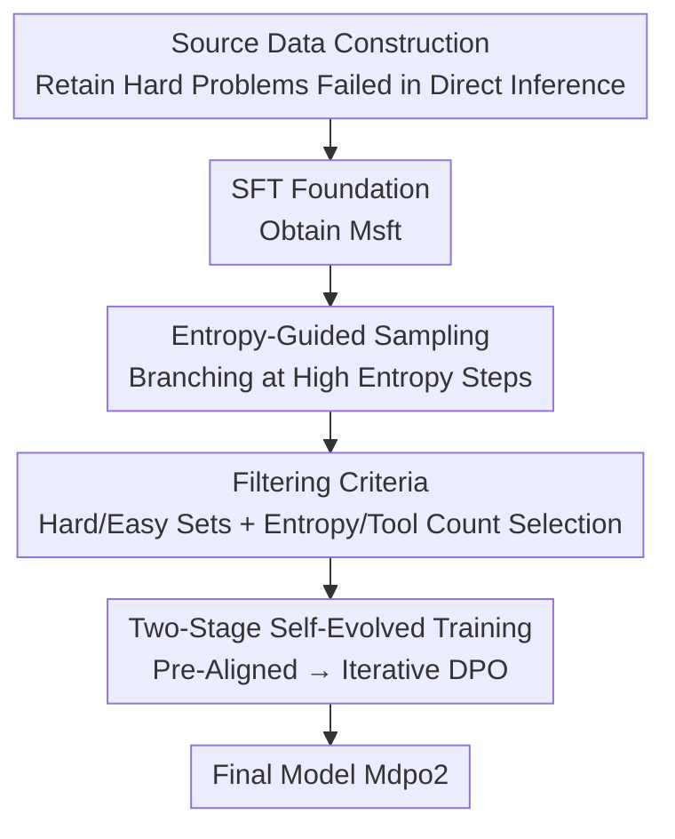

# Toward Effective Tool-Integrated Reasoning via Self-Evolved Preference Learning

**Conference**: ICLR 2026  
**OpenReview**: [https://openreview.net/forum?id=mNeitRAdWV](https://openreview.net/forum?id=mNeitRAdWV)  
**Code**: https://github.com/RUC-NLPIR/Tool-Light  
**Area**: LLM Reasoning  
**Keywords**: Tool-Integrated Reasoning, Information Entropy, Preference Learning, DPO, Self-Evolved Sampling

## TL;DR
The Tool-Light framework is proposed to analyze the root causes of inefficiency in Tool-Integrated Reasoning (TIR) from an information entropy perspective. By utilizing "entropy-guided sampling + two-stage self-evolved DPO," the model learns "when to call tools and when not to," simultaneously improving both accuracy and efficiency across 10 math and knowledge-intensive tasks.

## Background & Motivation

**Background**: Tool-Integrated Reasoning (TIR) enables large language models to autonomously call external tools (e.g., code interpreters, search engines) during the reasoning process to compensate for deficiencies in internal knowledge or computational capacity. It has become a mainstream enhancement for tasks such as deep information retrieval and precise calculation that cannot be solved by internal reasoning alone.

**Limitations of Prior Work**: Models with TIR often exhibit three types of "pathological" behaviors: **under-calling** (failing to call when necessary, leading to errors), **over-calling** (repeatedly calling tools for tasks manageable internally, wasting compute), and **over-thinking after receiving tool results** (potentially leading to "analysis paralysis"). The authors categorize these as "incorrect tool calls."

**Key Challenge**: Existing works optimizing tool calls via reinforcement learning almost exclusively focus on "reducing tool over-use." They ignore "under-calling" and fail to consider how tool results conversely perturb subsequent reasoning. Since the problem is not fully characterized, it cannot be thoroughly resolved.

**Goal**: Redefine the "effectiveness" of TIR as a comprehensive objective: reducing redundant calls, calling decisively when necessary, and avoiding over-thinking after obtaining results. This is to be addressed from both the training side (algorithms + data) and the inference side (sampling).

**Key Insight**: Leveraging the discovery that "high-entropy tokens determine reasoning directions," the authors conduct an information entropy analysis of the TIR process and derive two key observations: ① After a model receives tool results, the information entropy of subsequent outputs first rises, then fluctuates, and finally drops sharply before the next tool call; ② For the same problem, **correct paths with fewer tool calls exhibit lower overall entropy distributions**. These points directly link "entropy" to "tool call efficiency."

**Core Idea**: Given that low-entropy paths correspond to more streamlined tool usage, the authors **use entropy to guide data sampling** (branching at high-entropy points to create diversity and selecting positive examples from low-entropy correct paths) and then inject this "efficient tool use" preference into the model via **two-stage self-evolved preference learning**.

## Method

### Overall Architecture

Tool-Light is a multi-stage training pipeline divided into two major components: **data construction** (carefully designed sampling strategies to filter training data) and a **two-stage TIR training paradigm** (initial SFT followed by self-evolved DPO). The input is a set of questions with annotated answers, and the output is a TIR model $M_{dpo2}$ that uses tools "appropriately."

The workflow is as follows: first, $M_{sft}$ is trained from existing SFT data and used to perform direct inference **without tools**; only failed hard problems are kept to form the source data $D_{source}$. Then, $M_{sft}$ performs TIR sampling on $D_{source}$, merging "vanilla sampling" and "entropy-guided sampling" to produce candidate paths. Next, strict positive/negative pair filtering criteria (Cri1/Cri2) organize candidates into preference pairs. Finally, the model enters two-stage training: SFT as a foundation, followed by Pre-Aligned DPO and Self-Evolved DPO Alignment (multi-round iterative sampling + training) to align the model toward "efficient and necessary" tool calls. **Information entropy analysis is the consistent prior**: it explains why to branch at high-entropy points and why to pick positive examples from low-entropy paths.

### Key Designs

**1. TIR Analysis from an Information Entropy Perspective: Identifying Observable Signals for Efficient Tool Use**

This is the foundation of the work. The authors characterize the information entropy of each token position using the formula $H(i) = -\sum_{j=1}^{N} P(y_{ji}|y_{<i})\log P(y_{ji}|y_{<i})$. Using Search-R1, they performed ten rollouts per question across multiple QA datasets, grouping them into "high-calling" and "low-calling" sets to calculate average entropy distribution at each reasoning step. The conclusion is direct: entropy rises then falls after receiving tool results and drops sharply before the next call; **low-entropy chains consistently correspond to fewer tool calls, and the gap in tool counts between high and low-entropy chains widens as reasoning progresses**. The value of this observation is that it translates the abstract concept of "good tool use" into a **measurable and optimizable entropy signal**.

**2. Entropy-Guided Sampling: Creating Diversity where Exploration is Needed Most**

To address the high reasoning cost and uncertainty of vanilla sampling, the authors stop uniform re-sampling. Instead, they generate a main chain $C_{main}$ and calculate the average entropy for the first 10/20/30/40/50 tokens of each step: $H_{avg}(i)=\frac{1}{i}\sum_{j=1}^{i}H(j)$. They retain the maximum $H_{avg}$ and its corresponding length for each step. Then, they pick the **top-k steps with the highest entropy** to guide the model in continuing multiple branches: $D^2_{dpo} = \{y \mid y_{>i} = M_{sft}[I(q)\oplus y_{<i}]\}$. Since high-entropy positions are more likely to branch into diverse outputs, branching here is most "cost-effective." This tree-like branching reduces sampling complexity from $O(mn)$ to $O(n\log m)$ (where $m$ is the number of rollouts and $n$ is the sequence length), ensuring diversity while saving costs.

**3. Strict Positive/Negative Pair Selection Criteria: Enabling DPO to Learn the Gap Between Success and Failure**

Candidate paths are insufficient; DPO success depends on "clean" preference pairs. Trajectories are judged as correct (F1=1) or incorrect (F1=0). Samples are categorized into hard and easy sets based on accuracy, embedding entropy conclusions into selection rules. Under the entropy-guided strategy, the **positive example is the "correct trajectory with the fewest tool calls and lowest entropy"** (falling back to SFT trajectories if no correct trajectory exists), and the **negative example is an "incorrect trajectory with more tool calls than the positive."** The vanilla strategy takes the shortest correct trajectory as positive and a longer incorrect trajectory as negative, with a 2:1 ratio for hard/easy sets. This constructs preference pairs that naturally encode "concise and accurate vs. redundant and incorrect" comparisons.

**4. Two-Stage Self-Evolved Training: Suppressing Redundancy First, then Supplementing Necessity**

Training occurs in two stages. First, SFT uses $L_{SFT}(\theta)=-\sum_{(x,y)}\log P_\theta(y|x)$ to rapidly equip the model with TIR capabilities. Second, self-evolved DPO is performed using the standard DPO loss: $L_{DPO}=-\mathbb{E}\left[\log\sigma\left(\beta\log\frac{\pi_\theta(y_w|x)}{\pi_{ref}(y_w|x)} - \beta\log\frac{\pi_\theta(y_l|x)}{\pi_{ref}(y_l|x)}\right)\right]$. This is split into two steps: **Pre-Aligned DPO** uses Cri1 to train $M_{dpo1}$, specifically targeting "tool over-calling + over-thinking" to suppress redundancy. **Self-Evolved DPO Alignment** uses the stricter Cri2, re-sampling $D^2_{dpo}$ with $M_{dpo1}$ to train $M_{dpo2}$, then iteratively sets $M_{dpo1}\leftarrow M_{dpo2}$. The essence of "self-evolution" is the **model training on its own generated data**, with hard-set criteria dynamically adjusting to current model capabilities (selecting "few-tool low-entropy positives" in easy sets to consolidate efficiency and "longest correct chain positives + shortest incorrect chain negatives" in hard sets to supplement necessary calls).

### Loss & Training
- **SFT Loss**: $L_{SFT}(\theta)=-\sum_{(x,y)\in D}\log P_\theta(y|x)$.
- **DPO Loss**: As defined in Design 4, where $\pi_{ref}$ is the original policy model and $\beta$ is the temperature.
- **Self-Evolved Iteration**: Self-Evolved DPO Alignment is performed for multiple rounds (**2 rounds is optimal**), re-sampling and updating the reference model each round.
- **Tools**: Code interpreter and search engine.

## Key Experimental Results

### Main Results

Backbone: Qwen2.5-7B-Instruct, evaluated on 6 math reasoning tasks + 4 knowledge-intensive tasks.

| Method | Type | AIME24 | MATH500 | GSM8K | HotpotQA | 2Wiki | Avg. |
|------|------|--------|---------|-------|----------|-------|------|
| Direct Inference (Qwen) | Direct | 0.0 | 57.2 | 71.4 | 26.1 | 25.6 | 33.0 |
| Search-R1 | Single Tool | 16.7 | 63.8 | 82.4 | 48.7 | 40.0 | 45.6 |
| ToRL | Single Tool | 30.0 | 80.2 | 89.2 | 41.3 | 35.4 | 50.4 |
| Tool-Star | Multi-Tool | 30.0 | 77.2 | 89.4 | 54.7 | 55.7 | 56.6 |
| **Tool-Light (Ours)** | Multi-Tool | **33.3** | **79.0** | **92.0** | **57.7** | **56.1** | **58.0** |

Key Conclusions: ① Single-tool training (Search-R1 for knowledge, ToRL for math) has poor generalization; multi-tool training (Tool-Star/Ours) performs well across both categories. ② Tool-Light exceeds most GRPO-trained baselines in average score using only DPO, achieving SOTA in 4 math datasets and top-2 in all knowledge tasks.

### Ablation Study

| Configuration | Performance | Efficiency | Necessity | Description |
|------|-------------|-----------|-----------|------|
| Tool-Light (2 loop) | 58.0 | 0.44 | 0.75 | Full model |
| w. 1 loop | 57.9 (-0.1) | 0.42 | 0.71 | 1 round of self-evolution |
| w. 3 loop | 56.1 (-1.9) | 0.39 | 0.73 | Overfitting starts |
| w. 5 loop | 54.1 (-3.9) | 0.36 | 0.72 | Continued degradation |
| w. 1/1 data ratio | 56.9 (-1.1) | 0.44 | 0.76 | Ratio changed to 1:1 |
| w. p-r. (Random Positive) | 53.6 (-4.4) | 0.42 | 0.63 | Positive criteria broken |
| w. n-r. (Random Negative) | 53.9 (-4.1) | 0.41 | 0.74 | Negative criteria broken |

Efficiency is defined as $\frac{1}{n}\sum_{i=1}^{n}\frac{M_i}{T_i}$ (Performance / Tool Calls), and Necessity is $M\left(\frac{1}{n}\sum_{i=1}^{n}(N^i_{in}-N^i_{co})\right)$ (measuring under-calling).

### Key Findings
- **2 rounds of self-evolution is the sweet spot**: All metrics peak at round 2 then decline—sufficient positive/negative pairs are available early, but beneficial samples decrease later as the model overfits the training distribution.
- **Criteria for positive/negative pairs are more critical than data ratio**: Changing the ratio dropped performance by 1.1, whereas randomizing selection dropped it by 4.1-4.4.
- **Output entropy is effectively suppressed**: Tool-Light's entropy distribution is significantly lower than Search-R1 and ReCall, and its sequences are shorter but more accurate than Tool-Star, confirming that "low-entropy learning alleviates over-thinking."

## Highlights & Insights
- **Translating "tool use quality" into measurable entropy signals**: Instead of relying on manual reward rules, the paper identifies that "low entropy ≈ concise and accurate tool use," providing an objective basis for sampling and pair selection.
- **Entropy-guided sampling achieves two goals simultaneously**: Branching only at high-entropy positions enhances diversity while slashing complexity from $O(mn)$ to $O(n\log m)$.
- **Pure DPO outperforms multiple GRPO baselines**: This demonstrates that if data construction is appropriate (clean preference pairs), preference learning can achieve results comparable to RL in multi-step decision tasks at a much lower training cost.
- **"Self-evolution + Adaptive Difficulty"**: Training on self-generated data with dynamic difficulty categorization prevents the issues of fixed-difficulty data becoming insufficient or too overwhelming.

## Limitations & Future Work
- **Diminishing returns of self-evolution**: Saturation at 2 rounds indicates a loss of data diversity and overfitting; the framework lacks a mechanism to actively maintain diversity.
- **Generalizability of entropy signals**: The observation that low entropy correlates with fewer tool calls comes from specific models and QA/math tasks. Its validity in complex multi-tool combinations or long-horizon agent scenarios remains unverified.
- **Dependence on SFT data and toolsets**: Selection criteria might need redesigning when extending to richer tool ecosystems.
- **Dependency of Necessity/Efficiency metrics**: The Necessity calculation relies on a baseline pool; values may shift with the set of comparison methods.

## Related Work & Insights
- **vs Tool-Star**: Tool-Light uses Tool-Star as an SFT starting point but introduces two DPO stages to explicitly align for efficient tool use, raising the average score from 56.6 to 58.0 with shorter sequences.
- **vs Search-R1 / ToRL (Single-tool RL)**: These methods use meticulous reward functions for RL but excel only in single task types. Tool-Light uses multi-tool preference learning for broader generalization.
- **vs SMART / IKEA (Metacognitive)**: While those focus on "knowledge boundaries" to decide tool use, Tool-Light uses information entropy as an observable signal, providing a more data-driven and easily optimizable perspective.

## Rating
- Novelty: ⭐⭐⭐⭐ 
- Experimental Thoroughness: ⭐⭐⭐⭐ 
- Writing Quality: ⭐⭐⭐⭐ 
- Value: ⭐⭐⭐⭐ 

<!-- RELATED:START -->

<!-- RELATED:END -->

## Related Papers

- [\[ICLR 2026\] SimpleTIR: End-to-End Reinforcement Learning for Multi-Turn Tool-Integrated Reasoning](simpletir_end-to-end_reinforcement_learning_for_multi-turn_tool-integrated_reaso.md)
- [\[CVPR 2026\] Scaling Agentic Reinforcement Learning for Tool-Integrated Reasoning in VLMs](../../CVPR2026/llm_reasoning/scaling_agentic_reinforcement_learning_for_tool-integrated_reasoning_in_vlms.md)
- [\[ICLR 2026\] THOR: Tool-Integrated Hierarchical Optimization via RL for Mathematical Reasoning](thor_tool-integrated_hierarchical_optimization_via_rl_for_mathematical_reasoning.md)
- [\[ICLR 2026\] T1: Tool-Integrated Verification for Test-Time Compute Scaling in Small Language Models](t1_tool-integrated_verification_for_test-time_compute_scaling_in_small_language_.md)
- [\[ICLR 2026\] SkillFactory: Self-Distillation for Learning Cognitive Behaviors](skillfactory_self-distillation_for_learning_cognitive_behaviors.md)

<!-- RELATED:END -->
