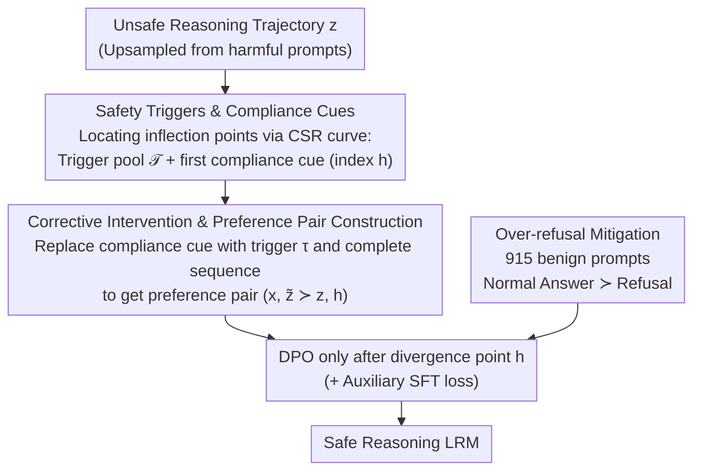

# Towards Safe Reasoning in Large Reasoning Models via Corrective Intervention

**Conference**: ICLR 2026  
**arXiv**: [2509.24393](https://arxiv.org/abs/2509.24393)  
**Code**: To be confirmed  
**Area**: LLM Reasoning  
**Keywords**: Reasoning Safety, Large Reasoning Models (LRM), Preference Optimization, Safety Triggers, Compliance Cues

## TL;DR
This paper reveals that the chain-of-thought (CoT) reasoning of Large Reasoning Models (LRMs) often contains harmful content even when the final answer is safe. It proposes Intervened Preference Optimization (IPO), which corrects unsafe reasoning trajectories by replacing compliance cues with safety triggers to construct preference pairs for alignment. IPO reduces the reasoning harm rate by over 30% across three LRMs without compromising reasoning performance.

## Background & Motivation
Large Reasoning Models (e.g., DeepSeek-R1, Qwen3) excel in math, coding, and agent tasks, but their CoT reasoning processes frequently contain harmful content (deception, illegal acts, violence, etc.), even if the final answers appear safe. This issue is systematically ignored by existing safety alignment methods:

**Key Challenge**: Current alignment methods (e.g., SafeChain, RealSafe, STAR) primarily train LRMs via SFT on distilled safe CoT data. However, experiments show: (1) While final answers are generally safe, harmful content in reasoning chains remains prevalent—RealSafe has a reasoning harm rate as high as 47.1% on WildJailbreak, despite a 2.0% answer harm rate; (2) Unsafe reasoning can be exploited by malicious users (especially in open-source models) and makes models more vulnerable to jailbreak attacks.

**Why RL is Insufficient**: Directly rewarding safe reasoning using GRPO is a natural idea but suffers from severe rollout diversity issues—approximately 50% of harmful prompts generate almost no safe reasoning trajectories, leading to a lack of intra-group advantage diversity and weak policy gradient signals.

**Key Insight**: By analyzing the evolution of safety during reasoning, the authors discover three key patterns: (1) Safe reasoning is usually consolidated by a few **safety triggers**—reasoning steps where the model explicitly acknowledges risks or cites safety guidelines—after which the probability of safe continuation is nearly 100%; (2) **Compliance cues** are strongly correlated with unsafe continuations—harmful outputs surge once steps expressing compliant intent appear; (3) Replacing compliance cues with safety triggers effectively corrects reasoning trajectories.

## Method

### Overall Architecture
IPO (Intervened Preference Optimization) treats reasoning safety as a **process-supervision** alignment problem. The pipeline is built on an empirical observation: reasoning safety is not uniformly distributed but is determined by a few key sentences. Thus, supervision should precisely target these sentences. Specifically, given an unsafe reasoning trajectory sampled from a harmful prompt, a safety metric is used to locate the first sentence that "misleads" the model (compliance cue). This cue is replaced with a corrective safety phrase (safety trigger) to let the model generate a safe continuation from the point of intervention. The original unsafe chain and the corrected safe chain form a preference pair, and DPO is applied **only after the divergence point**. Simultaneously, benign prompt preference data is used to mitigate over-refusal. The entire alignment takes about 40 minutes on 1,000 harmful prompts.

### Key Designs

**1. Safety Triggers & Compliance Cues: Quantifying "Safety Inflection Points"**

To apply supervision at critical steps, these steps must first be identified. The authors define the Continuation Safety Ratio (CSR) to measure the marginal contribution of each position in a reasoning chain to final safety: given a prefix $z_s^{\le i}$, the probability that a continuation remains safe is estimated as $S_i(x, z_s) = \mathbb{E}[\mathbb{I}(z_s^{\le i}\,\|\,z_c \text{ is safe})]$, implemented by sampling 32 continuations for each token position. In this CSR curve, **safety triggers** are defined as sentences that cause the CSR to soar above a threshold $\mu=0.9$ and remain stable within a window $K=15$—where the model acknowledges risks or cites guidelines. Conversely, **compliance cues** are sentences where the CSR drops below $\eta=0.1$ (also maintained within window $K=15$), indicating the model's intent to comply with malicious requests. Detection of compliance cues is performed using GPT-4o with few-shot prompting, achieving over 80% agreement with human labels. Furthermore, their position correlates with CSR inflection points (Pearson correlation of 0.85). Mapping token-level points back to sentences allows the automatic construction of a reusable **trigger pool $\mathcal{T}$**.

**2. Corrective Intervention & Preference Pair Construction: Steering the Trajectory**

Once the inflection point is found, IPO directly corrects the trajectory instead of re-distilling data. Suppose the first compliance cue in an unsafe trajectory $z$ is at token index $h$. A trigger $\tau$ from the pool $\mathcal{T}$ replaces that sentence, and the model generates an intervened trajectory $\tilde{z}^{\ge h} \sim \pi_\theta(\cdot \mid x, z^{<h}, \tau)$. If the continuation remains unsafe, the intervention is iterated. The original chain and the corrected chain form a preference pair $(x,\ \tilde{z} \succ z,\ h)$, where $h$ marks the true divergence. This solves two pain points: unlike GRPO where ~50% of harmful prompts fail to sample safe trajectories, proactive replacement ensures diversity. Moreover, since signals are applied only after the divergence, supervision is concentrated on safety-critical steps, equivalent to applying shaped rewards at CSR jump points, which is more efficient than global sparse rewards.

**3. Over-refusal Mitigation: Balancing Safety and Utility**

Training on pure safety data might lead to "over-refusal"—rejecting benign requests. The authors add a second phase: using 915 benign prompts from a preference dataset (STAR-benign-915), comparing "normal answers" to "refusal answers." This is mixed with harmful data for a second stage of DPO, with an auxiliary SFT loss (coefficient 0.2, similar to RPO) to stabilize training and preserve reasoning structures, restoring the balance between safety and helpfulness.

### Loss & Training
The core objective is a DPO loss calculated only after the divergence point $h$:

$$-\,\mathbb{E}\left[\log \sigma\!\left(\beta \log \frac{\pi_\theta(\tilde{z}^{\ge h}\mid x, z^{<h})}{\pi_{\text{ref}}(\tilde{z}^{\ge h}\mid x, z^{<h})} - \beta \log \frac{\pi_\theta(z^{\ge h}\mid x, z^{<h})}{\pi_{\text{ref}}(z^{\ge h}\mid x, z^{<h})}\right)\right]$$

It rewards corrected safe continuations and penalizes original harmful ones, affecting only tokens after $h$ to avoid polluting consistent reasoning before the divergence. Training uses 1,000 harmful prompts from STAR-1 with 6 representative safety triggers ($N=1$), resulting in ~500–1,400 preference pairs. The process takes ~40 minutes, whereas GRPO takes >2 hours with inferior results.

## Key Experimental Results

### Main Results (DeepSeek-R1-Distill-Llama-8B)

| Method | JBB Reason↓ | JBB Ans↓ | SR Reason↓ | SR Ans↓ | WJ Reason↓ | WJ Ans↓ | Reason Avg.↓ | Ans Avg.↓ | AIME↑ | MATH↑ | GPQA↑ | HEval↑ | Reason Avg.↑ |
|------|----------|----------|---------|---------|---------|---------|-----------|-----------|-------|-------|-------|--------|-----------|
| Base | 69.0% | 45.0% | 63.2% | 49.3% | 82.4% | 73.9% | 71.5% | 56.1% | 50.7 | 91.8 | 44.9 | 79.5 | 66.7 |
| STAR | 8.0% | 0.3% | 21.9% | 14.6% | 37.8% | 22.7% | 22.6% | 12.5% | 46.0 | 89.4 | 47.0 | 77.1 | 64.9 |
| GRPO | 0.3% | 0.0% | 19.0% | 19.7% | 36.3% | 33.6% | 18.5% | 17.8% | 50.0 | 92.8 | 50.5 | 79.9 | 68.3 |
| **IPO** | **5.7%** | **0.3%** | **16.7%** | **10.9%** | **23.4%** | **9.6%** | **15.3%** | **6.9%** | 54.0 | 91.6 | 49.0 | 79.5 | **68.5** |

IPO achieves the best comprehensive performance in both reasoning safety (15.3% avg.) and answer safety (6.9% avg.), while its reasoning capability (68.5%) exceeds all baselines including the base model.

### Ablation Study

| Ablation Variable | SR Reason↓ | SR Ans↓ | Avg.↓ |
|---------|---------|---------|-------|
| Detector: DS-8B | 21.8% | 17.1% | 19.4% |
| Detector: DeepSeek-R1 | 16.4% | 11.0% | 13.6% |
| Detector: GPT-4o | 16.2% | 11.3% | **13.7%** |
| Algorithm: SFT | 47.4% | 37.3% | 42.3% |
| Algorithm: DPO on Full | 25.8% | 12.3% | 19.0% |
| Algorithm: **DPO on Part** | **11.2%** | **10.6%** | **10.9%** |

Partial DPO (DPO on Part) significantly outperforms Full DPO and SFT, validating the effectiveness of precise local supervision.

### Key Findings
- **Reasoning Safety → Answer Safety**: The probability of a safe answer after safe reasoning is extremely high, suggesting alignment should prioritize reasoning processes over final answers.
- **Corrective Effect of Safety Triggers**: A single replacement significantly reduces harmful continuation rates; iterative intervention shows cumulative effects.
- **IPO vs GRPO Efficiency**: IPO requires at most 14 generations per prompt (6 triggers × 2 + 2 for over-refusal), whereas GRPO requires at least 40. Training: IPO ~40min vs GRPO >2h.
- **Cross-model Consistency**: Effective on DS-8B, DS-7B, and Qwen3-8B. Qwen3-8B's reasoning harm rate dropped from 51.3% to 13.9%.
- **KL Divergence Analysis**: IPO shows higher KL divergence at tokens corresponding to compliance cues, confirming the efficacy of targeted supervision.

## Highlights & Insights
- The discovery of "safety triggers" and "compliance cues" is the most significant empirical contribution—reasoning safety is determined by critical steps rather than being uniform.
- CSR (Continuation Safety Ratio) is an elegant tool for quantifying the marginal safety contribution of each token.
- IPO introduces reward shaping to safety alignment: applying local preference signals at CSR inflection points is more efficient than global rewards.
- Achieves the best Pareto balance between safety and reasoning capability—safety improves significantly while reasoning performance is maintained or enhanced.
- The 0.85 correlation between compliance cues and CSR inflection points provides a solid empirical basis for intervention.

## Limitations & Future Work
- Compliance cue detection relies on GPT-4o as an external judge, introducing potential bias and dependency.
- The construction of the safety trigger pool still involves manual selection (6 representative triggers), limiting automation.
- XsTest compliance (DS-8B: 80%) is lower than some weak safety baselines, indicating some over-refusal.
- Verification is limited to scales ≤8B (except 1.5B–14B mentioned in the appendix); effects on larger models need confirmation.
- Reasoning safety in multi-turn dialogues and agent scenarios is not explored (mentioned as future work).
- Scaling effects of training data beyond ~1,000 harmful prompts are unknown.

## Related Work & Insights
- Compared to SFT methods like SafeChain/RealSafe/STAR, IPO does not rely on distilled safe CoT data but interventions in unsafe trajectories.
- Unlike BackTrack, which uses special tokens for rollback, IPO performs forward correction at the reasoning level.
- The argument that "reasoning safety should prioritize answer safety" is powerful and quantitatively supported, potentially shifting the focus of safety alignment research.
- CSR and safety trigger analysis can be extended to other process-supervision tasks such as factuality and logical consistency.

## Rating
- Novelty: ⭐⭐⭐⭐⭐ First to treat reasoning safety as an independent alignment goal; original contributions in triggers/cues.
- Experimental Thoroughness: ⭐⭐⭐⭐ Covered 3 LRMs, 3 safety benchmarks, and 4 reasoning benchmarks with ablation, though model scale is limited.
- Writing Quality: ⭐⭐⭐⭐⭐ Clear logical chain: observation → hypothesis → method → verification.
- Value: ⭐⭐⭐⭐⭐ Reveals a neglected dimension in LRM alignment; method is practical and efficient, impacting safe AI research.

<!-- RELATED:START -->

## Related Papers

- [\[ICLR 2026\] RFEval: Benchmarking Reasoning Faithfulness under Counterfactual Reasoning Intervention in Large Reasoning Models](rfeval_benchmarking_reasoning_faithfulness_under_counterfactual_reasoning_interv.md)
- [\[ICLR 2026\] Once-More: Continuous Self-Correction for Large Language Models via Perplexity-Guided Intervention](once-more_continuous_self-correction_for_large_language_models_via_perplexity-gu.md)
- [\[ICLR 2026\] Pruning Long Chain-of-Thought of Large Reasoning Models via Small-Scale Preference Optimization](pruning_long_chain-of-thought_of_large_reasoning_models_via_small-scale_preferen.md)
- [\[ICLR 2026\] HardcoreLogic: Challenging Large Reasoning Models with Long-tail Logic Puzzle Games](hardcorelogic_challenging_large_reasoning_models_with_long-tail_logic_puzzle_gam.md)
- [\[ICLR 2026\] Your Models Have Thought Enough: Training Large Reasoning Models to Stop Overthinking](your_models_have_thought_enough_training_large_reasoning_models_to_stop_overthin.md)

<!-- RELATED:END -->
