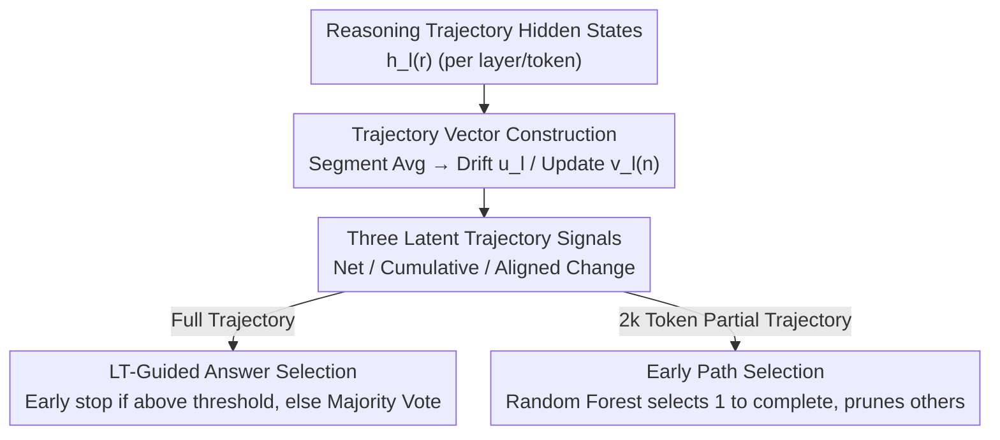

# Tracing the Traces: Latent Temporal Signals for Efficient and Accurate Reasoning

**Conference**: ICLR 2026  
**OpenReview**: [https://openreview.net/forum?id=Ytlj8Ckv9n](https://openreview.net/forum?id=Ytlj8Ckv9n)  
**Area**: LLM Reasoning  
**Keywords**: Reasoning Trajectory, Hidden States, Test-time Scaling, Answer Selection, Interpretability

## TL;DR
This paper proposes **Latent-Trajectory (LT) signals**—by tracing the "temporal evolution trajectory" (net change, cumulative change, and aligned change) of the model's hidden states during reasoning token generation, it predicts whether a reasoning trajectory leads to a correct answer without training. This signal guides early stopping and early path selection in multi-sample reasoning, reducing token consumption by up to approximately 70% while maintaining or even improving accuracy.

## Background & Motivation

**Background**: Reasoning models (DeepSeek-R1, Phi-4-Reasoning, Qwen3, etc.) enhance their capabilities through "test-time scaling"—generating longer chains of thought or aggregating multiple sampled reasoning trajectories (e.g., majority vote). However, token consumption grows exponentially with each additional sample.

**Limitations of Prior Work**: Not all reasoning trajectories are equivalent; some fall into "overthinking," fail to converge, or iterate pointlessly. Identifying "reliable trajectories" early could save significant compute. Current discriminative methods have flaws: ① Verifier models incur high additional inference costs; ② Analyzing natural language surface forms depends on human/model labeling, and text may not reflect the model's true internal strategy (some models even output latent embeddings directly); ③ Heuristics like trajectory length or output token distributions (logit margin / entropy / perplexity) are simple but unreliable, often performing near random.

**Key Challenge**: When determining reasoning quality, one must either sacrifice accuracy for simplicity or sacrifice compute for accuracy. The "internal representation dynamics" that truly drive reasoning have remained unutilized.

**Goal**: Find a **training-free, compute-on-the-fly, and cross-model universal** signal that predicts final answer correctness solely from the model's own hidden state trajectories, converting this into compute-saving reasoning strategies.

**Key Insight**: Extensive work shows that probing hidden states reveals information about model reliability, safety, and performance. The authors hypothesize that **the "temporal evolution" of hidden states during reasoning token generation carries predictive information about final answer correctness**. This represents a "temporal" perspective—distinct from previous works that examine representation curvature along the "layer" direction (cross-layer / spatial).

**Core Idea**: Treat the hidden state sequence of a reasoning trajectory as a "path" in latent space. Use three geometric quantities—distance traveled, cumulative jitter, and directness towards the final direction—to determine reasoning quality. These quantities are then used online to decide whether to stop ("this is good enough") or continue ("this shows promise").

## Method

### Overall Architecture
Given a query, the reasoning model generates a sequence: `query → {trace start} reasoning tokens → {trace end} → answer`. This method focuses on the intermediate reasoning tokens: at each token position $r$ and every layer $l$, the model produces a hidden state $h_l^{(r)} \in \mathbb{R}^d$. The method first applies "temporal coarse-graining" to compress these into segment-level states, extracts three complementary signals from the segment-level trajectory, and applies these signals to two types of reasoning control: **End-to-end Answer Selection** (deciding after viewing the full trajectory) and **Early Path Selection** (deciding after viewing only a partial trajectory).

Specifically, the reasoning trajectory is split into non-overlapping "segments" of $k=500$ tokens. Hidden states within each segment are averaged to obtain the segment-level state $\tilde{h}_l^{(n)}$ (layer $l$, segment $n$). This produces a segment-level trajectory $\{\tilde{h}_l^{(1)}, \dots, \tilde{h}_l^{(N)}\}$ per layer, smoothing token-level local jitter while preserving large-scale evolution. Two base vectors are defined: the **Drift Vector** $u_l = \tilde{h}_l^{(N)} - \tilde{h}_l^{(1)}$ (total displacement) and the **Update Vector** $v_l^{(n)} = \tilde{h}_l^{(n)} - \tilde{h}_l^{(n-1)}$ (incremental change). The three LT signals are derived from these vectors, calculated per layer, and averaged across layers to produce a scalar score per trajectory.

### Key Designs

**1. Segment-level Trajectory Vectors: Transforming hidden state sequences into measurable latent space paths**

Viewing hidden states directly at the token level is difficult due to high dimensionality and intense jitter. This method partitions the trajectory into fixed 500-token segments and takes the mean. This "temporal coarse-graining" reduces dimensionality and suppresses local fluctuations while maintaining the overall scale of representation evolution. The drift vector $u_l$ captures "how far and where it went," while the update vector $v_l^{(n)}$ captures "how it moved at each step." Combining both allows for an analysis of both total displacement and step-by-step dynamics, serving as the foundation for the three signals.

**2. Three Complementary Latent Trajectory Signals: Characterizing reasoning quality via magnitude and direction**

This is the core contribution. Three metrics are derived from the base vectors to answer different questions. **Net Change** asks "how far did the reasoning move the representation overall," taking the norm of the drift vector, normalized by segments to account for length:

$$\mathrm{NetChange} = \frac{1}{L}\sum_{l\in L}\frac{\lVert u_l\rVert_2}{N}$$

**Cumulative Change** asks "how much jitter occurred along the way," summing the norms of each update vector regardless of the final destination:

$$\mathrm{CumulativeChange} = \frac{1}{L}\sum_{l\in L}\sum_{n=2}^{N}\lVert v_l^{(n)}\rVert_2$$

**Aligned Change** asks "did each intermediate step move directly toward the final direction," measured as the cosine similarity between each update vector and the drift vector:

$$\mathrm{AlignedChange} = \frac{1}{L}\sum_{l\in L}\frac{1}{N-1}\sum_{n=2}^{N}\frac{\langle v_l^{(n)}, u_l\rangle}{\lVert v_l^{(n)}\rVert_2\,\lVert u_l\rVert_2}$$

Mechanism experiments show that correct trajectories tend to have **high Net Change, high Aligned Change, and low Cumulative Change**—meaning representations undergo significant, directional displacement directly toward a final state. Incorrect trajectories "wander" more and lack consistency (Cumulative Change correlates negatively with accuracy $r=-.38$, while Net Change $r=+.28$ and Aligned Change $r=+.32$ correlate positively).

**3. LT-guided End-to-End Answer Selection: Replacing blind majority voting with internal signals**

Majority voting conventionally requires a fixed number of samples (e.g., 5) before aggregation, which is expensive. This work implements **Sequential Sampling + Online Early Stopping**: the LT signal is calculated for each sampled trajectory. If it exceeds a calibrated threshold $\tau$, it is accepted as the final answer immediately. If none of the $k=5$ samples pass the threshold, the system reverts to majority voting. The threshold $\tau$ is chosen via cross-validation on a calibration set.

**4. Early Path Selection: Pruning poor paths using early-emerging signals**

A more aggressive compute-saving approach does not wait for trajectories to finish. The authors found LT signals to be discriminative early in the reasoning process (ROC-AUC > 0.6 within the first 4k tokens). When sampling multiple trajectories in parallel, each is allowed only 2k tokens. The LT signals at this point serve as features for a lightweight Random Forest classifier to predict correctness, selecting the **single most promising trajectory to complete and terminating the other four**.

### Loss & Training
The method is **completely training-free**. The three LT signals are deterministic geometric quantities of hidden states calculated during inference. The only "learning" components are the lightweight Random Forest classifier for early selection and the cross-validation for the threshold $\tau$, both of which incur overhead far smaller than running an additional verifier or sampling extra trajectories.

## Key Experimental Results

**Models & Data**: Three open-source reasoning models: DeepSeek-R1-Distill-Qwen-14B (R1-D), Phi-4-Reasoning-Plus (Phi4R+), and Qwen3-14B (Qwen3). Domains include GPQA Diamond (Science MC), AIME 2025 (Math), and TSP (Optimization).

### Main Results
Discriminative Power (ROC-AUC for distinguishing correct/incorrect trajectories, averaged across models):

| Signal Type | Metric | ROC-AUC |
|-------------|--------|---------|
| LT–Net Change | Net Change | 0.71 ± 0.09 |
| LT–Cumulative (sign flipped) | Cumulative | 0.74 ± 0.09 |
| LT–Aligned Change | Aligned | 0.73 ± 0.08 |
| Layer Magnitude (baseline) | Layer Mag | 0.58 ± 0.17 |
| Layer Angle (baseline, sign flipped) | Layer Ang | 0.67 ± 0.14 |
| Logit Margin | — | 0.59 ± 0.10 |
| Entropy | — | 0.44 ± 0.10 |
| Perplexity | — | 0.49 ± 0.12 |

LT signals are consistently above random and significantly superior to cross-layer geometry and output distribution confidence (the latter often performing near or below random).

Accuracy and Efficiency (Excerpt from Table 1, parentheses denote change relative to MV@5):

| Model | Strategy | GPQA Acc. | AIME Acc. | TSP Acc. | Efficiency (Samples / Token Savings) |
|-------|----------|-----------|-----------|----------|-----------------------------------------|
| R1-D | MV@5 | 59.90 | 56.67 | 27.50 | 5.00 samples |
| R1-D | LT–Net | 61.10 (+1.2) | 61.90 (+5.2) | 28.60 (+1.1) | 1.2–1.7 samples, 54–71% savings |
| Qwen3 | MV@5 | 63.96 | 70.00 | 36.25 | 5.00 samples |
| Qwen3 | LT–Cumulative | 63.30 (-0.7) | **84.10 (+14.1)** | 36.30 (+0.1) | 1.6–2.3 samples, 41–66% savings |

Summary: Compared to MV@5, LT strategies save an average of **58% samples and 48% tokens (up to 70.6%)**, with an average accuracy increase of **+2.46%**.

### Ablation Study

| Configuration | Key Metrics | Observation |
|---------------|-------------|-------------|
| Shortest@5 (Length baseline) | Avg. accuracy drop 1.4% | "Shorter is better" is unreliable. |
| LT Answer Selection | >85% points trigger early stop | This subset consistently outperforms baselines. |
| LT Early Selection (2k tokens) | Avg. Acc +2.49%, 61.2% tokens saved | R1-D: 54%, Qwen3: 62%, Phi4R+: 68% savings. |
| vs. ST-BoN (Early selection) | LT +2.48% vs ST-BoN +1.12% | LT doubles accuracy gain and is cheaper. |

### Key Findings
- **Mechanistic Explainability**: Correct reasoning corresponds to "large + directional" representation shifts (high Net/Aligned Change), while incorrect reasoning corresponds to "wandering + deviation" (high Cumulative Change).
- **Output Confidence is Ineffective**: Entropy and Perplexity AUCs (0.44–0.49) are near random; internal trajectories are far more reliable.
- **Signals Emerge Early**: AUC exceeds 0.6 within the first 4k tokens, enabling path pruning.
- **Robustness**: AUC remains stable at 0.70–0.72 across models from 8B to 70B and various reasoning tasks.

## Highlights & Insights
- **The "Temporal Dimension" is a new perspective**: Unlike spatial/cross-layer curvature or output distributions, this method treats the reasoning trajectory as a polyline in latent space.
- **Training-free & Direct**: LT signals are deterministic functions of hidden states, requiring no verifiers or labels, and can be integrated into decoding with near-zero overhead.
- **Turning Interpretability into Utility**: Moving from "why reasoning fails" to "which trajectory to prune" translates mechanistic insights into compute scheduling.

## Limitations & Future Work
- **Dependency on Hidden States**: Requires white-box access, making it inapplicable to black-box APIs.
- **Calibration Required**: Thresholds/classifiers must be fitted on a calibration set; cross-domain transfer may require recalibration.
- **Segment Length $k=500$**: The granularity of segmentation and cross-layer averaging remains a hyperparameter.
- **Task-dependent Signal Priority**: Net vs. Cumulative Change dominance can flip depending on the dataset.

## Related Work & Insights
- **vs. Cross-layer Curvature (Wang et al. 2024)**: They view curvature across layers (spatial) within one segment; this method views evolution across time (temporal). LT AUC (0.71–0.74) is significantly higher than cross-layer signals (0.58–0.67).
- **vs. ST-BoN**: ST-BoN relies on pairwise distances between multiple samples; LT calculates signals on a single sample's trajectory, making it cheaper and more effective.
- **vs. Trained Verifiers**: This method is training-free and plug-and-play across models with zero setup cost.

## Rating
- Novelty: ⭐⭐⭐⭐⭐ 
- Experimental Thoroughness: ⭐⭐⭐⭐⭐ 
- Writing Quality: ⭐⭐⭐⭐ 
- Value: ⭐⭐⭐⭐⭐ 

<!-- RELATED:START -->

## Related Papers

- [\[ICLR 2026\] Optimal Aggregation of LLM and PRM Signals for Efficient Test-Time Scaling](optimal_aggregation_of_llm_and_prm_signals_for_efficient_test-time_scaling.md)
- [\[ACL 2026\] Efficient Test-Time Scaling via Temporal Reasoning Aggregation](../../ACL2026/llm_reasoning/efficient_test-time_scaling_via_temporal_reasoning_aggregation.md)
- [\[ICLR 2026\] Where Did This Sentence Come From? Tracing Provenance in LLM Reasoning Distillation](where_did_this_sentence_come_from_tracing_provenance_in_llm_reasoning_distillati.md)
- [\[ICLR 2026\] Segment-Level Attribution for Selective Learning of Long Reasoning Traces](segment-level_attribution_for_selective_learning_of_long_reasoning_traces.md)
- [\[ICLR 2026\] RESTRAIN: From Spurious Votes to Signals — Self-Training RL with Self-Penalization](restrain_from_spurious_votes_to_signals_self-training_rl_with_self-penalization.md)

<!-- RELATED:END -->
