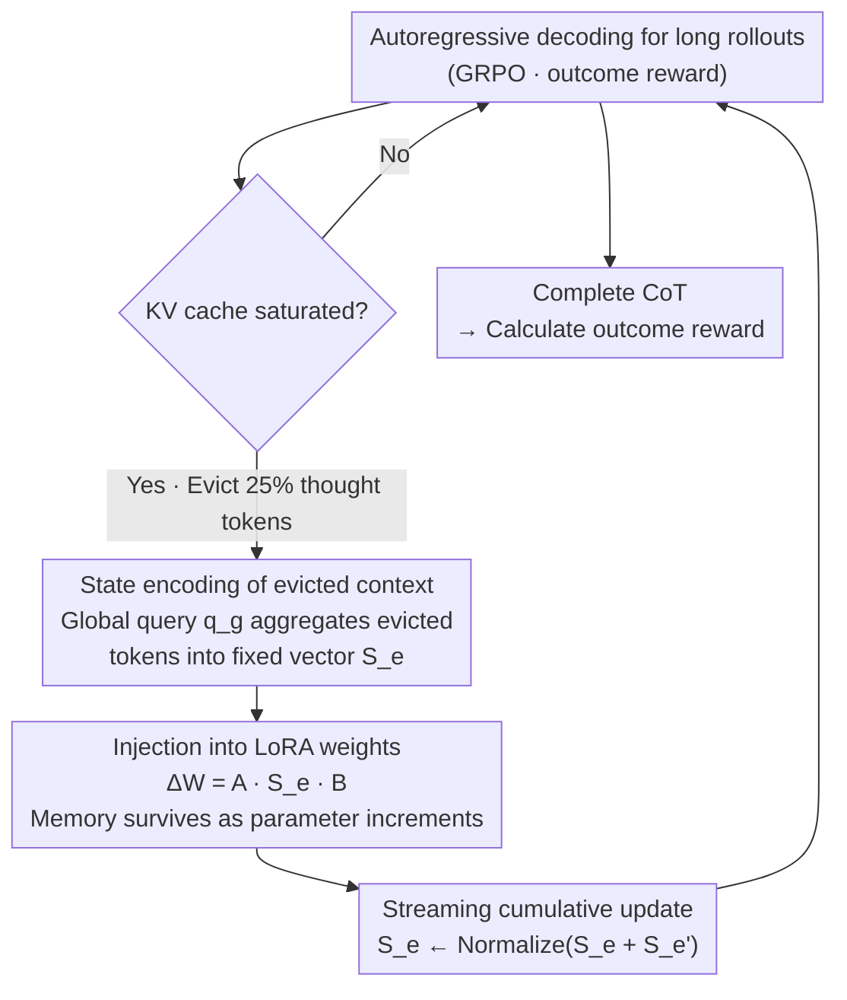

# Training Large Reasoning Models Efficiently via Progressive Thought Encoding

**Conference**: ICLR 2026  
**arXiv**: [2602.16839](https://arxiv.org/abs/2602.16839)  
**Code**: No public code  
**Area**: LLM Reasoning  
**Keywords**: Large Reasoning Models, RL training efficiency, KV cache compression, Parameter-efficient fine-tuning, Progressive thought encoding

## TL;DR

This paper proposes Progressive Thought Encoding, which encodes evicted thought tokens into LoRA weights under KV cache constraints. This allows Large Reasoning Models (LRMs) to reduce GPU memory consumption by half during RL training while reasoning accuracy surpasses full-cache LoRA (with a maximum improvement of +23.4% on AIME2024/2025).

## Background & Motivation

**Core Challenge of RL Training**: Large Reasoning Models (LRM) undergo post-training via RL (e.g., GRPO), requiring long rollout sequences to obtain outcome-based rewards. Autoregressive decoding makes the rollout phase the primary bottleneck for both time and VRAM—difficult tasks require longer Chains of Thought (CoT), further exacerbating resource consumption.

**Dilemma of Sliding Windows**: Intuitively, a sliding window can limit the KV cache size to reduce VRAM. However, experiments show this severely impairs reasoning quality—discarding intermediate thought tokens disrupts long-range context understanding, leading to a decline in rollout sample quality and subsequent training effectiveness. For instance, the average accuracy of Qwen2.5-3B drops from 28.2% to 25.6% under a sliding window.

**Core Problem**: Can LRMs be trained under strict VRAM budgets without sacrificing reasoning accuracy? Specifically, can the model "see" all historical tokens even within a limited cache window?

## Method

### Overall Architecture

Progressive Thought Encoding addresses a specific issue: when training LRMs using RL (GRPO), the KV cache of long rollouts exhausts VRAM, but simply discarding intermediate thought tokens via sliding windows severs long-range dependencies and degrades reasoning performance. The proposed approach transforms "cache eviction" from pure information loss into an opportunity for online learning. The entire pipeline is a loop triggered repeatedly during decoding: the model performs autoregressive decoding as usual; once the KV cache is saturated, a batch of evicted thought tokens is selected based on an eviction strategy; a global query then compresses them into a fixed-size state vector $S_e$; this vector is injected into a set of lightweight LoRA weights to form an increment $\Delta W$; finally, the current state is accumulated into the historical state before decoding continues. Consequently, the information of evicted tokens is no longer stored in the cache but resides within the model as parameter increments—encoding, injection, and accumulation occur each time the cache saturates, allowing the model to "remember" the full history despite a restricted window.

### Key Designs

**1. State Encoding of Evicted Context: Compressing discarded tokens into a fixed vector via a global query**

The first step in the framework addresses the pain point where evicted tokens vanish and long-range dependencies are severed. A learnable global query vector $q_g$ is introduced to serve as a summary carrier for all evicted contexts. Whenever a batch of tokens $\{y_{e_1},\dots,y_{e_m}\}$ is selected by the eviction strategy, they are aggregated into a context state using an attention-style mapping:

$$S_e = (W_Q^a q_g)\,(W_K^a K_e)^\top\,(W_V^a V_e)$$

Where $K_e$ and $V_e$ are the key-value vectors of the evicted tokens, and $W_Q^a, W_K^a, W_V^a$ project the global query and evicted tokens into a compressed latent space. Crucially, the dimension of $S_e$ remains fixed regardless of the number of evicted tokens, ensuring that the cost of subsequent weight updates is independent of history length—this is the fundamental reason VRAM consumption is constrained. To ensure $q_g$ is a meaningful context carrier from the start, the state is initialized with a learnable global token $h_g$ before processing any evicted tokens to avoid encoding noise during a cold start.

**2. Injecting Context State into LoRA Weights: Allowing "memory" to survive as parameter increments**

Once $S_e$ is obtained, it must influence subsequent decoding. This corresponds to the injection step following encoding in the framework. Rather than pushing $S_e$ back into the cache (which would defeat the purpose of saving VRAM), it is used to construct a LoRA weight increment $\Delta W = A\,S_e\,B$, which is directly applied to the model weights. Thus, the influence of evicted tokens no longer relies on the attention mechanism to "see" specific KVs but is integrated into Every layer of forward computation. The model retains long-context understanding within a limited window. Since LoRA itself has very few parameters, this memory path adds almost no VRAM overhead while continuously preserving information from thousands of discarded tokens—this is key to "halving VRAM without losing accuracy."

**3. Streaming Cumulative Update: Refreshing memory during generation without divergence**

A single encoding only covers the current batch of evicted tokens, whereas long reasoning will trigger eviction multiple times. Therefore, the framework loop must allow states to be added incrementally. Whenever a new batch of tokens is evicted and a new $S_e'$ is calculated, the state is updated via $S_e \leftarrow \text{Normalize}(S_e + S_e')$, and $\Delta W$ is recalculated. Normalization ensures the state magnitude does not diverge with repeated evictions, while summation achieves true streaming adaptation—the model "remembers" all evicted tokens throughout the generation process. This essentially functions as online self-adaptation of intermediate thoughts during inference. Ablations confirm that both paths are necessary: omitting the global token ($#Global-0$) or omitting the eviction encoding (Global-Only) results in significantly worse performance than using both combined.

### Loss & Training

Training follows the outcome-based GRPO, optimized on DAPO-Math-17K with a global batch size of 512 and a learning rate of 1e-5. Regarding eviction strategy, problem tokens are permanently retained (similar to sink tokens), while only thought tokens are subject to sliding window eviction. 25% of tokens are discarded whenever the cache saturates; the cache size is set to the maximum problem length within the current micro-batch. Learnable modules are lightweight: the LoRA rank is set to 32, and the number of global tokens is also set to 32 (ablation shows performance degrades at 64).

## Key Experimental Results

### Main Results

Comparison across 3 models and 6 mathematical reasoning benchmarks (max generation length 3072):

| Method | Peak GPU Mem | Math500 | Olympiad | AMC | AIME24 (p@16) | AIME25 (p@16) | Average |
|------|-------------|---------|----------|-----|---------------|---------------|------|
| **Qwen2.5-3B** | | | | | | | |
| Baseline | - | 50.8 | 27.2 | 34.3 | 20.0 | 13.3 | 26.9 |
| LoRA | 82.8% | 53.2 | 27.8 | 35.9 | 20.0 | 16.7 | 28.2 |
| LoRA_c (sliding window) | 38.0% | 50.0 | 27.7 | 33.1 | 16.7 | 10.0 | 25.6 |
| **Ours** | **45.3%** | **54.0** | **29.0** | **45.0** | **20.0** | **16.7** | **30.1** |
| **DeepSeek-R1-Distill-8B** | | | | | | | |
| Baseline | - | 53.6 | 28.7 | 42.5 | 20.0 | 20.0 | 30.1 |
| LoRA | 88.7% | 57.4 | 35.3 | 55.0 | 23.3 | 20.0 | 34.9 |
| LoRA_c | 59.1% | 54.2 | 31.9 | 45.0 | 36.7 | 26.7 | 35.1 |
| **Ours** | **59.8%** | **57.6** | **39.7** | **60.0** | **56.7** | **43.3** | **45.6** |

### Ablation Study

Impact of global tokens and eviction strategies (DeepSeek-R1-Distill-8B, MATH-500):

| Configuration | Cache 768 | Cache 1K | Cache 2K | Description |
|------|---------|--------|--------|------|
| Baseline | 34.4 | 39.6 | 47.8 | No RL training |
| #Global-0 (No global tokens) | 36.2 | 41.0 | 48.6 | Eviction encoding only, limited gain |
| Global-Only (No eviction update) | 46.8 | 50.2 | 54.0 | Global tokens effective but insufficient |
| **Ours (#Global-32)** | **48.4** | **52.2** | **55.4** | Global + Eviction encoding is optimal |
| Ours + HeadKV | 50.7 | 53.4 | 55.8 | Better eviction strategy helps |

**Scalability**: With a fixed 1K cache window, as the maximum generation length scales from 3K to 64K, this method shows continuous scaling improvements across the entire range, whereas LoRA and LoRA_c gradually saturate.

### Key Findings

1. **VRAM Halved, Accuracy Exceeded**: On DeepSeek-R1-8B, Peak GPU decreased from 88.7% to 59.8% (-28.9%), while average accuracy increased from 34.9% to 45.6% (+10.7%).
2. **Surprising Performance on AIME**: DeepSeek-R1-8B improved from 23.3 to 56.7 (+33.4) on AIME2024 and from 20.0 to 43.3 (+23.3) on AIME2025.
3. **Longer Reasoning = Better Results**: Progressive encoding allows for safely increasing rollout lengths during training (4K→6K) with almost no change in VRAM, yet MATH-500 accuracy rose from 57.6 to 60.2.
4. **Stability in Long Sequences**: This method is particularly prominent in long responses, whereas the gains of LoRA_c come mainly from short responses.

## Highlights & Insights

- **Turning Waste into Treasure**: Changing KV cache eviction from "information loss" into an "online learning opportunity" is a highly clever perspective shift.
- **Practical Feasibility of Reasoning RL**: VRAM consumption is the primary barrier to scaling RL training; this method directly addresses this engineering bottleneck.
- **New Form of Test-time Learning**: Progressive encoding is essentially online adaptation during inference—the model continuously learns its own intermediate thoughts during generation.

## Limitations & Future Work

1. **Validated Only on Math Reasoning**: All 6 benchmarks are mathematical tasks; scenarios like code generation or scientific reasoning are not covered.
2. **Conservative Eviction Policy**: Simple sliding windows were used during training. The authors note that superior token selection strategies (e.g., HeadKV) could further improve results but increase runtime by 37%.
3. **Global Token Sensitivity**: #Global-64 performs worse than #Global-32, indicating hyperparameter tuning is required.
4. **No Comparison with Token-Level Reward Methods**: Currently only outcome-based rewards are considered; process rewards might offer further improvements.

## Related Work & Insights

- Complementary to **test-time training** (e.g., entropy minimization)—this method is "training during generation."
- Orthogonal to **KV cache compression** (PyramidKV, H2O, HeadKV)—better eviction strategies can be directly integrated.
- Insight: **Efficiency optimization in RL training** is a critical direction for current LRM research; this method provides a new path starting from "cache management."

## Rating

- Novelty: ⭐⭐⭐⭐⭐ Extremely creative idea to transform cache eviction into online learning signals.
- Experimental Thoroughness: ⭐⭐⭐⭐ 3 models × 6 benchmarks + rich ablations, but limited to the mathematical domain.
- Writing Quality: ⭐⭐⭐⭐ Clear problem formalization and rigorous formula derivation.
- Value: ⭐⭐⭐⭐⭐ Significant engineering impact by addressing the core bottleneck of LRM RL training.

<!-- RELATED:START -->

## Related Papers

- [\[ICLR 2026\] Your Models Have Thought Enough: Training Large Reasoning Models to Stop Overthinking](your_models_have_thought_enough_training_large_reasoning_models_to_stop_overthin.md)
- [\[ICLR 2026\] Towards Safe Reasoning in Large Reasoning Models via Corrective Intervention](towards_safe_reasoning_in_large_reasoning_models_via_corrective_intervention.md)
- [\[ICLR 2026\] Exposing Weaknesses of Large Reasoning Models through Graph Algorithm Problems](exposing_weaknesses_of_large_reasoning_models_through_graph_algorithm_problems.md)
- [\[ICLR 2026\] Dynamics-Predictive Sampling for Active RL Finetuning of Large Reasoning Models](dynamics-predictive_sampling_for_active_rl_finetuning_of_large_reasoning_models.md)
- [\[ICLR 2026\] RFEval: Benchmarking Reasoning Faithfulness under Counterfactual Reasoning Intervention in Large Reasoning Models](rfeval_benchmarking_reasoning_faithfulness_under_counterfactual_reasoning_interv.md)

<!-- RELATED:END -->
