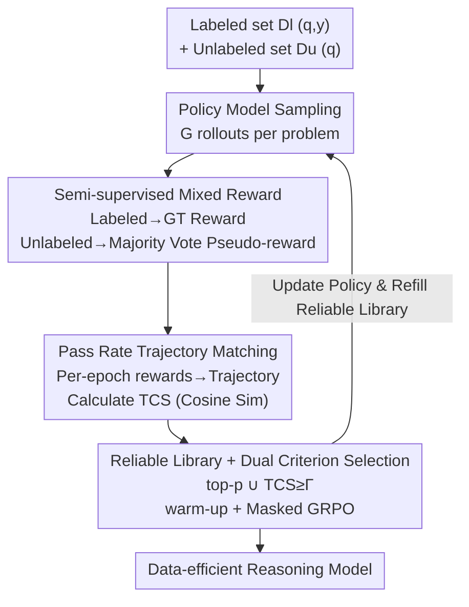

# TRAPO: Enhancing LLM Reasoning with Semi-supervised Reinforcement Learning

**Conference**: ICLR 2026  
**OpenReview**: [https://openreview.net/forum?id=3K1y4KbWAx](https://openreview.net/forum?id=3K1y4KbWAx)  
**Code**: https://github.com/ShenzhiYang2000/TRAPO  
**Area**: LLM Reasoning  
**Keywords**: RLVR, Semi-supervised Learning, Pass Rate Trajectory, Pseudo-label, Data Efficiency

## TL;DR
TRAPO proposes a semi-supervised RLVR paradigm that uses a small set of labeled samples to "anchor" the consistency rewards of unlabeled samples. By comparing the similarity of "pass rate trajectories" between labeled and unlabeled samples, it selects reliable unlabeled data. With only 1K labeled and 3K unlabeled samples, it achieves a 42.6% average accuracy, surpassing the strongest unsupervised method trained on 45K unlabeled samples (38.3%), and matches fully supervised performance using only 10% of the labeling volume.

## Background & Motivation
**Background**: Reinforcement Learning with Verifiable Rewards (RLVR), represented by DeepSeek-R1, has become the mainstream approach for training large reasoning models. This involves sampling multiple reasoning trajectories (rollouts) for a given problem from a policy model, calculating binary rewards based on whether the final answer matches the ground truth, and using group-based advantage estimation (such as GRPO) to guide the model toward correct reasoning paths.

**Limitations of Prior Work**: Supervised RLVR relies on gold-standard annotations, which incur exorbitant costs when scaling, making it nearly impossible to implement in fields like medicine or finance where standard answers are scarce or expensive. To bypass annotations, recent unsupervised RLVR methods use internal signals (majority voting, entropy, self-certainty) as rewards to enable self-improvement without labels.

**Key Challenge**: Purely unsupervised methods generally suffer from "model collapse" in late-stage training. Since reward signals are self-reinforcing, if the majority-voted pseudo-labels are themselves incorrect, erroneous reasoning patterns are continuously reinforced. The model becomes increasingly confident in wrong answers, falling into a vicious feedback loop. The root cause is the total lack of external ground truth to correct these biases.

**Goal**: To find a balance between "annotation cost" and "training stability/effectiveness"—determining if a minimal amount of annotation can stabilize consistency-based training on large-scale unlabeled samples.

**Key Insight**: Drawing an analogy to human learning—a student who solves problems solely based on current beliefs and treats the most confident answers as truth will solidify errors. Conversely, humans typically establish a correct conceptual framework from a few "known correct" examples and then generalize via analogy. The authors hypothesize that large reasoning models possess this property: a small number of verifiable labeled samples can guide the model to generalize correct patterns from massive unlabeled corpora.

**Core Idea**: A semi-supervised RLVR (SS-RLVR) framework is proposed, using labeled samples as "role models" to calibrate rewards for unlabeled samples. However, the authors find that simply summing supervised and unsupervised losses is ineffective (1K supervised + 3K entropy-based unsupervised only yields a 0.6% gain). The key lies in mining the intrinsic connection between labeled and unlabeled samples—**only reasoning patterns that can be externally validated by labeled samples should be incorporated into RL training**. To achieve this, "pass rate trajectory similarity" is utilized for selection.

## Method

### Overall Architecture
TRAPO (Trajectory-based Policy Optimization) addresses the challenge: given a small labeled set $\mathcal{D}_l=\{(q_i,y_i)\}$ and a large unlabeled set $\mathcal{D}_u=\{q_i\}$, how to ensure the rewards contributed by unlabeled samples are "reliable" rather than reinforcing incorrect consensus. The overall mechanism involves sampling $G$ rollouts for each problem using the policy model. Labeled samples receive supervised rewards based on ground truth, while unlabeled samples receive pseudo-rewards via majority voting. Simultaneously, the "pass rate" for each problem is recorded every epoch to form a trajectory that evolves with training. The cosine similarity between the trajectory of an unlabeled sample and the average trajectory of a "reliable trajectory library" is used to determine reliability. Only reliable unlabeled samples participate in the GRPO update. The core intuition is: when an unlabeled sample is "learned correctly," its pass rate trajectory trend should align with that of labeled samples—thus, trajectory consistency becomes a shared signal connecting heterogeneous solution spaces.

### Key Designs

**1. Semi-supervised Mixed Reward: Anchoring Consistency Rewards with Few Labels**

This targets the vicious feedback loop of purely unsupervised RLVR—where pseudo-rewards reinforce incorrect responses when the consensus deviates from ground truth (majority answer $\neq$ true answer). TRAPO splits the reward function based on data source: labeled data use ground truth rewards $R(\tau_i^j,y_i)=\mathbb{I}(a_i^j=y_i)$ (comparing the extracted boxed answer with the standard answer), while unlabeled data use an arbitrary self-consistency reward $R_u$ (defaulting to majority voting $R_u(\tau_i^j)=\mathbb{I}(a_i^j=\mathrm{MAJ}(a_i^1,\dots,a_i^G))$). The combined reward is:

$$R_{semi}(\tau_i^j)=\begin{cases}R(\tau_i^j,y_i),&(q_i,y_i)\in\mathcal{D}_l\\ R_u(\tau_i^j),&q_i\in\mathcal{D}_u\end{cases}$$

Crucially, labeled rewards are independent of model consensus, introducing an explicit distinction between "correctness (aligned with GT)" and "self-consistency (internal consensus)," thereby preventing the policy from reinforcing "internally consistent but actually incorrect" outputs. However, the authors stress that this step alone is insufficient—simply adding losses yields only a 0.6% gain—and must be paired with trajectory filtering.

**2. Trajectory Consistency Similarity (TCS): Bridging Labeled and Unlabeled Samples via "How it Learns"**

Traditional semi-supervised learning relies on feature similarity for label propagation. However, in RLVR, each problem has its own instance-level solution space where "correct outputs" vary significantly, making direct similarity alignment between unlabeled and labeled samples infeasible. TRAPO shifts the focus from "what the model learned" to "how the model learns," using training dynamics as the medium. For each problem $q$ at epoch $t$, a (pseudo) pass rate is defined—using pseudo-labels $\tilde y^{(t)}$ for unlabeled samples and ground truth $y$ for labeled samples:

$$P_q^{(t)}=\frac{1}{G}\sum_{i=1}^{G}\mathbb{I}(a_i^{(t)}=\tilde y^{(t)}\ \text{or}\ y)$$

The per-epoch pass rates are concatenated into a trajectory $T_q^{(t)}=[P_q^{(1)},\dots,P_q^{(t)}]$. The normalized cosine similarity (TCS) between the unlabeled trajectory and the average trajectory of the reliable library is calculated:

$$\mathrm{TCS}(T_u^{(t)},\bar T_{reliable}^{(t)})=\sum_{j=1}^{t}\hat P_u^{(j)}\cdot\hat{\bar P}_{reliable}^{(j)}$$

where terms are L2-normalized. The intuition is that if an unlabeled sample is genuinely learned correctly, its pass rate trend (rising or fluctuating) should align with labeled samples. The paper provides a generalization error bound (Theorem 3.1), proving that the $\mathbb{E}_{q'\sim\mathcal{D}_u}[1-\mathrm{TCS}]$ term acts as a regularizer, anchoring the optimization path to the learning dynamics of labeled samples. ⚠️ The theorem is an informal statement; refer to the original appendix for details.

**3. Reliable Trajectory Library + Dual Criterion Selection + Warm-up Masked Training**

This step implements TCS in actual training. A reliable pass rate database $\mathcal{D}_{reliable}$ is maintained, initialized with all labeled sample trajectories $\mathcal{D}_{reliable}^{(0)}=\{T_l\mid l\in\mathcal{D}_l\}$. Selected reliable unlabeled trajectories are subsequently added to the library to dynamically update the reference mean trajectory. Selection uses a union of two criteria: the top-p unlabeled samples with highest similarity, and any sample exceeding a similarity threshold $\Gamma$:

$$M(u)=\mathbb{I}\big(u\in\text{top-}p(\mathrm{TCS})\big)\vee\mathbb{I}\big(\mathrm{TCS}\geq\Gamma\big)$$

The training begins with a warm-up phase (updating only with labeled data while accumulating unlabeled trajectories), after which the mask $M$ incorporates reliable unlabeled samples into training. The final objective is:

$$L(\theta)=J_{GRPO}^{labeled}(\theta)+M\odot J_{GRPO}^{unlabeled}(\theta)$$

$J_{GRPO}$ is the standard GRPO objective (with importance sampling clipping and KL regularization). The warm-up ensures early pseudo-labels are not too noisy, the dual criteria balance "relative ranking" with "absolute credibility," and the refill mechanism improves the library's accuracy as training progresses—ensuring only unlabeled samples that are clearly "learning well" influence the model update.

### Loss & Training
The training target is $L(\theta)=J_{GRPO}^{labeled}+M\odot J_{GRPO}^{unlabeled}$, where the unlabeled branch is gated by selection mask $M$. Key hyperparameters include top-p (defaulting to the top 30% of unlabeled samples), threshold $\Gamma$, and warm-up epochs. Excessive top-p introduces early noisy pseudo-labels, while a low $\Gamma$ includes low-quality samples and a high $\Gamma$ leads to underutilization. Warm-up ensures pseudo-label stability. The base model is Qwen2.5-Math-7B, with the training set sampled from OpenR1-Math-220k at temperature $T=0.6$.

## Key Experimental Results

### Main Results
Based on Qwen2.5-Math-7B, comparing supervised, unsupervised, and semi-supervised paradigms. ID refers to the average of six math reasoning benchmarks; OOD refers to the average of ARC-c / GPQA-diamond / MMLU-Pro.

| Setting | Method | ID Avg. | OOD Avg. |
|------|------|---------|----------|
| Unsupervised / 45K Unlabeled | Strongest Unsupervised (Self-certainty) | 38.3 | 48.4 |
| Semi-supervised / 1K Labeled + 3K Unlabeled | Fully Supervised (1K Labeled only) | 39.4 | 52.1 |
| Semi-supervised / 1K Labeled + 3K Unlabeled | Strongest Naive Semi-supervised | 40.0 | 52.6 |
| Semi-supervised / 1K Labeled + 3K Unlabeled | **TRAPO** | **42.6** | **56.1** |
| Semi-supervised / 4K Labeled + 12K Unlabeled | **TRAPO** | **45.6** | **59.7** |
| Fully Supervised / 45K Labeled | Fully Supervised | 45.5 | 57.3 |

With just 1K labeled and 3K unlabeled samples, TRAPO outperforms the strongest unsupervised method using 45K unlabeled samples by +4.3% ID / +3.7% OOD, and exceeds the strongest naive semi-supervised method by +2.6% ID / +3.5% OOD. It also beats 1K-only full supervision by +3.2% ID / +4.0% OOD. Notably, with 4K labeled and 12K unlabeled samples (10% labeling scale), ID 45.6 / OOD 59.7 surpasses the fully supervised model using all 45K labels (45.5 / 57.3).

### Cross-domain Unlabeled Experiment
Labels are in math (ID), while unlabeled data are non-math (OOD) to test cross-domain transfer.

| Method | ID Avg. | OOD Avg. |
|------|---------|----------|
| Strongest Unsupervised | 39.2 | 53.4 |
| Naive Semi-supervised (Self-certainty) | 38.6 | 51.9 |
| **TRAPO** | **41.0** | **56.9** |
| Fully Supervised / 2K Labeled | 41.9 | 57.8 |

Naive semi-supervised methods even degrade under domain shift (self-certainty ID −0.6%), whereas TRAPO exceeds the strongest unsupervised method by +1.8% ID / +3.5% OOD, approaching the 2K fully supervised results (only 0.9% difference), demonstrating that trajectory matching robustly transfers reasoning knowledge across domains.

### Key Findings
- **Trajectory matching identifies reliable samples**: The performance of the top 10% unlabeled samples ranked by trajectory similarity is over 40% higher than the bottom 10%. Even with voted pseudo-labels, the dynamics remain strongly correlated with ground truth dynamics, proving the practicality of TCS.
- **Selection ratio has a sweet spot**: Selecting the top 30% of unlabeled samples is optimal; including more introduces noise and decreases gains, highlighting the importance of intelligent denoising/selection.
- **Hyperparameter sensitivity aligns with intuition**: Excessive top-p leads to noisy early pseudo-labels; $\Gamma$ that is too low or too high hurts performance; longer warm-ups stabilize pseudo-labels.
- **Robustness across base models**: On Llama-3.1-8B-Instruct, unsupervised training collapses rapidly within dozens of steps, while TRAPO follows a trajectory similar to supervised training, showing continuous improvement. This confirms trajectory matching is critical for stabilizing pseudo-supervised training.

## Highlights & Insights
- **"How to learn" is more transferable than "What to learn"**: Traditional semi-supervised learning relies on feature/semantic similarity, which fails in the instance-level solution space of RLVR. TRAPO uses pass rate trajectories (learning dynamics) as the bridge, cleverly bypassing solution space heterogeneity—a perspective applicable to any semi-supervised scenario where output spaces differ but learning curves are comparable.
- **Labels as Anchors, not just Data**: The value of 1K labels lies not in the training samples themselves, but in their continuous calibration of unlabeled reward credibility. This explains why 10% labeling can outperform full supervision.
- **Alignment of Theory and Mechanism**: In the generalization error bound, $1-\mathrm{TCS}$ naturally acts as a regularizer, anchoring the optimization of unlabeled samples to the dynamics of labeled ones, providing theoretical grounding for the mechanism.

## Limitations & Future Work
- Unlabeled rewards default to majority voting, so pseudo-label quality is bounded by the consensus capabilities of the base model. If the base model's consensus is consistently wrong in a specific domain, the reliable library may introduce bias (warm-up only mitigates, it does not cure this).
- Main results focus on math reasoning (Qwen/Llama) and math-labeled-to-non-math-unlabeled transfer. The efficacy in purely specialized domains with no math prior (e.g., medicine/finance, as cited by the authors) remains to be directly verified.
- Performance is sensitive to top-p, $\Gamma$, and warm-up duration. While trends are provided, a scheme for adaptive settings in new domains is lacking.
- Maintaining the per-epoch trajectory library and calculating TCS introduces overhead. While Appendix E.7 analyzes efficiency, scalability boundaries for massive unlabeled sets deserve further attention.

## Related Work & Insights
- **vs. Unsupervised RLVR (TTRL / Self-certainty / Entropy)**: These rely entirely on internal signals for rewards and are prone to collapse due to self-reinforcing bias. TRAPO uses minimal labels for external anchoring, decoupling "correctness" from "self-consistency" to stabilize and significantly outperform them.
- **vs. Naive Semi-supervised (Summing losses)**: Naive approaches treat labeled and unlabeled data independently, ignoring their intrinsic connections and yielding minimal gains (+0.6%). TRAPO actively "guides" unlabeled learning with labels, using trajectory similarity to filter reliable samples (further gains of 2.6% ID / 3.5% OOD).
- **vs. Traditional Semi-supervised (FixMatch / MixMatch, etc.)**: These perform label propagation based on feature similarity in a shared discrete label space. The instance-level solution space in RLVR breaks feature alignment; TRAPO’s use of learning dynamics as a bridge is a critical adaptation for applying semi-supervised ideas to RLVR.
- **vs. Reasoning Data Selection**: External methods depend on humans/knowledge bases/proxy models, while internal methods use shallow metrics like output probability or semantic entropy. TRAPO directly probes the "intrinsic learning dynamics" to select unlabeled instances truly beneficial for robust training.

## Rating
- Novelty: ⭐⭐⭐⭐⭐ First to introduce semi-supervised learning to RLVR using pass rate trajectory similarity to bridge labeled and unlabeled samples; includes theoretical bounds.
- Experimental Thoroughness: ⭐⭐⭐⭐ Covers ID/OOD, cross-domain, multiple base models, and hyperparameter sensitivity, though domains are primarily math-centric.
- Writing Quality: ⭐⭐⭐⭐ Clear motivation (human analogy → vicious cycle → anchoring) and smooth transition from method to theory.
- Value: ⭐⭐⭐⭐⭐ Demonstrating that 10% labels can match/exceed full supervision has direct practical value for RLVR training in label-scarce professional domains.

<!-- RELATED:START -->

## Related Papers

- [\[ICLR 2026\] Rectifying LLM Thought from Lens of Optimization](rectifying_llm_thought_from_lens_of_optimization.md)
- [\[ICLR 2026\] Nudging the Boundaries of LLM Reasoning](nudging_the_boundaries_of_llm_reasoning.md)
- [\[ICLR 2026\] Quantile Advantage Estimation: Stabilizing RLVR for LLM Reasoning](quantile_advantage_estimation_stabilizing_rlvr_for_llm_reasoning.md)
- [\[ICLR 2026\] Reference-guided Policy Optimization for Molecular Optimization via LLM Reasoning](reference-guided_policy_optimization_for_molecular_optimization_via_llm_reasonin.md)
- [\[ICLR 2026\] Random Policy Valuation is Enough for LLM Reasoning with Verifiable Rewards](random_policy_valuation_is_enough_for_llm_reasoning_with_verifiable_rewards.md)

<!-- RELATED:END -->
