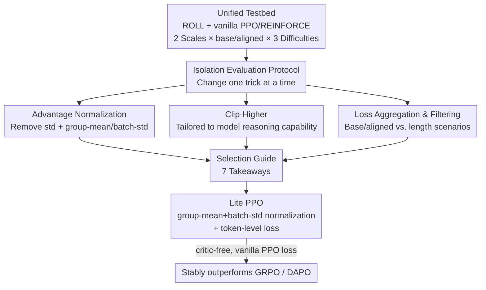

# Tricks or Traps? A Deep Dive into RL for LLM Reasoning

**Conference**: ICLR 2026  
**OpenReview**: [https://openreview.net/forum?id=R0JM3BWP7W](https://openreview.net/forum?id=R0JM3BWP7W)  
**Code**: https://github.com/alibaba/ROLL (Experiments based on ROLL framework)  
**Area**: LLM Reasoning  
**Keywords**: RL4LLM, Advantage Normalization, Clip-Higher, Loss Aggregation, Lite PPO

## TL;DR
This paper isolates "tricks" commonly used in RL4LLM—such as normalization, clipping, loss aggregation, and length filtering—within a unified open-source framework through 160+ sets of controlled experiments. It clarifies their applicable scenarios and discovers that combining "group-mean + batch-std advantage normalization" with "token-level loss aggregation" (termed Lite PPO) consistently outperforms more complex methods like GRPO and DAPO under a critic-free, vanilla PPO loss setting.

## Background & Motivation

**Background**: Since OpenAI o1 and DeepSeek-R1, leveraging Reinforcement Learning (RL) to boost the mathematical and coding reasoning capabilities of LLMs has become a major direction. The community has seen a surge of optimization tricks: advantage normalization (group-level in GRPO, batch-level in REINFORCE++), Clip-Higher, over-length filtering, token-/sequence-level loss aggregation, and various reward shaping techniques.

**Limitations of Prior Work**: These tricks lack unified usage guidelines, and their conclusions often conflict. For example, GRPO advocates for group-level normalization, while REINFORCE++ prefers batch-level; GRPO retains the variance term in normalization, whereas Dr. GRPO explicitly suggests removing it to eliminate bias. Different papers offer opposite advice for the same components, leaving practitioners confused.

**Key Challenge**: The conflicting conclusions stem from massive differences in experimental settings, training data, and model initialization across studies. Factors like using base vs. aligned models and varying data difficulty mix "the effect of the trick itself" with "environmental variance," making direct comparison impossible. Furthermore, the combination space of seemingly orthogonal tricks like Normalization, Clip, and Filtering is too vast to navigate intuitively.

**Goal**: To isolate each trick from "recipe stacks" and evaluate them under a **completely consistent** framework, baseline, data, and model. The study aims to answer: What scenarios are each trick suitable for? Is there a simple, generalizable combination that stably improves policy optimization?

**Key Insight**: Following the tradition of empirical analysis in classical RL (similar to "What matters in on-policy RL"), this work decomposes mechanisms through reproducible large-scale controlled experiments rather than inventing a new algorithm. It covers two model scales (Qwen3-4B/8B), two initializations (base and aligned), and three difficulty levels (Easy/Medium/Hard), totaling 160+ independent RL training experiments.

**Core Idea**: First, clarify the "internal mechanism + applicable conditions" of each trick via isolation experiments, then derive a minimalist combination called Lite PPO—proving that "less is more," as complex stacking does not necessarily lead to better performance.

## Method

### Overall Architecture

The paper does not propose a new algorithm but builds a "controlled variable experimental bed." It fixes the ROLL training framework, uses REINFORCE for advantage estimation with vanilla PPO loss as a unified baseline, and standardizes data sampling and hyperparameters. **Only one trick is changed at a time** to observe its impact on convergence speed, stability, and final accuracy across different model scales, initializations, and data difficulties. Four categories of tricks (Advantage Normalization, Clip-Higher, Loss Aggregation Granularity, and Over-length Filtering) are dissected to produce 7 takeaways and a selection roadmap, culminating in Lite PPO.

### Key Designs

**1. Isolation Evaluation Protocol: Separating Tricks from Recipe Stacks**

To eliminate "environmental noise," all experiments run on the ROLL framework using PPO loss + REINFORCE advantage estimation as the baseline. Global batch size is 1024 (rollout of 128 prompts × 8 samples per prompt), max length 8192, learning rate $1\text{e}{-6}$, and sampling temperature 0.99. Variables are systematically expanded across model scale (Qwen3-4B/8B), initialization (base vs. aligned), and data difficulty (labeled by GPT-4o into Easy/Medium/Hard based on correct rollouts out of 8). This allows for conditional conclusions like "a trick only works on base models."

**2. Advantage Normalization: Variance is Not Always Better; Use Hierarchical Mean and Std**

While advantage normalization is standard, the choice between group-level (GRPO) and batch-level (REINFORCE++) was unclear. **Takeaway 1**: When answers in a prompt group are almost all correct or all wrong, group-level std approaches 0. Dividing by this tiny std amplifies gradients abnormally, over-emphasizing extreme samples ("difficulty bias"). Degenerating the standard 

$$A^{\text{group}}_k = \frac{r_k - \text{mean}(\{r_j\}_{j=1}^K)}{\text{std}(\{r_j\}_{j=1}^K)}$$

into $A^{\text{std}\neg}_k = r_k - \text{mean}(\{r_j\}_{j=1}^K)$ (removing variance) is more stable on Easy data. **Takeaway 2** proposes a "hierarchical" solution: compute mean **locally (group)** and standard deviation **globally (batch)**. This hierarchical scheme suppresses the interference of homogeneous group rewards more effectively than pure group-std or batch-std.

**3. Clip-Higher: Relaxing $\varepsilon_{high}$ is for "Reasoning-Capable Models," and Small Models have "Scaling Laws"**

Ratio clipping in PPO can suppress low-probability tokens, leading to entropy collapse. DAPO proposed relaxing the upper bound $\varepsilon_{high}$: $J(\theta)=\text{clip}(r_{i,t}(\theta),\,1-\varepsilon_{low},\,1+\varepsilon_{high})$. **Takeaway 3**: Increasing $\varepsilon_{high}$ is nearly ineffective for base models (which have low clipping rates and weak policy expressivity) but significantly helps aligned models by maintaining exploration. **Takeaway 4**: At a bound of 0.2, logical connectors ("therefore," "but") are clipped, suppressing new reasoning structures. Relaxing to 0.28 shifts the clipping focus to high-frequency functional words ("is," "the"), preserving reasoning diversity. **Takeaway 5**: 4B models show accuracy gains up to a peak of 0.32 (a "scaling law"), while 8B models peak at 0.28.

**4. Loss Aggregation Granularity and Over-length Filtering: Context-Dependent**

**Takeaway 6 (Loss Aggregation)**: Sequence-level (GRPO) averages tokens within a sample then across samples, treating every response equally but diluting the influence of long responses. Token-level aggregation eliminates length bias. Experiments show token-level is significantly better for **base models**, while sequence-level is faster and better for **aligned models** where reasoning is already stable. **Takeaway 7 (Filtering)**: Masking rewards for truncated over-length responses helps the model model the EOS token correctly. This is highly effective at an 8k threshold but yields diminishing returns at 20k, where truncated outputs are mostly "repetitive and non-terminating" degradations.

### Mechanism: How Lite PPO Wins with Two Simple Tricks

Synthesizing the isolation findings for base/non-aligned models: (i) Advantage normalization uses group-mean + batch-std (Takeaway 2) to convert sparse rewards into robust signals; (ii) Loss aggregation uses token-level (Takeaway 6). Lite PPO combines these with vanilla PPO loss and a critic-free setup, discarding Clip-Higher, over-length reward shaping, and dynamic sampling. In contrast, DAPO stacks five different tricks. Benchmarks demonstrate that Lite PPO's accuracy rises steadily, whereas GRPO and DAPO often collapse after peaking.

### Loss & Training

The base is vanilla PPO clip loss with REINFORCE Monte Carlo return estimation, **without a critic (value network)**. Lite PPO adds: advantage normalization via "group-mean and batch-std" and token-level loss aggregation. Other hyperparameters match the baseline ($1\text{e}{-6}$ lr, 1024 global batch, 8192 max length).

## Key Experimental Results

### Main Results

The core quantitative findings regarding training stability and final accuracy are:

| Setting | Comparison | Key Finding |
|------|--------|----------|
| Base Model, Easy Data | w/ std vs. w/o std normalization | Removing the std term is more stable when rewards are concentrated. |
| Base Model | group-mean+batch-std vs. pure group-std | Hierarchical (global std) is more stable and achieves higher accuracy. |
| Aligned 4B | $\varepsilon_{high}$ 0.20→0.32 | Accuracy rises monotonically, peaking at 0.32 (Scaling law). |
| Aligned 8B | $\varepsilon_{high}$ 0.20→0.32 | Peaks at 0.28; higher values yield no additional gain. |
| Base vs. Aligned | token-level vs. sequence-level loss | Token-level is better for Base; Sequence-level is better for Aligned. |
| Base Model, Easy/Hard | Lite PPO vs. GRPO vs. DAPO | Lite PPO increases steadily; GRPO/DAPO collapse after peak. |

### Ablation Study

| Configuration | Phenomenon | Explanation |
|------|------|------|
| Lite PPO (group-mean+batch-std + token-level) | Highest avg accuracy across 6 math benchmarks | Integrated combination. |
| GRPO (group-level norm + sequence-level) | Collapse after peak | Lacks hierarchical normalization. |
| DAPO (5-trick stack) | Collapse after peak | Excessive tricks lead to instability. |
| Over-length filtering @8k vs. @20k | 8k helps; 20k gain is weak | Effectiveness depends on task length distribution. |

### Key Findings
- **Variance is a double-edged sword**: The more concentrated the reward distribution (Easy data), the smaller the std, making division dangerous. This explains the discrepancy between GRPO and Dr. GRPO.
- **Mean and Std should be hierarchical**: Group-level means preserve competitive signals, while batch-level std provides robust gradient compression. This is the core of Lite PPO.
- **Tricks are context-dependent**: Almost all tricks—Clip-Higher, token-level loss—only work for specific initializations or scales. Blind application is harmful.
- **Less is More**: Lite PPO outperforms the five-trick DAPO, challenging the assumption that more tricks are better for RL4LLM.

## Highlights & Insights
- Attributing conflicting conclusions to inconsistent environments and using a unified testbed provides a reproducible "survival guide" for RL4LLM.
- The variance analysis identifies "reward distribution concentration" as the true switching variable, unifying opposing community views.
- Lite PPO introduces minimal engineering complexity (vanilla PPO + two changes, no critic), making it easy to migrate to existing pipelines.
- The "linguistic perspective on Clip-Higher" is an insightful observation, explaining hyperparameter effects through the specific tokens (connectors vs. functional words) being clipped.

## Limitations & Future Work
- Experiments are restricted to mathematical reasoning and the Qwen3 series; generalizability to code, agents, or other model families (Llama/Mistral) remains to be verified.
- As an empirical/experience-based study, conclusions are correlation-based observations without strong theoretical guarantees for hierarchical normalization.
- Lite PPO was primarily validated on **base/non-aligned** models. The optimal recipe for already-aligned models remains a collection of takeaways rather than a single formula.
- Results are sensitive to task difficulty and length thresholds; conclusions should not be blindly applied across different scenarios.

## Related Work & Insights
- **vs. GRPO**: GRPO uses group-level normalization + variance retention + sequence-level loss. Ours points out the danger of the variance term and uses group-mean/batch-std + token-level for a more stable Lite PPO.
- **vs. DAPO**: DAPO stacks Clip-Higher, reward shaping, token-level, and dynamic sampling. Ours demonstrates that two of these tricks are sufficient to surpass it on base models, advocating for simplification.
- **vs. REINFORCE++ / Dr. GRPO**: This work places conflicting claims about batch vs. group levels into a unified testbed to provide conditional reconciliations.
- **vs. Classical RL empirical studies**: Inherits the methodology of distilling practical guidelines through large-scale isolation experiments.

## Rating
- Novelty: ⭐⭐⭐⭐ Does not propose a new algorithm, but clarifies conflicting tricks with convincing evidence that minimalism wins.
- Experimental Thoroughness: ⭐⭐⭐⭐⭐ 160+ independent training runs covering 2 scales, base/aligned, 3 difficulties, and 6 benchmarks.
- Writing Quality: ⭐⭐⭐⭐ Takeaways are clear and mechanisms well-explained, though some conclusions rely heavily on reading learning curves.
- Value: ⭐⭐⭐⭐⭐ Provides a practical selection guide and a low-cost, high-performance baseline for practitioners.

<!-- RELATED:START -->

## Related Papers

- [\[ICLR 2026\] Deep Think with Confidence](deep_think_with_confidence.md)
- [\[ICLR 2026\] RL of Thoughts: Navigating LLM Reasoning with Inference-Time Reinforcement Learning](rl_of_thoughts_navigating_llm_reasoning_with_inference-time_reinforcement_learni.md)
- [\[ICLR 2026\] Beyond Markovian: Reflective Exploration via Bayes-Adaptive RL for LLM Reasoning](beyond_markovian_reflective_exploration_via_bayes-adaptive_rl_for_llm_reasoning.md)
- [\[ICLR 2026\] THOR: Tool-Integrated Hierarchical Optimization via RL for Mathematical Reasoning](thor_tool-integrated_hierarchical_optimization_via_rl_for_mathematical_reasoning.md)
- [\[ICLR 2026\] Dynamics-Predictive Sampling for Active RL Finetuning of Large Reasoning Models](dynamics-predictive_sampling_for_active_rl_finetuning_of_large_reasoning_models.md)

<!-- RELATED:END -->
