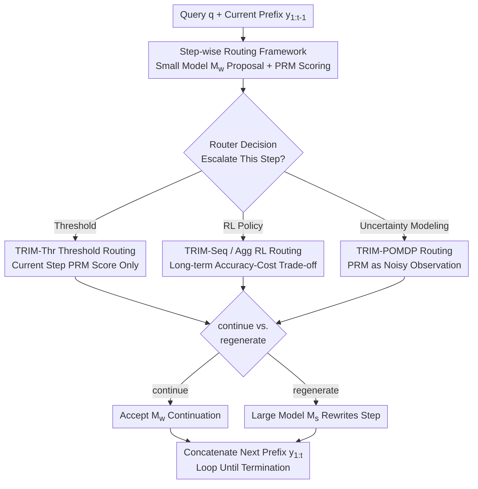

# TRIM: Hybrid Inference via Targeted Stepwise Routing in Multi-Step Reasoning Tasks

**Conference**: ICLR 2026  
**OpenReview**: [https://openreview.net/forum?id=MoKrugWUfC](https://openreview.net/forum?id=MoKrugWUfC)  
**Code**: None  
**Area**: LLM Inference / Inference Efficiency  
**Keywords**: Step-wise Routing, Hybrid Inference, Process Reward Model, POMDP, Cost-Accuracy Trade-off

## TL;DR
TRIM refines the routing granularity of "large vs. small models" from the entire query to individual reasoning steps. It uses a Process Reward Model (PRM) to identify "critical steps that cause solution failure," assigning only these steps to an expensive large model for rewriting while allowing a cheap small model to continue the remaining routine steps. This achieves the accuracy of large models on benchmarks like MATH-500 and AIME using as little as 20% of expensive tokens.

## Background & Motivation
**Background**: The LLM ecosystem consists of both strong but expensive large models (e.g., Claude 3.7 Sonnet) and weak but cheap small models (e.g., Qwen2.5-3B). To balance quality and cost, mainstream routing methods (RouteLLM, Smoothie, AutoMix, etc.) make decisions at the **query level**, routing the entire query to one model based on problem difficulty.

**Limitations of Prior Work**: Query-level routing implies a flawed assumption: "every token in a response has the same difficulty, requiring the large model for the entire duration or not at all." In multi-step reasoning, this is clearly false. Only a few steps in a solution are true **critical decision points** determining success or failure, while the rest are routine continuations. Routing the entire query to a large model wastes expensive tokens on routine steps that a small model could easily handle.

**Key Challenge**: Failure in multi-step reasoning is **cascading**—an early error snowballs and collapses the entire solution (cascading failure). The value of large models is concentrated in "preventing a single step from derailing the trajectory," but query-level routing cannot precisely target interventions at these steps.

**Goal**: Reformulate the routing problem as a **step-wise sequential decision process**. At each generated step, judge whether to escalate to the large model for rewriting, achieving an optimal trade-off between final answer accuracy and expensive model token count.

**Key Insight**: The authors observe that PRMs can assign "correctness scores" to each intermediate step. This step-level signal can be used to locate "critical steps that cause derailment." While PRMs were previously used for beam search selection or exploration, this work applies them to **routing decisions during the generation process**.

**Core Idea**: Replace "entire query switching" with "step-level targeted intervention." Only when the small model is likely to err in a step is the large model used to rewrite that specific step, with the rest left to the small model.

## Method

### Overall Architecture
TRIM segments a solution into reasoning steps $y_1, y_2, \dots, y_N$ (e.g., by double newlines), generating them sequentially. At each step $t$, the cheap model $M_w$ proposes a candidate continuation $y_t^w = M_w(y_{1:t-1})$. A **step-wise router** uses PRM scores of the current partial trajectory to decide action $a_t \in \{\text{continue}, \text{regenerate}\}$. If `continue`, the small model's step is accepted; if `regenerate`, the expensive model $M_s$ rewrote the step $y_t^s = M_s(y_{1:t-1})$, and the small model continues from the corrected prefix. The trajectory is built step-by-step, where each segment is either a small model step or a large model rewrite.

Cost is measured only by the **tokens decoded by the large model**, as prefilling (KV-cache construction) can be amortized via chunked parallelization (similar to speculative decoding), leaving serial decoding as the primary bottleneck.

The authors design a suite of routing policies with **increasing complexity**: from the simple threshold-based TRIM-Thr to RL-trained TRIM-Seq/TRIM-Agg for long-term logic, and TRIM-POMDP which explicitly models PRM noise as partial observability.

### Key Designs

**1. Step-wise Targeted Routing Framework: Precision Escalation to "Failure Steps"**

This design directly addresses the "uniform difficulty/entire query switching" flaw. TRIM models generation as a sequential decision process on each prefix $y_{1:t}$ choosing $a_t \in \{\text{continue}, \text{regenerate}\}$. If `continue`, the next prefix is $y_{1:t+1} = (y_{1:t}, M_w(y_{1:t}))$. If `regenerate`, $M_s$ first rewrites the previous step $y'_{1:t} = (y_{1:t-1}, M_s(y_{1:t-1}))$, and then the small model proceeds. The signal comes from the PRM: given trajectory $y_{1:t}$, the PRM outputs scores $r_{1:t} = (r_1, \dots, r_t)$ as proxies for correctness. It is effective because multi-step errors are **local and cascading**—correcting a few critical steps saves the entire solution while minimizing expensive token usage.

**2. TRIM-Thr Myopic Threshold Policy: Simple "Rewrite if Below Threshold"**

The simplest instantiation only considers the PRM score of the small model's current step. Given threshold $k$, the policy is:

$$\pi_{\text{thr},k}(y_{1:t}) = \begin{cases} \text{regenerate}, & \text{if } \mathrm{PRM}(y_{1:t})_t < k \\ \text{continue}, & \text{otherwise} \end{cases}$$

Adjusting $k$ navigates the accuracy-cost curve: higher $k$ increases escalation, cost, and accuracy. This mirrors fixed-threshold mechanisms in speculative decoding but allows the threshold to vary with budget. Its advantage is being zero-training and a strong baseline; its limitation is **myopia**—it ignores history and future. Escalation is wasteful if the trajectory is already irrecoverable or if the rewrite cost outweighs the benefit.

**3. TRIM-Seq / TRIM-Agg RL Policies: Balancing Long-term Accuracy and Cost**

To overcome myopia, the authors use RL to train policies with a global view. TRIM-Seq concatenates (PRM score, token count) into a feature sequence $f_{1:t} = ((r_1,c_1), \dots, (r_t,c_t))$, encoding "semantic fidelity" and "marginal intervention cost." A transformer policy network optimizes expected return:

$$J(\pi) = \mathbb{E}_\pi\!\left[ R(y_{1:T}) - \lambda \sum_{t=1}^{T} \mathbb{1}\{a_t = \text{regenerate}\}\cdot |M_s(y_{1:t-1})| \right]$$

where $R$ is the binary terminal reward for answer correctness and $\lambda > 0$ controls the cost-accuracy trade-off. TRIM-Agg compresses the sequence into **aggregated features** $\tilde f_{1:t} = (r_t,\ \min(r_{1:t-1}),\ c_t,\ t)$, capturing the "weakest link" via the historical minimum score. It trains significantly faster with nearly identical performance because these aggregates are effective proxies for solution validity in math reasoning.

**4. TRIM-POMDP Policy: PRM Scores as "Noisy Observations of True State"**

Previous policies treat PRM scores as ground truth, but PRMs are **noisy**. TRIM-POMDP explicitly models the hidden state of true correctness. The hidden states are categorized into three types: $S_0$ (currently correct), $S_1$ (irreversibly derailed), and $S_2$ (last step wrong but prefix correct/recoverable). The observation space includes history and current PRM scores. The authors fit the **observation function offline** using process-supervised datasets (e.g., ProcessBench)—modeling the distribution of PRM outputs given a hidden state. This observation function is **trained once and reused across different $\lambda$ values**. A standard POMDP solver then computes the optimal policy. TRIM-POMDP is particularly robust in **low-budget** (large $\lambda$) regimes where RL struggle with sparse rewards.

### Loss & Training
RL policies (Seq/Agg) optimize $J(\pi)$ using binary terminal task rewards $R$ minus cost penalties proportional to $M_s$ decoded tokens, adjusted by $\lambda$. TRIM-Agg is faster due to compact features. TRIM-POMDP uses offline observation function fitting and online solving, requiring no retraining for different budgets. Models used: $M_w=$ Qwen2.5-3B-Instruct, $M_s=$ Claude 3.7 Sonnet, PRM = Qwen2.5-Math-PRM-7B.

## Key Experimental Results

### Main Results
Metrics focus on the "cost-accuracy trade-off": $\bar C(\pi)$ is average $M_s$ tokens per query, $c(\pi)$ is normalized percentage, PGR (Performance Gap Recovered vs $M_s$), and CPT(x%) is the minimum cost to reach x% PGR. $\Delta$IBC measures performance gain per unit cost relative to full $M_s$ usage.

| Dataset | Metric | TRIM-POMDP | TRIM-Agg | Prev. SOTA | Effect |
|--------|------|-----------|----------|------------------|------|
| MATH-500 | CPT(95%) token % | 17.98% | 17.21% | AutoMix-PRM 53.96% | ~3× token reduction |
| MATH-500 | $\Delta$IBC | 5.86 | 5.67 | AutoMix-PRM 0.95 | TRIM-Thr reaches 4.75 (~5×) |
| AIME | CPT(95%) token % | 28.17% | 38.01% | SW Ranking 82.34% | Significant reduction |
| AIME | $\Delta$IBC | 5.00 | 2.50 | SW Ranking 0.79 | POMDP ~6.33× better |

Key Conclusion: Even the simple TRIM-Thr achieves a $\Delta$IBC of 4.75 on MATH-500, roughly 5× better than the strongest baseline (AutoMix-PRM). TRIM-Agg recovers 95% of the performance gap using ~80% fewer expensive tokens in high-budget regimes.

### Ablation Study
Cross-dataset generalization (router trained on AIME, tested on OlympiadBench / Minerva Math) using $\Delta$IBC:

| Configuration | AIME | OlympiadBench | Minerva Math | Description |
|------|------|---------------|--------------|------|
| BERT (query-level) | 0.44 | -0.04 | -0.1 | Query-level fails on transfer |
| SW Ranking (query-level) | 0.79 | 0.07 | 0.04 | Significant degradation |
| TRIM-Thr | 1.81 | 1.31 | 2.23 | Step-wise signals are robust |
| TRIM-Agg | 2.50 | 2.57 | 3.12 | Transfer performance improves |

### Key Findings
- **Budget-specific Strengths**: In low-budget (large $\lambda$) scenarios, TRIM-POMDP leads due to long-term planning and uncertainty handling. In high-budget (small $\lambda$) scenarios, TRIM-Agg performs better as policy optimization becomes easier.
- **Step-wise Signals are Universal**: Query-level routers (BERT, SW Ranking) overfit to surface correlations (style, length), failing upon transfer. TRIM conditions on "step-wise correctness within the trajectory," reflecting universal multi-step failure modes.
- **Sample Efficiency**: TRIM-Agg, trained on <500 AIME samples, reaches CPT(95%) on held-out sets and consistently outperforms query-level baselines.
- PRM-based variants of AutoMix consistently outperform self-verification versions, proving PRM signals are more reliable for mathematical reasoning.

## Highlights & Insights
- **Shifting routing granularity from query to step** is a simple yet powerful perspective shift. It decomposes a binary global decision into a sequence of local "should I escalate?" decisions, focusing expensive compute only on potential points of failure.
- **A spectrum of policies within one framework**: From zero-training thresholds to RL and POMDP, information utilization increases alongside complexity. The "same problem, multiple strategy levels" organization is a strong structural template.
- **PRM noise as a first-class citizen**: TRIM-POMDP does not assume PRM accuracy. Instead, it fits an observation function from process-supervised data, a trick applicable to any scenario using noisy scorers for sequential decisions.
- **Reusable observation functions**: Changing the cost budget only requires re-running the POMDP solver (<1 min) without retraining, making it highly suitable for real-world deployments with varying cost tiers.

## Limitations & Future Work
- The authors suggest moving from **step-level** to **token-level** routing. Since a few tokens disproportionately influence generation, token-level intervention could be more efficient but harder to locate.
- Dependence on PRM quality: On harder tasks like AIME, cumulative correctness estimation becomes less reliable, capping routing precision even with POMDP noise modeling.
- The evaluation focuses on mathematical reasoning with a fixed model pair (Qwen2.5-3B + Claude 3.7 Sonnet). Evidence for other tasks (e.g., code) and model pairs is primarily in the appendix.
- $\Delta$IBC values are not directly comparable across different difficulty benchmarks due to varying task scales and token budgets.

## Related Work & Insights
- **vs. RouteLLM / Hybrid-LLM / Zooter (query-level)**: These use classifiers for the entire query, assuming uniform difficulty. TRIM's step-wise approach generalizes significantly better across domains.
- **vs. AutoMix**: AutoMix uses POMDP + self-verification but remains query-level. TRIM uses step-wise PRM, and even a "PRM-upgraded" AutoMix is outperformed by TRIM.
- **vs. Speculative Decoding / RSD / SpecReason**: These also use multi-model collaboration with step-wise signals, but target **latency reduction under high budget**. TRIM targets **accuracy maximization under cost constraints**.
- **vs. PRM Usage**: Previously used for beam search or RL exploration; TRIM's application for **routing decisions during generation** provides a new utility for PRMs.

## Rating
- Novelty: ⭐⭐⭐⭐⭐ Refines routing to step-level and provides a comprehensive suite of policies (Threshold/RL/POMDP).
- Experimental Thoroughness: ⭐⭐⭐⭐ Solid results across four math benchmarks and cross-domain analysis, though limited to math in the main text.
- Writing Quality: ⭐⭐⭐⭐⭐ Clear problem formulation and logical progression of strategies.
- Value: ⭐⭐⭐⭐⭐ Reaching large model performance with 20% tokens is highly attractive for cost-sensitive deployments.

<!-- RELATED:START -->

## Related Papers

- [\[ICLR 2026\] Latent Veracity Inference for Identifying Errors in Stepwise Reasoning](latent_veracity_inference_for_identifying_errors_in_stepwise_reasoning.md)
- [\[ICLR 2026\] MAGO: Beyond Fixed Hyperparameters with Multi-Objective Pareto Optimization for Hybrid LLM Reasoning](mago_beyond_fixed_hyperparameters_with_multi-objective_pareto_optimization_for_h.md)
- [\[ICLR 2026\] RL of Thoughts: Navigating LLM Reasoning with Inference-Time Reinforcement Learning](rl_of_thoughts_navigating_llm_reasoning_with_inference-time_reinforcement_learni.md)
- [\[ICLR 2026\] STAT: Skill-Targeted Adaptive Training](stat_skill-targeted_adaptive_training.md)
- [\[NeurIPS 2025\] Self-Evaluating LLMs for Multi-Step Tasks: Stepwise Confidence Estimation for Failure Detection](../../NeurIPS2025/llm_reasoning/self-evaluating_llms_for_multi-step_tasks_stepwise_confidence_estimation_for_fai.md)

<!-- RELATED:END -->
