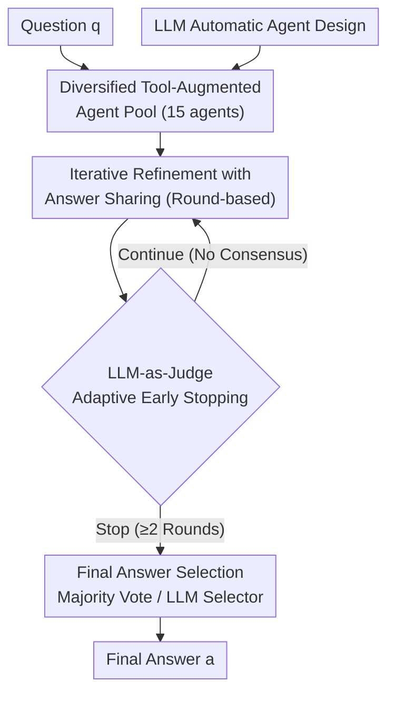

# TUMIX: Multi-Agent Test-Time Scaling with Tool-Use Mixture

**Conference**: ICLR 2026  
**OpenReview**: [https://openreview.net/forum?id=HBm3MFtszH](https://openreview.net/forum?id=HBm3MFtszH)  
**Area**: LLM Reasoning / Multi-Agent / Test-Time Scaling  
**Keywords**: Tool-Augmentation, Test-Time Scaling, Multi-Agent Ensemble, Code Interpreter, Web Search, LLM-as-Judge

## TL;DR
TUMIX enables a single LLM to derive 15 agents with distinct tool-use strategies (pure text / code / search / code+search, etc.), letting them answer in parallel and refine answers across rounds via sharing. It uses LLM-as-Judge for adaptive early stopping plus majority voting to select the final answer. On HLE, GPQA, and AIME, it achieves an average improvement of 3.55% over the strongest tool-augmented test-time scaling baselines with nearly identical inference costs.

## Background & Motivation
**Background**: Equipping LLMs with Code Interpreters and Web Search has become standard for frontier products (ChatGPT Agent, Gemini-Pro, Grok4) to enhance reasoning. Test-time scaling has also been repeatedly validated—sampling multiple solutions and selecting the correct one often outperforms single-shot inference.

**Limitations of Prior Work**: Operable methods for "how exactly to use tools" are rarely public. Text reasoning excels at semantics and common sense but struggles with precise calculation and up-to-date knowledge; code is good for precision; search is good for facts. Problems are diverse, and most do not explicitly prompt whether to use code or search, while the solution space for combining text/code/search is enormous. Existing works either use only text, only code, or train models to use Code Interpreters specifically for math (narrow domain), failing to truly integrate the three reasoning modalities.

**Key Challenge**: Test-time scaling essentially involves two stages: (1) generating diverse candidates to increase coverage (the probability that at least one is correct), and (2) selecting the correct one from noisy candidates. Existing methods like MoA rely on stacking different LLMs to create diversity, but Self-MoA suggests that "repeatedly using the single strongest LLM is better than mixing different ones." Thus, the problem becomes: in a **single LLM + tool-augmented** setting, does a "diverse agent swarm" or "repeatedly running the single strongest agent" win? Furthermore, as coverage increases, answer selection becomes a new bottleneck.

**Goal**: Systematically address four key factors in tool-augmented test-time scaling: agent quality, agent diversity, refinement termination, and final answer selection.

**Key Insight**: The authors model the process as "sequential decision-making facing a group of diverse yet related experts (agents) under a finite compute budget"—deciding which agents to run, what they can read, when to stop, and how to aggregate, balancing accuracy and cost.

**Core Idea**: Replace "homogeneous repeated sampling" with a **Tool-Use Mixture**—deriving agents with distinct tool strategies from a single LLM to work in parallel, refine via cross-round sharing, and control termination with LLM-as-Judge to achieve higher accuracy at similar costs.

## Method

### Overall Architecture
TUMIX decomposes test-time scaling into four steps: "diversity generation → cross-round refinement → adaptive stopping → answer selection." Given a question $q$ (unknown answer), the system outputs a final answer $\hat{a}$. It maintains an agent pool $S=\{s_1,\dots,s_K\}$, defaulting to $K=15$ where each agent $s_i$ provides an answer $Y_i$ using different text/code/search strategies, with cost $c_i$ and capability $p_i(q)=P\{Y_i=a^\star\mid q\}$. In each round, all agents receive a joint prompt consisting of the "original question + reasoning/answers from all agents in the previous round" to re-answer (message-passing refinement). An LLM-as-Judge determines whether to stop after each round (forcing at least 2 rounds). Once stopped, the final answer is determined by majority voting or an LLM selector. The strategy $\pi$ aims to maximize:

$$\max_{\pi}\ P\{\hat{a}_\pi=a^\star\}-\lambda\cdot \mathrm{Cost}_\pi,$$

where $\mathrm{Cost}_\pi$ is the total inference count and token count, and $\lambda>0$ balances cost and accuracy.

### Key Designs

**1. Diversified Tool-Augmented Agent Pool: Deriving Expert Swarms from One LLM**

This step addresses the challenge of creating high-quality diversity within a single LLM. The authors pre-design 15 agents (Table 1) sharing the same backbone LLM but utilizing different tool strategies: from Direct Answer (Base) and Chain-of-Thought (CoT) to CoT with code (CoTcode), Search-only (S), Code Interpreter-only (C / C+ with human priors), and dual-tool Code+Search (CS), up to CS with steering (CSG / CSG+). Any agent capable of searching has three variants (Google Search API, LLM built-in search, or both). Key Insight: **Diversity and quality are more important than scale.** At the same round and inference count, increasing agents from 1 → 3 → 15 significantly raises coverage and average scores; additionally, stronger agents (CSgs) consistently maintain higher coverage than weaker ones (w/o TTS). Comparative tests between Code Text / Search Text / Code Search Text groups show that even with similar average individual quality, **the group with both code and search achieves significantly higher coverage and average scores**, as complementary tools enhance both reasoning and answer diversity. This contradicts the Self-MoA conclusion that "diversity is useless," because diversity here stems from tool strategies rather than different model weights.

**2. Iterative Refinement via Answer Sharing: Expanding Exploration but Guarding Against Diversity Collapse**

This step tackles how to make agents learn from each other. In each round, every agent re-answers independently while referencing the original question and **all** solutions from the previous round. The authors characterize swarm quality and diversity using average accuracy and coverage:

$$\mathrm{Coverage}(S)=P\Big(\bigcup_{i\in S}\{Y_i=a^\star\}\Big).$$

Empirical results reveal a double-edged dynamic: **Coverage monotonically decreases with rounds** (indicating that refinement can erroneously discard correct answers), while average scores either plateau or eventually decline. Sankey diagrams for HLE problems show that from Round 1 to 2, "partially correct" problems increase while "all wrong" or "all correct" decrease, indicating that sharing initially broadens exploration; however, after Round 2, partial correctness drops as agents converge to a shared answer (correct or incorrect). This "excessive refinement collapses diversity" phenomenon necessitates the next design.

**3. LLM-as-Judge Adaptive Early Stopping: Preserving Peak Accuracy at 49% Cost**

Since different problems require different refinement rounds, fixed rounding is wasteful and potentially harmful. The authors define the expected marginal gain of an additional round as:

$$\Delta_r=\mathbb{E}[\,A_{r+1}-A_r\mid \text{signals before round } r\,].$$

Stopping occurs when $\Delta_r \le \lambda \cdot (\text{marginal cost})$. The actual strategy queries the LLM to judge termination based on signals like diversity collapse, vote margin, and answer entropy, while forcing a minimum of 2 rounds to counteract LLM overconfidence. This Term_LLM strategy reduces inference counts to ~49% (and token costs to ~46%) while maintaining peak accuracy. After stopping, the final answer is decided by majority voting (or a Gemini-2.5-Pro selector).

**4. LLM Automatic Agent Design: Upgrading Human Intuition to LLM-Generated Experts**

To optimize the agent pool, the authors provide code examples of existing agents to Gemini-2.5-Pro to generate 25 more diverse, high-quality implementations. They retain the 15 best performers on HLE. Combining 15 human-designed and 15 LLM-generated agents into a pool of 30, they evaluate 25,000 combinations. Many mixed groups outperform the human-only baseline. Using a combined score of coverage and average accuracy, they select top-3 groups (TUMIX-Evolve), which achieve a ~1.2% additional gain at no extra cost.

## Key Experimental Results

### Main Results
Evaluated on HLE (2,500 problems), GPQA Diamond (198 problems), and AIME 2024&2025 (60 problems) using Gemini-2.5-Pro and Flash.

| Model / Metric | w/o TTS | Strongest Baseline | TUMIX | TUMIX+ |
|------|------|------|------|------|
| Pro · HLE | 21.6 | 29.5 (Symbolic-MoE) | **32.3** | 34.1 |
| Pro · GPQA | 84.6 | 86.9 (SciMaster) | **87.9** | 88.3 |
| Pro · AIME | 87.3 | 95.0 (DEI) | **96.7** | 96.7 |
| Pro · Norm. Avg | 64.5 | 70.3 | **72.3** | 73.0 |
| Flash · HLE | 9.7 | 19.3 (DEI) | **21.2** | 23.1 |
| Flash · GPQA | 50.0 | 67.9 (SciMaster) | **77.3** | 82.1 |
| Flash · AIME | 70.0 | 82.3 (DEI) | **83.3** | 86.7 |
| Flash · Norm. Avg | 43.2 | 55.5 | **60.6** | 64.0 |

TUMIX outperforms the strongest baselines by 2.0% (Pro) and 5.9% (Flash) on average. Compared to single-shot inference (w/o TTS), it gains +7.8% (Pro) and +17.4% (Flash).

### Ablation Study

| Configuration | Key Observation | Description |
|------|---------|------|
| Agent count 1→3→15 | Significant increase in coverage/average score | Diversity is beneficial |
| Strong vs. Weak (15x sample) | Stronger agents yield higher coverage | Quality remains critical |
| Code+Search vs. Single tool | Full toolset yields significantly higher coverage | Complementary tools enhance diversity |
| Term_LLM (Adaptive) | Maintains peak accuracy, reduces inference to ~49% | Token cost drops to ~46% |
| TUMIX-Evolve (LLM Design) | +1.2% gain at zero extra cost | LLM-generated agents have high potential |
| Agent types > 12 | Diminishing returns | Validates pool size of 15 |

### Key Findings
- **Diversity/Quality > Pure Scale**: While high-temperature sampling helps, the gains from heterogeneous tool strategies exceed those of repeated sampling from the strongest agent.
- **Selection is the Bottleneck**: On HLE, coverage is $\ge$ 65%, yet accuracy stops at ~34% because the LLM fails to identify the correct answer from noisy candidates.
- **Cost-Performance Trade-off**: TUMIX achieves higher scores on the scaling curve with fewer inference steps and tokens compared to baselines.

## Highlights & Insights
- **Tool Mixture as the diversity source**, rather than different models. This allows implementation with a single LLM and challenges the Self-MoA claim that "diversity is useless."
- **LLM-as-Judge for early stopping** is clever: it ignores simple rules and instead reads signals like entropy and consensus to stop adaptively, saving half the cost without losing accuracy.
- **Diagnostic tools like Coverage and Sankey diagrams** are highly transferable for analyzing any "multi-candidate + iterative refinement" system.
- **Automated Agent Design** transitions from manual prompt tuning to searching the agent space, indicating that "agent architecture" itself can be optimized at test-time.

## Limitations & Future Work
- **Unresolved Selection Bottleneck**: The gap between 65% coverage and 34% accuracy suggests the main ceiling is identifying the correct candidate.
- **High Computational Cost**: Test-time scaling still requires roughly two orders of magnitude more tokens than single-shot inference.
- **Reasoning Benchmark Focus**: Validated only on academic reasoning tasks (HLE/GPQA/AIME); generalizability to open-ended or long-horizon agent tasks is unknown.

## Related Work & Insights
- **vs. MoA / Self-MoA**: TUMIX uses a **single LLM + diverse tool strategies** to prove that diversity is beneficial when it comes from tool use, contrasting with Self-MoA's findings on model-weight diversity.
- **vs. SciMaster**: SciMaster lacks deep exploration of tool diversity; TUMIX emphasizes **heterogeneity** and systemically analyzes diversity/termination/selection.
- **vs. DEI / Symbolic-MoE**: TUMIX shows that answer sharing, multi-round refinement, and agent diversity are all necessary components for optimal performance.

## Rating
- Novelty: ⭐⭐⭐⭐ Utilizing "tool-use strategy" as the primary source of diversity is a fresh perspective.
- Experimental Thoroughness: ⭐⭐⭐⭐⭐ Extensive benchmarks across multiple models and metrics with deep ablation.
- Writing Quality: ⭐⭐⭐⭐ Clear logic, though mathematical notations and appendix references are dense.
- Value: ⭐⭐⭐⭐⭐ Provides an operable framework for integrating tools in test-time scaling with significant cost efficiency.

<!-- RELATED:START -->

## Related Papers

- [\[ICLR 2026\] TATTOO: Tool-Grounded Thinking PRM for Test-Time Scaling in Tabular Reasoning](tattoo_tool-grounded_thinking_prm_for_test-time_scaling_in_tabular_reasoning.md)
- [\[ICLR 2026\] MoDr: Mixture-of-Depth-Recurrent Transformers for Test-Time Reasoning](modr_mixture-of-depth-recurrent_transformers_for_test-time_reasoning.md)
- [\[ICLR 2026\] T1: Tool-Integrated Verification for Test-Time Compute Scaling in Small Language Models](t1_tool-integrated_verification_for_test-time_compute_scaling_in_small_language_.md)
- [\[ICLR 2026\] AgentMath: Empowering Mathematical Reasoning for Large Language Models via Tool-Augmented Agent](agentmath_empowering_mathematical_reasoning_for_large_language_models_via_tool-a.md)
- [\[ICLR 2026\] ContextPRM: Leveraging Contextual Coherence for multi-domain Test-Time Scaling](contextprm_leveraging_contextual_coherence_for_multi-domain_test-time_scaling.md)

<!-- RELATED:END -->
