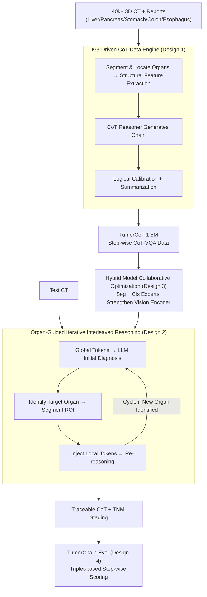

# TumorChain: Interleaved Multimodal Chain-of-Thought Reasoning for Traceable Clinical Tumor Analysis

**Conference**: ICLR 2026  
**arXiv**: [2603.05867](https://arxiv.org/abs/2603.05867)  
**Code**: [GitHub](https://github.com/ZJU4HealthCare/TumorChain)  
**Area**: LLM Reasoning  
**Keywords**: Tumor Analysis, Multimodal CoT Reasoning, Interleaved Reasoning, 3D CT, TNM Staging

## TL;DR

The authors propose TumorChain, an interleaved multimodal Chain-of-Thought (CoT) reasoning framework for tumor analysis across five major digestive organs. By integrating a knowledge-graph-driven 1.5M CoT-VQA data engine, organ-guided Iterative Interleaved Reasoning (IIR), and collaborative optimization of segmentation, classification, and LLM modules, it achieves a complete reasoning chain from findings to impressions to pathological predictions, with a mean accuracy of 84.41%, significantly outperforming GPT-5-Mini (51.59%).

## Background & Motivation

- **Background**: While medical VLMs have progressed in general report generation, they remain insufficient for high-stakes clinical oncology. Tumor analysis requires a complete reasoning chain connecting radiological findings, clinical impressions, and pathological endpoints (TNM staging).
- **Limitations of Prior Work**: (1) Existing Med-VLMs lack tumor-specific capabilities and cannot reliably map radiological findings to pathological-grade endpoints. (2) There is a lack of large-scale, multi-granular tumor-specific datasets; existing datasets like CT-RATE provide short-text QA without supporting CoT reasoning. (3) Most Med-VLMs are limited to 2D images and single-step reasoning, whereas the structural complexity of 3D CT requires multi-step clinical reasoning.
- **Key Challenge**: Clinical tumor diagnosis is a multi-step reasoning process (detecting abnormality $\rightarrow$ synthesized judgment $\rightarrow$ pathological staging), but current models fail to generate traceable reasoning chains, leaving internal processes opaque.
- **Key Insight**: Construction of a complete findings $\rightarrow$ impressions $\rightarrow$ pathology reasoning pipeline, measured by a specifically designed CoT evaluation protocol (TumorChain-Eval) to assess the quality of each step in the reasoning chain.

## Method

### Overall Architecture

TumorChain transforms the clinical reasoning process "from image findings to pathological staging" into an end-to-end, traceable pipeline covering data, training, inference, and evaluation. For **data**, a multi-agent engine constrained by a diagnostic knowledge graph distills over 40,000 3D CT cases into 1.5 million step-by-step supervised CoT-VQA items (TumorCoT-1.5M). For the **model**, TumorChain consists of a 3D vision encoder $\mathcal{E}_v$, an organ segmentation expert $\mathcal{S}eg$, an abnormality classification model $\mathcal{C}ls$, and an $\mathcal{LLM}$. During **inference**, the model mimics radiologists by "scanning the global CT then focusing on suspicious organs for repeated confirmation," embedding this interleaved workflow into the forward pass. For **evaluation**, the reasoning chains are decomposed into triplets for step-by-step scoring to measure the credibility of each stage.

### Key Designs

**1. Knowledge Graph-Driven CoT Data Engine (TumorCoT-1.5M): Addressing the lack of specialized tumor CoT data.**

The difficulty in training reasoning stems from existing datasets lacking supervised chains. TumorChain utilizes 41,059 3D CT scans to generate CoT via six agents: a segmentation expert to locate organs, a structural feature extractor (Qwen3-235B) to obtain lesion attributes, a CoT reasoner (GPT-4o-mini) for chains, a calibrator (Claude3.5-Haiku) for feasibility, and a summarizer (GPT-5-mini). A five-organ diagnostic knowledge graph (KG) ensures the chains follow clinical standards. This produced 1,497,818 CoT-VQA pairs across localization, lesion attributes, TNM staging, and reports.

**2. Organ-Guided Iterative Interleaved Reasoning (IIR): Mimicking radiologists focusing on suspicious regions.**

IIR breaks reasoning into a cyclic process: (1) The LLM processes global tokens for initial diagnosis $\mathcal{R}^1_{cot}$. (2) Target organs are identified, and the segmentation expert extracts the ROI while generating focus-enhancing prompts. (3) Global tokens, local tokens, and previous answers are combined for iterative reasoning. This mimics radiologists' actual reading habits and reduces hallucinations.

**3. Hybrid Model Collaborative Optimization (HCO): Enhancing LLM discriminative power via specialists.**

HCO integrates three modules during training: the segmentation model provides ROI localization, the classification model performs binary abnormal/normal detection on local features, and the LLM integrates these results. They are optimized via a joint loss: $L_{total} = L_{LLM} + \lambda L_{cls}$, where $\lambda$ balances language generation and discriminative signals.

**4. TumorChain-Eval Protocol: Step-wise scoring via structured triplets.**

To evaluate intermediate steps, triplets (Subject-Relation-Object) are extracted and scored across three levels: Finding Chain $S_{FC}$ (accuracy of facts), Impression Chain $S_{IC}$ (synthesized judgment), and Long Reasoning Chain $S_{LRC}$ (pathological inference). GPT-4 scores these triplets to quantify the credibility of every step.

## Key Experimental Results

### Main Results

| Method | Mean Accuracy | TNM-T | TNM-N | TNM-M | CoTe Score |
|------|:-------:|:-----:|:-----:|:-----:|:----------:|
| GPT-5-Mini | 51.59% | — | — | — | 61.23 |
| Gemini2.0 | 41.29% | — | — | — | 54.28 |
| **Ours (TumorChain-7B)** | **84.41%** | **88.83%** | **61.63%** | **71.07%** | **58.33** |

### Ablation Study

| Configuration | Mean Accuracy | Note |
|------|:-------:|------|
| Full TumorChain | **84.41%** | Complete framework |
| w/o IIR | 80.34% (-4.07%) | Iterative reasoning is the primary contributor |
| w/o CoT | 82.45% (-1.96%) | CoT data provides significant contribution |
| w/o Classification | 82.93% (-1.48%) | Auxiliary classification enhances discrimination |

### Key Findings

- **Location Accuracy**: Reaches near-perfection (99.97% at organ-level, 97.57% at position-level), outperforming all baselines.
- **IIR Impact**: Iterative refinement is the core mechanism, as removing IIR causes the largest performance drop (4.07%).
- **Generalization**: On DeepTumorVQA, it achieves 73.30% vs MedVLM-R1's 56.41%, proving domain transfer capability.
- **Clinical Difficulty**: TNM-N (lymph node metastasis) accuracy is lowest (61.63%), highlighting the persistent difficulty of this task in clinical oncology.

## Highlights & Insights

- **Traceable Clinical Pipeline**: The three-tier reasoning design (findings $\rightarrow$ impressions $\rightarrow$ pathology) ensures explainability.
- **KG-Driven Data Engine**: Automating 1.5M high-quality CoT labels solves the scarcity of specialized tumor training data.
- **Iterative Interleaved Reasoning (IIR)**: Effectively fuses global context and local evidence, reducing hallucination risks through verification.
- **Triplet-Based Evaluation**: Extracting structured knowledge from CoT chains allows for more granular assessment than end-to-end accuracy.

## Limitations & Future Work

- Iterative reasoning adds 2.51s latency per sample, necessitating acceleration for real-time use.
- CoT evaluation depends on GPT-4, which may introduce systematic biases.
- Coverage is limited to five digestive organs; broader generalization (e.g., lungs, breast) is required.
- TNM-N staging accuracy (61.63%) remains a clinical bottleneck.
- Further validation across diverse cross-regional datasets and comparative experiments with specialists are needed to prove clinical deployment value.

## Related Work & Insights

- Compared to general medical VLM datasets like CT-RATE, TumorCoT-1.5M provides the first large-scale tumor-specific CoT annotations.
- Unlike MedVLM-R1, TumorChain achieves deeper multi-step reasoning through organ-guided iteration.
- The IIR design (LLM $\rightarrow$ ROI identification $\rightarrow$ Segmentation $\rightarrow$ Local tokens $\rightarrow$ Re-reasoning) can be generalized to other medical imaging tasks requiring spatial precision.

## Rating

- **Novelty**: ⭐⭐⭐⭐⭐ (First multimodal CoT reasoning framework for tumors)
- **Experimental Thoroughness**: ⭐⭐⭐⭐⭐ (1.5M data/multi-task/generalization/ablation)
- **Writing Quality**: ⭐⭐⭐⭐ (Strong clinical motivation, detailed technical methodology)
- **Value**: ⭐⭐⭐⭐⭐ (A significant tool for precision oncology with high clinical potential)

<!-- RELATED:START -->

## Related Papers

- [\[CVPR 2025\] Interleaved-Modal Chain-of-Thought](../../CVPR2025/llm_reasoning/interleaved-modal_chain-of-thought.md)
- [\[AAAI 2026\] BLM-Guard: Explainable Multimodal Ad Moderation with Chain-of-Thought and Policy-Aligned Rewards](../../AAAI2026/llm_reasoning/blm-guard_explainable_multimodal_ad_moderation_with_chain-of.md)
- [\[ICLR 2026\] Analytica: Soft Propositional Reasoning for Robust and Scalable LLM-Driven Analysis](analytica_soft_propositional_reasoning_for_robust_and_scalable_llm-driven_analys.md)
- [\[ICLR 2026\] Long Chain-of-Thought Reasoning Across Languages](long_chain-of-thought_reasoning_across_languages.md)
- [\[ICLR 2026\] Elastic Reasoning: Scalable Chain-of-Thought via Elastic Reasoning](scalable_chain_of_thoughts_via_elastic_reasoning.md)

<!-- RELATED:END -->
## Related Papers

- [\[CVPR 2025\] Interleaved-Modal Chain-of-Thought](../../CVPR2025/llm_reasoning/interleaved-modal_chain-of-thought.md)
- [\[ICLR 2026\] Analytica: Soft Propositional Reasoning for Robust and Scalable LLM-Driven Analysis](analytica_soft_propositional_reasoning_for_robust_and_scalable_llm-driven_analys.md)
- [\[ICLR 2026\] Compositional Generalization from Learned Skills via CoT Training: A Theoretical and Structural Analysis for Reasoning](compositional_generalization_from_learned_skills_via_cot_training_a_theoretical_.md)
- [\[ICLR 2026\] Long Chain-of-Thought Reasoning Across Languages](long_chain-of-thought_reasoning_across_languages.md)
- [\[ICLR 2026\] Continuous Chain of Thought Enables Parallel Exploration and Reasoning](continuous_chain_of_thought_enables_parallel_exploration_and_reasoning.md)

<!-- RELATED:END -->
