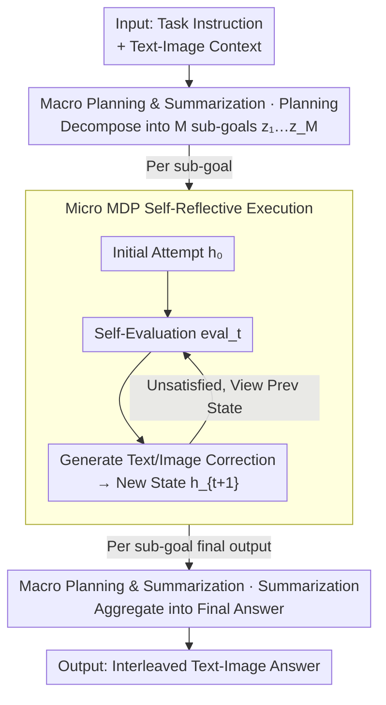

# Uni-CoT: Towards Unified Chain-of-Thought Reasoning Across Text and Vision

**Conference**: ICLR2026  
**arXiv**: [2508.05606](https://arxiv.org/abs/2508.05606)  
**Code**: [https://github.com/Fr0zenCrane/UniCoT](https://github.com/Fr0zenCrane/UniCoT)  
**Area**: LLM Reasoning  
**Keywords**: Multimodal CoT, Interleaved Text-Image Reasoning, Macro-Micro Hierarchy, MDP Self-Reflection, Unified Generation

## TL;DR
The paper proposes Uni-CoT, a hierarchical macro-micro reasoning framework that decomposes multimodal CoT into macro-level task planning (breaking complex tasks into sub-goals) and micro-level sub-task execution (MDP-style iterative optimization via self-reflection). By designing an attention mask to reduce $O(T^2)$ complexity to $O(T)$, it outperforms the BAGEL baseline by +0.02 on GenEval, achieving unified reasoning for interleaved text and images.

## Background & Motivation

**Background**: CoT reasoning has been extensively validated in text-only LLMs, but multimodal CoT (text + vision) remains in its early stages. Existing multimodal reasoning methods either utilize text-only CoT while ignoring visual intermediate products or employ loosely coupled pipeline-based MLLM + image generator systems.

**Limitations of Prior Work**: (a) Pure-text RL reasoning methods perform poorly on vision-dependent tasks (e.g., geometry, navigation); (b) Interleaved text-image generation sequences are extremely long (~10,000 tokens per step), making naive autoregressive modeling with $O(T^2)$ complexity computationally prohibitive; (c) Long interleaved sequences lead to training instability.

**Key Challenge**: Multimodal reasoning requires generating intermediate visual states to support inference (e.g., observing intermediate results when solving a puzzle), yet each visual state requires thousands of tokens, rendering standard CoT computationally and training-wise infeasible in multimodal scenarios.

**Goal**: How to efficiently implement interleaved text-visual CoT reasoning?

**Key Insight**: A hierarchical design—where the macro layer performs task planning (viewing only sub-goal descriptions) and the micro layer handles sub-task execution (MDP-style viewing only adjacent states)—reduces computational overhead by using attention masks to limit the visibility range.

**Core Idea**: Macro-micro hierarchy + MDP self-reflection + Attention masking = Multimodal CoT with linear complexity.

## Method

### Overall Architecture
Uni-CoT aims to enable models to "think and draw" simultaneously, much like a human solving a geometry problem: when a task requires visual support, the model generates an intermediate image, inspects it, and revises if necessary until the reasoning is complete. The challenge is that each visual state consumes thousands of tokens; concatenating these directly for autoregressive training results in $O(T^2)$ complexity and sequences exceeding 10k tokens, which is untrainable. The framework resolves this by splitting reasoning into two layers: the macro layer decomposes the task into sub-goals and summarizes results, while the micro layer executes each sub-goal through "trial → self-evaluation → correction" iterations. Both layers utilize carefully designed attention masks to restrict token visibility—the macro layer sees only the skeleton, and the micro layer sees only the previous state—conceptually compressing $O(T^2)$ complexity through $O(T^2/M)$ down to linear $O(T)$. This is the key to enabling end-to-end interleaved training on real hardware. The backbone follows BAGEL (Decoder Transformer + MoE), using SigLIP2 ViT for vision understanding (~4900 tokens) and FLUX VAE for image generation (4096 tokens), with MoE weights switching between "reading" and "drawing" paths.

### Key Designs

**1. Macro Planning & Summarization: High-level Skeleton Focus**

Feeding 10k+ interleaved tokens directly into a planner overwhelms it with low-level details and high computational cost. The Macro Planner first decomposes complex tasks into $M$ sub-goals $z_{plan} = \{z_1, ..., z_M\}$, which can be sequential or parallel. After the micro layer completes these sub-goals, the Summarizer aggregates the results into a final response. Both sharing a macro attention mask that forms the outer shell of the micro layer. The key is the masking logic: macro tokens are only permitted to see the original input, sub-goal descriptions, and the **final output** of each sub-goal, completely bypassing intermediate trial-and-error states. This ensures the high-level planning stays on the "skeleton," cutting sequence length by roughly $1/M$ and reducing complexity from $O(T^2)$ to $O(T^2/M)$.

**2. Micro MDP Self-Reflective Execution: Markovian Correction Chains**

An individual sub-goal might still require multiple rounds to solve correctly. If every round refers back to all previous states, length explodes again. The Micro Operator formalizes single sub-goal execution as a Markov Decision Process (MDP): starting from an initial attempt $h_0$, each step generates a self-evaluation score $eval_t$, followed by a text or image-level correction to reach state $h_{t+1}$, looping until satisfied. The core constraint is the Markov property—current state $h_t$ depends only on the previous state $h_{t-1}$ and the parent sub-goal $z_i$, ignoring earlier history. This is enforced by the attention mask, pinning the token count per step to a constant and further compressing sub-goal complexity from $O(T^2/M)$ to $O(T)$. Intuitively, to fix a puzzle, one only needs to see the current state rather than re-reading every failed attempt. These two designs are complementary: hierarchy alone leaves sub-segment complexity at square power, while Markov logic alone fails to handle long-range dependencies across sub-goals.

### Loss & Training
The joint objective optimizes both text and image paths: $\mathcal{L}_{joint} = \lambda_{CE} \cdot \mathcal{L}_{CE}^{text} + \mathcal{L}_{MSE}^{image}$, using cross-entropy for text and MSE for images. Four auxiliary tasks are added to the micro layer (text action generation, image action generation, next-state prediction, and reward estimation) to teach the model how to self-evaluate and correct. Training utilized 31K samples (11K macro interleaved pairs + 20K micro examples) on 8×A100 GPUs for approximately one week.

## Key Experimental Results

### Main Results

**GenEval Image Generation Benchmark**:

| Metric | Uni-CoT | BAGEL | FLUX.1-dev | Janus-Pro-7B |
|------|---------|-------|-----------|-------------|
| Single Object | **0.99** | 0.99 | 0.98 | 0.99 |
| Two Objects | **0.95** | 0.92 | 0.93 | 0.89 |
| Counting | **0.82** | 0.78 | 0.75 | 0.59 |
| Color Attr | **0.69** | 0.64 | 0.65 | 0.66 |
| Overall | **0.81** | 0.79 | 0.82 | 0.80 |

Improvement in counting capability is most significant (+0.04), with notable gains in two-object scenarios (+0.03).

### Ablation Study

| Method | Complexity | Per-step Token Cost |
|------|--------|--------------|
| Naive Autoregressive CoT | $O(T^2)$ | ~10000 tokens (Infeasible) |
| Hierarchical Decomposition | $O(T^2/M)$ | Reduced by $M$ |
| **Hierarchical + MDP (Ours)** | **$O(T)$** | **Linear** |

### Key Findings
- **Visual intermediate products are critical for reasoning**: Text-only CoT fails on geometry or puzzle tasks; the model needs to "see" intermediate visual results.
- **MDP Markov assumption is effective**: Viewing only the previous state is sufficient for generating high-quality corrections without full history.
- **Self-reflective iteration improves quality**: Models can self-evaluate and correct errors, particularly in counting and spatial relationships.

## Highlights & Insights
- **Computational feasibility of multimodal CoT solved**: Reducing complexity from $O(T^2)$ to $O(T)$ makes interleaved text-image reasoning practical on existing hardware. The core insight is that "reasoning does not require viewing all history"—the combination of hierarchy and Markov attention masking is the key innovation.
- **Unified framework for understanding and generation**: The MoE architecture based on BAGEL seamlessly switches between understanding and generation paths, naturally mixing "viewing" and "drawing" actions during reasoning.
- **Formalizing MDP in Multimodal CoT**: Modeling the self-reflection process as an MDP (state, action, reward) establishes a formal foundation for optimizing multimodal reasoning with RL in the future.

## Limitations & Future Work
- **Limited experimental scale**: Generation results are primarily shown on GenEval; results for understanding tasks (MMBench, MathVista, etc.) are not fully detailed in the main text.
- **Small training data volume**: Only 31K samples were used, limiting the depth of reasoning capabilities.
- **Insufficient baseline comparison**: Primarily compared against the BAGEL baseline; the +0.02 gain is relatively small. Comparisons with closed-source models like GPT-4o or Gemini are missing.
- **Potential Improvements**: (1) Replace SFT with RL (e.g., NRT/GRPO) to train the micro-reasoner; (2) Support self-reflection with more iteration steps; (3) Scale training data to 100K+ samples.

## Related Work & Insights
- **vs. Text-only CoT Reasoning (o1, R1)**: These methods output only text reasoning and struggle with visual tasks. Uni-CoT enables the model to "think and draw" simultaneously.
- **vs. Janus-Pro**: Supports both understanding and generation but lacks CoT capabilities, with generation quality limited by single-pass inference.
- **vs. CogCoM/Visual Sketchpad**: These use external tools for visual intermediate products; Uni-CoT is fully end-to-end and does not rely on external tools.

## Rating
- Novelty: ⭐⭐⭐⭐⭐ First practical multimodal CoT framework with a unique macro-micro + MDP + attention mask design.
- Experimental Thoroughness: ⭐⭐⭐ Core concepts are well-validated, but evaluation datasets and baseline comparisons are limited.
- Writing Quality: ⭐⭐⭐⭐ Complexity analysis is clear, though the paper structure is somewhat long.
- Value: ⭐⭐⭐⭐⭐ Establishes a feasible computational framework for multimodal reasoning; open-source code benefits community follow-up.

<!-- RELATED:START -->

## Related Papers

- [\[ICLR 2026\] Long Chain-of-Thought Reasoning Across Languages](long_chain-of-thought_reasoning_across_languages.md)
- [\[ICLR 2026\] CoT-Evo: Evolutionary Distillation of Chain-of-Thought for Scientific Reasoning](cot-evo_evolutionary_distillation_of_chain-of-thought_for_scientific_reasoning.md)
- [\[ICLR 2026\] SIM-CoT: Supervised Implicit Chain-of-Thought](sim-cot_supervised_implicit_chain-of-thought.md)
- [\[ACL 2026\] AIM-CoT: Active Information-driven Multimodal Chain-of-Thought for Vision-Language Reasoning](../../ACL2026/llm_reasoning/aim-cot_active_information-driven_multimodal_chain-of-thought_for_vision-languag.md)
- [\[ICLR 2026\] CoT-RVS: Zero-Shot Chain-of-Thought Reasoning Segmentation for Videos](cot-rvs_zero-shot_chain-of-thought_reasoning_segmentation_for_videos.md)

<!-- RELATED:END -->
