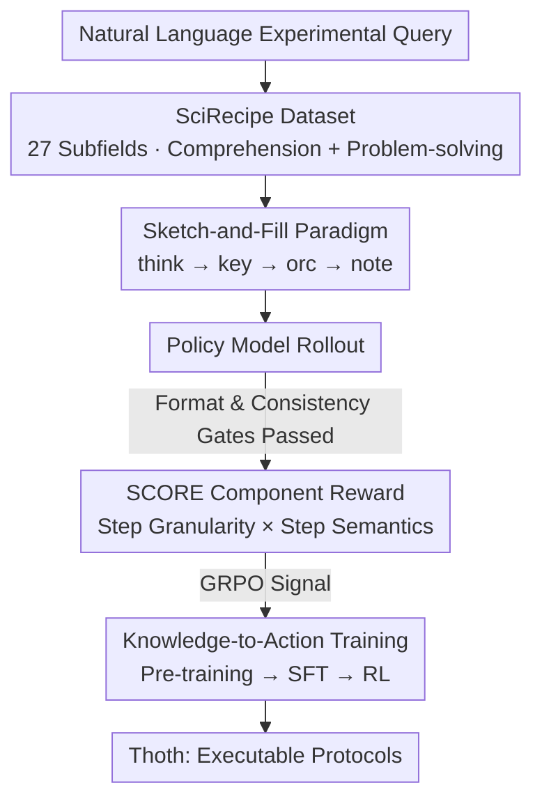

# Unleashing Scientific Reasoning for Bio-Experimental Protocol Generation via Structured Component-based Reward Mechanism

**Conference**: ICLR 2026  
**OpenReview**: [https://openreview.net/forum?id=5BRMteyNOp](https://openreview.net/forum?id=5BRMteyNOp)  
**Code**: https://github.com/InternScience/Thoth  
**Area**: LLM Reasoning / Scientific Reasoning / Reinforcement Learning  
**Keywords**: Experimental Protocol Generation, Structured Reasoning, Component-based Reward, GRPO, Biomedicine

## TL;DR
This paper reformulates "bio-experimental protocol generation" as a structured and verifiable reasoning task. It introduces the Sketch-and-Fill reasoning paradigm to decompose free-text into a three-stage output: "Thought → Atomic Steps → Natural Language." The authors propose SCORE, a rule-based component reward mechanism (Step granularity + Action sequence + Semantic fidelity) to replace expensive LLM-as-a-judge signals for RL. Combined with a three-stage Knowledge-to-Action training pipeline, the resulting 8B model, Thoth, outperforms larger models like GPT-4o and DeepSeek-V3 on protocol generation and multiple biomedical benchmarks.

## Background & Motivation

**Background**: Experimental protocols are the cornerstone of reproducible science—they are not mere descriptions but "operational blueprints" specifying actions, materials, concentrations, and step dependencies. Automating protocol generation from natural language queries can significantly improve replication efficiency. Current approaches rely either on the general reasoning capabilities of frontier models like GPT-4o or on agentic systems with external tools like Biomni or STELLA.

**Limitations of Prior Work**: Existing datasets and benchmarks predominantly cover "comprehension" tasks (understanding protocols, QA) rather than the "planning and problem-solving" dimension. Consequently, models often provide fragmented advice and fail to generate logically ordered protocols ready for laboratory execution. Common issues include disordered steps, redundant operations, factual errors, and action hallucinations.

**Key Challenge**: The evaluation itself is a bottleneck. Metrics like BLEU/ROUGE/BERTScore only measure lexical overlap; a protocol with a completely scrambled action sequence can still achieve a high score. Meanwhile, LLM-as-a-judge, though closer to human preference, is prohibitively expensive to scale for RL training. Essentially, **the "structured and verifiable" nature of protocols has not been utilized by existing reward designs**.

**Goal**: ① Construct a protocol dataset covering both comprehension and problem-solving; ② Design a reasoning paradigm that "anchors" open-ended language output to an executable structural space; ③ Design an efficient reward mechanism that measures execution reliability without calling large models.

**Key Insight**: When human researchers write protocols, they first determine the operation (action), the targets (objects), and the conditions (parameters) before expanding them into natural language. If models are forced to output in a "skeleton first, details second" sequence—making every step explicit and parsable—rule-based scoring can be performed directly in the structural space.

**Core Idea**: Use "Sketch-and-Fill" structured reasoning (sketching atomic action sequences first, then filling natural language) to make protocol generation a parsable and verifiable process, driven by rule-based component rewards rather than an LLM judge during RL.

## Method

### Overall Architecture

The work centers on making protocol generation both reason-able and evaluable. The pipeline consists of four components: The **SciRecipe dataset** provides high-quality structured protocols across 27 bio-subfields. Under the **Sketch-and-Fill reasoning paradigm**, the model outputs a four-part structure: `<think>→<key>→<orc>→<note>` (Chain-of-thought → Atomic steps → Natural language → Safety notes). Each rollout passes through the **SCORE mechanism** via two filters (Format Gate + Consistency Gate) before calculating step-level and semantic rewards. This reward serves as the signal for GRPO within the **Knowledge-to-Action three-stage training** (Pre-training → SFT → RL), resulting in the Thoth-8B model. SCORE also serves as a dual-purpose tool: as an RL reward and as an evaluation metric suite (Step-M / Order-S / Order-LCS / Order-Tau / Semantic-A).

### Key Designs

**1. SciRecipe Dataset: Building the Foundation for Planning and Problem-Solving**

Existing resources are either scattered across platforms like Nature Protocols and Protocols.io with inconsistent formats or restricted to comprehension benchmarks. The authors collected 23K+ raw protocols across 27 subfields, including neuroscience and molecular biology. After extraction, cleaning, dual-structuring (rules + models), deduplication, and expert review, 12K high-quality records were retained in a unified metadata structure: `exp_name / abstract / materials / equipments / procedures / notes`. Eight categories of tasks were constructed, split into **Protocol-Comprehension** (overview and specific analysis) and **Problem-Solving** (retrieval, planning, troubleshooting, constraints, scaling, and safety), forming a comprehension-application loop.

**2. Sketch-and-Fill Reasoning Paradigm: Anchoring Output to Parsable Structures**

This is the prerequisite for rule-based rewards. The paradigm mandates the model to output three main segments: `<think>` where the model decomposes sub-goals and identifies step dependencies; `<key>` which is the "Sketch" phase, converting thoughts into **atomic, machine-readable** steps where each step is a JSON dictionary `{"action": verb, "objects": [...], "parameters": [...]}`. Formally, `<key>` is denoted as $Y=(y_1,\dots,y_m)$, where $y_i=(a_i,O_i,P_i)$ representing action, objects, and parameters. `<orc>` is the "Fill" phase, expanding each atomic step into natural language, with a mandatory **one-to-one mapping in step count and semantics** to `<key>`.

**3. SCORE Structured Component Reward: Replacing LLM Judges with Rules for Executability**

The core innovation of the paper. SCORE uses a progressive design starting with two **Gates**: The Format Gate ensures the presence of the four segments and the `Step x:{json}` format; the Consistency Gate verifies that every action/object/parameter in `<key>` appears in `<orc>` with a coverage rate $\ge 95\%$.

The score is composed of two multiplied parts. The **Step-level Reward** $r_{\text{scale}}=f(|N_{\text{pred}}-N_{\text{gold}}|)\,/\,g(\bar L)$ uses a cosine decay for step count deviation and penalizes verbosity if average step length exceeds a limit. The **Step Semantic Reward** $r_{\text{semantics}}$ comprises order and semantic consistency. The "Strict" order mode only grants points if the predicted action sequence matches or is a subsequence of the ground truth. Semantics are aligned by action; for each pair $(i,j)$, object overlap is calculated using IoU $\mathrm{Obj}(i,j)$, and parameters $\mathrm{Par}(i,j)$ are compared only if object overlap $\ge 0.5$. A position decay factor $m_{ij}=\max\{0,1-(|i-j|/D)^\lambda\}$ penalizes correct actions in the wrong positions:

$$r_{\text{semantics}}=\mathrm{Order}(\hat a,a^*)+\frac{1}{|W|}\sum_{(i,j)\in W} m_{ij}\Big(\mathrm{Obj}(i,j)+\tfrac{1}{2}\mathrm{Par}(i,j)\Big)$$

The final $\mathrm{SCORE}(y,y^*)=I_{\text{format}}\cdot I_{\text{cons}}\cdot r_{\text{scale}}\cdot r_{\text{semantics}}$. This hybrid design of multiplicative gates and additive fine-grained rewards ensures structural integrity while mitigating reward hacking.

**4. Knowledge-to-Action Training: From Knowledge Accumulation to Execution**

A curriculum-based three-stage process: **Pre-training** learns the semantics of experimental language; **SFT** on Sketch-and-Fill data performs tasks like parameter filling and error correction to provide a cold start for RL; **RL** uses GRPO with the SCORE reward, removing entropy loss and reducing KL penalties to encourage exploration. The base model used is Qwen2.5-7B/Qwen3-8B.

## Key Experimental Results

### Main Results

On SciRecipe-Eval, Thoth achieves SOTA performance across all metrics (executability on the left, lexical similarity on the right):

| Model | Semantic-A | Order-LCS | Order-S | Step-M | AVG |
|------|-----------|-----------|---------|--------|-----|
| ChatGPT-4o | 40.04 | 73.27 | 24.00 | 44.00 | 48.41 |
| GPT-5 | 27.79 | 58.12 | 11.35 | 18.79 | 32.84 |
| Claude Opus 4.1 | 41.32 | 71.70 | 21.80 | 34.59 | 45.65 |
| DeepSeek-V3 | 41.72 | 73.97 | 21.44 | 41.71 | 48.16 |
| Qwen3-8B (Base) | 28.89 | 63.51 | 11.17 | 24.33 | 34.32 |
| **Thoth (8B)** | **46.60** | **75.34** | **25.50** | **53.00** | **52.10** |

Thoth (8B) outperforms ChatGPT-4o by 3.69% on average. Notably, reasoning models like GPT-5 and o1 often score lower here because they produce overly complex outputs unsuitable for direct lab execution, confirming that lexical similarity does not equal executability. Thoth also demonstrates strong transferability on out-of-domain benchmarks like LAB-Bench and PubMedQA.

### Ablation Study

| Configuration | Key Metric | Description |
|------|---------|------|
| Thoth (Full) | AVG 52.10 / Step-M 53.00 | Full Model |
| Data: QA only | AVG 29.85 | Only QA data, BLEU < 40% |
| SCORE: w/o $f(d)$ | Order-S 6.83 / Step-M 10.00 | Removed step reward; protocols became disordered/incomplete |
| SCORE: w/o Order(·) | Order-LCS 61.27 | Removed order reward; semantic coherence failed |
| SCORE: Vanilla Reward | AVG 45.62 | Using BLEU/ROUGE as reward; executability -10.65% |
| Training: Stage 1+2 only | — | Executability 11.08% lower than Thoth |

### Key Findings
- **The step reward $f(d)$ is critical for executability**: Without it, Order-S and Step-M drop drastically. Granularity control directly determines if a protocol can be followed.
- **Order constraints are indispensable**: Removing Order(·) causes step misalignment, indicating that disordered protocols must be explicitly penalized.
- **Rule-based Reward > Lexical Reward**: Vanilla rewards may inflate BLEU/ROUGE but decrease executability by 10.65%, highlighting the fundamental flaw of rewarding surface overlap.

## Highlights & Insights
- **Turning the "Evaluation Bottleneck" into "Training Leverage"**: Rather than optimizing an LLM judge, the authors used the Sketch-and-Fill paradigm to make structured rules possible, saving significant computational costs.
- **Action-Anchored Alignment is Transferable**: The strategy of aligning actions first, then comparing objects/parameters, can be generalized to any task involving sequential structured elements (e.g., recipes, assembly instructions).
- **Hybrid Reward Shaping**: Integrating multiplicative "gates" with additive "scores" effectively balances structural strictness with training stability.

## Limitations & Future Work
- **Dependence on Gold Standards**: SCORE relies on ground truth protocols and parsable atomic steps, making it difficult to apply to purely exploratory experiments without standard answers.
- **Strict Order Mode May Be Too Rigid**: Lab protocols sometimes allow parallel or interchangeable steps; the "Strict" mode might penalize valid alternative paths.
- **Domain Specificity**: The model is heavily tied to bio-protocols. Extending to chemistry or material science would require rebuilding action libraries and datasets.

## Related Work & Insights
- **vs BioPlanner**: While BioPlanner focus on evaluating planning via pseudocode, Thoth generates natural, executable protocols.
- **vs BioGPT / BioBERT**: These are strong in knowledge tasks (QA) but cannot generate executable procedures; Thoth bridges the gap between knowledge and action.
- **vs LLM-as-a-judge**: SCORE provides a direct, interpretable, and efficient reward signal that solves the scaling problem inherent in model-based evaluation for RL.

## Rating
- Novelty: ⭐⭐⭐⭐⭐ Reformulating protocol generation into a parsable structural space for rule-based RL is a highly innovative and self-consistent path.
- Experimental Thoroughness: ⭐⭐⭐⭐⭐ Comprehensive coverage across 20+ baselines and detailed ablation studies.
- Writing Quality: ⭐⭐⭐⭐ Clear methodology, though the notation density is high.
- Value: ⭐⭐⭐⭐⭐ Significant performance gains for an 8B model and high transfer potential for other structured generation tasks.

<!-- RELATED:START -->

## Related Papers

- [\[ICLR 2026\] Structured Reasoning for LLMs: A Unified Framework for Efficiency and Explainability](structured_reasoning_for_llms_a_unified_framework_for_efficiency_and_explainabil.md)
- [\[ICLR 2026\] SCI-Verifier: Scientific Verifier with Thinking](sci-verifier_scientific_verifier_with_thinking.md)
- [\[ICLR 2026\] Reverse-Engineered Reasoning for Open-Ended Generation](reverse-engineered_reasoning_for_open-ended_generation.md)
- [\[ICLR 2026\] DRPO: Efficient Reasoning via Decoupled Reward Policy Optimization](drpo_efficient_reasoning_via_decoupled_reward_policy_optimization.md)
- [\[ICLR 2026\] PEAR: Phase Entropy Aware Reward for Efficient Reasoning](pear_phase_entropy_aware_reward_for_efficient_reasoning.md)

<!-- RELATED:END -->
