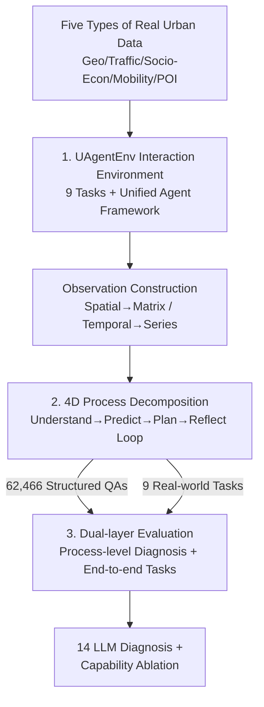

# USTBench: Benchmarking and Dissecting Spatiotemporal Reasoning Capabilities of LLMs as Urban Agents

**Conference**: ICLR 2026  
**OpenReview**: [https://openreview.net/forum?id=ETzBStUFJy](https://openreview.net/forum?id=ETzBStUFJy)  
**Code**: https://github.com/usail-hkust/UAgentEnv  
**Area**: LLM Reasoning  
**Keywords**: Spatiotemporal Reasoning, Urban Agents, Process-level Evaluation, Reflective Reasoning, Benchmark

## TL;DR
USTBench decomposes the spatiotemporal reasoning capabilities of LLMs acting as urban agents into four process dimensions: **Understanding—Prediction—Planning—Reflection**. Within the interactive urban environment UAgentEnv, the authors construct 62,466 structured QAs and 9 real-world urban downstream tasks. Evaluating 14 mainstream LLMs reveals that while they perform well in understanding and prediction, they generally struggle with long-range planning and reflection. Furthermore, models specifically trained for reasoning (e.g., DeepSeek-R1) do not consistently outperform standard models in urban tasks.

## Background & Motivation
**Background**: Urban systems (transportation, population flow, planning) are inherently spatiotemporally intertwined and dynamic. While traditional data-driven methods have progressed in prediction and decision-making, they suffer from poor generalization to unseen scenarios and opaque reasoning processes. Recent work has begun utilizing LLMs as "urban agents"—leveraging their ability to integrate multi-source information, adapt across tasks, and provide interpretable natural language reasoning for tasks like traffic light control, congestion prediction, and route planning.

**Limitations of Prior Work**: Existing urban LLM evaluations (STBench, CityBench, CityGPT, UrbanPlanBench) focus almost exclusively on **outcome-level metrics**—such as prediction accuracy or traffic efficiency—ignoring the underlying reasoning process. This obscures critical reasoning flaws. For instance, the paper highlights that in congestion prediction, the reasoning model DeepSeek-R1 slightly underperforms compared to the standard Llama3.3. Only through process-level dissection is it revealed that DeepSeek-R1 is inherently weak in **understanding and predicting temporal trends**. Without fine-grained evaluation, such anomalies remain unexplained.

**Key Challenge**: Urban tasks require **multi-step spatiotemporal reasoning**, yet evaluations often provide only a final score. Moreover, urban environments are real-time and provide feedback (as traffic patterns shift). The **capability for reflection**—associating "previous action → observed consequence" into a causal chain to adjust subsequent reasoning—is vital for agents, yet existing benchmarks fail to evaluate this dimension.

**Goal**: To build a benchmark capable of "dissecting" the spatiotemporal reasoning process of LLMs, answering "at which step does reasoning succeed or fail," while maintaining standardized end-to-end task comparisons.

**Key Insight**: Explicitly decompose urban spatiotemporal reasoning into four processes within an **agent-environment interaction loop**: Understanding (interpreting spatial structure and temporal patterns) → Prediction (inferring future states) → Planning (selecting optimal long-term actions) → Reflection (using feedback for error correction and improvement). Each process is evaluated via individual QAs to locate weaknesses and study dependencies among them.

**Core Idea**: Utilize a dual-layer framework of "Process-level QA Diagnosis + End-to-end Task Evaluation," paired with an interactive environment, UAgentEnv, that generates realistic urban observations. This transforms the evaluation of urban LLM agents from "black-box scoring" into "step-by-step dissection."

## Method

### Overall Architecture
USTBench takes five categories of real urban data (geospatial OSM, traffic flow, socioeconomic GDP/population, human mobility trajectories, POI check-ins) as input and outputs **dual-layer diagnostic results** of LLM spatiotemporal reasoning capabilities. The system is connected by two components: the underlying **UAgentEnv** (providing unified interaction for 9 real-world tasks) and the **USTBench** evaluation protocol (process-level QA + end-to-end tasks).

The pipeline operates as follows: UAgentEnv encapsulates real urban data into "observations" per task (spatial structures verbalized as sparse adjacency matrices; temporal dynamics as discrete time series). LLM agents process these observations within a modular workflow of "Understanding → Prediction → Planning," producing actions or predictions and storing experiences in memory. The evaluation side operates simultaneously: partitioning the interaction process into 62,466 structured QAs for **process-level** diagnosis, while conducting **end-to-end** evaluation on 9 real tasks using domain metrics. Finally, 14 mainstream LLMs (paired as reasoning vs. non-reasoning, e.g., Qwen2.5-32B vs. QwQ-32B) are evaluated followed by "capability-wise ablation" to analyze dependencies.

### Key Designs

**1. UAgentEnv: An Interactive Environment and Unified Agent Framework for Nine Urban Tasks**
To diagnose reasoning, a stable source of "real urban observations" is necessary, ensuring different tasks are comparable under a unified interface. UAgentEnv integrates public real-world data across five dimensions (OSM geography, historical traffic, 2000–2019 global GDP/population, NYC taxi trajectories, FourSquare check-ins), covering **4 prediction tasks** (Next POI, Congestion Prediction, Socioeconomic Indicators, Traffic OD) and **5 decision-making tasks** (Traffic Light Control, POI Siting, Route Planning, Road Planning, Urban Planning). 

Crucially, it applies a **unified agent framework** to all tasks: each task provides a description, data schema, and domain knowledge, feeding real-time dynamics as context. The agent follows a modular workflow, retrieving history from memory. Upon receiving environmental feedback, it performs **reflection** to diagnose errors and writes useful experiences back to memory. This "Perception → Reasoning → Action → Reflection → Memory" loop allows process-level QAs to be naturally extracted from real interactions.

**2. 4D Process Decomposition + Verifiable QA Generation**
The core design decomposes urban spatiotemporal reasoning into 4 processes evaluated via QA with accuracy scores (62,466 total; 40% basic understanding + 60% high-level reasoning). The dimensions are: ① **Spatiotemporal Understanding** (27,000 QAs), covering 3 spatial types (distance/adjacency/connectivity) and 5 temporal types (duration/extremes/sequence/periodicity/trend); ② **Prediction** (15,336 QAs), predicting state $s_{i+1}$ based on $o_i$ using real future values as ground truth; ③ **Planning** (15,000 QAs), selecting actions $a_i$ to optimize long-term goals; ④ **Reflection** (8,130 QAs), assessing previous actions/predictions given current observations and feedback $f_i$ to determine correctness.

The challenge lies in **establishing ground truth for planning**, as real cities rarely expose "optimal actions" due to noise. The authors use simulation-driven exhaustive search to enumerate future sequences within a planning horizon $H$, selecting the action with the maximum expected cumulative discounted reward:

$$a^*_i = \arg\max_{a_i\in A}\ \max_{a_{i+1},\dots,a_{i+H}\in A}\ \mathbb{E}\Big[\sum_{j=0}^{H}\gamma^j R(a_{i+j})\ \big|\ a_i\Big]$$

where $R$ is progress toward the goal and $\gamma$ balances immediate and future rewards. Observations for decision tasks are collected using a **semi-random heuristic agent** that explores to ensure diverse trajectories.

**3. Dual-layer Evaluation + Ability Ablation**
Process-level QAs identify where reasoning fails, while **end-to-end downstream evaluation** measures the impact on real applications (e.g., MAPE for socioeconomic prediction, Accuracy for congestion). 

**Capability ablation** reveals the **dependency structure**: for top-tier models like DeepSeek-R1, removing spatiotemporal understanding significantly increases prediction error and degrades planning (indicating heavy reliance on initial understanding). Removing prediction also hurts planning for strong models, but for mid-tier models (Qwen2.5-32B), bypassing prediction slightly improves planning as noisy predictions can be misleading. For weak models (Qwen2.5-7B), intermediate reasoning and reflection can even be detrimental, where unreliable intermediate results propagate errors.

## Key Experimental Results

### Main Results
14 LLMs were evaluated (7 non-reasoning + 7 reasoning pairs). In spatiotemporal understanding, reasoning models often exceed 80% accuracy, but drop below 70% in long-range spatial (connectivity) and temporal (trend/periodicity) analysis.

| Capability Dimension | Top Model | Overall Acc | Common Weakness |
|----------------------|-----------|-------------|-----------------|
| ST Understanding     | o4-mini   | 0.7924      | Connectivity, Trend (Trend < 0.30) |
| Prediction           | o4-mini   | 0.7872      | Long-range (Congestion, OD) |
| Planning             | gpt-oss-20B| 0.4468      | Significantly lower than others |
| Reflection           | DeepSeek-R1| 0.5179      | Most models < 0.50 |

> Note: Random baseline is ~0.25 for most sub-tasks (1-of-4) and ~0.11 for trends.

In end-to-end tasks, LLMs generally outperform classical methods, with up to a 337.31% increase in prediction accuracy and 53.48% in decision effectiveness.

| Task | Metric | Classic Method | Best LLM |
|------|--------|----------------|----------|
| Socio-Econ Pred | MAPE ↓ | 7.09% | 4.97% (o4-mini) |
| Congestion Pred | Acc. ↑ | 17.18% | 75.73% (o4-mini) |
| Urban Planning | Service ↑ | 0.6100 | 0.6858 (DeepSeek-R1) |
| Road Planning | Cost ↓ | 18.95 | 18.40 (QwQ-32B) |

### Ablation Study
Effect of bypassing reasoning processes on downstream performance:

| Config | DeepSeek-R1 (Strong) | Qwen2.5-32B (Mid) | Qwen2.5-7B (Weak) |
|--------|----------------------|-------------------|-------------------|
| Full Pipeline | Baseline | Baseline | Baseline |
| w/o ST Understanding | Error↑, Plan↓ | Damaged | Damaged |
| w/o Prediction | Plan↓ (Used Pred) | Plan slightly↑ (Noise removed) | Intermediate Reasoning Harmful |
| w/o Reflection | Largest Drop | Moderate sensitivity | Reflection is a hindrance |

### Key Findings
- **Reasoning Post-training $\neq$ Stronger Urban Performance**: While models like QwQ and DeepSeek-R1 show 7–20% gains over non-reasoning versions, it is inconsistent. GPT-4o often matches or exceeds DeepSeek-R1-Distill-70B. In long-term trend prediction (Congestion, OD), non-reasoning bases (Qwen2.5, Llama3.3) sometimes outperform reasoning variants, suggesting reasoning gains in logic/math do not automatically transfer to urban spatiotemporal domains.
- **Hierarchy of Capabilities**: Mastery of long-range temporal understanding correlates with better long-term prediction. Post-training Qwen2.5-7B specifically on spatiotemporal understanding (creating **Qwen2.5-7B-ST**) allowed it to surpass both its base and the DeepSeek-R1-Distill-Qwen-7B variant, validating the "Understanding → Prediction/Planning" support structure.
- **Reflection is the Bottleneck**: Most models score <50% in reflection. DeepSeek-R1 exhibits stronger reflection (fewer errors, higher correction rate) but still struggles with dynamic feedback integration. Non-reasoning models tend to be "overconfidently wrong," while reasoning models occasionally show "internal inconsistency."

## Highlights & Insights
- **Verifiable Process-level Ground Truth**: By using simulation for planning, real future values for prediction, and environment feedback for reflection, the authors quantify "intermediate reasoning correctness" rather than relying on subjective judgment.
- **Paired Experimental Design**: Using same-architecture pairs (e.g., Llama3.3 vs. DeepSeek-R1-70B) isolates "reasoning post-training" as the variable, supporting the counter-intuitive finding that reasoning models aren't always superior in urban contexts.
- **Directional Insights of Ablation**: The discovery that strong models benefit from intermediate reasoning while weak models are hindered by it provides direct guidance for deployment: weak models may perform better with end-to-end output rather than forced Chain-of-Thought (CoT).

## Limitations & Future Work
- The paper focuses on **evaluation rather than enhancement**. Although spatiotemporal post-training was briefly validated (Qwen2.5-7B-ST), a systematic enhancement method is not provided.
- Decision tasks rely on **simulated environments**; real-world validation is missing. Dimensions like social reasoning and multi-agent interaction are not yet covered.
- The independence assumption of the four stages is questionable in complex tasks where boundaries might overlap.

## Related Work & Insights
- **Comparison with Outcome-only Benchmarks (STBench, CityGPT)**: USTBench is the first to combine **process-level and end-to-end** diagnosis while explicitly incorporating **reflection** and reasoning model baselines.
- **Support for Agent Frameworks (PreAct, ReflAct)**: While those works propose new reasoning mechanisms, USTBench provides the diagnostic platform to dissect exactly where those mechanisms succeed or fail.
- **Guidance for Urban LLMs (UrbanGPT, LLMLight)**: By proving that general reasoning training is inconsistent in the urban domain, USTBench highlights the necessity for domain-specific adaptation.

## Rating
- Novelty: ⭐⭐⭐⭐⭐ First benchmark to dissect urban spatiotemporal reasoning into four verifiable process dimensions.
- Experimental Thoroughness: ⭐⭐⭐⭐⭐ Comprehensive coverage with 14 LLMs, 60k+ QAs, 9 tasks, and detailed ablations.
- Writing Quality: ⭐⭐⭐⭐ Clear motivation and convincing examples; some technical details are deferred to appendices.
- Value: ⭐⭐⭐⭐⭐ Provides actionable insights on reasoning model performance and the hierarchy of urban agent capabilities.

<!-- RELATED:START -->
<!-- RELATED:END -->

## Related Papers

- [\[ICLR 2026\] GeoGramBench: Benchmarking the Geometric Program Reasoning in Modern LLMs](geogrambench_benchmarking_the_geometric_program_reasoning_in_modern_llms.md)
- [\[NeurIPS 2025\] CoRe: Benchmarking LLMs' Code Reasoning Capabilities through Static Analysis Tasks](../../NeurIPS2025/llm_reasoning/core_benchmarking_llms_code_reasoning_capabilities_through_static_analysis_tasks.md)
- [\[ICLR 2026\] Scaling Generalist Data-Analytic Agents](scaling_generalist_data-analytic_agents.md)
- [\[ICLR 2026\] VisioMath: Benchmarking Figure-based Mathematical Reasoning in LMMs](visiomath_benchmarking_figure-based_mathematical_reasoning_in_lmms.md)
- [\[ICLR 2026\] LEXam: Benchmarking Legal Reasoning on 340 Law Exams](lexam_benchmarking_legal_reasoning_on_340_law_exams.md)

<!-- RELATED:END -->
