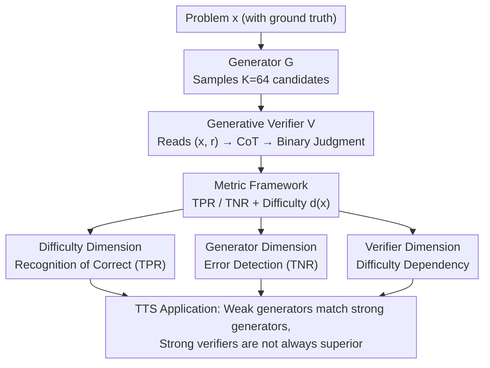

# Variation in Verification: Understanding Verification Dynamics in Large Language Models

**Conference**: ICLR 2026  
**OpenReview**: [https://openreview.net/forum?id=DcEuBwrWnB](https://openreview.net/forum?id=DcEuBwrWnB)  
**Area**: LLM Reasoning  
**Keywords**: Generative Verifier, Test-time Scaling, Verification Dynamics, Problem Difficulty, TPR/TNR

## TL;DR
This paper systematically deconstructs the question of "when LLM verifiers are reliable." Through large-scale controlled experiments across 12 benchmarks and 15 models, the authors find that verification effectiveness is jointly determined by three dimensions: **problem difficulty, generator capability, and verifier capability**. Specifically, difficulty dominates the recognition of correct answers (TPR), generator capability dominates the detection of errors (TNR), and the relationship between verifier capability and effectiveness follows three patterns (saturation, linear, or threshold) depending on difficulty. This reveals that the default practice of "using the strongest model as a verifier" is often wasteful in many scenarios.

## Background & Motivation

**Background**: Test-time scaling (TTS) is currently a mainstream paradigm for enhancing LLM reasoning capabilities. It involves letting a generator sample multiple candidate solutions for a problem and then using an LLM verifier to judge whether each candidate is correct in the **absence of ground-truth answers**, thereby filtering errors and retaining correct solutions. "Generative verifiers" are particularly popular: they first generate a Chain-of-Thought (CoT) reasoning path and then output a binary decision token ("Correct"/"Incorrect"), which leverages the text generation talent of LLMs better than earlier discriminative verifiers or scalar reward models.

**Limitations of Prior Work**: The industry's default practice is to **directly use the strongest closed-source frontier models as verifiers** (e.g., GPT-4o). This approach is built on the assumption that "verification quality scales monotonically with the verifier’s own problem-solving (generation) ability." Recent works (Chen et al. 2025c, Krumdick et al. 2025, Tan et al. 2025) have indeed demonstrated this positive correlation, leading many to treat it as an iron rule. However, this is likely sub-optimal. Verifying a solution is usually easier than generating one from scratch (i.e., "verification asymmetry" — similar to how verifying prime factorization is much simpler than finding the factors). Therefore, verification should be studied as an **independent capability** rather than a mere byproduct of generation capability.

**Key Challenge**: While **generation dynamics** are well-understood, almost no one has systematically studied **verification dynamics**. How the properties of the problem itself, the properties of the response being verified, and the model's capability interact to determine verification success remains largely a black box. Without this understanding, developers blindly default to the most expensive frontier models when cheaper alternatives might suffice, wasting significant compute.

**Goal**: To answer one core question: **What factors determine verification success?** The authors decompose this into three dimensions: problem difficulty, generator capability, and verifier capability, quantifying their respective impacts on "recognizing correct solutions" and "identifying incorrect solutions."

**Key Insight**: Experiments are conducted only on **verifiable problems** with objective ground-truth answers (mathematical reasoning, knowledge QA, natural language inference). This allows for the objective measurement of verifier performance using ground truth while simulating "reference-free" verification scenarios in actual deployment.

**Core Idea**: Decompose verification performance into two independent metrics: TPR (probability of recognizing correct solutions) and TNR (probability of rejecting incorrect solutions). Conduct controlled-variable experiments along the three dimensions to clarify whether each factor affects "recognition" or "identification."

## Method

### Overall Architecture

Rather than proposing a new method or model, this paper presents a **controlled empirical research framework**. By fixing a generative verification pipeline (Generator samples solutions → Verifier judges), the authors treat problem difficulty, generator capability, and verifier capability as controllable variables. They observe how verification performance (split into TPR/TNR) changes accordingly and apply these findings to TTS applications.

The pipeline operates as follows: For a problem $x$ with a ground-truth answer, a generator $G$ samples $K=64$ candidate responses. Each response $(x, r)$ is fed to a generative verifier $V$, which generates a verification CoT followed by a "Correct/Incorrect" binary judgment. Using ground truth to categorize responses into truly correct or truly incorrect sets allows for the calculation of the verifier's TPR and TNR. Furthermore, the authors use a **model-agnostic difficulty definition** to bin problems and execute analysis across the three dimensions.

### Key Designs

**1. Metric Framework: Splitting "Verification Quality" into Recognition and Error Detection**

Simply stating "verification accuracy is high/low" obscures a critical fact: recognizing a correct solution and rejecting an incorrect one are two different abilities. Combining them can lead to bias due to class imbalance. The authors decompose verification performance into **TPR** (True Positive Rate, probability of accepting a correct response, $\text{TPR}=\mathbb{E}[V(x, r) \mid a(r)=y^*(x)]$) and **TNR** (True Negative Rate, probability of rejecting an incorrect response, $\text{TNR}=\mathbb{E}[1-V(x, r) \mid a(r) \neq y^*(x)]$), using balanced accuracy $\text{Acc}_{bal}=\tfrac12(\text{TPR}+\text{TNR})$ to account for both sets. This decomposition is fundamental to all subsequent findings: by separating them, the authors discovered patterns—such as difficulty only affecting TPR while generator capability only affects TNR—that are invisible when looking at total accuracy.

A **model-agnostic difficulty definition** is also used: the difficulty of a problem $d(x)=\frac{1}{|\mathcal{G}|}\sum_{G \in \mathcal{G}}\hat{p}_G(x)$, which is the average pass rate across a set of diverse generators. Problems most generators can solve are easy (high $d(x)$), while those almost none can solve are hard. Model capability is similarly measured by the pass rate $\hat{p}_G(D)$. Unlike previous approaches that define difficulty relative to a single generator, this definition remains objective and comparable.

**2. Difficulty Dimension: Problem Difficulty Dominates "Recognition" because Verifiers Calculate the Reference Answer Incorrectly**

After binning problems into four quartiles (Hardest to Easiest), the authors observed a clean pattern: **TPR rises steadily as problems become simpler, while TNR has almost no predictable relationship with difficulty** (consistent across model families and three domains). In other words, problem difficulty mainly affects whether a verifier "dares to recognize a correct solution" but does not affect its ability to "identify an error."

Analysis of individual cases revealed that when judging, verifiers tend to **generate their own reference solution for comparison**. As the problem becomes harder, the verifier's own generated reference is more likely to be wrong, leading it to misjudge a truly correct response as incorrect (False Negative, FN), which pulls down TPR. Using LLM-as-judge to detect if verification CoTs contain solving errors, the authors quantified this causal chain: in the hard problem set, **39.1% of verification FNs were accompanied by reference generation errors**. This identifies "the verifier failing to solve the problem itself" as the primary driver of FNs.

**3. Generator Dimension: The Stronger the Generator, the Harder its Errors are to Catch**

By fixing the problem and varying the generator's capability (calculated only on problem subsets where all generators produced at least one correct and one incorrect response for fairness), the authors found that **TPR is high (>0.7) in almost all settings and approaches 1.0 as the generator gets stronger**, but **TNR significantly decreases as the generator improves**. This is intuitive yet often overlooked: weak generators (like Gemma2-2B) make obvious, low-level mistakes that the verifier catches easily; strong generators make subtle, hidden errors that are difficult for the verifier to perceive.

This law explicitly attributes "error detection difficulty" to **generator capability**, a factor previously under-emphasized. The same verifier will block almost all errors from a weak generator but frequently allow errors from a strong one to pass. This complements Design 2—difficulty manages TPR (recognition), while generator capability manages TNR (error detection).

**4. Verifier Dimension: Correlation between Verifier Capability and Effectiveness depends on Difficulty**

This dimension targets the industry's default assumption. The authors confirmed that **verifier generation capability and verification performance are generally positively correlated**, consistent with prior work. However, the critical insight is that the **"shape" of this correlation depends strongly on problem difficulty**: on easy problems, it is **saturated/uncorrelated** (stronger verifiers yield no extra gain because simple problems are easy for everyone to verify); on medium-difficulty problems, it is **linear** (stronger capability leads to better verification—the most valuable range); on hard problems, it is **threshold-limited** (one must cross a certain capability threshold for it to be useful; below the threshold, even "stronger" models fail).

This "non-linear trichotomy" is the most significant correction to previous findings. While earlier work only saw a general positive correlation and concluded "stronger is better," this paper points out that at the extremes of the difficulty spectrum, strong verifiers have **almost no advantage** over weak ones because both hit fundamental verification bottlenecks.

### Example: How the Three Dimensions Interact

Consider a single verifier, GPT-4o, judging a problem under different conditions. **For a simple math problem**: regardless of generator strength, correct solutions are almost always recognized (high TPR, Design 2), and switching to a stronger verifier yields no difference (saturation zone, Design 4)—here, Qwen2.5-7B is as effective as GPT-4o. **For a medium-difficulty problem with solutions from a weak generator (Gemma2-9B)**: the weak generator's errors are easy to catch (high TNR, Design 3). After verification filtering, Gemma2-9B's TTS performance approaches that of Gemma2-27B, closing the gap by **75.7%**. **For a hard problem with solutions from a strong generator**: the strong generator's subtle errors are hard to catch (low TNR, Design 3), and since hard problems fall into the threshold-limited zone (Design 4), even a strong verifier cannot save it. Combining these three dimensions determines which verifier configuration is most cost-effective for a given problem.

## Key Experimental Results

The experiments cover **12 benchmarks**: 2,347 math problems (GSM8K, MATH500, etc.), 1,196 knowledge QA problems (MMLU-Pro subset), and 901 NLI problems (ReClor, GPQA, etc.). **15 models** were used: 14 open-source (Qwen, Llama, Gemma, Mistral, 2B–72B) plus GPT-4o, with each model acting as both generator and verifier.

### Main Results: Core Patterns of the Three Dimensions

| Research Question | Independent Variable | Major Impact | Phenomenon |
|-------------------|----------------------|--------------|------------|
| RQ1 | Problem Difficulty | TPR (Recognition) | Easier problems lead to higher TPR; TNR has no clear pattern. |
| RQ2 | Generator Capability | TNR (Error Detection) | Stronger generators lead to lower TNR; TPR rises slightly. |
| RQ3 | Verifier Capability | Overall Verification | Positive correlation, but saturated (Easy) / Linear (Medium) / Threshold-limited (Hard). |

### Mechanism Analysis: Relationship between FN and Solving Errors

| Difficulty Bin | Verification FN Proportion | Proportion of FN with Reference Errors |
|----------------|----------------------------|-----------------------------------------|
| Hardest | High | 39.1% in hardest set |
| → Easiest | Gradually Decreasing | Gradually Decreasing |

> Note: As difficulty increases, the proportion of cases where the verifier makes an error while generating its internal reference increases, directly causing false negatives.

### Key Findings
- **Difficulty and generator capability are two key factors overlooked by prior work**: Previous studies focused only on verifier capability. This paper proves difficulty manages TPR and generator capability manages TNR.
- **Strong verifiers are not always worth it**: On the ends of the difficulty spectrum (very easy/very hard) or when facing strong generators, GPT-4o has almost no extra gain over weak verifiers like Qwen2.5-7B. Verifier scaling cannot overcome fundamental verification difficulties.
- **Weak generators can match strong ones via verification**: With the same verifier, Gemma2-9B approached Gemma2-27B, closing the gap by 75.7%, suggesting compute can be shifted from "larger generators" to "better verification."
- **Difficulty estimation can be label-free**: The appendix uses a practical, ground-truth-free difficulty estimator to replicate all key trends, making the conclusions applicable in real deployment.

## Highlights & Insights
- **Decomposing "verification accuracy" into TPR and TNR** is the most critical step. By separating them, the three dimensions fall into place. This "decompose metrics then controlled variable" paradigm is highly transferable to any "discrimination/scoring" tasks like reward or judge model diagnostics.
- **Explaining the drop in TPR via "the verifier's own solving errors"** turns a statistical correlation into an interpretable mechanism, quantified at 39.1% via LLM-as-judge.
- **The "Non-linear Trichotomy" (saturation/linear/threshold) directly challenges industry defaults**: It tells engineering teams not to waste money on frontier verifiers for easy or extremely hard tasks. Linear returns only exist in the medium-difficulty range.

## Limitations & Future Work
- **Focus on Verifiable Problems**: Experiments are limited to problems with objective ground truth. While conclusions may generalize to any domain where "correctness" is definable, open-ended generation (writing, dialogue) was not covered.
- **Model-Agnostic Difficulty**: $d(x)$ is defined by population average pass rates; it might lose resolution for problems that are hard for one specific model but easy for the group. 
- **Sample of Instruction-Tuned Models**: While covering 2B–72B, reasoning models (o1-like) were only validated in the appendix. Their specific verification dynamics (long CoT) require further study.
- **Future Direction**: Designing "Difficulty-aware Verifier Routing" — using small verifiers for easy tasks, strong verifiers for medium tasks, and multi-verifier aggregation (or skipping verification) for hard tasks.

## Related Work & Insights
- **vs. Chen et al. 2025c / Krumdick et al. 2025 / Tan et al. 2025**: These established the positive correlation between verifier capability and quality. This paper complements them by showing this correlation is non-linear relative to difficulty and adding the missing dimensions of difficulty and generator capability.
- **vs. Test-time Scaling (Snell et al. 2025 / Zhang et al. 2025)**: Previous work focused on *how* to use verifiers. This paper focuses on *why* they succeed or fail, providing a compute-saving guide for TTS.
- **vs. Weak Verifier Aggregation (Saad-Falcon et al. 2025)**: While those works propose cost-reduction methods, this paper provides the underlying theoretical reason *why* weak verifiers are sufficient in certain regimes (saturation/threshold zones).

## Rating
- Novelty: ⭐⭐⭐⭐ Treating verification as an independent capability and decomposing TPR/TNR provides a fresh perspective that corrects industry assumptions.
- Experimental Thoroughness: ⭐⭐⭐⭐⭐ Massive controlled experiments across 12 benchmarks and 15 models with causal attribution.
- Writing Quality: ⭐⭐⭐⭐ Clear structure with RQs and findings, though some conclusions are densly packed in heatmaps.
- Value: ⭐⭐⭐⭐⭐ High. Directly impacts engineering practices for TTS and provides actionable compute allocation insights.

<!-- RELATED:START -->

## Related Papers

- [\[ICML 2026\] Internalizing Safety Understanding in Large Reasoning Models via Verification](../../ICML2026/llm_reasoning/internalizing_safety_understanding_in_large_reasoning_models_via_verification.md)
- [\[ICLR 2026\] T1: Tool-Integrated Verification for Test-Time Compute Scaling in Small Language Models](t1_tool-integrated_verification_for_test-time_compute_scaling_in_small_language_.md)
- [\[ICLR 2026\] Dynamics-Predictive Sampling for Active RL Finetuning of Large Reasoning Models](dynamics-predictive_sampling_for_active_rl_finetuning_of_large_reasoning_models.md)
- [\[ICLR 2026\] Neural Theorem Proving for Verification Conditions: A Real-World Benchmark](neural_theorem_proving_for_verification_conditions_a_real-world_benchmark.md)
- [\[ICLR 2026\] VoG: Enhancing LLM Reasoning through Stepwise Verification on Knowledge Graphs](vog_enhancing_llm_reasoning_through_stepwise_verification_on_knowledge_graphs.md)

<!-- RELATED:END -->
